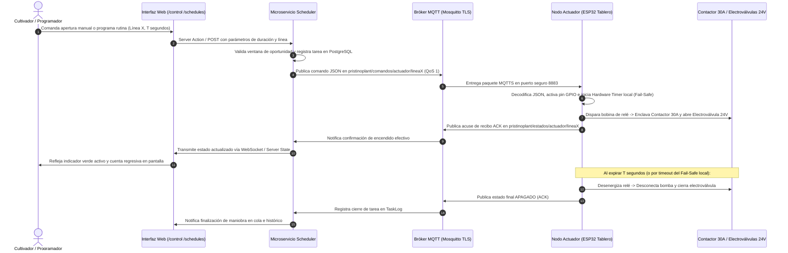
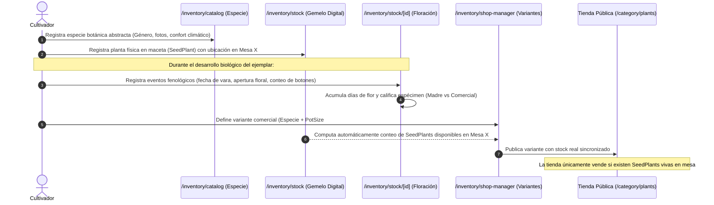
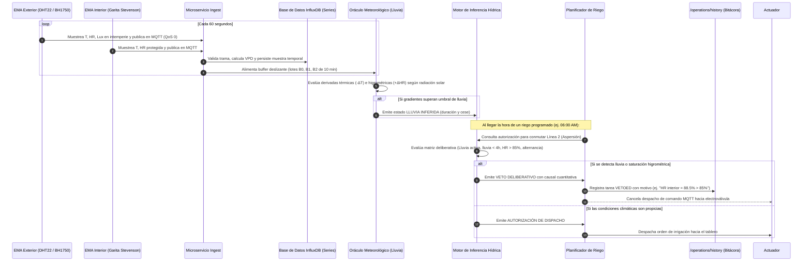

# Apéndices

## Apéndice F: Catálogo de Interfaces de Usuario y Flujos Operativos

El presente apéndice expone el catálogo estructurado de las interfaces de usuario que conforman la plataforma web de PristinoPlant, así como la especificación detallada de los cinco (5) flujos operativos medulares del sistema. Este compendio constituye la evidencia empírica de la materialización del software y su adecuación funcional (ISO/IEC 25010), sirviendo de guía operativa para la interacción del cultivador botánico y del cliente final.

En atención a la naturaleza técnica y agronómica de la investigación, este catálogo omite los módulos administrativos genéricos (como inicio de sesión y gestión básica de cuentas) y prioriza de manera jerárquica los dominios críticos de la agricultura protegida:

1. **Operaciones del Circuito Hidráulico y Riego Autónomo:** Tablero de comando directo, gestión de colas, programador recurrente y bitácora de auditoría histórica.
2. **Laboratorio y Dosificación Agronómica:** Inventario de insumos puros, recetas compuestas, ciclos rotativos anti-resistencia y agenda proyectada.
3. **Catálogo Botánico, Inventario Físico y Gemelos Digitales:** Clasificación taxonómica, inventario unívoco de especímenes (`SeedPlant`), seguimiento fenológico y conciliación de stock comercial en mesas.
4. **Telemetría y Monitoreo Ambiental:** Dashboard de microclima en tiempo real, oráculo meteorológico de precipitación pluvial y análisis ecofisiológico por zonas.
5. **Comercio Electrónico y Gestión de Ventas:** Portal público de la tienda botánica, selección de variantes vivas, checkout y conciliación de órdenes.

---

### 1. Catálogo Detallado de Interfaces de Usuario

A continuación se presentan las veinticuatro (24) interfaces de usuario esenciales de la plataforma, acompañadas de sus especificaciones técnicas, denominaciones formales y notas explicativas según la norma APA 7.ª edición.

---

#### 1.1. Operaciones del Circuito Hidráulico y Riego Autónomo

Las interfaces de este bloque permiten al cultivador supervisar y gobernar la infraestructura electromecánica del invernadero (bomba de agua de 1 HP y 1 pulgada, junto a las electroválvulas de solenoide), garantizando conmutaciones seguras mediante temporizadores locales de seguridad (*fail-safe*) y acuse de recibo bidireccional (`ACK`) vía MQTT.

##### Centro de Control Manual Directo (`/operations/control`)

La interfaz centraliza el comando inmediato de las cuatro líneas hidráulicas del orquideario: Línea 1 (Humidificación / Foggers), Línea 2 (Aspersión principal de mesas), Línea 3 (Humectación de suelo para enfriamiento pasivo) y Línea 4 (Dosificación agroquímica aislada). Cuenta con tarjetas de conmutación individual provistas de selectores de duración preestablecida (por defecto 300 segundos), indicadores de estado de conexión al bróker MQTT, latencia del enlace telemétrico y temporizadores visuales con cuenta regresiva. Toda orden despachada activa una guarda local en firmware que interrumpe la impulsión ante pérdida de red.


**_Figura Ap-F1._** Centro de control manual directo de actuadores hidráulicos.
*Nota.* Fuente: Elaboración propia a partir de la interfaz de usuario de PristinoPlant. Muestra los controles de conmutación manual por línea hidráulica, selectores de temporización fail-safe, estado de enlace MQTT y tarjetas de retroalimentación de estado real.

##### Modal de Advertencia y Confirmación de Agroquímicos (`/operations/control`)

Dado que la manipulación de insumos fitosanitarios y fertilizantes concentrados exige rigurosas medidas de seguridad operacional, la conmutación de la Línea 4 requiere una confirmación interactiva explícita. El modal presenta al operador la lista de tareas de dosificación pendientes registradas en el laboratorio, detallando el nombre de la mezcla, el volumen de aplicación y las recomendaciones toxicológicas antes de autorizar el energizado de la electroválvula de 24V.


**_Figura Ap-F2._** Modal interactivo de advertencia y confirmación para maniobras de dosificación fitosanitaria.
*Nota.* Fuente: Elaboración propia a partir de la interfaz de usuario de PristinoPlant. Despliega los parámetros de la solución química a inyectar, alertas toxicológicas y solicitud de confirmación manual para prevenir descargas accidentales.

##### Supervisión de Cola de Tareas y Maniobras Activas (`/operations/queue`)

Esta pantalla supervisa en tiempo real las operaciones hídricas gestionadas por el microservicio `Scheduler`. Permite auditar las maniobras que se encuentran en ejecución inmediata (`RUNNING`), encoladas para los próximos minutos (`PENDING`) o diferidas temporalmente. Cada elemento visualiza la línea hidráulica involucrada, la duración programada, el origen del comando (manual o autónomo) y un botón de cancelación de emergencia para detener la maniobra en cualquier instante.


**_Figura Ap-F3._** Panel de supervisión de la cola de tareas hidráulicas activas y diferidas.
*Nota.* Fuente: Elaboración propia a partir de la interfaz de usuario de PristinoPlant. Presenta el listado reactivo de maniobras hídricas en ejecución y en espera, con temporizadores de progreso y opciones de cancelación inmediata.

##### Programador de Rutinas Recurrentes de Riego (`/operations/schedules`)

Permite establecer cronogramas automatizados periódicos de irrigación y nebulización mediante expresiones basadas en tiempo (Cron). El cultivador selecciona los días de la semana, la hora de inicio, la duración en minutos y la línea de riego a energizar. Asimismo, la vista incorpora selectores para habilitar las guardas deliberativas del sistema: veto por lluvia activa, espaciamiento interdiario automático y límites por saturación higrométrica.


**_Figura Ap-F4._** Programador cronológico de rutinas recurrentes de irrigación y reglas de guarda ambiental.
*Nota.* Fuente: Elaboración propia a partir de la interfaz de usuario de PristinoPlant. Exhibe la matriz de rutinas periódicas configuradas, días de activación, tiempos de apertura y conmutadores de vetos ambientales autónomos.

##### Bitácora de Auditoría Histórica de Operaciones (`/operations/history`)

Registro cronológico inmutable de todas las conmutaciones y decisiones hídricas procesadas por el sistema. Cada fila documenta la fecha y hora exacta, la línea hidráulica afectada, la duración efectiva de apertura, el operador o servicio emisor y el estado final de la tarea (`COMPLETED`, `CANCELLED` o `VETOED`). En caso de veto deliberativo, la interfaz detalla el motivo algorítmico específico (p. ej., precipitación pluvial en curso, lluvia en las últimas 4 horas o humedad relativa superior al 85%).


**_Figura Ap-F5._** Bitácora de auditoría histórica de operaciones hídricas y registro de vetos deliberativos.
*Nota.* Fuente: Elaboración propia a partir de la interfaz de usuario de PristinoPlant. Ilustra el historial de tareas ejecutadas con indicadores de procedencia, duraciones reales y causas cuantitativas de veto ambiental emitidas por los motores.

---

#### 1.2. Laboratorio y Dosificación Agronómica

Las interfaces del laboratorio agronómico transforman la preparación manual de nutrientes y plaguicidas en un proceso metódico, formulando recetas balanceadas para el tanque dosificador presurizado de 20 litros y programando ciclos rotativos que mitigan la resistencia biológica de patógenos.

##### Inventario de Insumos Agroquímicos Puros (`/lab/supplies`)

Catálogo estructurado que almacena las formulaciones puras disponibles en el orquideario, clasificadas en fertilizantes minerales y productos fitosanitarios (fungicidas, insecticidas, acaricidas y bactericidas). Cada ficha presenta el nombre comercial, ingrediente activo, presentación física (líquido o polvo soluble), dosis recomendada por litro de agua ($ml/L$ o $g/L$), advertencias toxicológicas y período de reingreso al cultivo.


**_Figura Ap-F6._** Inventario de insumos agroquímicos puros con proporciones de dilución y directrices de seguridad.
*Nota.* Fuente: Elaboración propia a partir de la interfaz de usuario de PristinoPlant. Muestra la tabla de insumos concentrados, clasificación agronómica, dosis unitarias recomendadas y directrices de manipulación segura.

##### Formulación de Recetas y Mezclas Compuestas (`/lab/recipes`)

Herramienta interactiva para la formulación de mezclas balanceadas destinadas al tanque dosificador de 20 litros. Al seleccionar los insumos puros a combinar y fijar el volumen total de agua a preparar, la interfaz calcula automáticamente la cantidad exacta de cada componente en mililitros o gramos, alertando sobre incompatibilidades químicas conocidas y riesgos de fitotoxicidad antes de guardar la formulación.


**_Figura Ap-F7._** Asistente interactivo para formulación y balanceo de recetas compuestas para tanque dosificador.
*Nota.* Fuente: Elaboración propia a partir de la interfaz de usuario de PristinoPlant. Detalla el configurador de formulaciones, cálculo volumétrico automático de ingredientes por volumen de tanque y verificación de compatibilidad.

##### Configuración de Programas Nutricionales y Fitosanitarios Rotativos (`/lab/dosing`)

Permite estructurar planes agronómicos secuenciales organizados en ciclos rotativos de 4 a 8 pasos. Esta interfaz asegura la alternancia periódica de moléculas fitosanitarias con diferente modo de acción (FRAC e IRAC) e intercala riegos de lavado con agua pura entre aplicaciones nutricionales, preservando la conductividad eléctrica del sustrato y previniendo la acumulación salina en las raíces.


**_Figura Ap-F8._** Diseñador de programas agronómicos secuenciales y rotación de principios activos.
*Nota.* Fuente: Elaboración propia a partir de la interfaz de usuario de PristinoPlant. Presenta la secuencia cíclica de aplicaciones, asignación de recetas por etapa y pautas de alternancia de moléculas anti-resistencia.

##### Agenda Proyectada y Programación de Tratamientos (`/lab/dosing-schedules`)

Visualiza un calendario proyectado en el tiempo donde se programan las fechas y horas exactas de aplicación de cada paso del programa agronómico. Permite vincular la rutina a sectores específicos de mesas de cultivo, asociar recordatorios para la preparación manual de la mezcla en tanque y habilitar la conmutación de la Línea 4 de agroquímicos del tablero eléctrico.


**_Figura Ap-F9._** Agenda cronológica proyectada de tratamientos agronómicos y seguimiento de calendario.
*Nota.* Fuente: Elaboración propia a partir de la interfaz de usuario de PristinoPlant. Exhibe la vista de calendario con las aplicaciones fitosanitarias y nutricionales proyectadas, estado de ejecución y asignación de mesas.

---

#### 1.3. Catálogo Botánico, Inventario Físico y Gemelos Digitales

Este módulo materializa la individualización de cada activo biológico vivo en las mesas de cultivo mediante el modelo de gemelos digitales (`SeedPlant`), vinculando la taxonomía botánica, el tamaño de maceta (`PotSize`), la trazabilidad fenológica de floración y la disponibilidad comercial en tienda.

##### Catálogo Taxonómico de Especies Botánicas (`/inventory/catalog`)

Listado maestro de las especies y variantes botánicas registradas en la plataforma. Presenta información taxonómica exhaustiva (familia *Orchidaceae*, género, especie, variedad o epíteto híbrido), galería fotográfica botánica, requerimientos de cultivo (rango óptimo de temperatura, humedad relativa e iluminación en lux) y descripción fenológica general de la inflorescencia.


**_Figura Ap-F10._** Catálogo maestro de especies botánicas y referencias taxonómicas de cultivo.
*Nota.* Fuente: Elaboración propia a partir de la interfaz de usuario de PristinoPlant. Despliega la colección de especies registradas con clasificación taxonómica, miniaturas fotográficas y parámetros ecofisiológicos de referencia.

##### Formulario de Alta y Edición Taxonómica de Especie (`/inventory/catalog/new`)

Formulario estructurado que permite ingresar nuevos genotipos botánicos al sistema. Captura el género, especie, autor botánico, híbrido parental, fotoperíodo sugerido, rangos térmicos admisibles, sustrato recomendado y carga de archivos multimedia en alta definición representativos de la flor y porte foliar.


**_Figura Ap-F11._** Formulario de registro y edición de atributos taxonómicos y ecofisiológicos de la especie.
*Nota.* Fuente: Elaboración propia a partir de la interfaz de usuario de PristinoPlant. Ilustra los campos de captura de datos botánicos, parámetros climáticos de confort y gestor de carga de fotografías de referencia.

##### Matriz de Inventario de Gemelos Digitales en Mesas (`/inventory/stock`)

Panel central de inventario físico individualizado. Muestra cada espécimen en maceta (`SeedPlant`) registrado en el orquideario con un código unívoco. La tabla permite filtrar por tamaño de contenedor (`PotSize`: Nro 5, Nro 7, Nro 10 y Nro 14), ubicación espacial tridimensional (Zonas A a D y Mesas 1 a 6) y estado biológico (`AVAILABLE` para especímenes comerciales o `MOTHER` para ejemplares élite de banco germoplasma).


**_Figura Ap-F12._** Matriz de inventario individualizado de gemelos digitales (SeedPlant) en mesas de cultivo.
*Nota.* Fuente: Elaboración propia a partir de la interfaz de usuario de PristinoPlant. Muestra la relación unívoca de macetas vivas, tamaño de maceta, sector físico en mesas, estado biológico y enlace a ficha de floración.

##### Ficha Individual de Espécimen y Bitácora Fenológica (`/inventory/stock/[id]`)

Ficha técnica dedicada a un ejemplar físico específico. Documenta su fecha de siembra o trasplante, maceta actual, registros fotográficos cronológicos y la bitácora fenológica completa de sus floraciones: fecha de brote de vara floral, apertura de la primera flor, conteo de botones florales, duración total de la inflorescencia en días y fecha de marchitamiento. Esta información permite evaluar la vitalidad del espécimen y catalogarlo para venta o propagación.


**_Figura Ap-F13._** Ficha individual de espécimen botánico con registro y bitácora fenológica de floración.
*Nota.* Fuente: Elaboración propia a partir de la interfaz de usuario de PristinoPlant. Despliega la hoja de vida de la planta en maceta, historial de eventos fenológicos, duración de flores y evolución visual.

##### Gestor Comercial de Variantes y Stock Sincronizado (`/inventory/shop-manager`)

Interfaz que gestiona la conciliación comercial del inventario. Permite al cultivador estructurar las variantes comerciales vendibles (`ProductVariant`), asociando una especie abstracta a un tamaño de maceta específico, fijando el precio en dólares estadounidenses (USD) y sincronizando automáticamente el stock disponible en tienda a partir del cómputo exacto de gemelos digitales (`SeedPlant`) disponibles en ese tamaño en las mesas.


**_Figura Ap-F14._** Gestor de variantes comerciales y sincronización reactiva de stock con mesas físicas.
*Nota.* Fuente: Elaboración propia a partir de la interfaz de usuario de PristinoPlant. Muestra la asignación de precios por tamaño de maceta, estado comercial visible y stock calculado en tiempo real según plantas en mesa.

##### Panel de Solicitudes y Lista de Espera de Ejemplares (`/inventory/requests`)

Permite gestionar el interés de clientes sobre especies botánicas actualmente agotadas o en fase de maduración vegetativa. Registra el nombre, correo electrónico y tamaño de maceta solicitado, generando notificaciones automáticas al momento en que nuevas plantas de esa especie alcanzan el estado disponible en el inventario físico de mesas.


**_Figura Ap-F15._** Panel de administración de solicitudes de reposición y lista de espera de clientes.
*Nota.* Fuente: Elaboración propia a partir de la interfaz de usuario de PristinoPlant. Exhibe las peticiones de reserva de especies sin stock, datos de contacto del comprador y alertas automáticas de reposición.

---

#### 1.4. Telemetría y Monitoreo Ambiental

Estas vistas representan el núcleo de percepción del microclima, exhibiendo las magnitudes físicas transmitidas minuto a minuto por las estaciones EMA Exterior e Interior, las derivadas analíticas del oráculo pluvial y los indicadores psicrométricos de estrés vegetal.

##### Dashboard Telemétrico Central en Tiempo Real (`/monitoring`)

Panel principal de supervisión climática del orquideario. Exhibe tarjetas de lectura instantánea que contrastan las condiciones de intemperie (EMA Exterior) con las condiciones bajo malla sombra (EMA Interior): Temperatura ($^\circ\text{C}$), Humedad Relativa ($\%HR$), Iluminancia solar ($\text{Lux}$) y Déficit de Presión de Vapor ($\text{VPD}$ en $\text{kPa}$). Adicionalmente, integra gráficos históricos interactivos alimentados desde InfluxDB con selectores de ventana temporal (24 horas, 7 días, 30 días) y marcadores de la zona de confort fisiológico de las orquídeas.


**_Figura Ap-F16._** Dashboard telemétrico de supervisión microclimática en tiempo real y series históricas.
*Nota.* Fuente: Elaboración propia a partir de la interfaz de usuario de PristinoPlant. Presenta los indicadores microclimáticos instantáneos de ambas estaciones, gráficos temporales de T, HR y VPD, y bandas de confort vegetal.

##### Monitor del Oráculo Meteorológico e Inferencia de Lluvia (`/weather-oracle`)

Interfaz de visualización operativa del Motor de Inferencia Meteorológica (`rain-manager.ts`). Muestra el estado atmosférico actual deducido por el algoritmo (Despejado, Lluvia Nublada, Lluvia Soleada, Lluvia Nocturna o Cese de Precipitación), el cálculo en tiempo real de las derivadas térmicas instantáneas ($-\Delta T$) e higrométricas ($+\Delta HR$) en ventanas deslizantes de 10, 20 y 30 minutos, y la activación de guardas que vetan preventivamente las operaciones hidráulicas de aspersión.


**_Figura Ap-F17._** Monitor del oráculo meteorológico e inferencia algorítmica de eventos pluviales.
*Nota.* Fuente: Elaboración propia a partir de la interfaz de usuario de PristinoPlant. Ilustra el estado pluvial inferido en tiempo real, derivadas de gradientes higrotérmicos en ventanas deslizantes y estado de veto hídrico.

##### Análisis Ecofisiológico e Indicadores de Microclima por Zona (`/botanics`)

Panel de analítica agronómica avanzada que sintetiza el comportamiento ecofisiológico del cultivo. Evalúa la integral higrométrica diaria, las horas acumuladas bajo estrés térmico ($T > 32^\circ\text{C}$), los niveles medios de VPD y la radiación solar acumulada. Proporciona recomendaciones cualitativas automáticas al cultivador sobre la necesidad de aplicar pulsos de humectación en piso (Línea 3) o nebulización aérea (Línea 1).


**_Figura Ap-F18._** Panel de analítica agronómica, balance higrotérmico e indicadores de confort vegetal.
*Nota.* Fuente: Elaboración propia a partir de la interfaz de usuario de PristinoPlant. Despliega índices de estrés por déficit de presión de vapor, acumulación de calor diurno y recomendaciones ecofisiológicas de irrigación.

---

#### 1.5. Comercio Electrónico y Gestión Comercial

Este bloque comprende la experiencia comercial del cliente externo en la tienda digital y las herramientas administrativas del orquideario para conciliar pagos multimoneda y coordinar despachos.

##### Catálogo Público de la Tienda Botánica (`/category/plants`)

Vista principal de exploración para el cliente final. Dispone de una cuadrícula de productos responsiva con fotografías botánicas de alta resolución, nombre científico, nombre común y rango de precios. Incorpora un motor de búsqueda por texto y filtros dinámicos por género taxonómico (*Cattleya*, *Phalaenopsis*, *Dendrobium*, *Vanda*, *Oncidium*, etc.) y requerimientos de iluminación.


**_Figura Ap-F19._** Catálogo público de la tienda botánica con filtros taxonómicos dinámicos y buscador.
*Nota.* Fuente: Elaboración propia a partir de la interfaz de usuario de PristinoPlant. Exhibe la vitrina comercial con tarjetas de especies, selector interactivo de géneros botánicos y barra de búsqueda reactiva.

##### Ficha Comercial de Producto Botánico y Selector de Maceta (`/plant/[slug]`)

Ficha técnica y comercial de la especie. Presenta la galería de imágenes, ficha botánica descriptiva, consejos de cultivo y un selector de tamaño de maceta interactivo (`PotSize`). Al seleccionar el contenedor deseado, la vista actualiza en tiempo real el precio en USD y la disponibilidad en existencias sustentada en las macetas vivas en mesa, deshabilitando la opción de compra si la variante no cuenta con ejemplares físicos disponibles.


**_Figura Ap-F20._** Ficha comercial de especie con selector de tamaño de maceta y disponibilidad real en mesas.
*Nota.* Fuente: Elaboración propia a partir de la interfaz de usuario de PristinoPlant. Muestra la ficha detallada de la especie, selector dinámico de tamaño de maceta, actualización de precio y botón de agregar al carrito.

##### Carrito de Compras Interactivo (`/cart`)

Permite al comprador auditar los especímenes seleccionados, modificar las cantidades respetando los límites de stock real en mesa, visualizar los subtotales en dólares y proceder al cierre de la compra. Dispone de almacenamiento persistente en el navegador para preservar los productos durante la sesión de compra.


**_Figura Ap-F21._** Carrito de compras interactivo con validación de existencias y cálculo de subtotales.
*Nota.* Fuente: Elaboración propia a partir de la interfaz de usuario de PristinoPlant. Ilustra el desglose de productos seleccionados por maceta, cálculo reactivo del monto total y botón de inicio de checkout.

##### Proceso de Pago y Datos de Entrega (`/checkout`)

Formulario de formalización de compra donde el usuario suministra sus datos de facturación y selecciona la modalidad de entrega: retiro directo en las instalaciones del orquideario en San Félix o despacho a domicilio. Asimismo, permite seleccionar el método de pago preferente (Pago Móvil, Transferencia bancaria o divisas en efectivo).


**_Figura Ap-F22._** Formulario de formalización de pedido, selección de despacho y método de pago multimoneda.
*Nota.* Fuente: Elaboración propia a partir de la interfaz de usuario de PristinoPlant. Presenta los campos para datos de consignación, opciones logísticas de retiro/despacho y selección de pasarela de pago.

##### Confirmación de Orden y Canalización por WhatsApp (`/checkout/order/[id]`)

Pantalla de confirmación tras registrar el pedido en la base de datos. Muestra el número correlativo de la orden, el resumen detallado de las plantas adquiridas y las instrucciones para formalizar la transferencia bancaria. Dispone de un botón interactivo que canaliza el resumen de la orden directamente hacia el canal de mensajería del cultivador (WhatsApp API), adjuntando el código unívoco para agilizar la verificación del pago.


**_Figura Ap-F23._** Pantalla de confirmación de pedido con instrucciones de pago y derivación directa a WhatsApp.
*Nota.* Fuente: Elaboración propia a partir de la interfaz de usuario de PristinoPlant. Detalla el comprobante digital de la orden, datos bancarios del vendedor y botón interactivo para validar la transacción por WhatsApp.

##### Conciliación de Órdenes y Registro de Venta Directa (`/orders` y `/orders/sales`)

Panel administrativo para el cultivador. Permite auditar las órdenes entrantes, verificar los comprobantes de pago suministrados por los clientes y transicionar el estado del pedido (`PENDING` $\to$ `PAID` $\to$ `DELIVERED`). Al confirmarse el despacho, la plataforma descuenta automáticamente las macetas físicas correspondientes en la matriz de inventario. Adicionalmente, incluye un módulo de venta directa en mostrador (`/orders/sales`) para registrar compras presenciales en el invernadero.


**_Figura Ap-F24._** Panel de conciliación administrativa de órdenes y módulo de venta directa en orquideario.
*Nota.* Fuente: Elaboración propia a partir de la interfaz de usuario de PristinoPlant. Muestra la tabla de órdenes de compra para confirmación de pagos, cambio de estados de despacho y registro de ventas de mostrador.

---

### 2. Flujos Operativos y Diagramas de Interacción de Extremo a Extremo

A fin de ilustrar la articulación funcional entre el usuario, la plataforma web, los microservicios del backend, el protocolo de mensajería y el hardware electromecánico en campo, a continuación se detallan los cinco (5) flujos operativos medulares del sistema.

---

#### Flujo Operativo 1: Conmutación y Despacho Hidráulico (Manual y Programado)

Este flujo gobierna el ciclo de control físico sobre la red presurizada de cuatro líneas hidráulicas, cerrando el lazo entre las interfaces de usuario o el planificador automático y los actuadores de potencia.



**Descripción Técnica del Flujo:**

1. El cultivador selecciona la línea a energizar y la duración en segundos desde el Centro de Control (`/control`), o bien el programador cronológico (`/schedules`) dispara una rutina planificada.
2. La plataforma web Next.js envía la orden al microservicio `Scheduler`, el cual verifica que no existan tareas concurrentes incompatibles en la cola y persiste el estado en PostgreSQL.
3. El `Scheduler` despacha una trama JSON serializada al bróker Mosquitto bajo el tópico `pristinoplant/comandos/actuador/lineaX` con nivel de servicio QoS 1 (garantizando entrega al menos una vez).
4. El microcontrolador ESP32 en el tablero eléctrico recibe la trama mediante el driver seguro `simple2.py`, extrae la duración especificada e inicializa un temporizador por interrupción de hardware (*Hardware Timer*).
5. El ESP32 conmuta la salida GPIO correspondiente, energizando el módulo optoacoplado que conmuta la bobina del contactor industrial de 30A (bomba de agua de 1 pulgada) y la electroválvula de 24VAC del circuito seleccionado.
6. El microcontrolador emite inmediatamente un mensaje de confirmación (`ACK`) hacia el tópico `pristinoplant/estados/actuador/lineaX`.
7. El `Scheduler` recibe el acuse de recibo, actualiza la base de datos y propaga el estado hacia la interfaz web, donde el cultivador observa la activación en tiempo real con una barra de progreso decreciente.
8. Una vez transcurrido el tiempo programado, el temporizador de hardware del firmware desenergiza las bobinas de potencia de forma totalmente autónoma (incluso si la red WiFi o el backend cayeron durante la maniobra), emite el estado de apagado hacia el bróker y el `Scheduler` cierra el registro en la bitácora histórica (`TaskLog`).

---

#### Flujo Operativo 2: Dosificación Agronómica y Ciclos Fitosanitarios Rotativos

Este flujo asegura el cumplimiento estricto de las labores de nutrición y sanidad botánica mediante la formulación computarizada y la conmutación de la Línea 4 de agroquímicos físicamente aislada.

```mermaid
sequenceDiagram
    autonumber
    actor Cultivador as Cultivador
    participant LabSupplies as /lab/supplies (Insumos)
    participant LabRecipes as /lab/recipes (Formulación)
    participant LabDosing as /lab/dosing (Ciclos Rotativos)
    participant LabAgenda as /lab/dosing-schedules (Agenda)
    participant Tablero as Tablero de Potencia (Línea 4 - 24V)

    Cultivador->>LabSupplies: Registra agroquímicos puros con diluciones (ml/L o g/L) y FRAC/IRAC
    Cultivador->>LabRecipes: Selecciona insumos y fija volumen (20L); sistema calcula dosis
    LabRecipes->>LabRecipes: Verifica compatibilidad de mezclas y alerta riesgos de fitotoxicidad
    Cultivador->>LabDosing: Estructura ciclo rotativo de 4 a 6 pasos alternando principios activos
    Cultivador->>LabAgenda: Proyecta calendario en días específicos y asigna mesas de cultivo
    Note over Cultivador,LabAgenda: El día de la aplicación proyectada:
    LabAgenda->>Cultivador: Emite recordatorio interactivo con la receta a preparar en el tanque
    Cultivador->>Tablero: Prepara mezcla física y autoriza conmutación de Línea 4 en /control
    Tablero->>Tablero: Inyecta solución por conducción aislada sin retorno a red potable
    Tablero->>LabAgenda: Confirma ejecución y avanza automáticamente al siguiente paso del ciclo rotativo
```

**Descripción Técnica del Flujo:**

1. El cultivador mantiene actualizado el inventario de insumos puros en `/lab/supplies`, documentando ingredientes activos y códigos de acción molecular.
2. En `/lab/recipes`, el cultivador diseña una receta seleccionando los insumos concentrados; el sistema balancea los volúmenes necesarios para el tanque presurizado de 20 litros.
3. En `/lab/dosing`, se configuran programas rotativos secuenciales (ej. Alternancia de Fungicidas Triazoles y Estrobirulinas en pasos 1 y 2, seguidos de lavado en paso 3 y nutrición foliar en paso 4) para erradicar la resistencia en hongos patógenos (*Phytophthora* y *Pythium*).
4. El planificador en `/lab/dosing-schedules` genera las entradas en el calendario del cultivador.
5. Al llegar la fecha y hora, el sistema despliega el modal de preparación con las instrucciones exactas de dilución.
6. El cultivador prepara físicamente la solución en el tanque de 20 litros y autoriza la conmutación de la Línea 4 en el Centro de Control (`/control`).
7. La electroválvula de 24V de la línea de agroquímicos se energiza por el tiempo calibrado, impulsando la solución a través de tuberías dedicadas que previenen cualquier contaminación cruzada con la red de agua limpia.
8. La plataforma registra la aplicación en la bitácora de auditoría y adelanta el puntero del programa hacia el siguiente paso del ciclo rotativo.

---

#### Flujo Operativo 3: Ciclo de Vida del Gemelo Digital y Trazabilidad Botánica

Este flujo implementa el modelo de correspondencia unívoca del activo biológico, garantizando que cada espécimen en maceta física cuente con un reflejo digital que documenta su evolución fenológica y gobierna el stock comercial de forma dinámica.



**Descripción Técnica del Flujo:**

1. En `/inventory/catalog`, el cultivador registra la ficha taxonómica base (`Species`), estableciendo los parámetros biológicos generales de la planta.
2. Al trasplantar o enmacetar ejemplares en el invernadero, se crean entidades individuales `SeedPlant` en `/inventory/stock`, asignándoles su tamaño de maceta (`PotSize`), fecha de enmacetado y ubicación física en mesas (p. ej., Zona B, Mesa 3).
3. A medida que la planta evoluciona, el operador documenta en `/inventory/stock/[id]` los hitos fenológicos: brote de la inflorescencia, número de botones florales y días de permanencia de la flor abierta. Esta trazabilidad permite seleccionar las plantas más vigorosas como plantas madre (`MOTHER`) para preservación genética.
4. Para los especímenes destinados a la venta (`AVAILABLE`), el cultivador ingresa al gestor de variantes (`/inventory/shop-manager`) y vincula la especie y el tamaño de maceta con un precio en dólares estadounidenses.
5. La plataforma calcula de forma reactiva el stock disponible sumando los gemelos digitales activos en esa maceta, asegurando que la tienda pública (`/category/plants`) exponga únicamente existencias biológicas reales.

---

#### Flujo Operativo 4: Supervisión Telemétrica y Protección Algorítmica contra el Sobre-Riego

Este flujo describe la captura sensorial continua y la intervención de los motores deliberativos para cancelar o vetar rutinas hídricas cuando el microclima no lo demanda, previniendo la pudrición radicular.



**Descripción Técnica del Flujo:**

1. Las estaciones meteorológicas EMA Exterior y EMA Interior muestrean las magnitudes de temperatura ($T$), humedad relativa ($HR$) e iluminancia solar ($Lux$) cada 60 segundos, publicando tramas estructuradas en el bróker MQTT.
2. El servicio `services/ingest` recibe las tramas, valida su integridad, calcula el Déficit de Presión de Vapor ($VPD$) y almacena los puntos en la base de series temporales InfluxDB.
3. El Oráculo Meteorológico (`rain-manager.ts`) agrupa las lecturas en una cola de lotes deslizantes de 10 minutos ($B_0, B_1, B_2$) y calcula las derivadas instantáneas ($-\Delta T$ y $+\Delta HR$). Si los gradientes satisfacen las reglas heurísticas diurnas o nocturnas según la radiación solar, el algoritmo deduce la presencia de lluvia sin depender de sensores mecánicos corrosivos.
4. Cuando el planificador (`Scheduler`) se dispone a ejecutar una rutina de riego programada, consulta al Motor de Inferencia Hídrica.
5. El motor contrasta las condiciones actuales y recientes contra su matriz deliberativa: bloquea el riego si hay lluvia activa, si llovió en las últimas 4 a 8 horas, si la humedad relativa en el orquideario supera el 85%, o si se acumuló riego el día anterior.
6. De verificarse alguna condición adversa, el motor veta la operación, el `Scheduler` aborta la orden y se registra en `/operations/history` la justificación física detallada, impidiendo la saturación del sustrato y la asfixia del velamen radicular.

---

#### Flujo Operativo 5: Adquisición Comercial, Checkout Multimoneda y Conciliación

Este flujo modela la interacción entre el cliente que formaliza una compra en la plataforma pública y el cultivador que valida la transacción y actualiza el inventario físico en mesa.

```mermaid
sequenceDiagram
    autonumber
    actor Cliente as Cliente Comprador
    participant Tienda as /category/plants & /plant/[slug]
    participant Carrito as /cart & /checkout
    participant OrderPage as /checkout/order/[id]
    participant WhatsApp as WhatsApp API (Mensajería)
    actor Cultivador as Cultivador / Administrador
    participant OrdersAdmin as /orders & /orders/sales
    participant StockFisico as /inventory/stock (SeedPlants)

    Cliente->>Tienda: Explora catálogo, filtra por género y selecciona espécimen
    Tienda->>Cliente: Exhibe ficha, opciones de maceta (PotSize) y stock vivo en mesa
    Cliente->>Carrito: Añade variante al carrito y procede a formalizar compra
    Cliente->>Carrito: Ingresa datos de facturación, entrega (retiro/despacho) y método de pago
    Carrito->>OrderPage: Genera registro Order en PostgreSQL con estado PENDING
    OrderPage->>Cliente: Presenta número de orden, resumen y botón interactivo a WhatsApp
    Cliente->>WhatsApp: Presiona botón; envía mensaje preformateado con comprobante de pago
    WhatsApp->>Cultivador: Recibe mensaje directo del comprador con ID de orden
    Cultivador->>OrdersAdmin: Accede a panel /orders, corrobora pago bancario y cambia a PAID
    Cultivador->>OrdersAdmin: Prepara el paquete físico y marca orden como DELIVERED
    OrdersAdmin->>StockFisico: Descuenta automáticamente las macetas SeedPlant del inventario de mesa
    OrdersAdmin->>Cliente: Emite notificación de despacho completado
```

**Descripción Técnica del Flujo:**

1. El cliente accede a la tienda botánica (`/category/plants`), filtra por el género de su preferencia y selecciona una especie en la vista detallada (`/plant/[slug]`).
2. Elige el tamaño de maceta deseado; la plataforma valida que existan ejemplares físicos en estado disponible en las mesas de cultivo y permite añadir la variante al carrito (`/cart`).
3. En la pantalla de checkout (`/checkout`), el comprador ingresa su dirección de entrega o selecciona retiro en tienda, especificando el método de pago multimoneda.
4. El sistema crea la orden en estado pendiente (`PENDING`) en PostgreSQL y redirige a la página de confirmación (`/checkout/order/[id]`).
5. La vista provee un botón interactivo que enlaza con la API de WhatsApp, precargando un mensaje estructurado con el número de orden y monto exacto para que el comprador envíe su comprobante de pago bancario directamente al cultivador.
6. El cultivador consulta el panel administrativo de órdenes (`/orders`), contrasta la acreditación del dinero en su cuenta y transiciona la orden a estado pagado (`PAID`).
7. Una vez despachada la planta, el operador actualiza la orden a entregada (`DELIVERED`). En este instante, el sistema descuenta automáticamente la cantidad de gemelos digitales (`SeedPlant`) correspondientes del inventario físico en mesas, manteniendo la concordancia absoluta entre las plantas presentes en el orquideario y el stock de la tienda digital.

---

Con la consolidación de este catálogo de interfaces y flujos de interacción concluye el **Apéndice F**, certificando la cobertura funcional completa de la plataforma PristinoPlant sobre los requerimientos de ingeniería de software, percepción ambiental hiperlocal y tecnificación hídrica en el cultivo de orquídeas.
