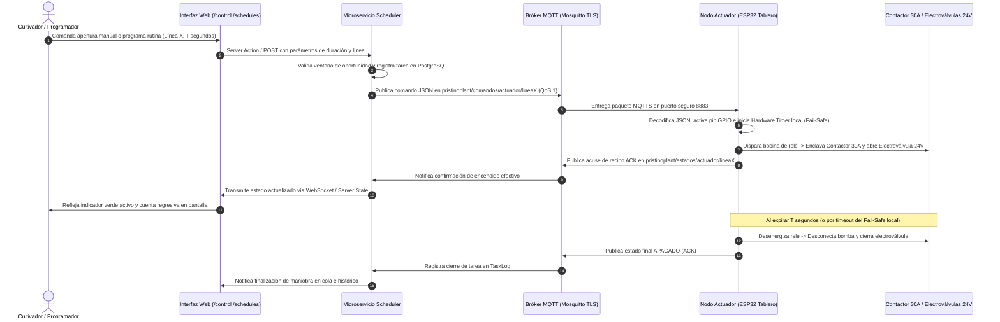
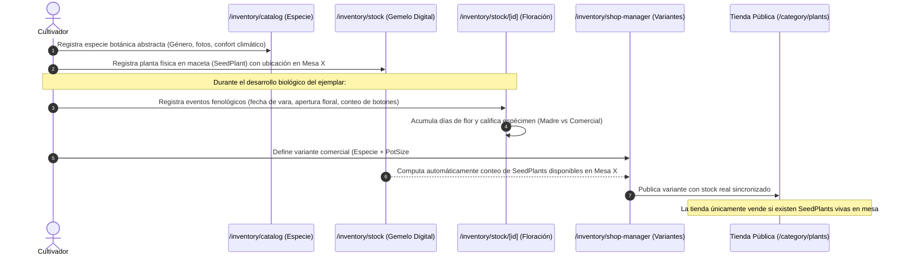
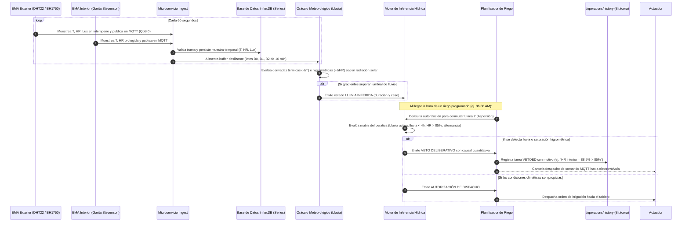

## Apéndice F: Catálogo de Interfaces de Usuario y Flujos Operativos

El presente apéndice expone el catálogo estructurado de las interfaces de usuario que conforman la plataforma web de PristinoPlant, así como la especificación detallada de los cinco (5) flujos operativos medulares del sistema. Este compendio constituye la evidencia empírica de la materialización del software y su adecuación funcional (ISO/IEC 25010), sirviendo de guía operativa para la interacción del cultivador botánico y del cliente final.

En atención a la naturaleza técnica y agronómica de la investigación, este catálogo omite los módulos administrativos genéricos (como inicio de sesión y gestión básica de cuentas) y prioriza de manera jerárquica los dominios críticos de la agricultura protegida:

1. **Operaciones del circuito hidráulico y riego autónomo:** Tablero de comando directo, gestión de colas, programador recurrente y bitácora de auditoría histórica.
2. **Laboratorio y dosificación agronómica:** Inventario de insumos con dosis unitarias por litro, recetas compuestas, ciclos rotativos anti-resistencia y consola de seguimiento proyectado.
3. **Catálogo botánico, inventario físico y gemelos digitales:** Clasificación taxonómica, inventario unívoco de especímenes (`SeedPlant`), seguimiento fenológico y conciliación de stock comercial en mesas.
4. **Telemetría y monitoreo ambiental:** Dashboard de microclima en tiempo real, oráculo meteorológico de precipitación pluvial y análisis ecofisiológico por zonas.
5. **Comercio electrónico y gestión de ventas:** Portal público de la tienda botánica, selección de variantes vivas, checkout y conciliación de órdenes.

En las Figuras Ap-F1 a Ap-F25 se presentan las veinticinco (25) interfaces de usuario esenciales de la plataforma, acompañadas de sus especificaciones técnicas y denominaciones formales según la normativa de presentación de informes de la Escuela de Ingeniería Informática (UCAB Guayana).

---

### **Operaciones del circuito hidráulico y riego autónomo.**

Las interfaces de este bloque permiten al cultivador supervisar y gobernar la infraestructura electromecánica del invernadero (bomba de agua de 1 HP y 1 pulgada, junto a las electroválvulas de solenoide). La seguridad operativa de las conmutaciones reside en que todas las maniobras son estrictamente atómicas y requieren la validación de su acuse de recibo bidireccional (`ACK`) vía MQTT; asimismo, ante cualquier eventual pérdida de conectividad Wi-Fi o del enlace con el bróker MQTT, el firmware del nodo actuador desenergiza y cierra de inmediato el circuito por protección (*fail-safe* por desconexión), impidiendo aperturas indefinidas o inundaciones en el cultivo.

#### ***Centro de control manual directo (`/operations/control`).***

La interfaz centraliza el comando inmediato de las cuatro líneas hidráulicas del orquideario: Línea 1 (Humidificación / Foggers), Línea 2 (Aspersión principal de mesas), Línea 3 (Humectación de suelo para enfriamiento pasivo) y Línea 4 (Dosificación agroquímica aislada). Cuenta con tarjetas de conmutación individual provistas de selectores de duración preestablecida (por defecto 300 segundos), indicadores de estado de conexión al bróker MQTT, latencia del enlace telemétrico y temporizadores visuales con cuenta regresiva. Toda orden despachada activa una guarda local en firmware que interrumpe la impulsión ante pérdida de red.

*Figura Ap-F1*. Centro de Control Manual Directo de Actuadores Hidráulicos.
*Nota.* Muestra los controles de conmutación manual por línea hidráulica, selectores de temporización fail-safe, estado de enlace MQTT y tarjetas de retroalimentación de estado real.

#### ***Modal de advertencia y confirmación de agroquímicos (`/operations/control`).***

Dado que la manipulación de insumos fitosanitarios y fertilizantes concentrados exige rigurosas medidas de seguridad operacional, la conmutación de la Línea 4 requiere una confirmación interactiva explícita. El modal presenta al operador la lista de tareas de dosificación pendientes registradas en el laboratorio, detallando el nombre de la mezcla, el volumen de aplicación y las recomendaciones toxicológicas antes de autorizar el energizado de la electroválvula de 24V.

*Figura Ap-F2*. Modal de Advertencia y Confirmación para Maniobras de Dosificación.
*Nota.* Despliega los parámetros de la solución química a inyectar, alertas toxicológicas y solicitud de confirmación manual para prevenir descargas accidentales.

#### ***Supervisión de cola de tareas y maniobras activas (`/operations/queue`).***

Esta pantalla supervisa en tiempo real las operaciones hídricas gestionadas por el microservicio `Scheduler`. Permite auditar las maniobras que se encuentran en ejecución inmediata (`RUNNING`), encoladas para los próximos minutos (`PENDING`) o diferidas temporalmente. Cada elemento visualiza la línea hidráulica involucrada, la duración programada, el origen del comando (manual o autónomo) y un botón de cancelación de emergencia para detener la maniobra en cualquier instante.

*Figura Ap-F3*. Supervisión de la Cola de Tareas Hidráulicas Activas.
*Nota.* Presenta el listado reactivo de maniobras hídricas en ejecución y en espera, con temporizadores de progreso y opciones de cancelación inmediata.

#### ***Programador de rutinas recurrentes de riego (`/operations/schedules`).***

Permite establecer cronogramas automatizados periódicos de irrigación y nebulización mediante expresiones basadas en tiempo (Cron). El cultivador selecciona los días de la semana, la hora de inicio, la duración en minutos y la línea de riego a energizar. Asimismo, la vista incorpora selectores para habilitar las guardas deliberativas del sistema: veto por lluvia activa, espaciamiento interdiario automático y límites por saturación higrométrica.

*Figura Ap-F4*. Programador de Rutinas Recurrentes de Irrigación.
*Nota.* Exhibe la matriz de rutinas periódicas configuradas, días de activación, tiempos de apertura y conmutadores de vetos ambientales autónomos.

#### ***Bitácora de auditoría histórica de operaciones (`/operations/history`).***

Tal como se ilustra en la **Figura Ap-F5**, la bitácora de auditoría histórica constituye el registro cronológico inmutable que centraliza la trazabilidad integral de todas las conmutaciones y decisiones hídricas del orquideario. La interfaz se estructura mediante una línea de tiempo interactiva (*timeline*) organizada en tarjetas secuenciales; cada una documenta la marca temporal exacta, la línea hidráulica afectada, el actor o servicio emisor (comando manual del cultivador o rutina del `Scheduler`), y el contraste entre la duración programada y la efectivamente ejecutada. Asimismo, la vista permite certificar el desenlace atómico de cada tarea (`COMPLETED`, `CANCELLED` o `INTERRUPTED` ante contingencias de enlace) y expone cuantitativamente la causal algorítmica de los vetos deliberativos (p. ej., precipitación pluvial en curso, lluvia en las últimas 4 horas o humedad relativa superior al 85%).

*Figura Ap-F5*. Bitácora de Auditoría Histórica de Operaciones y Registro de Vetos.
*Nota.* Muestra el historial cronológico con indicadores de procedencia, duraciones reales y causas cuantitativas de veto ambiental emitidas por los motores.

---

### **Laboratorio y dosificación agronómica.**

Transforma la formulación de tratamientos en un proceso metódico y escalable. El módulo gestiona un catálogo de insumos agroquímicos puros cuyas dosis se registran normalizadas por litro de agua, permitiendo formular mezclas compuestas para cualquier capacidad hídrica. A partir de estas recetas de nutrición foliar y fitosanidad, el sistema estructura ciclos rotativos anti-resistencia, automatiza su despacho hidráulico y audita el avance mediante un cronograma proyectado de seguimiento para rutinas manuales y automatizadas.

#### ***Inventario de insumos agroquímicos puros (`/lab/supplies`).***

Gestiona el inventario de insumos puros del orquideario (fertilizantes minerales, fungicidas, insecticidas y bactericidas). Para garantizar escalabilidad ante cualquier volumen de preparación, las dosis base se registran normalizadas por litro de agua ($ml/L$ o $g/L$). Cada ficha documenta el nombre comercial, ingrediente activo, advertencias toxicológicas, mecanismos de acción molecular (códigos FRAC e IRAC) y tiempo de reingreso seguro al cultivo.

*Figura Ap-F6*. Inventario de Insumos Agroquímicos Puros.
*Nota.* Muestra el catálogo de insumos concentrados con dosis unitarias por litro de agua, clasificación agronómica y directrices de seguridad.

#### ***Formulación de recetas y mezclas compuestas (`/lab/recipes`).***

Permite formular mezclas combinando múltiples insumos puros para diseñar recetas nutricionales o fitosanitarias. Al seleccionar los compuestos y fijar el volumen total de agua deseado, el sistema calcula automáticamente la proporción exacta de cada componente a partir de su dosis unitaria, alertando sobre incompatibilidades químicas conocidas y riesgos de fitotoxicidad antes de registrar la fórmula.

*Figura Ap-F7*. Asistente de Formulación y Balanceo de Recetas Compuestas.
*Nota.* Detalla el configurador de formulaciones, cálculo volumétrico automático de ingredientes por volumen de tanque y verificación de compatibilidad.

#### ***Configuración de programas nutricionales y fitosanitarios rotativos (`/lab/dosing`).***

Estructura planes agronómicos secuenciales organizados en ciclos rotativos de 4 a 8 pasos para su automatización. La interfaz garantiza la alternancia de moléculas con distinto mecanismo de acción (FRAC/IRAC) e intercala riegos de lavado con agua pura entre fertilizaciones, preservando la conductividad eléctrica del sustrato y mitigando la resistencia biológica de patógenos.

*Figura Ap-F8*. Diseñador de Programas Agronómicos Secuenciales y Rotación de Principios Activos.
*Nota.* Presenta la secuencia cíclica de aplicaciones, asignación de recetas por etapa y pautas de alternancia de moléculas anti-resistencia.

#### ***Agenda proyectada y programación de tratamientos (`/lab/dosing-schedules`).***

Consola de seguimiento para dosificación manual y automatizada, homóloga a las vistas de cola (`/queue`) e histórico (`/history`) del circuito hidráulico. Mediante un cronograma interactivo, supervisa las fechas y horas de aplicación de cada tratamiento proyectado, asigna las rutinas a mesas de cultivo específicas y audita el estado de cada labor (pendiente, completada o diferida), coordinando la preparación en tanque con la conmutación de la Línea 4 de agroquímicos.

*Figura Ap-F9*. Agenda Proyectada y Programación de Tratamientos.
*Nota.* Exhibe el cronograma de tratamientos agronómicos proyectados, estado de seguimiento de tareas y asignación por mesas de cultivo.

---

### **Catálogo botánico, inventario físico y gemelos digitales.**

Este módulo materializa la individualización de cada activo biológico vivo en las mesas de cultivo mediante el modelo de gemelos digitales (`SeedPlant`), vinculando la taxonomía botánica, el tamaño de maceta (`PotSize`), la trazabilidad fenológica de floración y la disponibilidad comercial en tienda.

#### ***Modales de creación y parametrización taxonómica (`/catalog`).***

Permite gobernar la taxonomía vegetal del sistema a través de tres diálogos modales activados desde las tarjetas métricas de la cabecera. El modal de Tipos de Plantas expone las clases botánicas base (`PlantType`: Orquídeas, Adeniums, Bromelias, Cactus y Suculentas). El modal de Géneros posibilita registrar y editar géneros botánicos vinculándolos a su tipo correspondiente. Por su parte, el modal de Alta Rápida de Especies captura el nombre de la especie, la selección en cascada de tipo y género, la descripción y el color de resplandor (*glowColor*), integrando persistencia automática de borradores en cliente (`useFormDraftStore`) que previene la pérdida de datos antes de transicionar hacia el gestor avanzado.

*Figura Ap-F10*. Modales de Creación y Parametrización Taxonómica.
*Nota.* Muestra los diálogos modales para gestión de tipos botánicos, registro de géneros y alta rápida de especies con persistencia de borradores.

#### ***Catálogo botánico y cuadrícula de especies por género (`/catalog`).***

Organiza la colección vegetal del orquideario en una estructura jerárquica agrupada por Tipo de Planta y seccionada por bloques de Género. Cada bloque de género incluye un menú contextual de administración para editar su denominación o eliminarlo de forma protegida (con validación de seguridad que bloquea la acción si posee especies hijas asociadas). La cuadrícula presenta las tarjetas interactivas (`CatalogSpeciesCard`) de cada especie con su fotografía de portada, nombre botánico y badges cuantitativos de variantes comerciales configuradas y plantas vivas en mesas. La vista integra un sistema de enfoque reactivo que realiza un desplazamiento suave centrado y resalta temporalmente con un halo luminoso (*glow*) la especie recién creada o modificada.

*Figura Ap-F11*. Catálogo Botánico y Cuadrícula de Especies por Género.
*Nota.* Presenta la organización del catálogo por géneros, tarjetas de especies con indicadores de variantes y plantas en mesa, y acciones de gestión.

#### ***Gestión integral de especie y galería multimedia (`/catalog/[slug]`).***

Centraliza la administración técnica y visual de una especie botánica individual. Permite editar el nombre taxonómico, reasignar su género y redactar la descripción morfológica. Incorpora un selector cromático inteligente (`glowColor`) que analiza y extrae en tiempo real el color vibrante dominante de la fotografía floral para fijar la identidad visual y el resplandor de la planta en la tienda. Su gestor multimedia interactivo permite cargar imágenes en alta resolución organizadas en Cloudflare R2 (`plants/[tipo]/[género]/[slug]`), reordenar las tomas mediante arrastre (*drag & drop*), designar la fotografía principal de portada (*badge Principal / botón Destacar*) y eliminar imágenes bajo confirmación modal, protegiendo al espécimen contra eliminaciones accidentales si cuenta con activos biológicos en cultivo.

*Figura Ap-F12*. Gestión Integral de Especie y Galería Multimedia.
*Nota.* Exhibe el editor de metadatos botánicos, selector de colorimetría vibrante y el gestor de imágenes con ordenamiento por arrastre y selección de portada.

#### ***Matriz de inventario físico y gemelos digitales en mesas (`/stock`).***

Panel central de inventario físico y seguimiento de activos biológicos en cultivo. Agrupa las especies registradas mostrando para cada una el total acumulado de ejemplares vivos (`SeedPlant`) y el desglose de variantes de venta disponibles. La vista permite explorar las macetas presentes en las mesas del orquideario, verificar su estado vegetativo y acceder directamente a la ficha individual de inventario por especie.

*Figura Ap-F13*. Matriz de Inventario Físico y Gemelos Digitales en Mesas.
*Nota.* Muestra el listado de especies en inventario con conteo total de plantas vivas en mesas y variantes comerciales activas.

#### ***Ficha técnica de espécimen y bitácora fenológica (`/stock/[id]`).***

Ficha técnica y operacional dedicada al inventario de una especie específica en las mesas. Integra un panel de analítica fenológica que consolida el benchmark histórico de floración (duración media de la flor en días, frecuencia anual y meses típicos de inflorescencia), el gestor de variantes comerciales por tamaño de contenedor (`PotSize`: Nro 5, Nro 7, Nro 10 y Nro 14) con sus precios en USD, y la relación unívoca de plantas físicas en mesa (`PlantInstanceCard`) con registro de eventos fenológicos de floración (fechas de brote de vara, apertura y marchitamiento) y su ubicación espacial tridimensional (Zona y Mesa).

*Figura Ap-F14*. Ficha Técnica de Espécimen y Bitácora Fenológica.
*Nota.* Despliega la analítica histórica de floración, conciliación de macetas físicas por mesa y tarjetas de ejemplares vivos.

#### ***Gestor comercial de variantes y stock sincronizado (`/shop-manager`).***

Interfaz administrativa que gestiona la personalización de la tienda pública digital. Permite al cultivador designar las especies botánicas destacadas en la vitrina comercial (`FeaturedSpeciesManager`), seleccionar piezas multimedia de portada (`MediaPicker`) y sincronizar automáticamente el stock disponible para venta en línea a partir de la conciliación estricta de las macetas vivas registradas en las mesas de cultivo.

*Figura Ap-F15*. Gestor Comercial de Variantes y Stock Sincronizado.
*Nota.* Ilustra el panel de personalización de la vitrina comercial, selección de especies destacadas y asignación de banners multimedia.

#### ***Panel de solicitudes y lista de espera de ejemplares (`/requests`).***

Permite administrar el interés de compra de clientes sobre especies botánicas temporalmente agotadas o en fase de crecimiento vegetativo. Centraliza los registros de solicitud vinculando el correo electrónico del comprador con la especie y tamaño de maceta de interés, disparando notificaciones automáticas tan pronto como nuevos ejemplares físicos de dicha especie alcanzan el estado comercial disponible en las mesas de cultivo.

*Figura Ap-F16*. Panel de Solicitudes y Lista de Espera de Ejemplares.
*Nota.* Exhibe las peticiones de reserva de especies sin stock, datos de contacto del comprador y alertas automáticas de reposición.

---

### **Telemetría y monitoreo ambiental.**

Estas vistas representan el núcleo de percepción del microclima, exhibiendo las magnitudes físicas transmitidas minuto a minuto por las estaciones EMA Exterior e Interior, las derivadas analíticas del oráculo pluvial y los indicadores psicrométricos de estrés vegetal.

#### ***Dashboard telemétrico central en tiempo real (`/monitoring`).***

Panel principal de supervisión climática del orquideario. Exhibe tarjetas de lectura instantánea que contrastan las condiciones de intemperie (EMA Exterior) con las condiciones bajo malla sombra (EMA Interior): Temperatura ($^\circ\text{C}$), Humedad Relativa ($\%HR$) e Iluminancia solar ($\text{Lux}$). Adicionalmente, integra gráficos históricos interactivos alimentados desde InfluxDB con selectores de ventana temporal (24 horas, 7 días, 30 días) y marcadores de la zona de confort ambiental de las orquídeas.

*Figura Ap-F17*. Dashboard Telemétrico de Supervisión Microclimática en Tiempo Real.
*Nota.* Presenta los indicadores microclimáticos instantáneos de ambas estaciones, gráficos temporales de temperatura, humedad y luz, y bandas de confort vegetal.

#### ***Monitor del oráculo meteorológico e inferencia de lluvia (`/weather-oracle`).***

Interfaz de visualización operativa del Motor de Inferencia Meteorológica (`rain-manager.ts`). Muestra el estado atmosférico actual deducido por el algoritmo (Despejado, Lluvia Nublada, Lluvia Soleada, Lluvia Nocturna o Cese de Precipitación), el cálculo en tiempo real de las derivadas térmicas instantáneas ($-\Delta T$) e higrométricas ($+\Delta HR$) en ventanas deslizantes de 10, 20 y 30 minutos, y la activación de guardas que vetan preventivamente las operaciones hidráulicas de aspersión.

*Figura Ap-F18*. Monitor del Oráculo Meteorológico e Inferencia de Lluvia.
*Nota.* Ilustra el estado pluvial inferido en tiempo real, derivadas de gradientes higrotérmicos en ventanas deslizantes y estado de veto hídrico.

#### ***Análisis ecofisiológico e indicadores de microclima por zona (`/botanics`).***

Panel de analítica agronómica avanzada que sintetiza el comportamiento ambiental del cultivo. Evalúa la integral higrométrica diaria, las horas acumuladas bajo estrés térmico ($T > 32^\circ\text{C}$), los promedios térmicos diurnos y la radiación solar acumulada. Proporciona recomendaciones cualitativas automáticas al cultivador sobre la necesidad de aplicar pulsos de humectación en piso (Línea 3) o nebulización aérea (Línea 1).

*Figura Ap-F19*. Panel de Analítica Agronómica e Indicadores de Confort Vegetal.
*Nota.* Despliega índices de estrés térmico, acumulación de calor diurno y recomendaciones ambientales de irrigación.

---

### **Comercio electrónico y gestión comercial.**

Este bloque comprende la experiencia comercial del cliente externo en la tienda digital y las herramientas administrativas del orquideario para conciliar pagos multimoneda y coordinar despachos.

#### ***Catálogo público de la tienda botánica (`/category/plants`).***

Vista principal de exploración para el cliente final. Dispone de una cuadrícula de productos responsiva con fotografías botánicas de alta resolución, nombre científico, nombre común y rango de precios. Incorpora un motor de búsqueda por texto y filtros dinámicos por género taxonómico (*Cattleya*, *Phalaenopsis*, *Dendrobium*, *Vanda*, *Oncidium*, etc.) y requerimientos de iluminación.

*Figura Ap-F20*. Catálogo Público de la Tienda Botánica.
*Nota.* Exhibe la vitrina comercial con tarjetas de especies, selector interactivo de géneros botánicos y barra de búsqueda reactiva.

#### ***Ficha comercial de producto botánico y selector de maceta (`/plant/[slug]`).***

Ficha técnica y comercial de la especie. Presenta la galería de imágenes, ficha botánica descriptiva, consejos de cultivo y un selector de tamaño de maceta interactivo (`PotSize`). Al seleccionar el contenedor deseado, la vista actualiza en tiempo real el precio en USD y la disponibilidad en existencias sustentada en las macetas vivas en mesa, deshabilitando la opción de compra si la variante no cuenta con ejemplares físicos disponibles.

*Figura Ap-F21*. Ficha Comercial de Especie y Selector de Tamaño de Maceta.
*Nota.* Muestra la ficha detallada de la especie, selector dinámico de tamaño de maceta, actualización de precio y botón de agregar al carrito.

#### ***Carrito de compras interactivo (`/cart`).***

Permite al comprador auditar los especímenes seleccionados, modificar las cantidades respetando los límites de stock real en mesa, visualizar los subtotales en dólares y proceder al cierre de la compra. Dispone de almacenamiento persistente en el navegador para preservar los productos durante la sesión de compra.

*Figura Ap-F22*. Carrito de Compras Interactivo.
*Nota.* Ilustra el desglose de productos seleccionados por maceta, cálculo reactivo del monto total y botón de inicio de checkout.

#### ***Proceso de pago y datos de entrega (`/checkout`).***

Formulario de formalización de compra donde el usuario suministra sus datos de facturación y selecciona la modalidad de entrega: retiro directo en las instalaciones del orquideario en San Félix o despacho a domicilio. Asimismo, permite seleccionar el método de pago preferente (Pago Móvil, Transferencia bancaria o divisas en efectivo).

*Figura Ap-F23*. Formulario de Formalización de Pedido y Selección de Despacho.
*Nota.* Presenta los campos para datos de consignación, opciones logísticas de retiro/despacho y selección de pasarela de pago.

#### ***Confirmación de orden y canalización por WhatsApp (`/checkout/order/[id]`).***

Pantalla de confirmación tras registrar el pedido en la base de datos. Muestra el número correlativo de la orden, el resumen detallado de las plantas adquiridas y las instrucciones para formalizar la transferencia bancaria. Dispone de un botón interactivo que canaliza el resumen de la orden directamente hacia el canal de mensajería del cultivador (WhatsApp API), adjuntando el código unívoco para agilizar la verificación del pago.

*Figura Ap-F24*. Pantalla de Confirmación de Pedido y Canalización por WhatsApp.
*Nota.* Detalla el comprobante digital de la orden, datos bancarios del vendedor y botón interactivo para validar la transacción por WhatsApp.

#### ***Conciliación de órdenes y registro de venta directa (`/orders` y `/orders/sales`).***

Panel administrativo para el cultivador. Permite auditar las órdenes entrantes, verificar los comprobantes de pago suministrados por los clientes y transicionar el estado del pedido (`PENDING` $\to$ `PAID` $\to$ `DELIVERED`). Al confirmarse el despacho, la plataforma descuenta automáticamente las macetas físicas correspondientes en la matriz de inventario. Adicionalmente, incluye un módulo de venta directa en mostrador (`/orders/sales`) para registrar compras presenciales en el invernadero.

*Figura Ap-F25*. Panel de Conciliación Administrativa de Órdenes y Venta Directa.
*Nota.* Muestra la tabla de órdenes de compra para confirmación de pagos, cambio de estados de despacho y registro de ventas de mostrador.

---

### **Flujos operativos y diagramas de interacción de extremo a extremo.**

A fin de ilustrar la articulación funcional entre el usuario, la plataforma web, los microservicios del backend, el protocolo de mensajería y el hardware electromecánico en campo, a continuación se detallan los cinco (5) flujos operativos medulares del sistema.

---

#### ***Flujo operativo 1: conmutación y despacho hidráulico (manual y programado).***

Este flujo gobierna el ciclo de control físico sobre la red presurizada de cuatro líneas hidráulicas, cerrando el lazo entre las interfaces de usuario o el planificador automático y los actuadores de potencia.

```mermaid
sequenceDiagram
    autonumber
    actor Cultivador as Cultivador / Programador
    participant UI as Interfaz Web (/control /schedules)
    participant Scheduler as Microservicio Scheduler
    participant Broker as Bróker MQTT (Mosquitto TLS)
    participant ESP32 as Nodo Actuador (ESP32 Tablero)
    participant Potencia as Contactor 30A / Electroválvulas 24V

    Cultivador->>UI: Comanda apertura manual o programa rutina (Línea X, T segundos)
    UI->>Scheduler: Server Action / POST con parámetros de duración y línea
    Scheduler->>Scheduler: Valida ventana de oportunidad y registra tarea en PostgreSQL
    Scheduler->>Broker: Publica comando JSON en pristinoplant/comandos/actuador/lineaX (QoS 1)
    Broker->>ESP32: Entrega paquete MQTTS en puerto seguro 8883
    ESP32->>ESP32: Decodifica JSON, activa pin GPIO e inicia Hardware Timer local (Fail-Safe)
    ESP32->>Potencia: Dispara bobina de relé -> Enclava Contactor 30A y abre Electroválvula 24V
    ESP32->>Broker: Publica acuse de recibo ACK en pristinoplant/estados/actuador/lineaX
    Broker->>Scheduler: Notifica confirmación de encendido efectivo
    Scheduler->>UI: Transmite estado actualizado vía WebSocket / Server State
    UI->>Cultivador: Refleja indicador verde activo y cuenta regresiva en pantalla
    Note over ESP32,Potencia: Al expirar T segundos (o por timeout del Fail-Safe local):
    ESP32->>Potencia: Desenergiza relé -> Desconecta bomba y cierra electroválvula
    ESP32->>Broker: Publica estado final APAGADO (ACK)
    Broker->>Scheduler: Registra cierre de tarea en TaskLog
    Scheduler->>UI: Notifica finalización de maniobra en cola e histórico
```

**Descripción Técnica del Flujo:**

1. El cultivador selecciona la línea a energizar y la duración en segundos desde el Centro de Control (`/control`), o bien el programador cronológico (`/schedules`) dispara una rutina planificada.
2. La plataforma web Next.js envía la orden al microservicio `Scheduler`, el cual verifica que no existan tareas concurrentes incompatibles en la cola y persiste el estado en PostgreSQL.
3. El `Scheduler` despacha una trama JSON serializada al bróker Mosquitto bajo el tópico `pristinoplant/comandos/actuador/lineaX` con nivel de servicio QoS 1 (garantizando entrega al menos una vez).
4. El microcontrolador ESP32 en el tablero eléctrico recibe la trama mediante el driver seguro `simple2.py`, extrae la duración especificada e inicializa un temporizador por interrupción de hardware (*Hardware Timer*).
5. El ESP32 conmuta la salida GPIO correspondiente, energizando el módulo optoacoplado que conmuta la bobina del contactor industrial de 30A (bomba de agua de 1 pulgada) y la electroválvula de 24VAC del circuito seleccionado.
6. El microcontrolador emite inmediatamente un mensaje de confirmación (`ACK`) hacia el tópico `pristinoplant/estados/actuador/lineaX`.
7. El `Scheduler` recibe el acuse de recibo, actualiza la base de datos y propaga el estado hacia la interfaz web, donde el cultivador observa la activación en tiempo real con una barra de progreso decreciente.
8. Una vez transcurrido el tiempo programado, el temporizador de hardware del firmware desenergiza las bobinas de potencia de forma totalmente autónoma (incluso si la red WiFi o el backend cayeron durante la maniobra), emite el estado de apagado hacia el bróker y el `Scheduler` cierra el registro en la bitácora histórica (`TaskLog`).

---

#### ***Flujo operativo 2: dosificación agronómica y ciclos fitosanitarios rotativos.***

Este flujo asegura el cumplimiento estricto de las labores de nutrición y sanidad botánica mediante la formulación computarizada y la conmutación de la Línea 4 de agroquímicos físicamente aislada.

```mermaid
sequenceDiagram
    autonumber
    actor Cultivador as Cultivador
    participant LabSupplies as /lab/supplies (Insumos)
    participant LabRecipes as /lab/recipes (Formulación)
    participant LabDosing as /lab/dosing (Ciclos Rotativos)
    participant LabAgenda as /lab/dosing-schedules (Agenda)
    participant Tablero as Tablero de Potencia (Línea 4 - 24V)

    Cultivador->>LabSupplies: Registra agroquímicos puros con diluciones (ml/L o g/L) y FRAC/IRAC
    Cultivador->>LabRecipes: Selecciona insumos y fija volumen (20L); sistema calcula dosis
    LabRecipes->>LabRecipes: Verifica compatibilidad de mezclas y alerta riesgos de fitotoxicidad
    Cultivador->>LabDosing: Estructura ciclo rotativo de 4 a 6 pasos alternando principios activos
    Cultivador->>LabAgenda: Proyecta calendario en días específicos y asigna mesas de cultivo
    Note over Cultivador,LabAgenda: El día de la aplicación proyectada:
    LabAgenda->>Cultivador: Emite recordatorio interactivo con la receta a preparar en el tanque
    Cultivador->>Tablero: Prepara mezcla física y autoriza conmutación de Línea 4 en /control
    Tablero->>Tablero: Inyecta solución por conducción aislada sin retorno a red potable
    Tablero->>LabAgenda: Confirma ejecución y avanza automáticamente al siguiente paso del ciclo rotativo
```

**Descripción Técnica del Flujo:**

1. El cultivador mantiene actualizado el inventario de insumos puros en `/lab/supplies`, documentando ingredientes activos y códigos de acción molecular.
2. En `/lab/recipes`, el cultivador diseña una receta seleccionando los insumos concentrados; el sistema balancea los volúmenes necesarios para el tanque presurizado de 20 litros.
3. En `/lab/dosing`, se configuran programas rotativos secuenciales (ej. Alternancia de Fungicidas Triazoles y Estrobirulinas en pasos 1 y 2, seguidos de lavado en paso 3 y nutrición foliar en paso 4) para erradicar la resistencia en hongos patógenos (*Phytophthora* y *Pythium*).
4. El planificador en `/lab/dosing-schedules` genera las entradas en el calendario del cultivador.
5. Al llegar la fecha y hora, el sistema despliega el modal de preparación con las instrucciones exactas de dilución.
6. El cultivador prepara físicamente la solución en el tanque de 20 litros y autoriza la conmutación de la Línea 4 en el Centro de Control (`/control`).
7. La electroválvula de 24V de la línea de agroquímicos se energiza por el tiempo calibrado, impulsando la solución a través de tuberías dedicadas que previenen cualquier contaminación cruzada con la red de agua limpia.
8. La plataforma registra la aplicación en la bitácora de auditoría y adelanta el puntero del programa hacia el siguiente paso del ciclo rotativo.

---

#### ***Flujo operativo 3: ciclo de vida del gemelo digital y trazabilidad botánica.***

Este flujo implementa el modelo de correspondencia unívoca del activo biológico, garantizando que cada espécimen en maceta física cuente con un reflejo digital que documenta su evolución fenológica y gobierna el stock comercial de forma dinámica.

```mermaid
sequenceDiagram
    autonumber
    actor Cultivador as Cultivador
    participant Catalog as /inventory/catalog (Especie)
    participant Stock as /inventory/stock (Gemelo Digital)
    participant Fenologia as /inventory/stock/[id] (Floración)
    participant ShopManager as /inventory/shop-manager (Variantes)
    participant Tienda as Tienda Pública (/category/plants)

    Cultivador->>Catalog: Registra especie botánica abstracta (Género, fotos, confort climático)
    Cultivador->>Stock: Registra planta física en maceta (SeedPlant) con ubicación en Mesa X
    Note over Cultivador,Fenologia: Durante el desarrollo biológico del ejemplar:
    Cultivador->>Fenologia: Registra eventos fenológicos (fecha de vara, apertura floral, conteo de botones)
    Fenologia->>Fenologia: Acumula días de flor y califica espécimen (Madre vs Comercial)
    Cultivador->>ShopManager: Define variante comercial (Especie + PotSize #10 = $25 USD)
    Stock-->>ShopManager: Computa automáticamente conteo de SeedPlants disponibles en Mesa X
    ShopManager->>Tienda: Publica variante con stock real sincronizado
    Note over Tienda: La tienda únicamente vende si existen SeedPlants vivas en mesa
```

**Descripción Técnica del Flujo:**

1. En `/inventory/catalog`, el cultivador registra la ficha taxonómica base (`Species`), estableciendo los parámetros biológicos generales de la planta.
2. Al trasplantar o enmacetar ejemplares en el invernadero, se crean entidades individuales `SeedPlant` en `/inventory/stock`, asignándoles su tamaño de maceta (`PotSize`), fecha de enmacetado y ubicación física en mesas (p. ej., Zona B, Mesa 3).
3. A medida que la planta evoluciona, el operador documenta en `/inventory/stock/[id]` los hitos fenológicos: brote de la inflorescencia, número de botones florales y días de permanencia de la flor abierta. Esta trazabilidad permite seleccionar las plantas más vigorosas como plantas madre (`MOTHER`) para preservación genética.
4. Para los especímenes destinados a la venta (`AVAILABLE`), el cultivador ingresa al gestor de variantes (`/inventory/shop-manager`) y vincula la especie y el tamaño de maceta con un precio en dólares estadounidenses.
5. La plataforma calcula de forma reactiva el stock disponible sumando los gemelos digitales activos en esa maceta, asegurando que la tienda pública (`/category/plants`) exponga únicamente existencias biológicas reales.

---

#### ***Flujo operativo 4: supervisión telemétrica y protección algorítmica contra el sobre-riego.***

Este flujo describe la captura sensorial continua y la intervención de los motores deliberativos para cancelar o vetar rutinas hídricas cuando el microclima no lo demanda, previniendo la pudrición radicular.

```mermaid
sequenceDiagram
    autonumber
    participant EMA_Ext as EMA Exterior (DHT22 / BH1750)
    participant EMA_Int as EMA Interior (Garita Stevenson)
    participant Ingest as Microservicio Ingest
    participant InfluxDB as Base de Datos InfluxDB (Series)
    participant Oracle as Oráculo Meteorológico (Lluvia)
    participant WaterMotor as Motor de Inferencia Hídrica
    participant Scheduler as Planificador de Riego
    participant History as /operations/history (Bitácora)

    loop Cada 60 segundos
        EMA_Ext->>Ingest: Muestrea T, HR, Lux en intemperie y publica en MQTT (QoS 0)
        EMA_Int->>Ingest: Muestrea T, HR protegida y publica en MQTT
        Ingest->>InfluxDB: Valida trama y persiste muestra temporal (T, HR, Lux)
        Ingest->>Oracle: Alimenta buffer deslizante (lotes B0, B1, B2 de 10 min)
    end

    Oracle->>Oracle: Evalúa derivadas térmicas (-ΔT) e higrométricas (+ΔHR) según radiación solar
    alt Si gradientes superan umbral de lluvia
        Oracle->>WaterMotor: Emite estado LLUVIA INFERIDA (duración y cese)
    end

    Note over Scheduler,WaterMotor: Al llegar la hora de un riego programado (ej. 06:00 AM):
    Scheduler->>WaterMotor: Consulta autorización para conmutar Línea 2 (Aspersión)
    WaterMotor->>WaterMotor: Evalúa matriz deliberativa (Lluvia activa, lluvia < 4h, HR > 85%, alternancia)
    alt Si se detecta lluvia o saturación higrométrica
        WaterMotor->>Scheduler: Emite VETO DELIBERATIVO con causal cuantitativa
        Scheduler->>History: Registra tarea VETOED con motivo (ej. "HR interior = 88.5% > 85%")
        Scheduler--xActuador: Cancela despacho de comando MQTT hacia electroválvula
    else Si las condiciones climáticas son propicias
        WaterMotor->>Scheduler: Emite AUTORIZACIÓN DE DISPACHO
        Scheduler->>Actuador: Despacha orden de irrigación hacia el tablero
    end
```

**Descripción Técnica del Flujo:**

1. Las estaciones meteorológicas EMA Exterior y EMA Interior muestrean las magnitudes de temperatura ($T$), humedad relativa ($HR$) e iluminancia solar ($Lux$) cada 60 segundos, publicando tramas estructuradas en el bróker MQTT.
2. El servicio `services/ingest` recibe las tramas, valida su integridad y almacena los puntos en la base de series temporales InfluxDB.
3. El Oráculo Meteorológico (`rain-manager.ts`) agrupa las lecturas en una cola de lotes deslizantes de 10 minutos ($B_0, B_1, B_2$) y calcula las derivadas instantáneas ($-\Delta T$ y $+\Delta HR$). Si los gradientes satisfacen las reglas heurísticas diurnas o nocturnas según la radiación solar, el algoritmo deduce la presencia de lluvia sin depender de sensores mecánicos corrosivos.
4. Cuando el planificador (`Scheduler`) se dispone a ejecutar una rutina de riego programada, consulta al Motor de Inferencia Hídrica.
5. El motor contrasta las condiciones actuales y recientes contra su matriz deliberativa: bloquea el riego si hay lluvia activa, si llovió en las últimas 4 a 8 horas, si la humedad relativa en el orquideario supera el 85%, o si se acumuló riego el día anterior.
6. De verificarse alguna condición adversa, el motor veta la operación, el `Scheduler` aborta la orden y se registra en `/operations/history` la justificación física detallada, impidiendo la saturación del sustrato y la asfixia del velamen radicular.

---

#### ***Flujo operativo 5: adquisición comercial, checkout multimoneda y conciliación.***

Este flujo modela la interacción entre el cliente que formaliza una compra en la plataforma pública y el cultivador que valida la transacción y actualiza el inventario físico en mesa.

```mermaid
sequenceDiagram
    autonumber
    actor Cliente as Cliente Comprador
    participant Tienda as /category/plants & /plant/[slug]
    participant Carrito as /cart & /checkout
    participant OrderPage as /checkout/order/[id]
    participant WhatsApp as WhatsApp API (Mensajería)
    actor Cultivador as Cultivador / Administrador
    participant OrdersAdmin as /orders & /orders/sales
    participant StockFisico as /inventory/stock (SeedPlants)

    Cliente->>Tienda: Explora catálogo, filtra por género y selecciona espécimen
    Tienda->>Cliente: Exhibe ficha, opciones de maceta (PotSize) y stock vivo en mesa
    Cliente->>Carrito: Añade variante al carrito y procede a formalizar compra
    Cliente->>Carrito: Ingresa datos de facturación, entrega (retiro/despacho) y método de pago
    Carrito->>OrderPage: Genera registro Order en PostgreSQL con estado PENDING
    OrderPage->>Cliente: Presenta número de orden, resumen y botón interactivo a WhatsApp
    Cliente->>WhatsApp: Presiona botón; envía mensaje preformateado con comprobante de pago
    WhatsApp->>Cultivador: Recibe mensaje directo del comprador con ID de orden
    Cultivador->>OrdersAdmin: Accede a panel /orders, corrobora pago bancario y cambia a PAID
    Cultivador->>OrdersAdmin: Prepara el paquete físico y marca orden como DELIVERED
    OrdersAdmin->>StockFisico: Descuenta automáticamente las macetas SeedPlant del inventario de mesa
    OrdersAdmin->>Cliente: Emite notificación de despacho completado
```

**Descripción Técnica del Flujo:**

1. El cliente accede a la tienda botánica (`/category/plants`), filtra por el género de su preferencia y selecciona una especie en la vista detallada (`/plant/[slug]`).
2. Elige el tamaño de maceta deseado; la plataforma valida que existan ejemplares físicos en estado disponible en las mesas de cultivo y permite añadir la variante al carrito (`/cart`).
3. En la pantalla de checkout (`/checkout`), el comprador ingresa su dirección de entrega o selecciona retiro en tienda, especificando el método de pago multimoneda.
4. El sistema crea la orden en estado pendiente (`PENDING`) en PostgreSQL y redirige a la página de confirmación (`/checkout/order/[id]`).
5. La vista provee un botón interactivo que enlaza con la API de WhatsApp, precargando un mensaje estructurado con el número de orden y monto exacto para que el comprador envíe su comprobante de pago bancario directamente al cultivador.
6. El cultivador consulta el panel administrativo de órdenes (`/orders`), contrasta la acreditación del dinero en su cuenta y transiciona la orden a estado pagado (`PAID`).
7. Una vez despachada la planta, el operador actualiza la orden a entregada (`DELIVERED`). En este instante, el sistema descuenta automáticamente la cantidad de gemelos digitales (`SeedPlant`) correspondientes del inventario físico en mesas, manteniendo la concordancia absoluta entre las plantas presentes en el orquideario y el stock de la tienda digital.

---

Con la consolidación de este catálogo de interfaces y flujos de interacción concluye el **Apéndice F**, certificando la cobertura funcional completa de la plataforma PristinoPlant sobre los requerimientos de ingeniería de software, percepción ambiental hiperlocal y tecnificación hídrica en el cultivo de orquídeas.
