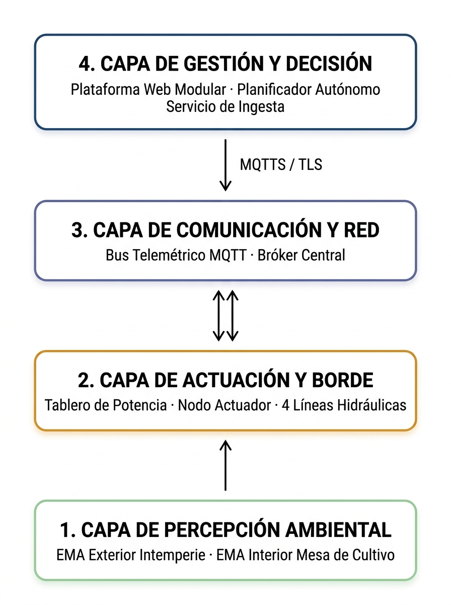

## Diseño Conceptual

En correspondencia con los requerimientos funcionales y no funcionales derivados del análisis inicial, la plataforma PristinoPlant se concibe conceptualmente como un sistema integral y unificado, donde la aplicación web sirve como núcleo operativo central para la supervisión telemétrica, el comando de actuadores, la trazabilidad agronómica y el comercio digital. Para garantizar alta cohesión y modularidad, el sistema se organiza en dos grupos de módulos funcionales:
1. *Módulos IoT de Automatización, Telemetría y Riego:* Componentes responsables de la adquisición sensorial en campo, la supervisión de estaciones meteorológicas y nodos embebidos, la conmutación del tablero de potencia sobre el circuito hidráulico y la toma de decisiones autónomas mediante motores de inferencia.
2. *Módulos de Gestión Agronómica, Trazabilidad y Comercio:* Capacidades operativas que administran el catálogo taxonómico de la familia *Orchidaceae*, el seguimiento y proyección del calendario de aplicación de los programas de dosificación de agroquímicos (nutricionales y fitosanitarios), el inventario individualizado por maceta (`SeedPlant`) y la tienda digital.

**Visión general y abstracción de la arquitectura IoTS en capas funcionales.** La gobernanza del microclima y la irrigación del orquideario se articula bajo una arquitectura distribuida y dirigida por eventos para IoTS, cuyo propósito es cerrar la brecha entre la percepción sensorial del entorno, la toma de decisiones desatendidas y la conmutación electromecánica de potencia. Para gestionar la integración de hardware, firmware y software, la plataforma se estructura en cuatro (4) capas funcionales interconectadas, cuya jerarquía arquitectónica se ilustra en la Figura 1.

**_Figura 1._** Arquitectura en capas del sistema IoTS.
*Nota.* Fuente: Elaboración propia fundamentada en el modelo de capas para IoTS (Gubbi et al., 2013).

***Capa de percepción ambiental.*** Constituye el punto de contacto sensorial con el microclima. Su función es muestrear magnitudes físicas críticas para la ecofisiología de las orquídeas —temperatura atmosférica ($T$), humedad relativa ($HR$) e iluminancia solar ($Lux$)— discriminando dinámicamente entre el entorno externo a la intemperie (EMA Exterior) y el microclima protegido bajo malla sombra (EMA Interior). Esta capa genera los flujos de telemetría de alta resolución requeridos para alimentar los motores de decisión.

***Capa de actuación y control de borde.*** Representa el brazo ejecutor sobre la infraestructura física del invernadero. Está conformada por el nodo embebido de control y el tablero de fuerza eléctrica instalado de forma segura fuera del área de cultivo. Su responsabilidad es traducir las órdenes lógicas de irrigación en conmutaciones eléctricas confiables, gobernando la activación de la bomba de agua de impulsión y las electroválvulas asociadas a las cuatro líneas del circuito hidráulico, incorporando protecciones eléctricas para una conmutación segura y confirmación de recepción de comandos (`ACK`).

***Capa de comunicación y red.*** Constituye el canal de integración e intercambio de datos entre los nodos embebidos en campo (*Edge*) y los servicios en la nube (*Cloud*). Mediante un protocolo de publicación y suscripción bajo canales cifrados, el envío de telemetría y el despacho de comandos operan de forma ágil y desacoplada, evitando esperas bloqueantes en la transmisión, reduciendo la sobrecarga de datos y tolerando interrupciones transitorias de conectividad.

***Capa de gestión, orquestación y decisión.*** Constituye el estrato de inteligencia y supervisión del sistema IoTS. En la **gestión**, integra las interfaces web operativas y de monitoreo telemétrico en tiempo real (`/monitoring`, `/control`, `/schedules`), administrando la persistencia histórica y la parametrización de las cuatro líneas de riego (cuyo catálogo visual completo de interfaces y pantallas se describe en el **Apéndice F**). En la **orquestación**, coordina mediante servicios contenerizados en Docker la ingesta continua de datos y el despacho desatendido de comandos 24/7. Por último, en la **decisión**, delibera en tiempo real a través de los motores de inferencia meteorológica e hídrica para autorizar, diferir o vetar el riego ante lluvia o saturación ambiental, garantizando la protección autónoma del cultivo.

**Modelo de información conceptual.** Siguiendo el modelado formal para Sistemas Basados en IoT y trazabilidad botánica, el universo de información de PristinoPlant se estructura a partir de las entidades y conceptos medulares de sus dos dominios funcionales:
* *Espécimen botánico (`SeedPlant`):* Entidad unívoca en el dominio agronómico que modela la existencia física de cada orquídea en maceta, vinculando su identidad taxonómica (género, especie, híbrido), tamaño de contenedor, localización física en mesas y registro fenológico de floración.
* *Programa de dosificación y calendario agronómico:* Estructura secuencial que planifica y audita la aplicación rotativa de tratamientos nutricionales y fitosanitarios, garantizando la alternancia de moléculas y el historial de ejecuciones por zona de cultivo.
* *Estación meteorológica automatizada (EMA):* Fuente telemétrica ambiental identificable del dominio IoT que delimita una zona de influencia microclimática específica (exterior a la intemperie versus interior bajo malla sombra).
* *Muestra telemétrica:* Registro inmutable constituido por una tupla de magnitudes físicas ($T, HR, Lux, VPD$), estampilla temporal (*timestamp*) y código de estación de origen, representativa de las condiciones instantáneas del microclima.
* *Programa de riego:* Directriz temporal recurrente que asigna ventanas horarias, periodicidad y duraciones de apertura a una línea hidráulica específica.
* *Inferencia decisional:* Juicio deliberativo generado por los motores de reglas en tiempo real que clasifica el estado ambiental y determina si un riego programado debe ser ejecutado, postergado o vetado ante condiciones de lluvia o saturación higrométrica.

**Casos de uso del sistema.** El comportamiento funcional y las fronteras operativas de la plataforma se modelan formalmente mediante la interacción entre los actores identificados y los módulos derivados de la Especificación de Requerimientos del Sistema (SRS).

***Actores del sistema.*** En la interacción con la plataforma intervienen cuatro actores claramente diferenciados:
1. *Cultivador (Usuario Administrador):* Operador técnico que supervisa la telemetría microclimática, comanda maniobras hidráulicas manuales, proyecta y audita el calendario de dosificación agronómica y administra el inventario físico en mesas.
2. *Cliente (Usuario Comercial / Externo):* Usuario final que explora el catálogo botánico público, consulta la disponibilidad de ejemplares en maceta y formaliza solicitudes de compra a través de la tienda digital integrada.
3. *Sistema Autónomo (Planificador y Motores de Inferencia):* Actor computacional desatendido en el servidor que evalúa de forma ininterrumpida las series climáticas para autorizar, diferir o vetar el riego en tiempo real.
4. *Servicio de Notificaciones (Mensajería Interactiva):* Agente de comunicación auxiliar que canaliza alertas operativas, confirmaciones de eventos de riego y diagnósticos de conectividad hacia canales directos del cultivador.

***Interacción funcional de casos de uso.*** Las fronteras operativas del sistema articulan las responsabilidades de estos cuatro actores con los siete módulos funcionales de la SRS (véase Tabla 1 del Análisis inicial y el Apéndice A). En esta dinámica, el *Cultivador* asume la gestión de gemelos digitales (`CU01`, Figuras Ap-F10 a Ap-F15), la dosificación agronómica (`CU02`, Figuras Ap-F6 a Ap-F9), la supervisión telemétrica (`CU03`, Figuras Ap-F16 a Ap-F18) y el comando hidráulico (`CU04`, Figuras Ap-F1 a Ap-F5); el *Sistema Autónomo* gobierna la deliberación y el riego desatendido (`CU05`, Flujo 4 del Apéndice F); el *Cliente* interactúa mediante el catálogo botánico y comercio digital (`CU06`, Figuras Ap-F19 a Ap-F24); y el *Servicio de Notificaciones* emite diagnósticos y alertas operacionales (`CU07`), preservando una delimitación estricta de responsabilidades entre la supervisión humana y la autonomía deliberativa (véanse diagramas de secuencia en los Flujos 1 al 5 del **Apéndice F**).

**Flujo conceptual de datos en dos vías.** A diferencia de los sistemas puramente informacionales, un Sistema Basado en IoT opera a través de un lazo cerrado de telemetría y control. El flujo de datos en PristinoPlant se articula conceptualmente en dos vías complementarias:

***Flujo telemétrico ascendente (borde hacia servidor).*** Inicia en el borde físico, donde las estaciones EMA muestrean los sensores ambientales a intervalos regulares, empaquetan las magnitudes físicas en tramas estructuradas y las publican hacia el bus telemétrico bajo canales diferenciados.

En el servidor, el servicio de ingesta valida la integridad de las cargas útiles, descarta lecturas anómalas, normaliza unidades y calcula el Déficit de Presión de Vapor (VPD). Los datos resultantes se bifurcan concurrentemente: se persisten en la base de series temporales para análisis histórico y se suministran a la memoria de los motores de decisión y al panel de supervisión.

***Flujo de control descendente (servidor hacia borde).*** Se origina cuando el planificador autónomo o el cultivador desde la interfaz web genera una directriz de riego para una línea específica. Si la orden proviene del planificador, el motor de inferencia evalúa la telemetría reciente; si clasifica lluvia o saturación higrométrica emite un veto deliberativo, mientras que si el microclima es propicio autoriza el despacho.

La orden autorizada viaja por el bus telemétrico con acuse de recibo obligatorio hacia el nodo actuador de borde. Al recibir el comando, el controlador energiza los relés correspondientes e inicia un temporizador local de seguridad (*fail-safe*). Finalmente, el nodo emite una confirmación de conmutación efectiva (`ACK`) hacia el servidor, cerrando el lazo de control y notificando al usuario.

**Concepción funcional del circuito hidráulico de riego.** Para satisfacer los requerimientos agronómicos diagnosticados en el análisis y erradicar los riesgos de asfixia radicular o estrés térmico en el cultivo protegido de $45\text{ m}^2$, se concibió la segmentación de la red hidráulica en cuatro (4) líneas de control funcionalmente independientes:
* *Línea 1: Humidificación de aire (nebulización / foggers):* Emisores superiores de descarga ultrafina suspendidos sobre pasillos centrales. Su función es atomizar microgotas para elevar la humedad relativa ambiental y amortiguar el Déficit de Presión de Vapor (VPD) en horas secas, sin generar goteo perjudicial sobre las macetas.
* *Línea 2: Aspersión de riego principal:* Emisores rotativos calibrados con distribución volumétrica homogénea sobre las mesas de cultivo. Se encargan de la irrigación profunda del sustrato de corteza y el lavado del velamen radicular durante las rutinas matutinas.
* *Línea 3: Humectación de suelo:* Manguera perforada tendida a ras de suelo sobre la cama de piedra picada. Descarga agua directamente sobre el piso para propiciar un enfriamiento evaporativo pasivo continuo que mitiga las temperaturas extremas del mediodía, sin humedecer la masa foliar de las orquídeas bajo radiación solar cenital.
* *Línea 4: Dosificación agroquímica y fitosanitaria:* Conducción físicamente aislada e independiente de las líneas de agua limpia. Se diseñó para inyectar soluciones de nutrientes y fungicidas en proporciones controladas, suprimiendo por diseño cualquier riesgo de contaminación cruzada hacia la red hidráulica matriz.

Esta segmentación física e hidráulica constituye la base sobre la cual opera el motor de inferencia hídrica, permitiendo gobernar cada línea mediante directrices de decisión diferenciadas según las condiciones climáticas del momento.

**Justificación del patrón arquitectónico de software.** En la ingeniería de Sistemas Basados en IoT aplicados a la agricultura protegida, la estructuración arquitectónica del software define la resiliencia operativa, la mantenibilidad y la latencia telemétrica del sistema.

***Descarte de microservicios puros y mitigación del «monolito distribuido».*** La arquitectura de microservicios estricta exige bases de datos independientes por servicio y despliegues aislados. En plataformas de escala acotada, forzar este paradigma introduce una sobrecarga desproporcionada de coordinación, latencia distribuida y riesgos transaccionales. Compartir un único almacenamiento relacional entre múltiples servicios remotos desemboca en el antipatrón de «monolito distribuido», aunando la fragilidad de las llamadas remotas con la rigidez centralizada.

***Adopción de la arquitectura híbrida para IoTS.*** Para solventar estos riesgos, la solución adopta una arquitectura híbrida para IoTS (integración distribuida de borde y servidor) articulada bajo tres pilares fundamentales:
1. *Plataforma de aplicación como monolito modular:* Las capacidades de gestión administrativa, el catálogo taxonómico de la familia *Orchidaceae*, el inventario unitario de especímenes (`SeedPlant`), la proyección y seguimiento de calendarios de dosificación agronómica y el comercio digital se integran dentro de un único núcleo de aplicación web. Este enfoque garantiza alta cohesión del dominio agronómico, simplicidad de despliegue y una única capa unificada de acceso a datos relacionales compartidos.
2. *Servicios auxiliares asíncronos desacoplados:* Las funciones telemétricas que exigen operación ininterrumpida las 24 horas se extraen en dos servicios de soporte en el servidor: el Servicio de Ingesta, que captura y almacena las ráfagas de datos en series temporales de alta velocidad; y el Servicio de Planificación y Decisión, encargado de evaluar periódicamente las heurísticas climáticas y despachar órdenes hacia los actuadores.
3. *Arquitectura dirigida por eventos (Event-Driven Architecture - EDA):* La comunicación entre los nodos de borde y los servicios de servidor se realiza a través de un bus telemétrico intermediado por un bróker central. El patrón de Publicación/Suscripción (*Pub/Sub*) desacopla espacial y temporalmente a los emisores de los receptores, permitiendo que la desconexión transitoria de un módulo no afecte la integridad del resto del sistema.

***Homogeneidad tecnológica y cohesión de dominio.*** La adopción de un mismo lenguaje fuertemente tipado en todo el software garantiza que los tipos de datos, esquemas de base de datos y entidades de negocio se compartan sin capas de transformación. Este criterio fundamentó el descarte de herramientas de flujo visual como Node-RED, cuya introducción habría impuesto un entorno de ejecución ajeno y conexiones redundantes sin ventajas frente a servicios modulares nativos.

**Atributos de calidad rectores del diseño conceptual.** Para asegurar que el diseño conceptual satisfaga los Requerimientos No Funcionales (RNF) consolidados en la SRS, se establecieron cuatro directrices de calidad que gobiernan la arquitectura:
1. *Resiliencia operativa y autonomía de borde:* El control del riego no depende exclusivamente de la conectividad a redes exteriores. Los nodos de borde incorporan temporizadores de seguridad (*fail-safe*) que fuerzan el apagado de electroválvulas y bombas en caso de pérdida de enlace con el servidor, previniendo sobre-irrigación o desbordamientos accidentales.
2. *Desacoplamiento temporal y espacial:* Mediante el bus telemétrico orientado a eventos, los ciclos de adquisición sensorial y el accionamiento hidráulico operan de forma no bloqueante respecto a las consultas de usuarios en la plataforma web.
3. *Integridad y trazabilidad botánica:* Eliminación de ambigüedades en la identificación individual de cada ejemplar en maceta, garantizando consistencia referencial entre su historial de inflorescencia y las aplicaciones de insumos químicos recibidos.
4. *Seguridad operacional hidráulico-eléctrica:* Aislamiento galvánico y separación estricta entre las líneas de control digital en bajo voltaje (3.3V / 5V) y los circuitos de fuerza electromecánica (24VAC / 110VAC), mitigando perturbaciones inductivas y preservando la vida útil del hardware.

---

## Diseño Básico

Una vez delimitado el contrato funcional y la visión general en el diseño conceptual, la fase de diseño básico establece la materialización tecnológica preliminar del sistema, especificando la selección de hardware y periféricos, la topología física de red, los contratos de mensajería telemétrica, el modelo de persistencia políglota y la estructuración modular del software.

**Selección de componentes de hardware y periféricos.** La selección de los dispositivos de procesamiento, sensado y conmutación física responde estrictamente a criterios de fiabilidad industrial, tolerancia a ambientes de alta humedad y bajo consumo energético, descartando componentes de uso recreativo o no aptos para intemperie tropical.

***Nodos de procesamiento embebido.*** Se seleccionaron microcontroladores basados en el System on a Chip (SoC) ESP32-WROOM-32. Este dispositivo incorpora dos núcleos de procesamiento Xtensa de 32 bits a 240 MHz, conectividad Wi-Fi 802.11 b/g/n en banda de 2.4 GHz, interfaces periféricas I2C, SPI y UART, y canales PWM con temporizadores de hardware de alta resolución. Su arquitectura permite ejecutar firmware embebido optimizado con capacidad de gestionar de forma concurrente la lectura de sensores, la gestión de la pila TCP/IP con TLS y la conmutación de salidas lógicas de control.

***Instrumentación meteorológica y ambiental.*** Para la percepción microclimática se seleccionaron sensores digitales de respuesta rápida y bajo consumo:
* *Sensor DHT22 (AM2302):* Encargado del muestreo simultáneo de temperatura atmosférica ($T$) y humedad relativa ($HR$). Presenta un rango de 0 a 100% HR con precisión de $\pm 2\%$ y de $-40$ a $+80^\circ\text{C}$ con precisión de $\pm 0.5^\circ\text{C}$ a través de protocolo digital unifilar (1-Wire).
* *Sensor BH1750:* Sensor digital de radiación solar e iluminancia ambiental en rango extendido de 1 a 65.535 lux con resolución de 1 lux mediante bus I2C, con respuesta espectral orientada a la sensibilidad foliar.
* *Descarte de sensores resistivos:* Se evaluaron y descartaron en esta fase los sensores resistivos de lluvia expuestos a cielo abierto; la electrólisis continua y la humedad residual provocan corrosión galvánica irreversible en sus pistas metálicas en menos de 30 días de campo, justificando su sustitución por el motor de inferencia matemática (véase validación experimental en el Apéndice C).

***Elementos de conmutación de potencia y control hidráulico.*** Para salvaguardar la electrónica de control y estructurar un conexionado industrial seguro sobre las cargas de bombeo y valvulería, se seleccionaron:
* *Interruptor industrial y dos fusileras de 15A:* Mecanismo principal de corte general en la acometida de 110VAC seguido por dos fusileras de 15A (una para la fase positiva y otra para la línea de neutro) como primera barrera de protección contra sobrecargas y cortocircuitos.
* *Contactor industrial y controlador de presión (Press Control):* La bomba de agua de 1 HP (con conexión de 1 pulgada) presenta una corriente nominal en placa de 11 Amperios con picos inductivos de arranque; al estar los módulos de relés comerciales especificados para un máximo de 10A, se integró un contactor industrial de 30A para conmutar la carga de fuerza, acoplado a un *press control* que previene el funcionamiento en seco.
* *Transformador reductor (110VAC a 24VAC):* Provee la tensión alterna de maniobra requerida para las electroválvulas de solenoide de 24V.
* *Electroválvulas de solenoide y filtrado de disco:* Se integraron seis (6) electroválvulas en total: dos (2) de 110VAC para gobernar las entradas maestras de agua limpia y agroquímicos, y cuatro (4) de 24VAC para sectorizar las cuatro líneas de riego. Asimismo, se incorporó un filtro de disco de 1 pulgada a la descarga de la bomba para impedir la obturación de los emisores de riego.
* *Módulos de relés y placa de desarrollo con borneras:* Dos (2) módulos de relés de cuatro canales (totalizando 8 relés optoacoplados) para la conmutación de las bobinas de contactor y electroválvulas, junto a una placa base con terminales de tornillo que aloja rígidamente al ESP32.
* *Alimentación lógica y montaje en riel DIN:* Tomacorriente interno de 110VAC con adaptador regulado de 5V para el nodo embebido, integrando todo el cableado sobre borneras de paso tipo riel DIN.

La especificación técnica detallada, modelos comerciales, cantidades, funciones y niveles de tensión de la totalidad de los componentes del ecosistema físico se encuentran formalizados en la Tabla Ap-G2 del Manual Técnico (véase el **Apéndice G**).

**Topología de red y arquitectura física distribuida.** La arquitectura física responde a un modelo distribuido compuesto por dos entornos operacionales físicamente distantes: el entorno local de borde en el orquideario (*On-Premises*) y el entorno centralizado de cómputo en la nube (*Cloud*).

***Infraestructura local en el orquideario (Edge).*** Los nodos embebidos (EMA Exterior, EMA Interior y Tablero de Potencia) se enlazan de forma inalámbrica a un punto de acceso Wi-Fi local dedicado que opera en el estándar 802.11 b/g/n en frecuencia de 2.4 GHz. La subred local está aislada del tráfico domiciliario convencional y cuenta con asignación estática de direcciones IP para garantizar que los paquetes telemétricos y de comando circulen con latencia mínima y sin contención de ancho de banda.

***Infraestructura en la nube (Cloud VPS).*** El servidor centralizado se despliega sobre una instancia de Servidor Privado Virtual (VPS) bajo sistema operativo Linux Ubuntu Server. En este entorno se ejecutan contenedores Docker orquestados mediante Docker Compose, alojando el bróker central de mensajería (Eclipse Mosquitto), los motores de persistencia políglota y los servicios auxiliares desacoplados.

***Seguridad en el canal telemétrico (MQTTS sobre TLS).*** La comunicación entre el orquideario y el servidor cloud se realiza exclusivamente a través del puerto seguro 8883 utilizando el protocolo MQTT encapsulado en una capa de transporte seguro (Transport Layer Security - TLS v1.2/1.3). Cada conexión requiere autenticación mutua mediante credenciales unívocas (usuario y contraseña) asignadas a cada nodo embebido, protegiendo las tramas de control telemétrico contra ataques de intercepción (*eavesdropping*), manipulación o suplantación de identidad.

**Contratos de mensajería telemétrica y esquema de tópicos.** El desacoplamiento entre los nodos de campo y el backend se fundamenta en un esquema semántico de tópicos MQTT estructurado bajo la raíz unificada `pristinoplant/`.

***Jerarquía de tópicos telemétricos y de comando.*** La estructura de canales de mensajería se organiza en cuatro ramas jerárquicas:
* `pristinoplant/telemetria/ema/{exterior|interior}:` Canal ascendente donde las estaciones publican periódicamente las tramas de magnitudes microclimáticas muestreadas.
* `pristinoplant/comandos/actuador/linea{1..4}:` Canal descendente utilizado por el planificador o el cultivador para ordenar la conmutación de electroválvulas y bombas con especificación de tiempo.
* `pristinoplant/estados/actuador/linea{1..4}:` Canal ascendente de confirmación donde el tablero de potencia notifica el estado real de apertura o cierre y los eventos de confirmación (`ACK`).
* `pristinoplant/diagnostico/{nodo_id}:` Canal telemétrico de salud del hardware, utilizado para reportar la memoria dinámica disponible (*heap memory*), la intensidad de señal recibida (*RSSI*), el tiempo de actividad (*uptime*) y eventos de reinicio.

***Estructura de tramas y serialización de datos.*** Las cargas útiles se serializan bajo un esquema JSON ligero y normalizado. La trama de telemetría encapsula el identificador del nodo (`EMA_EXTERIOR` o `EMA_INTERIOR`), la estampilla temporal ISO 8601 y los valores escalares de las variables microclimáticas ($T, HR, Lux, VPD$), facilitando su ingesta directa en series temporales.

Por su parte, la trama de comando define la transacción unívoca, el número de línea hidráulica ($1\text{ a }4$), la acción binaria (`ON`/`OFF`), la duración en segundos para el temporizador *fail-safe* y el actor emisor (cultivador o planificador autónomo). Los contratos detallados de datos y esquemas de validación se formalizan en el **Apéndice G**.

***Políticas de calidad de servicio (QoS) y persistencia de estado.*** Para equilibrar eficiencia de ancho de banda y confiabilidad operativa, se establecieron dos niveles de calidad de servicio:
* *Calidad de Servicio QoS 0 (At most once):* Aplicada a las publicaciones de telemetría meteorológica periódica de las estaciones EMA. La pérdida accidental de un paquete de lectura individual entre muestreos de 60 segundos no compromete la estabilidad del sistema ni la validez de las series temporales.
* *Calidad de Servicio QoS 1 (At least once):* Aplicada obligatoriamente a todas las tramas de comando hidráulico y a las confirmaciones de estado (`ACK`) de los actuadores. Requiere que el receptor emita un acuse de recibo (`PUBACK`), garantizando que ninguna orden de apertura o apagado de bomba sea omitida por congestión o pérdida de paquetes en la red.
* *Mensajes de última voluntad (Last Will and Testament - LWT):* Cada nodo registra en el bróker un mensaje de testamento al momento de establecer la conexión. Si un microcontrolador pierde conectividad de forma imprevista, el bróker publica automáticamente un estado de fuera de línea (`OFFLINE`) hacia el canal de diagnóstico correspondiente, permitiendo alertar al cultivador de forma inmediata.

**Modelo de persistencia políglota de datos.** Para optimizar el almacenamiento según la naturaleza y frecuencia de acceso a la información, se adoptó una arquitectura de persistencia políglota que combina dos motores de base de datos independientes:

***Persistencia relacional para el dominio del negocio (PostgreSQL).*** Alberga los datos estructurados que requieren consistencia transaccional (ACID), integridad referencial y relaciones complejas. Modela los catálogos taxonómicos de orquídeas, los ejemplares individuales en maceta (`SeedPlant`), los registros fenológicos de floración, los programas de dosificación agronómica con su historial y proyección de calendario, las credenciales de usuarios y las órdenes de la tienda virtual. El acceso a este motor se realiza a través de una capa de mapeo objeto-relacional (Prisma ORM) que garantiza tipado estricto en toda la plataforma.

***Persistencia en series temporales para telemetría ambiental (InfluxDB).*** Motor de base de datos no relacional optimizado específicamente para la ingesta y agregación continua de flujos telemétricos fechados en el tiempo. Almacena las mediciones de $T, HR, Lux, P$ y $VPD$ a intervalos de un minuto procedentes de las estaciones EMA. Su arquitectura de retención y compresión columnar permite ejecutar consultas analíticas sobre ventanas temporales deslizantes (cálculo de deltas térmicos, promedios móviles e integrales higrométricas) con tiempos de respuesta de milisegundos, sustentando la memoria operativa de los motores de inferencia climática.

**Arquitectura lógica de software y modularidad.** La solución de software se articula en tres módulos desacoplados que interactúan mediante protocolos estándar:

***Núcleo de aplicación web (Monolito modular).*** Construido bajo el framework Next.js con arquitectura App Router y TypeScript. Centraliza las interfaces visuales de usuario, la navegación del catálogo botánico, la gestión del inventario físico, el seguimiento y proyección del calendario de dosificación agronómica y los endpoints de comando manual directo hacia los actuadores mediante Server Actions.

***Servicio de ingesta telemétrica (`services/ingest`).*** Demonio independiente ejecutado en Node.js que mantiene una suscripción persistente al bróker MQTT. Su función es consumir las publicaciones de las estaciones EMA, validar los esquemas de datos mediante validadores en tiempo de ejecución, calcular magnitudes psicrométricas complementarias e insertar las muestras en la base de datos de series temporales sin intermediación de la interfaz web.

***Servicio de orquestación y decisión (`services/scheduler`).*** Motor autónomo de ejecución continua que administra las tareas cronológicas de fertirrigación y control microclimático. Evalúa periódicamente el estado de las reglas activas, consulta la telemetría reciente para alimentar los algoritmos de inferencia y, de cumplirse las condiciones ecofisiológicas, despacha las órdenes de conmutación hacia el bus de red con registro de auditoría.

---

## Diseño Detallado

El diseño detallado define las especificaciones técnicas completas requeridas para la fabricación física, el ensamblaje, el cableado, el cálculo hidráulico, la programación del firmware embebido y la formulación matemática de los algoritmos de decisión del sistema.

**Diseño esquemático y circuito de potencia eléctrica.** El tablero de control se diseñó bajo un principio de estructuración modular y protección escalonada en riel DIN, garantizando la conmutación segura de cargas de 110VAC y 24VAC sin comprometer la estabilidad del microcontrolador.

***Acometida principal y protección general de fuerza (110VAC).*** La línea principal de 110VAC ingresa al tablero a través de un switch interruptor industrial de maniobra hacia una bornera de paso en riel DIN. Como primera barrera de protección frente a sobrecorrientes o fallas severas, la acometida se conecta a dos fusileras industriales de 15A (una para la fase positiva y otra para la línea de neutro). Desde este punto protegido se distribuye la energía hacia el contactor de la bomba de agua, el transformador reductor y el tomacorriente de servicio interno.

***Circuito de conmutación de bomba y valvulería.*** La alimentación de la bomba de agua se gobierna mediante el contactor industrial, cuya bobina es conmutada por un módulo relé en coordinación con el *press control*, dispositivo hidroneumático encargado de supervisar la presión de la red y proteger la bomba contra trabajo en seco. A su vez, dos módulos de relés de cuatro canales (totalizando 8 relés optoacoplados) gobiernan las seis electroválvulas de solenoide del sistema: dos de 110VAC para las entradas matrices de agua y agroquímicos, y cuatro de 24VAC para las líneas de distribución hidráulica energizadas mediante el transformador reductor.

***Alimentación lógica y blindaje del nodo embebido.*** Para suministrar energía limpia y desacoplada al procesador, se instaló un tomacorriente interno de 110VAC que alimenta un adaptador regulado de 5V. Este voltaje energiza al ESP32 a través de una placa de expansión (*shield*) con borneras de tornillo, la cual asegura la sujeción mecánica de los cables hacia sensores y relés, suprimiendo falsos contactos y organizando todas las conexiones sobre borneras tipo riel DIN.

**Diseño y dimensionamiento del circuito hidráulico presurizado.** La red hidráulica se proyectó para operar como un circuito cerrado presurizado capaz de abastecer de forma homogénea las cuatro líneas de riego del invernadero de $45\text{ m}^2$.

***Parámetros hidráulicos de diseño.***
* *Fuente de impulsión:* Bomba de agua periférica de 1 HP (0.75 kW) con conexión hidráulica de 1 pulgada y corriente nominal de placa de 11 Amperios, capaz de suministrar una presión de trabajo de 2.5 a 3.2 bar ($36\text{ a }46\text{ PSI}$) y un caudal de $50\text{ L/min}$.
* *Tubería matriz y ramales:* Conducción principal fabricada en policloruro de vinilo (PVC) de 3/4" cédula 40 para minimizar pérdidas por fricción, con derivaciones secundarias en polietileno de alta densidad (PEAD) de 1/2".
* *Válvula de retención y filtrado de disco:* Válvula *check* en la descarga para mitigar golpes de ariete acoplada a un filtro de disco de 1 pulgada para retener impurezas (recomendándose además una unidad en succión).

***Distribución y caracterización de emisores por línea.***
* *Línea 1 (Humidificación ambiental):* Nebulizadores tipo *fogger* suspendidos sobre los pasillos centrales para generar microgotas a 2.5 bar, saturando la columna de aire sin condensar en las macetas.
* *Línea 2 (Aspersión principal de mesas):* Microaspersores rotativos sobre las mesas elevadas, asegurando el lavado del velamen y la reposición hídrica en la corteza.
* *Línea 3 (Humectación de suelo):* Manguera perforada tendida a ras de piso sobre la cama de piedra picada para enfriamiento evaporativo pasivo sin mojar las hojas.
* *Línea 4 (Dosificación fitosanitaria aislada):* Red dedicada de microtubos y emisores de descarga dirigida conectada a un tanque presurizado independiente de 20 litros, suprimiendo retornos hacia la red potable.

**Diseño del firmware embebido y máquina de estados finitos.** El firmware de los microcontroladores ESP32 se codificó en lenguaje MicroPython optimizado, compilando todos los módulos a bytecode binario `.mpy` para reducir la fragmentación de la memoria RAM dinámica (*heap*) y asegurar tiempos de ejecución deterministas.

***Máquina de estados finitos (FSM).*** El comportamiento del nodo actuador y de las estaciones EMA se gobierna mediante una máquina de estados finitos compuesta por seis estados formales:
1. `ESTADO_INIT:` Inicialización de periféricos de hardware, configuración de pines GPIO como entradas o salidas seguras y verificación de voltajes de referencia.
2. `ESTADO_CONEXION_WIFI:` Gestión de la conexión inalámbrica a la red local. Si el enlace se degrada o se interrumpe, activa un algoritmo de reintento exponencial con fluctuación aleatoria (*exponential backoff with jitter*) para evitar colisiones de red.
3. `ESTADO_CONEXION_MQTT:` Apertura del socket seguro TLS hacia el bróker Mosquitto, autenticación de usuario y clave, y suscripción a los tópicos correspondientes con registro del mensaje de última voluntad (LWT).
4. `ESTADO_MONITOREO_REPOSO (IDLE):` Estado estacionario en el que el microcontrolador atiende eventos del temporizador, ejecuta muestreos periódicos de sensores o espera tramas de comando con consumo de potencia optimizado.
5. `ESTADO_ACTUACION_EJECUCION:` Conmutación efectiva de salidas lógicas de relés, activación del contactor de bomba y apertura de electroválvulas, publicando de inmediato el estado de confirmación (`ACK`) hacia el servidor.
6. `ESTADO_FALLA_SEGURA (FAIL_SAFE):` Estado de contingencia ante anomalías críticas (desconexión prolongada, congelamiento de bus I2C o tiempo límite excedido), donde se fuerza el apagado preventivo de todas las salidas y se reinician periféricos.

***Temporizador de seguridad local por firmware (Fail-Safe Timer).*** Para evitar inundaciones si una orden de apagado se extravía por fallas de red, el firmware del nodo actuador implementa un temporizador por interrupción de hardware (*Hardware Timer*). Toda orden de apertura recibida incluye un parámetro explícito de duración; el microcontrolador inicia la cuenta regresiva local y, al expirar, desenergiza de inmediato la bomba de agua y la electroválvula de forma autónoma, prescindiendo del backend.

***Manejo de interferencias y autorrecuperación física en sensores.*** En la EMA Exterior, los sensores DHT22 y BH1750 se comunican mediante cableado Cat6 de hasta 10 metros desde el tablero de potencia. Para suprimir la diafonía (*crosstalk*) y el ruido en las líneas de datos, se parearon las señales con líneas fijas de alimentación (GND y VCC).

Asimismo, ante eventuales bloqueos por ruido eléctrico, el firmware incorpora una rutina de autorrecuperación: si la lectura falla durante tres ciclos consecutivos, el microcontrolador conmuta un transistor MOSFET que interrumpe la energía de los sensores por 200 ms (*power cycle*), forzando un reinicio físico del transductor y reconfigurando el bus sin intervención humana (véase el **Apéndice G**).

**Diseño algorítmico de los motores de inferencia.** La autonomía deliberativa del sistema reside en dos motores algorítmicos formulados para operar sobre flujos telemétricos hiperlocales:

***Motor de inferencia meteorológica de eventos pluviales.*** Diseñado para sustituir la necesidad de sensores físicos resistivos de lluvia mediante la detección matemática de firmas microclimáticas de precipitación en Ciudad Guayana. El algoritmo evalúa continuamente las series de telemetría exterior en ventanas temporales deslizantes ($w \in \{10, 20, 30\}\text{ min}$), calculando la derivada térmica instantánea ($-\Delta T$) y la derivada higrométrica ($+\Delta HR$):

$$\Delta T_w = T(t) - T(t - w) \quad , \quad \Delta HR_w = HR(t) - HR(t - w)$$

La toma de decisiones clasifica la atmósfera según el nivel de iluminancia solar incidente ($Lux$), discriminando entre tormentas convectivas nubladas (Rama A), lluvias rápidas bajo cielo soleado (Rama B) y precipitaciones nocturnas (Rama C), junto a criterios de cese por rebote térmico y recuperación lumínica (cuya supervisión telemétrica en tiempo real se visualiza en la interfaz `/weather-oracle`, Figura Ap-F17 del **Apéndice F**). La formulación matemática detallada y la matriz paramétrica de umbrales se formalizan en el **Apéndice C**.

***Motor de inferencia hídrica y matriz de veto agronómico.*** El orquestador de riego evalúa las condiciones microclimáticas internas y externas antes de conmutar cualquiera de las cuatro líneas hidráulicas, aplicando una matriz de veto preventivo:
* *Bloqueo por lluvia activa o reciente:* Inhibe de inmediato las líneas de aspersión y humidificación ante precipitaciones en curso o eventos ocurridos dentro de las ventanas retrospectivas de seguridad ($4\text{ a }8\text{ horas}$).
* *Veto por saturación higrométrica interna:* Cancela la nebulización (Línea 1) si la humedad interior supera el 85% ($HR_{\text{int}} > 85\%$), evitando condensación foliar perjudicial.
* *Enfriamiento evaporativo prioritario:* Autoriza pulsos cortos de humectación sobre el suelo (Línea 3) ante temperaturas superiores a $34^\circ\text{C}$ con $VPD > 1.8\text{ kPa}$ en horas del mediodía, refrigerando las mesas sin mojar el follaje ni alterar el calendario de fertilización.

El modelo de trazabilidad operacional, las seis reglas de control deliberativo y la estructura formal de la matriz de veto preventivo se detallan en el **Apéndice D** (y su registro auditable en producción se evidencia en la bitácora `/operations/history`, Figura Ap-F5 y Flujo 4 del **Apéndice F**).

Con esta formulación concluyen las tres fases fundamentales del diseño ingenieril del sistema: el **Diseño Conceptual**, que definió la solución en cuatro capas abstractas; el **Diseño Básico**, que formalizó la selección tecnológica, la topología distribuida, los contratos de mensajería y la persistencia políglota; y el **Diseño Detallado**, que especificó los circuitos esquemáticos de potencia, el dimensionamiento hidráulico, la máquina de estados del firmware y la lógica rectora de inferencia. Esta base arquitectónica sustenta la siguiente etapa del capítulo: la **Construcción e Implementación Incremental del Sistema** (cuyos entregables e iteraciones metodológicas se encuentran articulados en el **Apéndice B** y cuyas evidencias de interfaz de usuario se exponen en el **Apéndice F**).

