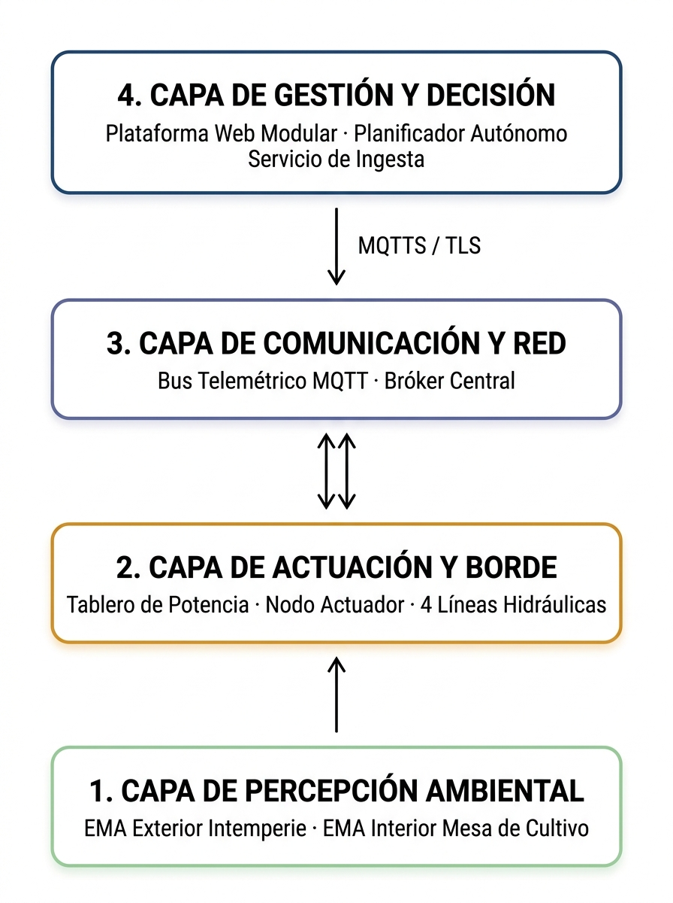
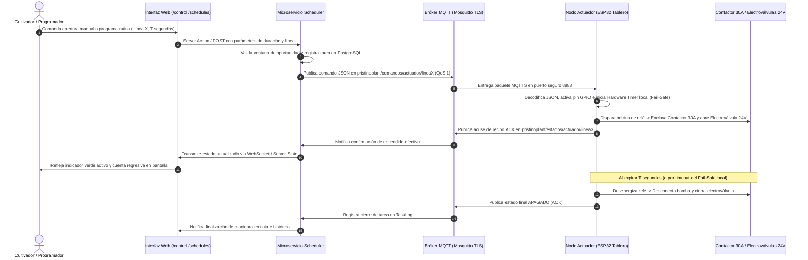
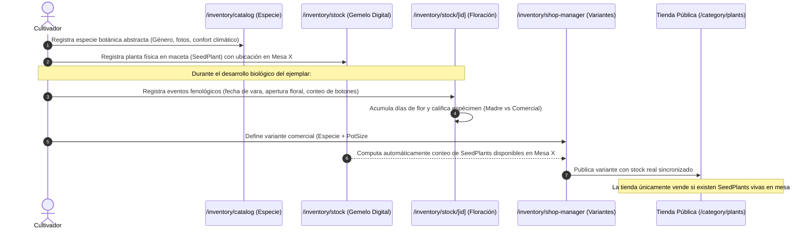
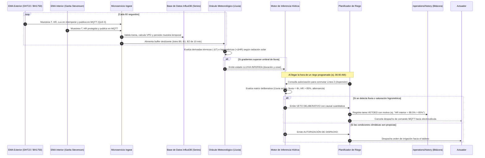

**UNIVERSIDAD CATÓLICA ANDRÉS BELLO**  
**FACULTAD DE INGENIERÍA**  
**ESCUELA DE INGENIERÍA INFORMÁTICA**

&nbsp;

&nbsp;

&nbsp;

&nbsp;

# **SISTEMA DE GESTIÓN DE INVERNADEROS BASADO EN AGRICULTURA INTELIGENTE PARA EL CULTIVO DE ORQUÍDEAS**

&nbsp;

**TRABAJO INSTRUMENTAL DE GRADO**  
Presentado ante la&nbsp;  
**UNIVERSIDAD CATÓLICA ANDRÉS BELLO**&nbsp;  
Como parte de los requisitos para optar el título de&nbsp;  
**INGENIERO EN INFORMÁTICA**

&nbsp;

| REALIZADO POR |  | Julio Cesar Flores Silva |
| :---- | :---- | :---- |
| **TUTOR EMPRESARIAL** |  | Richard García |
| **TUTOR ACADÉMICO** |  | José Fonseca |
| **FECHA** |  | Septiembre, 2026 |

&nbsp;

# **Dedicatoria** {#dedicatoria}

*Todo este esfuerzo se lo dedico a mi familia.*

*A todos los que creyeron en este proyecto cuando solo era una idea entre cables, sensores y flores.*

*A quienes comprenden que la constancia es como el agua: constante, silenciosa y capaz de dar vida a los proyectos más complejos.*

*A la naturaleza y a la tecnología, por recordarme cada día que la observación paciente y la innovación pueden coexistir en perfecta armonía.*&nbsp;

&nbsp;

&nbsp;

# **Agradecimientos** {#agradecimientos}

*A Dios y al Universo, por la salud, la sabiduría y la fortaleza necesarias para superar cada etapa de este camino de investigación y desarrollo.*

*Al orquideario PristinoPlant, por abrir sus puertas y permitir que este proyecto se materializara en sus espacios, confiando en la innovación tecnológica como una herramienta clave para la optimización de sus procesos.*

*A mis profesores, tutores y mentores, por su valiosa orientación académica, su rigor metodológico y por compartir su conocimiento sin reservas para enriquecer la arquitectura y alcance de este trabajo.*&nbsp;

*Y de manera muy especial, a mi familia, por su paciencia infinita, su respaldo incondicional y por ser el impulso permanente en cada una de mis metas.*

&nbsp;

**Índice de Contenido**

**[Dedicatoria	2](#dedicatoria)**

[**Agradecimientos	3**](#agradecimientos)

[**Resumen	8**](#heading=)

[**Introducción	9**](#heading=h.3dy6vkm)

[**Capítulo I**](#capítulo-i-el-problema)&nbsp;  
[**El Problema	10**](#capítulo-i-el-problema)

[Planteamiento del Problema	10](#planteamiento-del-problema)

[Objetivo General	15](#objetivo-general)

[Objetivos Específicos	15](#objetivos-específicos)

[Aportes Tecnológicos	16](#aportes-tecnológicos)

[Aportes Funcionales	16](#aportes-funcionales)

[Alcance	18](#alcance)

[Limitaciones	19](#limitaciones)

[**Capítulo II**](#capítulo-ii-marco-teórico)  
[**Marco Teórico	20**](#capítulo-ii-marco-teórico)

[Antecedentes	20](#antecedentes-de-la-investigación)

[Bases teóricas.	23](#bases-teóricas)

[**Capítulo III**](#capítulo-iii-marco-metodológico)  
[**Marco Metodológico	37**](#capítulo-iii-marco-metodológico)

[Tipo de Investigación	37](#tipo-de-investigación)

[Nivel de la Investigación	38](#nivel-de-la-investigación)

[Diseño de la Investigación	38](#diseño-de-la-investigación)

[Población	39](#heading=h.ro9jbiczvusy)

[Muestra	39](#heading=h.7482bn7ul6r)

[Técnicas e Instrumentos de Recolección de Datos	39](#técnicas-e-instrumentos-de-recolección-de-datos)

[Procedimiento Metodológico	42](#heading=h.9nvqo3hzt1u4)

[Procedimiento de la Investigación y Fases Metodológicas	44](#heading=h.117kyubiad41)

[**Capítulo IV**](#capítulo-iv-desarrollo-y-resultados)  
[**Desarrollo y Resultados	47**](#capítulo-iv-desarrollo-y-resultados)

[Análisis y Estudio Inicial	47](#análisis-y-estudio-inicial)

[Patrones Arquitectónicos y Justificación del Diseño Biofísico	83](#heading=h.v6mzb9e0s9s4)

[**Capítulo V**](#capítulo-v-conclusiones-y-recomendaciones)&nbsp;  
[**Conclusiones y Recomendaciones	86**](#capítulo-v-conclusiones-y-recomendaciones)

[**Referencias Bibliográficas	87**](#referencias-bibliográficas)


[**Apéndices**](#apéndices)  
[Apéndice A. Marco Normativo de Requerimientos (SRS)](#apéndice-a.-marco-normativo-de-requerimientos-srs)  
[Apéndice B. Correspondencia Metodológica por Incremento](#apéndice-b.-correspondencia-metodológica-por-incremento)  
[Apéndice C. Validación del Motor de Inferencia Climática](#apéndice-c.-validación-del-motor-de-inferencia-climática)  
[Apéndice D. Validación del Motor de Inferencia Hídrica](#apéndice-d.-validación-del-motor-de-inferencia-hídrica)  
[Apéndice E. Ecofisiología y Nutrición de Orquídeas](#apéndice-e.-ecofisiología-y-nutrición-de-orquídeas)  
[Apéndice F. Catálogo de Interfaces y Flujos Operativos](#apéndice-f.-catálogo-de-interfaces-y-flujos-operativos)  
[Apéndice G. Manual Técnico del Sistema PristinoPlant](#apéndice-g.-manual-técnico-del-sistema-pristinoplant)  
[Apéndice H. Manual de Usuario y Operaciones del Sistema](#apéndice-h.-manual-de-usuario-y-operaciones-del-sistema)  
[Apéndice I. Matriz de Evaluación de Requerimientos](#apéndice-i.-matriz-de-evaluación-de-requerimientos)  
[Apéndice J. Especificación de Casos de Uso del Sistema](#apéndice-j.-especificación-de-casos-de-uso-del-sistema)  

&nbsp;

**Índice de Figuras**

[Figura 1. Representación esquemática del modelo incremental.](#figura-1.-representación-esquemática-del-modelo-incremental.)  
[Figura 2. Arquitectura en capas del IoTS de Pristinoplant.](#figura-2.-arquitectura-en-capas-del-iots-de-pristinoplant.)  
[Figura 3. Red hidráulica presurizada de 4 líneas y emisores en el orquideario.](#figura-3.-red-hidráulica-presurizada-de-4-líneas-y-emisores-en-el-orquideario.)  
[Figura 4. Tablero de fuerza eléctrica industrial ensamblado sobre riel DIN.](#figura-4.-tablero-de-fuerza-eléctrica-industrial-ensamblado-sobre-riel-din.)  
[Figura 5. Suite web de operaciones y control manual del circuito hidráulico.](#figura-5.-suite-web-de-operaciones-y-control-manual-del-circuito-hidráulico.)  
[Figura 6. Estaciones meteorológicas automatizadas (EMA Exterior e Interior).](#figura-6.-estaciones-meteorológicas-automatizadas-ema-exterior-e-interior.)  
[Figura 7. Panel de monitoreo telemétrico y cálculo psicrométrico en tiempo real.](#figura-7.-panel-de-monitoreo-telemétrico-y-cálculo-psicrométrico-en-tiempo-real.)  
[Figura 8. Módulo de inventario unívoco de gemelos digitales (SeedPlant) y catálogo comercial.](#figura-8.-módulo-de-inventario-unívoco-de-gemelos-digitales-seedplant-y-catálogo-comercial.)  
[Figura 9. Flujo integral de validación operativa en lazo cerrado entre telemetría, inferencia y actuación.](#figura-9.-flujo-integral-de-validación-operativa-en-lazo-cerrado-entre-telemetría-inferencia-y-actuación.)  

&nbsp;

**Índice de Tablas**

[Tabla 1. Requerimientos funcionales del sistema (RF01 a RF19).](#tabla-1.-requerimientos-funcionales.)  
[Tabla 2. Requerimientos no funcionales del sistema (RNF01 a RNF09).](#tabla-2.-requerimientos-no-funcionales.)  
[Tabla 3. Matriz de resolución de fallas de banco, contingencias de campo y rediseños de ingeniería.](#tabla-3.-matriz-de-resolución-de-fallas-de-banco-contingencias-de-campo-y-rediseños-de-ingeniería)  
[Tabla 4. Balance global de evaluación y cumplimiento de requerimientos por módulo funcional.](#tabla-4.-balance-global-de-evaluación-y-cumplimiento-de-requerimientos-por-módulo-funcional)  
[Tabla Ap-B1. Módulos y entregables de ingeniería por incremento.](#tabla-ap-b1.-módulos-y-entregables-de-ingeniería-por-incremento.)  
[Tabla Ap-B2. Matriz de correspondencia metodológica por incremento.](#tabla-ap-b2.-matriz-de-correspondencia-metodológica-por-incremento.)  
[Tabla Ap-C1. Bitácora de eventos de lluvia observados in situ.](#tabla-ap-c1.-bitácora-de-eventos-de-lluvia-observados-in-situ.)  
[Tabla Ap-C2. Matriz paramétrica y umbrales de decisión del algoritmo pluvial.](#tabla-ap-c2.-matriz-paramétrica-y-umbrales-de-decisión-del-algoritmo-pluvial.)  
[Tabla Ap-D1. Volumen global y balance de ejecución de tareas hidráulicas.](#tabla-ap-d1.-volumen-global-y-balance-de-ejecución-de-tareas-hidráulicas.)  
[Tabla Ap-D2. Operaciones hidráulicas según el propósito de la rutina.](#tabla-ap-d2.-operaciones-hidráulicas-según-el-propósito-de-la-rutina.)  
[Tabla Ap-D3. Distribución de intervenciones de control manual y contingencias operativas.](#tabla-ap-d3.-distribución-de-intervenciones-de-control-manual-y-contingencias-operativas.)  
[Tabla Ap-D4. Clasificación de vetos del motor de inferencia hídrica.](#tabla-ap-d4.-clasificación-de-vetos-del-motor-de-inferencia-hídrica.)  
[Tabla Ap-E1. Límites y umbrales agronómicos para orquídeas epífitas incorporados en PristinoPlant.](#tabla-ap-e1.-límites-y-umbrales-agronómicos-para-orquídeas-epífitas-incorporados-en-pristinoplant)  
[Tabla Ap-G1. Matriz de variables de entorno y parámetros de infraestructura de producción.](#tabla-ap-g1.-matriz-de-variables-de-entorno-y-parámetros-de-infraestructura-de-producción)  
[Tabla Ap-G2. Especificación técnica y catálogo de componentes de hardware del sistema PristinoPlant.](#tabla-ap-g2.-especificación-técnica-y-catálogo-de-componentes-de-hardware-del-sistema-pristinoplant)  
[Tabla Ap-G3. Mapa de distribución de pines GPIO y asignación de periféricos en nodos ESP32.](#tabla-ap-g3.-mapa-de-distribución-de-pines-gpio-y-asignación-de-periféricos-en-nodos-esp32)  
[Tabla Ap-G4. Códigos de excepción semántica y diagnóstico en el driver MQTT endurecido (simple2.py).](#tabla-ap-g4.-códigos-de-excepción-semántica-y-diagnóstico-en-el-driver-mqtt-endurecido-simple2.py)  
[Tabla Ap-G5. Matriz de diagnóstico y solución de incidencias técnicas en firmware e infraestructura (Troubleshooting).](#tabla-ap-g5.-matriz-de-diagnóstico-y-solución-de-incidencias-técnicas-en-firmware-e-infraestructura-troubleshooting)  
[Tabla Ap-H1. Matriz de perfiles de usuario, roles y permisos de acceso a la plataforma.](#tabla-ap-h1.-matriz-de-perfiles-de-usuario-roles-y-permisos-de-acceso-a-la-plataforma)  
[Tabla Ap-I1. Matriz de evaluación y validación exhaustiva de requerimientos del sistema frente a especificaciones.](#tabla-ap-i1.-matriz-de-evaluación-y-validación-exhaustiva-de-requerimientos-del-sistema-frente-a-especificaciones)  
[Tabla Ap-J1. Matriz de trazabilidad y mapeo de casos de uso frente a requerimientos y actores.](#tabla-ap-j1.-matriz-de-trazabilidad-y-mapeo-de-casos-de-uso-frente-a-requerimientos-y-actores)  
[Tabla Ap-J2. Caso de uso CU01: Autenticación, gestión de sesiones seguras y control de acceso basado en roles.](#tabla-ap-j2.-caso-de-uso-cu01:-autenticación-gestión-de-sesiones-seguras-y-control-de-acceso-basado-en-roles)  
[Tabla Ap-J3. Caso de uso CU02: Exploración de catálogo botánico, selección de especímenes y formalización de pedidos multimoneda.](#tabla-ap-j3.-caso-de-uso-cu02:-exploración-de-catálogo-botánico-selección-de-especímenes-y-formalización-de-pedidos-multimoneda)  
[Tabla Ap-J4. Caso de uso CU03: Administración taxonómica, registro de plantas individuales (SeedPlant) y trazabilidad fenológica.](#tabla-ap-j4.-caso-de-uso-cu03:-administración-taxonómica-registro-de-plantas-individuales-seedplant-y-trazabilidad-fenológica)  
[Tabla Ap-J5. Caso de uso CU04: Formulación química de recetas compuestas y programación de ciclos agronómicos rotativos.](#tabla-ap-j5.-caso-de-uso-cu04:-formulación-química-de-recetas-compuestas-y-programación-de-ciclos-agronómicos-rotativos)  
[Tabla Ap-J6. Caso de uso CU05: Adquisición telemétrica continua, cálculo psicrométrico y detección algorítmica de lluvia.](#tabla-ap-j6.-caso-de-uso-cu05:-adquisición-telemétrica-continua-cálculo-psicrométrico-y-detección-algorítmica-de-lluvia)  
[Tabla Ap-J7. Caso de uso CU06: Comando manual directo de actuadores hidráulicos con guarda fail-safe local.](#tabla-ap-j7.-caso-de-uso-cu06:-comando-manual-directo-de-actuadores-hidráulicos-con-guarda-fail-safe-local)  
[Tabla Ap-J8. Caso de uso CU07: Planificación y ejecución de riego autónomo con veto deliberativo y auditoría inmutable.](#tabla-ap-j8.-caso-de-uso-cu07:-planificación-y-ejecución-de-riego-autónomo-con-veto-deliberativo-y-auditoría-inmutable)  

&nbsp;

**UNIVERSIDAD CATÓLICA ANDRÉS BELLO**  
**FACULTAD DE INGENIERÍA**  
**ESCUELA DE INGENIERÍA INFORMÁTICA**

**Sistema de Gestión de Invernaderos Basado en Agricultura Inteligente para el Cultivo de Orquídeas**&nbsp;

|  | Autor: | Julio Cesar Flores Silva |
| ----: | ----: | :---- |
|  | Tutor: | José Fonseca |
|  | Fecha: | Septiembre, 2026 |

# **Resumen**

Las operaciones de cultivo previas en el orquideario de PristinoPlant se caracterizaban por un riego empírico, la ausencia de datos microclimáticos y la falta de trazabilidad en el cumplimiento de los programas de fertilización y control fitosanitario planificados. El objetivo de la investigación fue desarrollar una plataforma de agricultura inteligente basada en Internet de las Cosas para establecer el monitoreo microclimático continuo, dotar de autonomía deliberativa al circuito hidráulico de riego y digitalizar la gestión agronómica del orquideario. La solución integró una arquitectura en capas fundamentada en el protocolo MQTT, persistencia temporal y relacional, un tablero de potencia industrial y estaciones meteorológicas automáticas de diseño propio. Asimismo, se implementaron motores de inferencia determinísticos para detectar y caracterizar eventos de lluvia a partir de variaciones microclimáticas y vetar deliberativamente el accionamiento del circuito hidráulico de riego autónomo, complementados con módulos web para la dosificación agronómica y la trazabilidad botánica por ejemplar. Metodológicamente, se aplicó el modelo incremental articulado con la metodología TDDM4IoTS a lo largo de siete iteraciones. Los resultados validaron la efectividad del motor de inferencia meteorológica en la detección desatendida de lluvia, la precisión de los vetos preventivos de riego y una alta confiabilidad operativa en los accionamientos del circuito hidráulico. Se concluyó que la integración de hardware embebido, telemetría continua y servicios en la nube constituyó una solución tecnológicamente viable y robusta para sustituir las prácticas empíricas por un control preciso y trazable en el cultivo de orquídeas.

	Palabras clave: Agricultura inteligente, Internet de las Cosas (IoT), Riego autónomo, Telemetría ambiental, TDDM4IoTS.

# **Introducción**

La gestión de las operaciones de cultivo de orquídeas bajo estructuras de malla sombra abarca desafíos agronómicos comunes a productores comerciales y coleccionistas. Las labores cotidianas demandan caracterizar oportunamente el microclima, coordinar la irrigación, planificar la nutrición mineral y mantener un inventario unívoco. En la práctica convencional, la carencia de herramientas tecnológicas accesibles somete estas tareas a un manejo empírico y desarticulado, propiciando riesgos de asfixia radicular por exceso de agua, estrés térmico en horas de alta radiación e interrupción en los planes fitosanitarios. Frente a esto, la agricultura inteligente permite concebir sistemas IoT para tecnificar el cultivo.

Esta investigación desarrolla una plataforma distribuida de agricultura inteligente validada en el orquideario PristinoPlant. La solución física acopla estaciones meteorológicas automáticas de diseño propio para la adquisición climática continúa, junto a un nodo embebido integrado en un tablero de potencia que ejecuta la conmutación segura del circuito hidráulico. El sistema es coordinado por motores de inferencia determinísticos que evalúan las condiciones en tiempo real para autorizar, diferir o vetar deliberadamente las operaciones de riego ante eventos de lluvia o saturación hídrica.

En el software, el sistema integra una aplicación web para el monitoreo microclimático, la operatividad hidráulica, la gestión de dosificación de agroquímicos, complementada con el inventario unívoco de su catálogo taxonómico y un asistente agronómico en Telegram orquestado por flujos automatizados. Metodológicamente, el desarrollo se sustenta en la arquitectura por capas de Gubbi et al. (2013), el estándar MQTT (OASIS, 2014) y el modelo incremental de Pressman (2010), aplicando la metodología TDDM4IoTS de Guerrero-Ulloa et al. (2020) a lo largo de siete incrementos con despliegue continuo in situ.

El presente informe se organiza en cinco capítulos: el Capítulo I contextualiza la problemática y los objetivos del proyecto; el Capítulo II expone los antecedentes y las bases teóricas sobre agricultura de precisión, redes IoT y ecofisiología; el Capítulo III detalla el marco metodológico con la adaptación de TDDM4IoTS; el Capítulo IV documenta el diseño, la construcción incremental y las pruebas de campo; y el Capítulo V formula las conclusiones del sistema, complementándose con diez apéndices técnicos y operacionales.

# **Capítulo I**&nbsp; **El Problema** {#capítulo-i-el-problema}

## **Planteamiento del Problema** {#planteamiento-del-problema}

Cultivar orquídeas exitosamente implica proporcionar las condiciones microclimáticas específicas para cada especie. Para lograrlo, es fundamental comprender y controlar variables como la iluminancia, la temperatura, la humedad relativa, la ventilación, la frecuencia de riego, la planificación de dosificación de agroquímicos y las propiedades del sustrato, entendiendo esta última como la porosidad, capacidad de retención hídrica y aireación radicular. Cada uno de estos factores condiciona de manera directa el desarrollo vegetativo de las orquídeas y determina su capacidad para florecer.

Bajo esta perspectiva, el rigor operativo que exige el control de sus condiciones microclimáticas responde a la singularidad biológica de la familia Orchidaceae, la cual presenta "una amplia variedad de adaptaciones morfológicas y anatómicas únicas, una diversidad que pocas otras familias de plantas igualan" (Hágsater et al., 1996, p. 1).&nbsp;

Su distribución biogeográfica abarca casi la totalidad de los ecosistemas terrestres, con excepción de las zonas polares y los desiertos hiperáridos, concentrando su mayor biodiversidad en las regiones tropicales. Pueden desarrollarse sobre diversos tipos de suelos, sobre rocas, y muchas especies tienen un hábito de crecimiento epífito, es decir, crecen sobre otras plantas o estructuras utilizándolas como soporte físico. (Hágsater et al., 1996, p. 3).

En el ámbito regional, entidades especializadas como la Sociedad Orquideológica del Caroní (SOC), ubicada en Ciudad Guayana, Estado Bolívar, desempeñan un rol estratégico en la divulgación científica para la protección de las orquídeas. Mediante programas de capacitación, proyectos de conservación *in situ* o *ex situ*, e intercambio técnico entre especialistas, investigadores y aficionados, SOC promueve la adopción de prácticas informadas que facilitan la réplica *ex profeso* de los parámetros ambientales requeridos por los distintos géneros de orquídeas presentes en Venezuela.

Conforme los cultivadores profundizan sus conocimientos y su dedicación a las orquídeas, suelen especializarse en géneros que puedan cohabitar entre sí, invirtiendo un considerable esfuerzo en la construcción de orquidearios para mantener unas condiciones ambientales favorables. Sin embargo, en muchos casos no se dispone del espacio necesario para una estructura de invernadero compleja o de la infraestructura necesaria para controlar significativamente las condiciones ambientales del orquideario.

A esta restricción de infraestructura se suma el hecho de que, aun cuando un grupo de cultivadores coexista en una misma demarcación geográfica, las condiciones microclimáticas al interior de sus orquidearios presentan variaciones significativas. Estas fluctuaciones en parámetros como humedad, temperatura, iluminancia y ventilación suelen ser lo suficientemente marcadas como para limitar o comprometer la viabilidad agronómica de ciertos géneros de orquídeas, los cuales podrían desarrollarse óptimamente si se contara con mecanismos precisos de regulación ambiental.

Esta necesidad de regulación ambiental cobra especial relevancia en la producción comercial de orquídeas, la cual demanda infraestructuras con capacidad operativa para el monitoreo y control riguroso del microclima. Si bien muchos cultivadores inician sus operaciones en estructuras de invernaderos de malla sombra, la expansión progresiva de la producción y la búsqueda de eficiencia hacen imperativa la transición hacia sistemas de control ambiental más sofisticados e integrados.

Esta realidad se refleja directamente en iniciativas locales como *PristinoPlant*, un emprendimiento ubicado en San Félix, Estado Bolívar, enfocado en el cultivo, conservación, propagación y comercialización de orquídeas, así como de otras familias de plantas entre las que destacan rosas del desierto, cactus y suculentas. En la actualidad, PristinoPlant dispone de dos áreas de invernadero de malla sombra dedicadas a la producción de géneros como *Cattleya* y *Dendrobium*. Asimismo, como miembro activo de SOC, colabora constantemente en actividades de investigación y divulgación orquideológica en las Muestras Surorientales de Orquídeas del Caroní.

La producción comercial de orquídeas en invernaderos de malla sombra enfrenta desafíos significativos en cuanto al control preciso de las condiciones ambientales. Si bien estos invernaderos mitigan la intensidad lumínica, las altas temperaturas y la evaporación de la humedad relativa; su falta de precisión y la dependencia de la experiencia del cultivador limitan la eficiencia y escalabilidad de la producción. Por consiguiente, la ausencia de datos precisos impide optimizar las condiciones de cultivo y maximizar el rendimiento. Para superar estas limitaciones, es necesario adoptar enfoques de agricultura de precisión y agricultura inteligente.&nbsp;

Marinello et al. (2023) definen la agricultura de precisión como un enfoque agrícola que hace uso de las innovaciones tecnológicas y el análisis de datos, para maximizar el rendimiento de los cultivos, reducir el desperdicio, aumentar la productividad y tomar decisiones más informadas. (p. 1).

Bajo este enfoque, se sostiene que la integración de las tecnologías disruptivas de la Industria 4.0 (tales como el Internet de las Cosas [IoT], la analítica de datos, los algoritmos de inferencia y la automatización agrícola) ha impulsado la evolución desde una agricultura de precisión convencional hacia el paradigma de la agricultura inteligente. Esta transformación tecnológica ha generado nuevas oportunidades operativas, revolucionando la manera en que los productores gestionan sus cultivos, optimizan el uso de recursos hídricos y energéticos, y supervisan las variables ambientales en tiempo real (Marinello et al., 2023).

Esta transición hacia el modelo de agricultura inteligente en entornos protegidos resulta fundamental para garantizar la sostenibilidad operativa y la competitividad de la producción comercial de orquídeas. La optimización automatizada de recursos insustituibles como el agua, los nutrientes minerales y los agentes fitosanitarios reduce drásticamente el impacto ambiental. Así mismo, la captura continua y precisa de datos microclimáticos permite fundamentar las decisiones agronómicas sobre riego, fertilización y fitosanidad, impactando positivamente en el rendimiento, la calidad de la floración y la sanidad del cultivo. Esta mayor eficiencia técnica no sólo mitiga los riesgos de pérdida por estrés ambiental, sino que fortalece la posición de los productores en un mercado agrícola crecientemente exigente.

A partir de las consideraciones expuestas, se evidencia la limitación estructural de los invernaderos tradicionales basados en la supervisión manual y discontinua para responder a las exigencias fisiológicas de la familia *Orchidaceae* y sostener una escala comercial eficiente.

En consecuencia, surge la necesidad apremiante de hacer la transición hacia el paradigma de la agricultura inteligente, integrando soluciones tecnológicas avanzadas para el diagnóstico, la toma de decisiones y la ejecución autónoma de las labores culturales en el cultivo de orquídeas; consolidando así un sistema de producción agrícola eficiente: un invernadero inteligente. En consecuencia, surge la necesidad apremiante de integrar soluciones tecnológicas avanzadas para el diagnóstico, la toma de decisiones y la automatización de las labores culturales, orientadas hacia la consolidación de un sistema de producción autónomo: un invernadero inteligente.

Atendiendo a esta realidad, se le propuso a PristinoPlant el desarrollo e implementación de un *sistema de gestión de invernaderos basado en agricultura inteligente para el cultivo de orquídeas*. Esta propuesta tiene como propósito automatizar el control de las variables microclimáticas al interior de sus orquidearios, sistematizar la planificación de la dosificación de agroquímicos según los requerimientos del cultivo, y centralizar el registro agronómico para realizar un seguimiento riguroso y trazable del desarrollo de las orquídeas.

## **Objetivo General** {#objetivo-general}

Desarrollar un sistema de gestión de invernaderos basado en agricultura inteligente para el cultivo de orquídeas.

## **Objetivos Específicos** {#objetivos-específicos}

1. Analizar los conceptos y herramientas referentes al cultivo de orquídeas basado en agricultura inteligente, a fin de identificar las características del sistema a desarrollar.

2. Diseñar en función del análisis realizado, un sistema de gestión de invernaderos basado en agricultura inteligente para el cultivo de orquídeas.

3. Implementar el sistema de gestión de invernaderos basado en agricultura inteligente para el cultivo de orquídeas, según el diseño realizado.

4. Validar el sistema de gestión de invernaderos basado en agricultura inteligente para el cultivo de orquídeas, respecto al análisis realizado.

5. Realizar la documentación formal del sistema de gestión de invernaderos basado en agricultura inteligente para el cultivo de orquídeas.

## **Aportes Tecnológicos** {#aportes-tecnológicos}

* Promover la adopción de tecnologías de agricultura inteligente para el diagnóstico, toma de decisiones y ejecución de las actividades relacionadas al cultivo de orquídeas.

* Brindar conocimientos referentes al diseño, construcción y gestión de un invernadero inteligente, que podrán ser aplicados tanto por PristinoPlant como por la Sociedad Orquideológica del Caroní en sus orquidearios.

## **Aportes Funcionales** {#aportes-funcionales}

* Apoyar la toma de decisiones de los cultivadores a través de información sobre el estado de las condiciones ambientales de manera expedita y oportuna.

* Optimizar la planificación y dosificación de agroquímicos garantizando una aplicación precisa, eficiente y segura que maximice la productividad.

* Apoyar la gestión comercial y el estudio fenológico mediante el registro individualizado de floración, aportando métricas sobre frecuencia anual y estacionalidad biológica que incrementan el valor comercial del catálogo taxonómico.

* Optimizar el consumo de agua mediante la implementación de un sistema de riego en función de las necesidades de las plantas y las condiciones climáticas externas.

* Contribuir al Objetivo de Desarrollo Sostenible número 6 de las Naciones Unidas sobre “Garantizar la disponibilidad y la gestión sostenible del agua y el saneamiento para todos” en su meta 6.4 de aquí a 2030, aumentar considerablemente el uso eficiente de los recursos hídricos en todos los sectores y asegurar la sostenibilidad de la extracción y el abastecimiento de agua dulce para hacer frente a la escasez de agua y reducir considerablemente el número de personas que sufren falta de agua.

* Contribuir al Objetivo de Desarrollo Sostenible número 9 de las Naciones Unidas sobre “Construir infraestructuras resilientes, promover la industrialización inclusiva y sostenible y fomentar la innovación” en su meta 9.4 de aquí a 2030, modernizar la infraestructura y reconvertir las industrias para que sean sostenibles, utilizando los recursos con mayor eficacia y promoviendo la adopción de tecnologías y procesos industriales limpios y ambientalmente racionales, y logrando que todos los países tomen medidas de acuerdo con sus capacidades respectivas.

* Contribuir al Objetivo de Desarrollo Sostenible número 12 de las Naciones Unidas sobre “Garantizar modalidades de consumo y producción sostenibles” en su meta 12.2 de aquí a 2030, lograr la gestión sostenible y el uso eficiente de los recursos naturales.

* Contribuir al Objetivo de Desarrollo Sostenible número 13 de las Naciones Unidas sobre “Adoptar medidas urgentes para combatir el cambio climático y sus efectos” en su meta 13.1 fortalecer la resiliencia y la capacidad de adaptación a los riesgos relacionados con el clima y los desastres naturales en todos los países; en su meta 13.2 incorporar medidas relativas al cambio climático en las políticas, estrategias y planes nacionales; en su meta 13.3 mejorar la educación, la sensibilización y la capacidad humana e institucional respecto de la mitigación del cambio climático, la adaptación a él, la reducción de sus efectos y la alerta temprana.

## **Alcance** {#alcance}

El presente Trabajo de Grado consiste en un proyecto de Ingeniería Informática, específicamente en las áreas del Internet de las Cosas (IoT) y desarrollo de software, orientado al diseño, desarrollo e implementación de un sistema de gestión de invernaderos basado en agricultura inteligente para optimizar el cultivo de orquídeas en el emprendimiento PristinoPlant.

El despliegue y validación del proyecto se sitúa en el orquideario de PristinoPlant, ubicado en San Félix, Estado Bolívar, Venezuela. Metodológicamente, se constituye por el estudio y análisis de las áreas de la agricultura inteligente, los sistemas basados en IoT y las actividades agronómicas de PristinoPlant; el diseño de la arquitectura distribuida del sistema, la capa de comunicación e interconectividad IoT, el modelado conceptual del circuito hidráulico de riego autónomo y la estructuración lógica de datos; el desarrollo e integración continua de los componentes de hardware, firmware, infraestructura IoT y la plataforma de software; la validación en campo de los algoritmos de inferencia de riego y de inferencia meteorológica; y la documentación formal de los manuales técnicos, operativos y de usuario necesarios para la transferencia tecnológica y sostenibilidad del sistema.

La solución implementada abarca el monitoreo telemétrico continuo de las condiciones microclimáticas internas y externas del orquideario, la orquestación autónoma del riego hidráulico mediante motores de inferencia, y una plataforma web para la gestión del inventario botánico, la gestión de dosificación de insumos agroquímicos y el seguimiento agronómico del cultivo. A su vez, el proyecto valida el prototipado y la puesta en marcha de la arquitectura de software distribuida para la toma de decisiones agronómicas que integra hardware de adquisición de datos microclimáticos y hardware de conmutación hidráulica, constituyendo un referente práctico para la gestión autónoma de entornos de cultivo inteligente.

## **Limitaciones** {#limitaciones}

El desarrollo y despliegue del proyecto estuvo condicionado por limitaciones biológicas, físicas y de conectividad:

* **Evaluación biológica:** El lento ciclo vegetativo de las orquídeas requiere años de observación, lo que excede los plazos académicos del proyecto. Esto imposibilita realizar un estudio biométrico comparativo con grupos de control, por lo que la validación se limitó estrictamente a la precisión operativa, estabilidad y confiabilidad de la infraestructura IoT en el control microclimático.

* **Degradación de hardware:** La selección inicial de componentes omitió considerar la degradación por intemperie y la necesidad de protección IP agrícola. Al evidenciarse fallas progresivas tras su implementación, se aplicaron las medidas pertinentes: un *press control* (en sustitución del transductor de agua), un motor de inferencia de lluvias (para reemplazar al sensor físico) y la recomendación de migrar a sensores de la familia SHT40 impermeables (en reemplazo del DHT22).

* **Servicio de internet:** La inestabilidad y baja velocidad del servicio de internet local en el área de despliegue representan una restricción permanente para la arquitectura del sistema. Aunque se migraron los servicios críticos a un VPS en la nube, la sincronización de telemetría in situ y la entrega de datos en tiempo real quedan limitadas por la disponibilidad de la red local, forzando al hardware a operar en modo *offline* durante las fluctuaciones del servicio y retrasando la actualización de la telemetría.

# **Capítulo II** **Marco Teórico** {#capítulo-ii-marco-teórico}

## **Antecedentes de la investigación** {#antecedentes-de-la-investigación}

La fundamentación teórica de la presente investigación se sustentó en la revisión sistemática de estudios previos, tanto en el ámbito internacional como local, que abordaron la convergencia entre la agricultura de precisión, el Internet de las Cosas (IoT) y la automatización telemétrica:

En el ámbito internacional, Liao y Chen (2022), en Taiwán, desarrollaron la investigación titulada “Correlación precisa del crecimiento de las hojas de orquídeas Phalaenopsis con las variables ambientales del invernadero utilizando un sistema de monitoreo IoT”. El estudio consistió en diseñar e implementar un sistema de monitoreo en tiempo real con IoT y visión computacional para evaluar el impacto de la temperatura y humedad relativa sobre el crecimiento de orquídeas *Phalaenopsis*.

Su trabajo validó la efectividad de plataformas en la nube para supervisar variables ambientales y conmutar actuadores de microaspersión, aportando un modelo referencial sobre la necesidad de correlacionar la telemetría continua con las respuestas fisiológicas del cultivo.

En el entorno institucional, Rozas (2023), en su trabajo de grado titulado “Servidor para la Interconexión de Dispositivos IoT de los Laboratorios de Ingeniería Informática e Ingeniería Civil de la UCAB Guayana”, implementó un servidor centralizado en un ordenador monoplaca Raspberry Pi 4 con bróker Eclipse Mosquitto, enlazado a nodos ESP8266 y Arduino mediante el protocolo MQTT y buses I2C para la lectura ambiental y conmutación de relés.

Este trabajo demostró la viabilidad práctica de emplear el protocolo MQTT para el intercambio telemétrico y validó la idoneidad de los microcontroladores de bajo costo de la familia ESP frente a placas tradicionales como Arduino gracias a su conectividad inalámbrica nativa. Para PristinoPlant, representó un caso de estudio sobre las alternativas de despliegue del bróker (local frente a servidor remoto) y fundamentó la selección del ESP32 (por su mayor capacidad de cómputo y memoria frente al ESP8266) acoplado a un bróker privado contenerizado en un VPS en la nube (Docker Compose) bajo canales seguros TLS, garantizando alta disponibilidad 24/7 y acceso remoto frente a la gestión local en un ordenador monoplaca.

Igualmente en la UCAB Guayana, Moreno González (2025), en su trabajo de grado titulado “Plataforma para Facilitar la Construcción y Programación de Estaciones Meteorológicas Orientadas a Estudiantes de Educación Básica”, desarrolló una estación meteorológica basada en el kit SparkFun Weather:bit y microcontrolador BBC Micro:bit, adquiriendo variables atmosféricas enlazadas a un bróker MQTT (Mosquitto/EMQX) y persistencia temporal en InfluxDB.

Dicha investigación validó en el ámbito institucional la idoneidad de InfluxDB para el registro masivo de series temporales climáticas y sirvió como referente de una estación meteorológica tradicional. No obstante, frente a la dependencia de kits prefabricados propietarios y sus altos costos de adquisición e importación, PristinoPlant contrastó este esquema demostrando la viabilidad de una solución de bajo costo basada en sensores independientes accesibles, manufactura aditiva local (garita meteorológica impresa en 3D) y el microcontrolador ESP32, logrando una estación meteorológica automática funcional, económica y autónoma.

## **Bases teóricas** {#bases-teóricas}

### **De la agricultura de precisión al Internet de las Cosas (IoT).**

La gestión agrícola tradicional ha dependido históricamente de la inspección visual empírica y de cronogramas rígidos de irrigación, prácticas que resultan altamente vulnerables ante las fluctuaciones climáticas y propician el desperdicio de recursos hídricos o la proliferación de fitopatógenos (Kim y Lee, 2022). Frente a estas limitaciones, la agricultura de precisión surgió como un paradigma tecnológico orientado a optimizar la toma de decisiones agronómicas mediante el monitoreo continuo, localizado y en tiempo real de las condiciones del entorno (Prakash et al., 2024).

La articulación de este enfoque con el Internet de las Cosas (IoT) transformó la captura de datos en una infraestructura digital distribuida, en la cual redes de dispositivos embebidos interconectados adquieren, procesan y transmiten telemetría ambiental hacia plataformas de software centralizadas (Majumder et al., 2019). En cultivos protegidos de alto valor botánico, como las orquídeas, la incorporación de arquitecturas IoT proporciona una base empírica para coordinar la conmutación de actuadores de riego y ventilación, mitigando tanto el estrés térmico como el encharcamiento prolongado del sustrato.

### **Arquitectura funcional por capas en sistemas IoT.**

Para garantizar modularidad, escalabilidad e interoperabilidad ante la heterogeneidad del hardware y software, los Sistemas Basados en Internet de las Cosas (IoTS) se estructuran formalmente bajo el modelo arquitectónico de cuatro capas funcionales propuesto por Gubbi et al. (2013):

* **Capa de percepción:** Constituye el estrato físico en contacto directo con el entorno. Agrupa los transductores y sensores encargados de medir las magnitudes analógicas o digitales (temperatura, humedad relativa e iluminancia) y los circuitos acondicionadores de señal gobernados por microcontroladores de borde.
* **Capa de red:** Responsable del transporte seguro y confiable de las tramas telemétricas hacia los servidores de cómputo. Se apoya en estándares de comunicación inalámbrica de corto alcance (Wi-Fi 802.11 b/g/n) y protocolos de mensajería optimizados para redes restringidas.
* **Capa de procesamiento:** Representa el núcleo analítico y de persistencia del sistema, desplegado bajo esquemas de computación en la nube (*Cloud Computing*) o en el borde (*Edge Computing*). En este estrato residen los servicios de ingesta masiva de datos, los motores de persistencia temporal y relacional, y los servicios de orquestación lógica desatendida.
* **Capa de aplicación:** Comprende las interfaces hombre-máquina (HMI) y plataformas web accesibles mediante las cuales los operadores supervisan en tiempo real el microclima, configuran agendas operativas, formulan programas agronómicos y administran la trazabilidad comercial del cultivo.

### **Protocolos de comunicación telemétrica en ambientes restringidos (MQTT).**

En los sistemas IoT con nodos sensores alimentados por baterías o enlazados a redes inalámbricas susceptibles a interferencias, los protocolos convencionales basados en el modelo petición-respuesta (como HTTP) introducen una sobrecarga inadmisible en el tamaño de las cabeceras y en el consumo energético (OASIS, 2014). Por esta razón, el estándar *Message Queuing Telemetry Transport* (MQTT) se consolidó como el protocolo de referencia para la transmisión de telemetría y el gobierno de actuadores en arquitecturas M2M (*Machine-to-Machine*).

MQTT se fundamenta en un patrón de comunicación desacoplado de Publicación/Suscripción (*Pub/Sub*), orquestado por un bróker central (como *Eclipse Mosquitto*). Los nodos de percepción publican cargas útiles (*payloads*) en formato binario o JSON bajo tópicos jerárquicos (p. ej., `pristinoplant/weather/exterior`), mientras que los microservicios backend reciben la información sin que los emisores requieran conocer la dirección de red de los destinatarios. Asimismo, MQTT contempla tres niveles de Calidad de Servicio (*Quality of Service*, QoS) que regulan la certeza de entrega del mensaje: *at most once* (QoS 0), *at least once* (QoS 1) y *exactly once* (QoS 2). En entornos de producción, este tráfico se canaliza sobre sockets TCP/IP protegidos con cifrado de capa de transporte (TLS/SSL), salvaguardando la integridad de los comandos de conmutación de potencia.

### **Persistencia de series temporales frente a modelos relacionales.**

En arquitecturas IoT coexisten dos paradigmas de almacenamiento con propósitos diferenciados. Los sistemas de bases de datos relacionales estructuran la información mediante esquemas normalizados y propiedades ACID, resultando idóneos para la gestión transaccional de identidades, inventarios y configuraciones del sistema.

Por su parte, las bases de datos de series temporales (*Time Series Database*, como InfluxDB) están especializadas en la ingesta continua de mediciones cronológicas a alta frecuencia. Estos motores implementan compresión temporal y funciones de agregación nativas, evitando la degradación de índices que sufren los modelos relacionales ante flujos masivos de telemetría y permitiendo consultas históricas eficientes por ventanas de tiempo.

### **Sistemas basados en reglas y motores de inferencia determinísticos.**

En la ingeniería de sistemas automatizados, Pressman (2010) define un motor de reglas (*Rule Engine*) como un componente de software que evalúa de forma desacoplada un conjunto de proposiciones lógicas (*si [condición], entonces [acción]*) contra el estado actual de los hechos almacenados en el sistema. 

En el contexto de la agricultura inteligente, la integración de motores de inferencia determinísticos permite conferir autonomía deliberativa al sistema de riego. En lugar de depender de temporizadores ciegos, el motor analiza en tiempo real las condiciones meteorológicas inmediatas (presencia de lluvia, caídas térmicas abruptas o saturación higrométrica), contrastándolas con matrices de decisión agronómicas para determinar si una tarea programada debe ejecutarse, diferirse o ser vetada preventivamente. Este enfoque desacopla la política de decisión del código de control de bajo nivel, posibilitando calibrar y evolucionar los umbrales de decisión sin alterar la arquitectura del firmware.

### **Parámetros microclimáticos críticos para la inferencia agronómica.**

El comportamiento biológico de las orquídeas epífitas en ambientes controlados se encuentra gobernado por un conjunto de magnitudes físicas que actúan como variables de entrada prioritarias para los algoritmos de control:

* **Temperatura y gradiente nictemeral:** La respuesta vegetal está condicionada por la alternancia térmica. El diferencial de temperatura entre el día y la noche (**termoperiodo**, $\Delta T = T_{\text{día}} - T_{\text{noche}}$) actúa como el disparador endocrino de la inducción floral. Asimismo, temperaturas sostenidas por encima de $34^\circ\text{C}$ provocan el cierre estomático foliar y exigen rutinas de enfriamiento evaporativo en el suelo del orquideario.
* **Humedad relativa (HR) y Déficit de Presión de Vapor (VPD):** La humedad relativa determina la tasa de evaporación en la lámina foliar. No obstante, el indicador biofísico más riguroso es el **Déficit de Presión de Vapor** ($VPD$, expresado en kilopascales, $\text{kPa}$), el cual cuantifica la diferencia entre la presión de vapor de saturación a la temperatura de la hoja y la presión de vapor real del aire. Un $VPD$ equilibrado ($0.8$ a $1.2\text{ kPa}$) favorece la transpiración adecuada y la absorción de nutrientes, mientras que valores elevados ($> 1.8\text{ kPa}$) inducen deshidratación foliar severa.
* **Iluminancia y radiación fotosintéticamente activa (PAR):** Las orquídeas requieren luz solar difusa (medida telemétricamente en luxes o $\mu\text{mol}\cdot\text{m}^{-2}\cdot\text{s}^{-1}$), evitando la radiación cenital directa que ocasiona quemaduras necróticas foliares por fotooxidación.
* **Dinámica radicular y prevención de anoxia:** Las raíces epífitas están recubiertas por el *velamen radicular*, un tejido esponjoso especializado que capta humedad por capilaridad en segundos pero requiere una rápida aireación posterior. La saturación hídrica continua por riegos excesivos elimina el oxígeno en el medio poroso, desencadenando la asfixia del tejido radicular (**anoxia**) y la proliferación letal de oomicetos fúngicos del suelo (*Phytophthora cactorum*).

*(Para un estudio exhaustivo sobre la diversidad botánica, los condicionantes fisiológicos ex situ y las tablas de nutrición mineral de la familia Orchidaceae que respaldan las mezclas del sistema, véase el **Apéndice E**)*.

## **Terminología básica**

* **Bróker MQTT:** Servidor de software centralizado en una red MQTT que recibe las publicaciones de datos desde los nodos sensores y las distribuye de manera desacoplada hacia los clientes suscritos a tópicos específicos.
* **Calidad de Servicio (Quality of Service - QoS):** Atributo del protocolo MQTT que define el nivel de garantía y confirmación de entrega en la transmisión de un mensaje entre clientes y bróker (QoS 0: entrega sin confirmación; QoS 1: entrega con confirmación obligatoria; QoS 2: entrega unívoca garantizada).
* **Computación en el Borde (Edge Computing):** Paradigma arquitectónico donde el procesamiento preliminar, filtrado y validación de las señales físicas se ejecuta directamente en los nodos de campo o microcontroladores locales, reduciendo la latencia y la saturación del canal de red.
* **Déficit de Presión de Vapor (Vapor Pressure Deficit - VPD):** Magnitud física calculada a partir de la temperatura y la humedad relativa que representa la diferencia entre la cantidad de vapor de agua contenida en el aire y la cantidad máxima que este podría retener a saturación; constituye el indicador bioclimático rector para evaluar la transpiración y el estrés vegetal.
* **Gemelo Digital (Digital Twin):** Representación computacional abstracta y estructurada de un espécimen botánico o componente físico presente en el orquideario (`SeedPlant`), enlazando sus características taxonómicas, ubicación física y estado fenológico con la base de datos de gestión.
* **Microclima:** Conjunto localizado y delimitado de condiciones atmosféricas (temperatura, humedad relativa, radiación solar y flujo de aire) existente en el interior de una estructura de cultivo o zona específica del orquideario.
* **Telemetría:** Técnica automatizada de medición y recopilación remota de magnitudes físicas a través de sensores instrumentados en campo, transmitiendo los datos mediante canales de comunicación hacia sistemas centrales de cómputo para su registro y análisis.
* **Velamen Radicular:** Manto epidérmico multiseriado de células lignificadas muertas que recubre las raíces de las orquídeas epífitas; actúa como una esponja capilar para la absorción de humedad y aislamiento térmico, demandando secado intermitente para prevenir anoxia tisular.

# **Capítulo III** **Marco Metodológico** {#capítulo-iii-marco-metodológico}

## **Tipo de Investigación** {#tipo-de-investigación}

El presente Trabajo Instrumental de Grado se enmarca como una investigación proyectiva, al enfocarse en el diseño e implementación de una solución tecnológica fundamentada en un proceso sistemático de indagación para solventar requerimientos operativos de un entorno real (Hurtado de Barrera, 2010, p. 133).&nbsp;

Así mismo, responde a la modalidad de proyecto factible, ya que consiste en el desarrollo e implantación de un modelo funcional y económicamente viable orientado a solventar necesidades organizacionales específicas (Universidad Pedagógica Experimental Libertador [UPEL], 2016, p. 21). Por su parte, adquiere un carácter tecnológico o aplicado, dado que persigue la integración práctica de la ingeniería sobre la mera teoría (Grajales, 2000; Nicomedes, 2018, p. 3).

Estas metodologías se materializan en una plataforma de agricultura inteligente que automatiza el monitoreo microclimático, confiere autonomía deliberativa al riego mediante motores de inferencia, centraliza la planificación de dosificación de agroquímicos, el catálogo taxonómico y el inventario unívoco.

## **Nivel de la Investigación** {#nivel-de-la-investigación}

Según el grado de profundidad alcanzado, la investigación se sitúa en un nivel descriptivo-explicativo (Arias, 2012). Es descriptiva porque caracteriza el microclima, la infraestructura hidráulico-electrónica y las necesidades agronómicas del cultivo. Asimismo, adquiere carácter explicativo al determinar las relaciones causa-efecto entre las variaciones de los parámetros ambientales y la toma de decisiones autónoma del motor de inferencia para ejecutar, diferir o vetar el riego.

## **Diseño de la Investigación** {#diseño-de-la-investigación}

La estrategia metodológica adoptada corresponde a un diseño experimental de campo complementado con investigación documental (Arias, 2012, p. 27; Sabino, 1992, p. 94). Es experimental de campo debido a que los prototipos de hardware (tablero de potencia, nodos de control y estaciones meteorológicas) y los algoritmos para la toma de decisiones fueron sometidos a la manipulación de variables y validaciones iterativas bajo las condiciones reales del orquideario (Ramos-Galarza, 2021, p. 1). Paralelamente, el componente documental se sustentó en la revisión sistemática de sistemas IoT, el protocolo MQTT para la adquisición y transmisión de telemetría, el diseño de estaciones meteorológicas de bajo costo, técnicas de regulación microclimática y literatura agronómica especializada en el cultivo de orquídeas.

## **Población y Muestra**

La población representa el conjunto de elementos sobre los cuales se generalizan los resultados de la investigación (Arias, 2012). En este proyecto, enfocado en dotar de autonomía al circuito hidráulico de riego mediante motores de inferencia, la población comprende el universo continuo de variaciones microclimáticas y estados ambientales generados en el orquideario PristinoPlant.

La muestra consistió en la totalidad de los registros discretos de telemetría (temperatura, humedad relativa, iluminancia y eventos de precipitación) capturados sistemáticamente por las estaciones meteorológicas (EMA interior y exterior) desplegadas en el orquideario durante los ciclos estacionales de prueba. Este muestreo continuo exhaustivo aportó el corpus de datos empíricos indispensable para caracterizar el comportamiento del entorno y calibrar las reglas de decisión del sistema IoT.

## **Técnicas e Instrumentos de Recolección de Datos** {#técnicas-e-instrumentos-de-recolección-de-datos}

La recolección de datos comprende los procedimientos sistemáticos e instrumentos empleados para obtener y registrar la información empírica y conceptual de la investigación (Arias, 2012, pp. 67-68). En este proyecto se articularon tres técnicas principales:

**Revisión y análisis documental.** Constituyó la consulta sistemática de fuentes científicas (artículos científicos, tesis de grado y fichas técnicas de componentes electrónicos) para fundamentar las decisiones de diseño arquitectónico y de hardware (Arias, 2012; Hernández Sampieri, Fernández Collado y Baptista Lucio, 2010).&nbsp;

Esta técnica fundamentó el proyecto en cuatro niveles clave: el marco metodológico (TDDM4IoTS), la optimización del firmware en MicroPython (ESP32), la arquitectura distribuida bajo Docker con mensajería MQTT/SSL, y el dimensionamiento del tablero de potencia junto a las estaciones meteorológicas.

***Instrumentos de revisión documental.***

* *Bases Académicas:* Google Scholar e IEEE Xplore para la recopilación de literatura sobre IoT y agricultura de precisión.

* *Fichas Técnicas (Datasheets):* Especificaciones de fabricantes para el dimensionamiento de microcontroladores, sensores, relés, bombas de agua y electroválvulas.

* *Esquemas Digitales:* Diagramas de conexión de hardware, topología de red y circuitos electrónicos del sistema.

**Entrevista no estructurada.** Diálogo abierto y continuo con los cultivadores y el tutor empresarial (Arias, 2012, p. 73\) para traducir el conocimiento agronómico empírico en estructuras formales de software.

***Instrumentos de la entrevista no estructurada.***

*Guías abiertas de preguntas*. Aplicadas en dos fases:&nbsp;

1. *Modelado de datos*, para estructurar el catálogo de agroquímicos, diluciones exactas y planes de aplicación rotativos en la base de datos.

2. *Umbrales microclimáticos*, para fijar horarios y límites climáticos que rigen el veto o espaciamiento preventivo del motor de inferencia de riego.

*Libreta de notas de campo.* Registro de observaciones microclimáticas, dosificaciones prácticas y requerimientos operativos in situ.

**Observación directa estructurada con enfoque de pruebas iterativas.** Según Arias (2012), la observación directa es la captación sistemática de un fenómeno en su contexto real. Dado que en un sistema IoT la lógica del software y la comunicación con el hardware son imperceptibles a simple vista, la única vía para validar el sistema fue desarrollar herramientas propias para su monitoreo, trazabilidad y observabilidad. Estos instrumentos permitieron verificar la estabilidad del firmware en campo, evaluar las decisiones autónomas del motor de inferencia de riego y obtener certeza trazable sobre cada rutina del circuito hidráulico.

#### ***Instrumentos de la Observación Directa.***

* *Depuración IoT (\`/admin\`):* Interfaz web para auditar la salud de los nodos, supervisar sensores y probar conmutaciones bajo demanda, permitiendo calibrar y depurar el hardware en campo sin conexiones físicas.

* *Telemetría y Gráficas (\`/monitoring\`):* Interfaz web para analizar el microclima interior y exterior, permitiendo definir los umbrales de riego y desarrollar el motor de inferencia para la detección y caracterización de lluvia.

* *Trazabilidad Operativa (\`/history\`):* Interfaz web que audita las operaciones del circuito hidráulico de riego, documentando cada conmutación física o cancelación preventiva orquestada por el servicio Scheduler.

* *Logs de Servicios (\`Scheduler\` e \`Ingest\`):* Registros cronológicos del flujo de comunicación con los nodos, consolidando estado operativo, telemetría y decisiones operativas para el mantenimiento y diagnóstico del sistema.

## **Metodología de Desarrollo**

En la Ingeniería de Software, la gobernanza del ciclo de vida se articula convencionalmente en dos vertientes: los enfoques predictivos, orientados a la exhaustividad de la planificación previa y al seguimiento secuencial de etapas, y los enfoques adaptativos o ágiles, centrados en la flexibilidad iterativa y la asimilación continua del cambio (Sommerville, 2011).&nbsp;

No obstante, los sistemas basados en Internet de las Cosas (IoTS) trascienden las premisas de ambos paradigmas al exigir la convergencia simultánea de hardware de conmutación, capas de adquisición de datos telemétricos, firmware embebido y software de gestión (Guerrero-Ulloa et al., 2020; Hornos & Quinde, 2024). En estos entornos, las restricciones físicas y electromagnéticas no pueden anticiparse enteramente en el diseño conceptual, sino que emergen durante el prototipado y la puesta en marcha in situ, demandando evolucionar el diseño previsto sobre la marcha.

Esta condición intrínseca de los IoTS impone una dependencia jerárquica estricta en la ingeniería de la solución: las capas superiores de supervisión y toma de decisiones autónomas no pueden operar con fiabilidad sobre una infraestructura física que no ha sido previamente automatizada y estabilizada. Un modelo secuencial cerrado postergaría la integración y validación del hardware hasta etapas tardías, elevando exponencialmente el costo de mitigar incompatibilidades de campo; a su vez, un marco ágil puro asume ciclos de iteración rápida sobre software homogéneo, subestimando las restricciones de acoplamiento eléctrico e instrumentación física. Se evidenció, por tanto, la necesidad de una estrategia metodológica capaz de aislar, validar y estabilizar progresivamente cada estrato del plataforma IoTS.

Bajo estos criterios, se adoptó como marco metodológico rector el Modelo Incremental. De acuerdo con Pressman (2010), este enfoque aplica secuencias lineales de forma escalonada a medida que avanza el calendario del proyecto, generando en cada ciclo un incremento funcional operativo y evaluable. Dicha aproximación permitió gestionar la heterogeneidad tecnológica de PristinoPlant mediante entregables modulares, facilitando la verificación temprana de cada componente y mitigando riesgos de integración en campo.

## **Procedimiento Metodológico**

A continuación se describen las cinco (5) fases del Modelo Incremental de Pressman (2010), detallando su aplicación en el proyecto, su articulación con los objetivos específicos y los resultados obtenidos:

**Comunicación.** Esta fase se orienta a identificar los requerimientos del sistema e interactuar con los interesados para definir las expectativas del proyecto (Pressman, 2010). En este proyecto, se aplicó mediante inspecciones técnicas en campo y entrevistas con el cultivador, articuladas con la revisión agronómica del cultivo. Su desarrollo dio cumplimiento al primer objetivo específico, obteniéndose la línea base conceptual y la Especificación de Requerimientos del Sistema.

**Planeación.** Comprende la organización del proyecto mediante la estimación de recursos, definición de tareas de ingeniería y secuenciación temporal de los incrementos (Pressman, 2010). En el proyecto, se estructuró el plan de trabajo desglosando el alcance en siete (7) incrementos funcionales y dimensionando los estratos de hardware, red hidráulica y servidores. Esta etapa dio inicio al segundo objetivo específico, generando como resultados el plan de desarrollo incremental, la matriz de asignación de recursos y el cronograma general.

**Modelado.** Abarca la creación de representaciones estructurales y funcionales del software y hardware que sirven de guía para su implementación (Pressman, 2010). En la plataforma IoTS, se tradujo en el diseño de los circuitos de potencia, el circuito hidráulico, la topología telemétrica MQTT, los modelos de base de datos y la arquitectura de servicios contenerizados. Esta fase completó el segundo objetivo específico, arrojando planos eléctricos e hidráulicos, esquemas de bases de datos y especificaciones de interfaces del sistema.

**Construcción.** Consiste en la transformación de los modelos de diseño en artefactos operacionales mediante la codificación de programas y el ensamblaje físico (Pressman, 2010). En PristinoPlant, se materializó en el montaje del tablero de potencia, el tendido hidráulico, la fabricación de las estaciones meteorológicas, el firmware embebido y el desarrollo web con servicios contenerizados backend. Esta etapa alcanzó el tercer objetivo específico, logrando la solución de IoTS plenamente construida, integrada y operativa en el orquideario a través de entregas sucesivas.

**Despliegue.** Comprende la entrega del sistema en su entorno operacional para su evaluación por los usuarios, recolección de retroalimentación y cierre documental (Pressman, 2010). En el orquideario, implicó la puesta en marcha in situ, pruebas de conmutación bajo carga, validación de la inferencia de riego junto al cultivador y elaboración de manuales. Esta fase cumplió el cuarto y quinto objetivo específico, obteniéndose los informes de validación operativa, el Manual de Usuario, el Manual Técnico y el informe final de grado.

##### *Figura 1\. Representación esquemática del modelo incremental.* {#figura-1.-representación-esquemática-del-modelo-incremental.}

Tomado de Ingeniería del software. Un enfoque práctico (p. 36\) por R. Pressman, 2010\.

Dado que la solución implementada se enmarca en la categoría de Sistemas Basados en el Internet de las Cosas (IoTS), la ejecución de las fases de Construcción y Despliegue del Modelo Incremental de Pressman (2010) se complementan con las directrices de la metodología TDDM4IoTS (Guerrero-Ulloa et al., 2020; Hornos & Quinde, 2024). En consonancia con el principio de adaptabilidad metodológica enunciado por sus autores, las actividades de TDDM4IoTS no se aplicaron de manera rígida, sino que se seleccionaron e integraron operativamente en función de los requerimientos específicos de cada capa tecnológica (hardware, firmware, servicios backend o interfaz web). La articulación de las once (11) fases técnicas de TDDM4IoTS con los siete (7) incrementos funcionales del proyecto y su matriz de correspondencia metodológica se detallan formalmente en el **Apéndice B**.

De manera complementaria, el diseño global del sistema (asociado al segundo objetivo específico) se estructuró formalmente a través de las tres etapas de la ingeniería: conceptual, básica y de detalle; sirviendo como marco arquitectónico unificado para guiar la construcción e integración progresiva de los siete (7) incrementos funcionales.

# **Capítulo IV** **Desarrollo y Resultados**&nbsp; {#capítulo-iv-desarrollo-y-resultados}

En este capítulo se detalla el proceso de desarrollo del Sistema de Gestión de Invernaderos para PristinoPlant bajo el marco de la metodología incremental, comenzando con el análisis de requerimientos de la plataforma agronómica, seguido por el diseño arquitectónico modular del sistema, las capas de comunicación e interconectividad IoT y el circuito hidráulico de riego autónomo. Posteriormente, se documenta la construcción del hardware, firmware, infraestructura IoT y la plataforma de software, organizados en siete iteraciones funcionales.

En cada una de estas etapas se adaptó la filosofía de la metodología TDDM4IoTS, orientando el proceso hacia un ciclo continuo de integración, despliegue en producción y refactorización. Esto permitió corregir las desviaciones operativas detectadas en producción antes de consolidar el cierre de cada iteración.&nbsp;

Finalmente, se presentan los resultados del comportamiento y puesta en marcha del sistema integrado en el orquideario, certificando la autonomía de las decisiones de irrigación y la entrega de la documentación técnica mediante los manuales correspondientes.

## **Análisis y Estudio Inicial** {#análisis-y-estudio-inicial}

La fase de análisis y estudio inicial se sitúa estrictamente en el espacio del problema, respondiendo a la interrogante rectora de la investigación: ¿cuál es la problemática agronómica y operativa en el orquideario y qué necesita el cultivador para asegurar la preservación biológica y la eficiencia en la gestión de sus plantas?

Desde la perspectiva de los cultivadores de PristinoPlant, esta etapa diagnóstica las carencias del entorno preexistente y formaliza las necesidades funcionales indispensables para superar la administración manual y empírica.

### **Diagnóstico del entorno operativo y levantamiento de información.** Con el propósito de caracterizar la situación de partida y reconociendo la ausencia total de instrumentación de agricultura de precisión o registros digitalizados en las instalaciones del orquideario, se ejecutó el diagnóstico de campo mediante las técnicas descritas en el marco metodológico. A través de inspecciones técnicas directas y entrevistas no estructuradas con el cultivador, se examinaron las rutinas de trabajo, los tiempos dedicados a la manipulación hídrica y fitosanitaria, y las dificultades de control en las mesas de cultivo.

### **Caracterización de problemáticas agronómicas y operativas.** El levantamiento evidenció que el manejo del orquideario se sustentaba en prácticas tradicionales altamente vulnerables a la variabilidad ambiental de Ciudad Guayana, identificándose tres problemáticas centrales:

#### ***Riego empírico y vulnerabilidad microclimática.*** La rutina de riego se ejecutaba de forma manual mediante manguera convencional con una frecuencia interdiaria rígida, sin soporte instrumental y basada únicamente en la inspección física y visual directa del cultivador para evaluar el estado de humedad del sustrato. En el contexto de un clima tropical cálido caracterizado por contrastes abruptos entre radiación solar intensa, días de lluvia continua y eventos de lluvias intermitentes, este esquema empírico introducía una severa fragilidad operacional ante las dos estaciones del año:

1. *Incertidumbre y asfixia radicular en temporada lluviosa:* Durante la temporada de lluvia, el comportamiento atmosférico suele mantener condiciones de cielo encapotado y alta humedad ambiental durante días continuos sin que necesariamente se produzca precipitación directa sobre el orquideario. En ausencia de registros históricos y de instrumentación telemétrica in situ, el cultivador enfrentaba la imposibilidad de evaluar la tasa de evaporación real del sustrato poroso, careciendo de criterios objetivos para determinar cuándo era seguro reanudar el riego. Esta ceguera operativa provocaba dos desviaciones críticas: o bien se regaba sobre un sustrato todavía saturado, favoreciendo la pudrición radicular y propiciando la proliferación de hongos fitopatógenos, o bien se postergaba el riego de forma excesiva por temor al encharcamiento, deshidratando las raíces superficiales.

2. *Desfase temporal, estrés térmico y precariedad en la humectación estival:* Durante la temporada seca, si bien la frecuencia interdiaria parecía cumplirse con mayor regularidad, el esquema colapsaba frente a la dinámica térmica intradiaria. El riego manual se ejecutaba estrictamente a primera hora de la mañana para evitar que el sol directo quemara el follaje húmedo. Sin embargo, las condiciones de máxima agresividad ambiental tienen lugar entre las 11:00 a.m. y las 3:00 p.m., intervalo en el cual la humedad relativa ambiental desciende hasta valores críticos cercanos los 45% y las temperaturas superan los 34ºC. En esta franja horaria, el problema no radica en la necesidad de un nuevo riego sobre el sustrato de las plantas (lo que resultaría contraproducente bajo radiación cenital), sino en que el microclima del orquideario deja de ser óptimo, provocando el cierre estomático foliar y un agudo estrés térmico ante la ausencia de métodos para regular o mitigar oportunamente tales condiciones ambientales.

3. *Ineficiencia en la regulación térmica:* Mitigar las condiciones térmicas durante los picos de calor es imposible mediante el riego, ya que no se puede pulverizar agua sobre el cultivo sin riesgo de quemaduras foliares. En su lugar, el cultivador recurría a dejar una manguera abierta en el orquideario por tiempo indefinido para humectar el suelo. Dicho método empírico conllevaba un alto desperdicio hídrico, necesidad de intervención humana permanente y total ceguera respecto a su impacto real en el microclima.

**Falta de registros y seguimiento en la dosificación de agroquímicos.** En el cultivo de orquídeas, la nutrición mineral y la sanidad vegetal demandan la planificación de programas rotativos y repetitivos estructurados en ciclos secuenciales: esquemas de fertilización que alternan periódicamente insumos para el desarrollo vegetativo, mantenimiento radicular y floración, así como rotaciones continuas de agroquímicos fitosanitarios indispensables para mitigar la resistencia biológica de plagas y patógenos. Aunque el cultivador disponía de la planificación de dichos programas, la gestión práctica de estas labores era ineficiente.&nbsp;

El problema central no residía en la selección o preparación de las mezclas, sino en la ausencia absoluta de un registro de las aplicaciones efectivamente ejecutadas y la inexistencia de una agenda proyectada en el tiempo. Al no documentarse qué insumo se aplicó en cada zona ni planificar anticipadamente las fechas de los siguientes pasos del ciclo, el seguimiento dependía de la memoria del operador. Esta desorganización causaba que los programas rotativos se interrumpieran con frecuencia, se aplicaran productos de forma reactiva o desfasada, y se perdiera la continuidad cronológica indispensable para el desarrollo biológico del cultivo.

### **Descontrol de inventario y pérdida de trazabilidad botánica.** En las mesas de cultivo prevalecía un marcado descontrol de inventario, gestionado mediante apreciaciones globales de volumen sin individualización de contenedores. Dado que las orquídeas constituyen especímenes de alto valor botánico y comercial con dinámicas de crecimiento heterogéneas, la falta de un registro unívoco por ejemplar impedía conocer con precisión el stock disponible por género, especie y variantes comerciales (maceta/tamaño). Asimismo, se perdía por completo el registro fenológico de cada ejemplar: fecha de apertura de la vara floral, duración en días de la flor y frecuencia de floración anual asociado a los meses de actividad floral, privando al cultivador de indicadores biológicos clave para seleccionar especímenes élite y limitando la comercialización hacia clientes finales al no disponer de un catálogo digital fidedigno.

### **Definición de necesidades del usuario y áreas de demanda funcional.** Para resolver las limitaciones diagnosticadas y transformar las operaciones del orquideario hacia una agricultura inteligente, el análisis determinó cuatro áreas de requerimientos funcionales que delimitan lo que el usuario y el cultivo requieren del sistema:

1. *Requerimiento de control microclimático y tecnificación hídrica:* Necesidad de supervisar de forma continua las variables microclimáticas y conferir autonomía deliberativa al riego mediante reglas algorítmicas capaces de autorizar, posponer o cancelar las operaciones de control microclimático según las condiciones climáticas del momento, erradicando el riego empírico y protegiendo al cultivo del déficit / saturación hídrica y el estrés térmico.

2. *Requerimiento de dosificación y laboratorio agronómico:* Necesidad de centralizar el catálogo de insumos y formulaciones compuestas, estructurar programas agronómicos rotativos y repetitivos que definan la secuencia de aplicación de cada producto, y coordinar cronogramas con una agenda proyectada y registro histórico de ejecuciones que garantice el cumplimiento estricto de los planes nutricionales y fitosanitarios.

3. *Requerimiento de inventario botánico unívoco:* Necesidad de modelar digitalmente cada espécimen de forma individualizada, registrando su especie taxonómica, tamaño de maceta y localización física en mesas, suprimiendo el descontrol de inventario.

4. *Requerimiento de trazabilidad fenológica y canal comercial:* Necesidad de registrar y procesar los eventos de floración por ejemplar para identificar las plantas con mejor desempeño biológico, enlazando dicha información con un catálogo público de comercio electrónico para la venta directa al consumidor.

### **Requerimientos funcionales.** En la [Tabla 1](https://docs.google.com/document/d/1UaU_hI6FtYf-wweL8PBlkVtlpOlfZ6zt/edit?pli=1#heading=h.6g3pilvxgzz) se presentan los requerimientos funcionales del sistema organizados en siete módulos operativos, formulados según los estándares descritos en el [Apéndice A](https://docs.google.com/document/d/1UaU_hI6FtYf-wweL8PBlkVtlpOlfZ6zt/edit?pli=1#heading=h.u41cn7bjioqe).

###### Tabla 1\.&nbsp; *Requerimientos funcionales.* {#tabla-1.-requerimientos-funcionales.}

| Cód. | Descripción |
| ----- | ----- |
| **Módulo I** | **Seguridad y Acceso** |
| RF01 | Gestionar el registro y autenticación de usuarios mediante credenciales, administrando el control de acceso basado en roles. |
| **Módulo II** | **Comercio Electrónico y Gestión de Ventas** |
| RF02 | Explorar el catálogo botánico de la tienda con búsqueda de texto y filtros dinámicos por género y categoría. |
| RF03 | Consultar la información botánica de la especie, galería de imágenes, precios por tamaño de maceta y disponibilidad para añadir al carrito. |
| RF04 | Gestionar los productos seleccionados, actualizar cantidades por tamaño de maceta y calcular los subtotales de compra en tiempo real. |
| RF05 | Gestionar datos de facturación y entrega, registrar el método de pago seleccionado y canalizar la verificación manual del pago de la orden multimoneda. |
| RF06 | Conciliar pagos de pedidos online, autorizar despachos y registrar ventas comerciales directas realizadas en el orquideario. |
| **Módulo III** | **Inventario Físico y Gemelos Digitales** |
| RF07 | Administrar el catálogo botánico de especies, registrando datos taxonómicos, referencias de floración y documentación fotográfica. |
| RF08 | Registrar y gestionar plantas físicas individuales en invernadero, controlando su tamaño de maceta, estado y ubicación en mesas de cultivo. |
| RF09 | Vincular variantes comerciales con el stock físico en mesa, fijar precios en USD y procesar avisos de reposición a clientes interesados. |

Tabla 1\.  
*Requerimientos funcionales (Cont.).*

| Cód. | Descripción |
| ----- | ----- |
| **Módulo IV** | **Dosificación de Agroquímicos** |
| RF10 | Administrar el inventario de agroquímicos puros y formular recetas de mezclas compuestas con proporciones de dilución balanceadas. |
| RF11 | Configurar programas nutricionales y fitosanitarios por ciclos rotativos. |
| RF12 | Programar la ejecución manual o automatizada de planes agronómicos, determinando día de la semana, hora de inicio y zonas de aplicación. |
| **Módulo V** | **Telemetría e Inteligencia Ambiental** |
| RF13 | Capturar de forma continua la telemetría ambiental transmitida por los nodos meteorológicos. |
| RF14 | Procesar consolidados diarios e indicadores agronómicos por zona de cultivo, visualizando datos climáticos en tiempo real y procesados. |
| RF15 | Monitorear y caracterizar eventos de lluvia en el orquideario, registrando la presencia, duración temporal y finalización de la precipitación. |
| **Módulo VI** | **Operaciones Hidráulicas y Riego Autónomo** |
| RF16 | Conmutar manualmente actuadores hidráulicos con auto-apagado y gestionar colas de tareas diferidas con posibilidad de cancelación. |
| RF17 | Configurar ciclos de riego recurrentes y adaptar su ejecución mediante mecanismos autónomos de veto y espaciamiento dinámico según las condiciones del entorno. |
| RF18 | Auditar el historial de operaciones hídricas, registrando duración real, operador, origen de la tarea y causas de veto ambiental. |
| **Módulo VII** | **Notificaciones del Sistema** |
| RF19 | Emitir notificaciones y alertas a los cultivadores ante eventos operativos, estados del sistema o requerimientos de confirmación interactiva. |

### **Requerimientos no funcionales.** De igual forma, se definieron los atributos de calidad y restricciones técnicas indispensables para la plataforma ([Apéndice A](#apéndice-a.-marco-normativo-de-requerimientos-srs)). En la [Tabla 2](#tabla-2.-requerimientos-no-funcionales.) se presentan las especificaciones que garantizan la usabilidad, resiliencia y seguridad de la infraestructura implementada.

###### Tabla 2\.&nbsp; *Requerimientos no funcionales.* {#tabla-2.-requerimientos-no-funcionales.}

| Cód. | Descripción |
| :---: | ----- |
| RNF01 | Disponer de una fuerte señal de la red wifi en el orquideario para asegurar una conexión continua de los nodos embebidos. |
| RNF02 | Retomar operaciones tras cortes eléctricos o inestabilidad Wi-Fi, garantizando su ejecución segura únicamente dentro de una ventana de oportunidad válida. |
| RNF03 | Garantizar la trazabilidad integral del sistema: decisiones de riego autónomo, accionamientos hidráulicos, telemetría ambiental y diagnóstico de los nodos. |
| RNF04 | Monitorear y depurar el estado operativo de los nodos embebidos de forma remota desde la interfaz web, sin requerir conexión física en campo. |
| RNF05 | Desacoplar funcionalmente las capas de adquisición de borde, persistencia, orquestación y presentación para facilitar el mantenimiento del sistema. |
| RNF06 | Detectar fallas en los sensores de las estaciones meteorológicas, intentar restablecer la operatividad telemétrica de forma autónoma y reflejar el incidente en los logs del sistema. |
| RNF07 | Garantizar alta disponibilidad operativa de los nodos embebidos mediante mitigación de fragmentación de memoria y resiliencia autónoma de red. |
| RNF08 | Cifrar todas las comunicaciones entre nodos embebidos, servidor y aplicación web mediante estándares criptográficos seguros. |
| RNF09 | Almacenar el histórico de datos telemétricos sin restricciones de tiempo ni caducidad forzada, asegurando disponibilidad para análisis a largo plazo. |

## Diseño Conceptual

En correspondencia con los requerimientos derivados del análisis inicial, la plataforma PristinoPlant se concibe conceptualmente como un sistema integral para la agricultura protegida, donde la aplicación web sirve como núcleo operativo para la supervisión telemétrica, el comando de actuadores, la trazabilidad agronómica y el comercio digital. Para garantizar alta cohesión y modularidad, el sistema organiza sus capacidades en dos grupos funcionales:
1. *Módulos IoT para el Control Microclimático y Riego Autónomo:* Componentes responsables de la adquisición sensorial en campo, la supervisión de estaciones meteorológicas y nodos embebidos, la conmutación de potencia del circuito hidráulico y la toma de decisiones autónomas mediante motores de inferencia.
2. *Módulos de Gestión Agronómica, Trazabilidad botánica y Comercio:* Capacidades operativas que administran el catálogo taxonómico botánico, la programación del calendario de dosificación de tratamientos (nutricionales y fitosanitarios), el inventario individualizado por maceta (`SeedPlant`) y la tienda digital.

**Visión general y abstracción de la arquitectura IoTS en capas funcionales.** La gobernanza del microclima y la irrigación se articula bajo una arquitectura distribuida y dirigida por eventos para IoTS, cuyo propósito es vincular la percepción sensorial del entorno con la toma de decisiones autónomas y la conmutación electromecánica de potencia. Para gestionar la integración de hardware, firmware y software, la plataforma se estructura en cuatro (4) capas funcionales interconectadas, cuya jerarquía arquitectónica se ilustra en la Figura 2.



**_Figura 2._** Arquitectura en capas del IoTS de Pristinoplant.
*Nota.* Fundamentada en el modelo de capas para IoTS (Gubbi et al., 2013).

***Capa de percepción ambiental.*** Constituye el punto de contacto sensorial con el microclima. Su función es muestrear magnitudes físicas críticas para la ecofisiología vegetal (temperatura, humedad relativa e iluminancia solar) discriminando dinámicamente entre el entorno exterior a la intemperie (EMA Exterior) y el microclima interior bajo malla sombra (EMA Interior) para alimentar los motores de decisión.

***Capa de actuación y control de borde.*** Representa el brazo ejecutor sobre la infraestructura física del invernadero. Está conformada por el nodo embebido de control y el tablero de fuerza eléctrica instalado de forma segura fuera del área de cultivo. Traduce las órdenes lógicas de irrigación en conmutaciones eléctricas confiables, gobernando la bomba de agua de impulsión y las electroválvulas de las cuatro líneas hidráulicas con protecciones eléctricas y confirmación (`ACK`).

***Capa de comunicación y red.*** Constituye el canal de integración e intercambio de datos entre los nodos embebidos en campo (*Edge*) y los servicios en el servidor (*Cloud*). Mediante un protocolo de publicación y suscripción bajo canales cifrados, el envío de telemetría y el despacho de comandos operan de forma ágil y desacoplada, evitando bloqueos en la transmisión, reduciendo la sobrecarga de datos y tolerando interrupciones transitorias de conectividad.

***Capa de gestión, orquestación y decisión.*** Constituye el estrato de inteligencia y supervisión del sistema IoTS. En la **gestión**, integra las interfaces web operativas y de monitoreo en tiempo real (`/monitoring`, `/control`, `/schedules`), administrando la persistencia histórica y parametrización de las líneas de riego (cuyo catálogo visual se detalla en el **Apéndice F**). En la **orquestación**, coordina mediante servicios contenerizados en Docker la ingesta continua de datos y el despacho desatendido de comandos. En la **decisión**, delibera en tiempo real mediante motores de inferencia para autorizar, diferir o vetar el riego ante lluvia o saturación ambiental.

**Modelo de información conceptual.** Siguiendo el modelado formal para Sistemas Basados en IoT y trazabilidad vegetal, el universo de información de PristinoPlant se estructura a partir de cinco (5) entidades medulares:
* *Espécimen botánico (`SeedPlant`):* Entidad unívoca que modela la existencia física de cada planta. Mantiene su identidad taxonómica, tamaño de maceta, ubicación física en el orquideario y registros de floración.
* *Programa de dosificación y calendario agronómico:* Estructura secuencial que planifica y audita la aplicación rotativa de tratamientos nutricionales y fitosanitarios, garantizando la alternancia de insumos y el historial de aplicaciones por zona.
* *Estación meteorológica automatizada (EMA):* Fuente telemétrica ambiental identificable del dominio IoT que delimita una zona de influencia microclimática específica (exterior intemperie versus interior bajo cubierta).
* *Muestra telemétrica:* Registro inmutable constituido por una tupla de magnitudes físicas ($T, HR, Lux, VPD$), estampilla temporal (*timestamp*) y código de estación de origen, representativa de las condiciones instantáneas.
* *Programa de riego:* Directriz temporal recurrente que asigna ventanas horarias, periodicidad y duraciones de apertura a una línea hidráulica específica.

**Casos de uso y actores del sistema.** En correspondencia con la fase de diseño conceptual y el marco metodológico TDDM4IoTS, la especificación de casos de uso constituye el instrumento formal para desacoplar y modelar el comportamiento dinámico de la plataforma, articulando los requerimientos funcionales identificados en el análisis con las secuencias de interacción entre los componentes del sistema IoTS. El universo operativo se estructura a partir de cuatro (4) actores:

* *Cultivador / Administrador:* Actor humano primario responsable de la supervisión microclimática, la configuración de las rutinas de riego, la configuración de los programas agroquímicos, la gestión del inventario botánico unívoco y la conciliación de ventas.
* *Cliente:* Actor humano externo que explora el catálogo botánico, filtra especies por género, gestiona el carrito de compras en función del stock disponible y formaliza órdenes de compra multimoneda asistidas por mensajería.
* *Sistema Autónomo:* Agente computacional continuo compuesto por los microservicios en segundo plano, encargado de la captura telemétrica ininterrumpida, la detección y caracterización de lluvia y la deliberación de vetos o autorizaciones de riego 24/7.
* *Servicio de Notificaciones:* Agente computacional auxiliar responsable de canalizar alertas operativas y confirmaciones interactivas bidireccionales hacia el cultivador a través de interfaces reactivas desde Telegram.

Para examinar la interacción operativa de estos cuatro actores con las capacidades y funciones del sistema, se invita a consultar el **Apéndice J (Tablas Ap-J2 a Ap-J8)**, donde se formalizan las especificaciones detalladas de los casos de uso con sus precondiciones, postcondiciones, flujos normales (Acción del Actor vs. Respuesta del Sistema), cursos alternativos y manejo de excepciones de hardware y red. De igual forma, los diagramas de secuencia y la dinámica temporal de estas interacciones se encuentran ilustrados en los Flujos Operativos 1 al 5 del **Apéndice F**.

**Flujo conceptual de datos en dos vías.** A diferencia de las plataformas informacionales convencionales, PristinoPlant opera mediante un lazo cerrado articulado en dos sentidos:

1. *Flujo telemétrico ascendente (borde hacia servidor):* Las estaciones meteorológicas automáticas (EMA) leen periódicamente los sensores ambientales y envían las lecturas a la nube mediante el protocolo MQTT. En el servidor, el servicio de ingesta valida los datos y los almacena en la base de datos de series temporales, poniéndolos a disposición de los motores de decisión y de la interfaz de monitoreo.
2. *Flujo de control descendente (servidor hacia borde):* Comprende el envío de comandos hacia el nodo de control en campo para conmutar las electroválvulas y la bomba de agua. Si la orden proviene directamente del panel de control manual, se despacha de inmediato a voluntad del cultivador. En cambio, cuando se trata de tareas programadas por el planificador o tareas diferidas en cola, el motor de inferencia hídrica analiza previamente las condiciones ambientales recientes: si registra lluvia o saturación de humedad cancela la operación para evitar el sobre-riego, y si las condiciones son favorables envía la orden hacia el nodo para conmutar los actuadores físicos y confirmar su ejecución.

**Concepción funcional del circuito hidráulico de riego.** Para satisfacer los requerimientos agronómicos en las instalaciones del cultivo protegido y evitar asfixia radicular o estrés térmico, el circuito hidráulico se concibió como un sistema presurizado multi-fuente y multi-línea, organizado en tres niveles operativos:

1. *Fuentes de suministro y líneas de entrada:*
   * *Entrada matriz de agua limpia:* Conducción conectada al reservorio principal para las rutinas de riego ordinario, humidificación ambiental y mitigación de temperatura en suelo.
   * *Entrada matriz de insumos agronómicos:* Conducción conectada a un tanque dosificador dedicado para la aplicación de soluciones nutricionales y fitosanitarias, garantizando el aislamiento físico para prevenir contaminación cruzada hacia la red de agua limpia.
2. *Elemento de impulsión y presurización:*
   * *Bomba de agua central:* Actuador de fuerza motriz responsable de presurizar la red matriz. Para asegurar una operación segura, el lazo de control aplica una secuencia de cebado previo en la que las válvulas de paso seleccionadas se abren con anticipación al encendido del motor, previniendo sobrepresiones y golpes mecánicos en las tuberías.
3. *Líneas sectorizadas de distribución y salida:*
   * *Línea 1 - Nebulización (foggers):* Emisores suspendidos en pasillos centrales que atomizan microgotas para elevar la humedad relativa y reducir el VPD, sin mojar directamente las macetas.
   * *Línea 2 - Aspersión principal:* Microaspersores rotativos sobre las mesas de cultivo para la irrigación homogénea del sustrato y lavado radicular.
   * *Línea 3 - Humectación de piso:* Conducción a ras de suelo sobre la cama de piedra picada para enfriamiento evaporativo pasivo sin mojar la masa foliar.
   * *Línea 4 - Dosificación agronómica:* Red físicamente aislada desde un tanque auxiliar dedicada a la aspersión foliar de tratamientos fertilizantes y fitosanitarios.

Esta segmentación física e hidráulica constituye la base sobre la cual opera el motor de inferencia hídrica, permitiendo gobernar cada línea mediante reglas de decisión diferenciadas según el microclima instantáneo.

---

## Diseño Básico

Una vez delimitada la visión general en el diseño conceptual, la fase de diseño básico define las tecnologías y componentes adoptados para materializar el sistema: los dispositivos físicos en campo, la red de comunicación, el almacenamiento de datos y la organización del software.

**Selección de componentes de hardware y periféricos.** La selección de piezas estuvo condicionada por el presupuesto y la disponibilidad en el mercado local, priorizando componentes accesibles frente a instrumental con certificación industrial por su elevado costo. Como procesadores centrales se seleccionaron microcontroladores ESP32-WROOM-32 (240 MHz y Wi-Fi 2.4 GHz) tanto para el tablero de control de riego como para las estaciones meteorológicas.

Para el monitoreo del microclima se seleccionaron sensores digitales DHT22 (temperatura y humedad relativa) dentro de garitas meteorológicas de protección, y transductores BH1750 (iluminancia solar en bus I2C), descartando sensores de lluvia resistivos por su vulnerabilidad a la corrosión galvánica. En el circuito hidráulico, la bomba de agua de 1 HP (11A en 110VAC) se comanda mediante un contactor de 30A acoplado a un controlador de presión (*press control*) para protección contra funcionamiento en seco. El sistema se complementa con módulos de relés de 8 canales, un transformador reductor de 24VAC para las cuatro electroválvulas sectoriales y fusibles de protección en la acometida eléctrica (el catálogo completo y especificaciones técnicas se detallan en la Tabla Ap-G2 del **Apéndice G**).

**Topología de red y arquitectura física distribuida.** La arquitectura física responde a un modelo distribuido compuesto por dos entornos operacionales: el entorno local en el orquideario (*Edge*) y el entorno centralizado de cómputo en la nube (*Cloud*).

En el orquideario se despliegan dos nodos embebidos: el *Nodo Actuador y EMA Exterior*, integrado físicamente en el tablero de potencia, y el *Nodo EMA Interior*, configurado como unidad móvil para caracterizar el microclima protegido bajo malla sombra. Ambos dispositivos se enlazan de forma inalámbrica a la red Wi-Fi local mediante el estándar 802.11 b/g/n en la banda de 2.4 GHz, obteniendo direccionamiento dinámico estándar a través de DHCP. En la nube, un servidor privado virtual (VPS) bajo Linux ejecuta los servicios contenerizados mediante Docker Compose, incluyendo el bróker Mosquitto, las bases de datos y los microservicios auxiliares. El enlace entre el orquideario y el servidor opera exclusivamente mediante el protocolo MQTT encapsulado en TLS v1.2 a través del puerto seguro 8883 con autenticación por credenciales individuales, garantizando la confidencialidad, autenticidad e integridad del canal telemétrico.

**Esquema de comunicación y mensajería MQTT.** El intercambio de información entre los nodos de campo y el servidor se realiza mediante un esquema jerárquico de tópicos bajo la raíz `pristinoplant/`. Este esquema divide el tráfico en canales ascendentes (donde las estaciones publican las magnitudes microclimáticas y los actuadores confirman su estado con acuse de recibo `ACK`) y canales descendentes (utilizados para enviar órdenes de conmutación temporizadas hacia las electroválvulas y la bomba). La telemetría periódica se transmite con calidad de servicio QoS 0, mientras que los comandos críticos y confirmaciones exigen QoS 1 y mensajes de última voluntad (LWT) para reportar desconexiones imprevistas. El detalle de las estructuras JSON y la lista completa de tópicos se formalizan en el **Apéndice G**.

**Estrategia de persistencia políglota y gestión de datos.** Para optimizar el rendimiento y desacoplar los flujos de lectura y escritura según la naturaleza y ciclo de vida de la información, se adoptó un modelo de persistencia políglota compuesto por dos motores complementarios:

1. *Base de datos de series temporales (InfluxDB):* Cumple el rol de motor de ingesta y almacenamiento de alta resolución para flujos cronológicos continuos. Su operación se articula en tres frentes:
   * *Ingesta continua:* El servicio Ingest en segundo plano suscribe los tópicos telemétricos del bróker MQTT y persiste las muestras microclimáticas que los nodos EMA envían en lotes periódicos, absorbiendo la inserción masiva de múltiples lecturas concurrentes sin generar contención de bloqueos en el sistema.
   * *Deliberación algorítmica:* El servicio Scheduler consulta periódicamente este motor mediante agregaciones en ventanas deslizantes de tiempo de 10, 20 y 30 minutos para evaluar las variaciones de temperatura y humedad que alimentan el motor de inferencia meteorológica.
   * *Visualización operativa:* La interfaz web consulta InfluxDB de forma directa únicamente para graficar las series en tiempo real de una sola jornada (fecha puntual de hasta 24 horas), proyectando las lecturas directas de temperatura, humedad relativa e iluminancia. Para horizontes temporales mayores a 24 horas se evita deliberadamente consultar este motor, delegando la visualización a los datos consolidados en PostgreSQL para no penalizar la latencia ni sobrecargar el navegador con miles de puntos crudos.

2. *Base de datos relacional (PostgreSQL con Prisma ORM):* Cumple una doble función en el sistema: por un lado, actúa como repositorio transaccional central para la plataforma web (Next.js) y el servicio Scheduler, asegurando consistencia ACID en operaciones críticas (control de acceso, inventario botánico, cola de tareas y auditoría de maniobras). Por otro lado, funge como almacén analítico consolidado al alojar las estadísticas diarias estructuradas (`DailyEnvironmentStat`) generadas al cierre de cada jornada por el pipeline de procesamiento del Scheduler. Este esquema permite que las consultas de monitoreo histórico y balances agronómicos para rangos extensos (semanas o meses) se ejecuten en milisegundos sin sobrecargar al motor de series de tiempo.

**Arquitectura lógica de software y modularidad.** Para garantizar la separación estricta de responsabilidades, la tolerancia a fallos y la continuidad operativa desatendida 24/7, la solución de software se articula en cuatro componentes desacoplados que interactúan mediante protocolos estándar sobre una topología distribuida:

* *Aplicación Web (Capa de Dominio y Presentación):* Centraliza la lógica de negocio transaccional, el control de acceso basado en roles, el catálogo fenológico, el modelado del inventario botánico y la proyección del calendario de fertirriego bajo Next.js. Provee interfaces de usuario para la supervisión telemétrica en tiempo real, el análisis de históricos consolidados y el despacho de comandos manuales bajo demanda con temporizadores de seguridad hacia el circuito hidráulico.

* *Servicio de Ingesta Telemétrica (Capa de Procesamiento de Flujo Sensorial):* Demonio en segundo plano de ejecución continua que gestiona el tráfico telemétrico ascendente proveniente del bróker MQTT. Su responsabilidad es validar los esquemas de datos en tiempo de ejecución, normalizar las marcas temporales mediante algoritmos de sincronización relativa y persistir los lotes periódicos de muestras físicas en InfluxDB, aislando la carga de adquisición física del rendimiento del servidor web.

* *Servicio Planificador y Decisor (Capa de Autonomía y Lazo Cerrado):* Motor deliberativo encargado de la orquestación temporal de las rutinas de riego y fertirrigación. Ejecuta en segundo plano los algoritmos de inferencia hídrica y meteorológica sobre las ventanas de telemetría en tiempo real para resolver de forma autónoma la autorización, el espaciamiento preventivo o el veto de operaciones hídricas, emitiendo órdenes de conmutación auditadas hacia los nodos de borde y consolidando al cierre de cada jornada las estadísticas ambientales en la base de datos relacional.

* *Motor de Flujos y Asistente Móvil (Capa de Observabilidad y Supervisión Human-in-the-Loop):* Subsistema asíncrono compuesto por el motor de automatización contenerizado n8n y la interfaz conversacional de mensajería (PristinoBot). Su cometido es garantizar la ubicuidad operativa mediante la emisión reactiva de notificaciones ante eventos críticos, la supervisión de resiliencia del hardware y la canalización de confirmaciones interactivas bidireccionales antes de habilitar la dosificación de insumos agroquímicos a través del circuito hidráulico.

---

## Diseño Detallado

El diseño detallado define las especificaciones técnicas completas requeridas para la fabricación física, el ensamblaje, el cableado, el cálculo hidráulico, la programación del firmware embebido y la formulación matemática de los algoritmos de decisión del sistema.

**Diseño esquemático y circuito de potencia eléctrica.** El tablero eléctrico acopla el suministro de energía, la conmutación de la bomba y electroválvulas, y el nodo de procesamiento embebido, el cual asume el doble rol de controlador hidráulico y estación meteorológica exterior (EMA Exterior). Atendiendo a la naturaleza iterativa del prototipado, el montaje se ejecutó sobre un panel de madera con borneras de riel para facilitar la reorganización de componentes y la conexión de la instrumentación climática externa (el catálogo de componentes y la asignación de pines GPIO se detallan en el **Apéndice G**). El conexionado opera bajo tres niveles de tensión:

1. *Circuito de alimentación principal (110VAC):* El suministro ingresa por un interruptor general hacia dos fusibles de protección de 15A. Desde los bornes de entrada del contactor de 30A se distribuye la línea protegida hacia el transformador reductor, la bomba de agua accionada por dicho contactor, las dos (2) electroválvulas maestras de entrada (conmutadas por sus propios módulos de relé) y hacia borneras de servicio que alimentan el interruptor del regulador de 5V DC.
2. *Circuito de electroválvulas de distribución (24VAC):* Se deriva del transformador reductor para alimentar y conmutar, a través de sus respectivos módulos de relé, las cuatro (4) electroválvulas que sectorizan las líneas de riego en el orquideario.
3. *Circuito de control e instrumentación (5V DC):* El nodo ESP32 se alimenta mediante el regulador de 5V, suministrando energía desde su placa de expansión a los módulos de relé. A su vez, la alimentación de los sensores de la EMA Exterior se conmuta a través de uno de los canales de relé para posibilitar su reinicio físico.

**Dimensionamiento del circuito hidráulico presurizado.** La impulsión del sistema recae en una bomba periférica de 1 HP (11A en 110VAC y conexión de 1 pulgada). Para garantizar el mantenimiento modular de los componentes, la instalación incorpora tres (3) uniones universales de 1 pulgada dispuestas en las dos entradas de succión y previo al distribuidor de salida. En la descarga, la tubería de PVC de 1 pulgada integra un filtro de disco para retener sedimentos antes de ingresar a dicho distribuidor, el cual sectoriza el caudal hacia cuatro líneas provistas de llaves de paso manuales de seguridad seguidas de sus correspondientes electroválvulas de 24VAC (véase la evidencia física de la instalación en la **Figura 3**).

El tendido de mangueras se adapta a la demanda de los emisores: la Línea 2 (aspersión principal sobre mesas) se despliega en manguera de 3/4", mientras que la Línea 1 (nebulizadores tipo *fogger*) y la Línea 3 (humectación de piso para enfriamiento pasivo) operan con manguera de 1/2". Por su parte, la Línea 4 permanece gobernada desde su electroválvula de sector, reservada para la dosificación de insumos agronómicos.

**Diseño del firmware embebido.** El firmware de los microcontroladores ESP32 se codificó en lenguaje MicroPython, optimizado y compilado a bytecode binario para reducir el consumo de memoria RAM. Su diseño descarta la programación secuencial tradicional y se estructura sobre un bucle asíncrono no bloqueante coordinado por eventos. Esta arquitectura ejecuta tareas concurrentes e independientes para la lectura de sensores, la gestión de la pila de red, el despacho de telemetría y la conmutación física. Los comandos recibidos por MQTT se encolan bajo un esquema de productor-consumidor y activan temporizadores locales de seguridad para gobernar la secuencia de apertura de electroválvulas y el encendido retardado de la bomba, mientras un temporizador guardián (*Watchdog*) supervisa la estabilidad del sistema ante eventuales bloqueos de ejecución.

Para interrumpir el funcionamiento del circuito hidráulico ante fallas de red, el firmware del nodo actuador implementa un temporizador: toda orden recibida incluye una duración explícita; al expirar la cuenta regresiva local, el microcontrolador desenergiza la bomba y las electroválvulas de forma autónoma sin depender del servidor. Asimismo, el firmware incorpora una rutina de autorrecuperación física para los sensores: si la lectura falla durante tres ciclos consecutivos, conmuta el Relé 8 (Pin 27) interrumpiendo la alimentación por 200 ms (*power cycle*), forzando un reinicio eléctrico de los sensores que restablece la comunicación del bus, sin reiniciar el microcontrolador ni interrumpir la sesión segura con el bróker.

**Diseño algorítmico de los motores de inferencia.** La deliberación autónoma reside en dos motores formulados para procesar la telemetría microclimática en tiempo real y gobernar el riego desatendido:

* *Motor de inferencia meteorológica:* Sustituye a los sensores resistivos analizando derivadas térmicas e higrométricas en ventanas deslizantes de 10, 20 y 30 minutos. El algoritmo evalúa caídas de temperatura y alzas de humedad bajo cielo soleado, nublado o nocturno, infiriendo el inicio, duración y cese de lluvias mediante criterios de recuperación térmica (su formulación analítica y validación empírica se detallan en el **Apéndice C**, visualizándose en la Figura Ap-F17 del **Apéndice F**).
* *Motor de inferencia hídrica:* Gobierna el riego articulando umbrales de ambas estaciones (EMA Exterior e Interior). Inhibe la irrigación ante lluvia activa o reciente (ventanas de cuatro horas en suelo y ocho en nebulización), respetando la alternancia interdiaria. A su vez, clasifica la jornada según el DLI acumulado y cruza temperatura con humedad interna para autorizar la nebulización o accionar humectación en piso para enfriamiento pasivo (la matriz de vetos y auditoría de 369 tareas se detallan en el **Apéndice D**, ilustrándose en la Figura Ap-F5 del **Apéndice F**).

## **Construcción e Implementación Incremental**

La fase de construcción e implementación materializa la ingeniería del sistema mediante la integración iterativa de hardware, firmware y software. En correspondencia con la metodología formalizada en el **Apéndice B**, el desarrollo se estructuró en siete (7) incrementos adaptando el modelo de Pressman (2010) y las fases de TDDM4IoTS (Guerrero-Ulloa et al., 2020). Cada iteración abordó el ciclo de ingeniería: definición de alcance, montaje técnico, detección de fallas en banco de pruebas, rediseño correctivo y consolidación del entregable funcional antes de la siguiente fase.

---

### **Incremento 1: plataforma web base y modelado de dominio.**

El primer incremento tuvo como propósito establecer la arquitectura de software base y estructurar el modelo de dominio antes de iniciar la construcción de la infraestructura física en campo. Para ello, las actividades se orientaron a definir la arquitectura de información, los flujos de navegación troncales y un sistema de diseño visual propio bajo un enfoque modular, sentando las bases sobre las cuales se acoplarían progresivamente las interfaces operativas de los ciclos posteriores.

#### ***Construcción de software y arquitectura web base.***

Se inicializó un proyecto bajo el framework Next.js con arquitectura App Router y tipado estricto en TypeScript dentro de un monorepositorio administrado con Turborepo. La presentación visual se organizó a través de un layout maestro con navegación responsiva unificada. Como decisión técnica, se prescindió de frameworks de componentes de interfaz de terceros para evitar sobrecargas y dependencias externas, adoptando un desarrollo a medida donde cada elemento visual se construyó de forma incremental según los requerimientos de cada módulo. La autenticación y el control de acceso basado en roles se implementaron mediante la librería Better-Auth, acoplada a PostgreSQL a través de Prisma ORM.

#### ***Modelado del dominio y esquema relacional de datos.***

Para respaldar la gestión integral del cultivo y sentar las bases operativas de la plataforma, se diseñó un modelo relacional estructurado en tres pilares conceptuales:

1. *Subdominio botánico y comercial:* Se formalizó una clara separación entre la clasificación taxonómica de la especie, las presentaciones comerciales según el tamaño de maceta y el registro del ejemplar físico individualizado en las mesas de cultivo, sentando las pautas para la trazabilidad biológica y el control riguroso de existencias.
2. *Subdominio agronómico y nutricional:* Se estructuró el catálogo de insumos clasificando fertilizantes y fitosanitarios según su propósito de aplicación, parametrizando unidades de dosificación y disponiendo de un campo descriptivo abierto para registrar notas técnicas o recomendaciones de uso.
3. *Subdominio de seguridad y gestión de acceso:* Se definió la administración de identidades, sesiones de usuario y privilegios mediante control de acceso basado en roles, incorporando además las estructuras de datos iniciales para la gestión de órdenes comerciales.

#### ***Estructuración de datos de prueba y validación preliminar.***

Para construir y evaluar los cimientos de la plataforma web sin incurrir en el costo de desarrollar prematuramente interfaces CRUD para cada entidad, se estructuró un conjunto integral de datos semilla (*seed dataset*). Esta estrategia permitió poblar la base de datos con registros representativos del orquideario para validar la arquitectura de información, la navegación y las vistas de catálogo sobre datos realistas; de este modo, se agilizaron y priorizaron los esfuerzos de desarrollo, concentrando los recursos en la arquitectura base del software y postergando la construcción de paneles administrativos individuales para iteraciones posteriores.

#### ***Entregables consolidados.***

Como resultado de este incremento, se entregó la plataforma web base operativa, el layout maestro de navegación con sistema de diseño propio, el esquema relacional desplegado en PostgreSQL con datos semilla de prueba y el sistema de autenticación con control de acceso por roles (véase Tabla Ap-B1 del Apéndice B y Figuras Ap-F10 y Ap-F19 del **Apéndice F**).

---

### **Incremento 2: circuito hidráulico, tablero eléctrico y conmutación física.**

El segundo incremento tuvo como propósito materializar la infraestructura física del sistema para sustituir el riego manual por un circuito presurizado, sectorizado y gobernado eléctricamente. Siguiendo el marco metodológico TDDM4IoTS, las actividades abarcaron el prototipado electrónico, el montaje del circuito hidráulico en campo, el ensamblaje del tablero de control y la validación local de la conmutación física mediante MQTT Explorer a través de un bróker MQTT contenedorizado en la red local, delimitando el alcance antes de abordar la orquestación en la nube.

#### ***Prototipado electrónico preliminar y desacoplamiento metodológico.***

Las pruebas iniciales de hardware se llevaron a cabo sobre protoboard evaluando el microcontrolador ESP32 bajo el entorno MicroPython. En esta fase experimental se estructuró un firmware preliminar para verificar el disparo lógico de los módulos de relés comerciales (comprobado mediante indicadores LED), adquirir la telemetría ambiental de los sensores DHT22 y BH1750, y calibrar los umbrales de conmutación del sensor resistivo de gotas para discriminar eventos de precipitación respecto a condiciones secas. Al planificar el despliegue físico en el orquideario, se adoptó una decisión metodológica de desacoplamiento: separar la instrumentación climática de la red de actuación hídrica, priorizando la instalación y aseguramiento del circuito de riego antes de abordar el tendido de sensores hacia la intemperie.

#### ***Acondicionamiento físico e instalación del circuito hidráulico en campo.***

En paralelo al prototipado electrónico, se ejecutaron las obras de plomería e instalación física en el orquideario para dejar establecida la red hidráulica antes de la integración del sistema eléctrico. La infraestructura de succión incorporó dos (2) electroválvulas maestras de 110VAC para conmutar independientemente la entrada matriz de agua limpia y la toma de insumos desde el tanque auxiliar dosificador, previniendo contaminación cruzada. La impulsión del sistema recayó en la bomba de agua de 1 HP equipada con un controlador de presión hidroneumático para presurización automática, vinculada a una tubería matriz de PVC de 1 pulgada con filtro de disco para retener sedimentos, uniones universales para mantenimiento y llaves de paso manuales de seguridad. A partir del cabezal colector, se distribuyeron cuatro líneas independientes gobernadas por electroválvulas de 24VAC: nebulización aérea para control de humedad, aspersión focalizada sobre mesas de cultivo, humectación del suelo para control de la temperatura y una línea auxiliar para dosificación agronómica. La red se extendió mediante ramales en mangueras de 3/4" y 1/2" dotadas de sus respectivos emisores, concluyendo esta fase con las líneas presurizadas, purgadas y verificadas mecánicamente contra fugas.


**_Figura 3._** Red hidráulica presurizada de 4 líneas y emisores en el orquideario.
*Nota.* Despliega las electroválvulas maestras de entrada, la bomba de agua de 1 HP (1 pulgada), la tubería matriz de PVC de 1 pulgada con filtro de disco, los ramales en mangueras de 3/4" y 1/2", y los sectores de nebulización, microaspersión y humectación de piso.

#### ***Ensamblaje del tablero eléctrico y rediseño de la etapa de potencia.***

Superadas las pruebas en protoboard, los componentes se trasladaron a un panel de madera fijado en la pared exterior del invernadero, protegido de la intemperie. El diseño eléctrico aisló físicamente tres niveles de tensión: la acometida de 110VAC protegida mediante fusibles de 15A e interruptor de corte general, el circuito de 24VAC energizado por un transformador reductor electromagnético para las electroválvulas sectoriales, y la alimentación lógica de 5V DC del microcontrolador sobre su placa de expansión con borneras de tornillo. Los dos módulos de relés de 4 canales se integraron para la conmutación de las salidas.

Con el tablero montado en pared y enlazado a la red hidráulica presurizada, se procedió a ensayar el encendido de la bomba de agua de 1 HP. Durante las pruebas de carga, la demanda nominal de 11A y los picos inductivos de arranque superaron los límites térmicos del módulo de relés (especificado para un máximo resistivo de 10A), provocando sobrecalentamiento y el disparo de sus protecciones sin llegar a dañarse permanentemente. Para solventar esta vulnerabilidad y garantizar la fiabilidad del sistema, se desmontó el panel de la pared para reestructurar la etapa de fuerza, incorporando sobre riel DIN un contactor electromagnético industrial de 30A antes de reinstalar el tablero definitivamente. Mediante este rediseño, el relé comandado por el microcontrolador pasó a accionar exclusivamente la bobina de control del contactor, delegando a sus polos de potencia el paso de la corriente de la bomba y aislando la electrónica.


**_Figura 4._** Tablero de control eléctrico industrial ensamblado sobre riel DIN.
*Nota.* Muestra el switch interruptor industrial, las dos fusileras de 15A (fase y neutro), el contactor de potencia de 30A, el transformador reductor de 24VAC, los dos módulos de relés (8 canales) y el nodo ESP32 acoplado a borneras de tornillo.

#### ***Desarrollo del firmware de conmutación y verificación en red local.***

Con la infraestructura física instalada y el tablero de control operativo, el desarrollo del firmware se concentró en la conmutación controlada de los actuadores. El firmware gestionó su conexión con el bróker MQTT a través de la red local, permitiendo accionar de forma manual cada línea hidráulica mediante instrucciones que especificaban el tiempo de apertura deseado. Al recibir un comando, el nodo conmuta los pines correspondientes para energizar las electroválvulas y la bomba de agua, manteniéndose activas durante el lapso indicado para luego cerrarlas automáticamente. La validación en campo se realizó mediante la herramienta MQTT Explorer, despachando órdenes hacia cada línea hidráulica bajo presión real de agua y certificando que los relés abrían y cortaban el flujo hídrico según los tiempos programados antes de abordar el desarrollo de la plataforma web y la automatización en el servidor. Con ello, esta versión temprana del firmware cumplió el propósito estricto de comprobar la conmutación física, careciendo aún de persistencia de estado, tolerancia a fallos o rutinas autónomas.

#### ***Entregables consolidados.***

Este incremento entregó la infraestructura física instalada (circuito hidráulico de cuatro líneas y tablero de control con potencia desacoplada), conmutada localmente mediante MQTT Explorer. El sistema no quedó automatizado ni operativo para uso cotidiano, al carecer de interfaz gráfica y requerir la activación manual e individual de cada relé desde una computadora de prueba. Esta base de hardware habilitó el punto de partida indispensable para que el siguiente incremento desarrollara la infraestructura backend y la suite web de operaciones (véase Tabla Ap-B1 del Apéndice B y Figuras 3 y 4 del **Apéndice F**).

---

### **Incremento 3: infraestructura backend distribuida, orquestación y operaciones.**

El tercer incremento tuvo como propósito construir y desplegar los servicios centrales de servidor para garantizar una operación ininterrumpida y desatendida las 24 horas del día. Esta arquitectura independizó la supervisión de actuadores y la ejecución de rutinas del navegador web del usuario, trasladando la orquestación a un entorno de servidor para controlar y coordinar las rutinas de riego de forma confiable ante contingencias de conectividad local.

#### ***Infraestructura contenerizada y despliegue en servidor virtual.***

Para asegurar alta disponibilidad y reproducibilidad, la pila de servicios de backend se estructuró en contenedores Docker gestionados mediante Docker Compose y se desplegó en un Servidor Privado Virtual (VPS) bajo Linux Ubuntu Server. En este entorno se migró de un bróker MQTT *serverless* inicial hacia el despliegue autogestionado de Eclipse Mosquitto con cifrado MQTTS sobre TLS en el puerto seguro 8883, la base de datos relacional PostgreSQL administrada mediante Prisma ORM, y el motor de series temporales InfluxDB configurado con retención ilimitada para registrar la telemetría ambiental requerida en la formulación de los algoritmos de inferencia.

#### ***Cuello de botella de memoria en borde, tooling de compilación y rediseño de resiliencia.***

La transición hacia el bróker propio bajo TLS introdujo severos desafíos de estabilidad y consumo de recursos en el microcontrolador ESP32. Durante la negociación criptográfica de certificados de seguridad SSL, la memoria RAM disponible descendía críticamente. En las versiones iniciales del firmware (v0.14.x), el nodo actuador implementaba un gestor local denominado `NVSManager`, el cual almacenaba el estado de las tareas activas en memoria Flash (`recovery.json`) con el fin de tolerar caídas de red de forma autónoma. No obstante, este esquema retenía entre 10 y 15 KB de memoria RAM dinámica; cuando la memoria libre caía por debajo del umbral de 45 KB, el microcontrolador resultaba incapaz de completar la primitiva criptográfica `wrap_socket`, arrojando el error fatal `OSError: [Errno 16] EBUSY` y provocando reinicios cíclicos del microcontrolador.

Para mitigar la fragmentación de memoria y agilizar el despliegue, se construyó una herramienta en PowerShell (`mprun`) que interpretaba el manifiesto del nodo (`manifest.json`) y compilaba automáticamente los scripts de MicroPython `.py` a bytecode binario `.mpy`, reduciendo sustancialmente la huella de memoria en el ESP32.

Aunado a esta optimización, se identificó un problema conceptual de fondo: concebir los nodos de borde como entidades con excesiva autonomía deliberativa local creaba un comportamiento opaco y complejo de auditar en campo. Como rediseño de ingeniería, se eliminó por completo el `NVSManager` del microcontrolador y se trasladó la inteligencia de orquestación al backend, adaptando el patrón de *Tolerancia a fallos desconectada y recuperación en caliente* (*Disconnected Fault-Tolerance & Hot State Recovery*).

Bajo este enfoque, los nodos embebidos pasaron a operar como clientes de borde delgados (*thin edge clients*), concentrándose únicamente en conmutar salidas y aplicar temporizadores locales de seguridad física. Por su parte, la gestión de colas, la reconciliación de estados, el seguimiento de temporizadores y la sincronización horaria se delegaron al microservicio `Scheduler` desarrollado en Node.js. Ante cortes de energía, caídas del enlace MQTT o reinicios del servidor, el `Scheduler` reconcilia de inmediato el estado del sistema consultando PostgreSQL, reemite los comandos de alineación pertinentes por MQTTS y cancela las tareas cuya ventana temporal haya prescrito, centralizando la observabilidad de la plataforma.

#### ***Microservicio desacoplado de ingesta telemétrica.***

El paradigma de Next.js, basado en renderizado del lado del servidor (*Server-Side Rendering*) y *Server Actions*, opera bajo un modelo sin estado orientado a peticiones HTTP transitorias (*request-response*). Este esquema resulta inadecuado para sostener procesos residentes con conexiones persistentes por sockets; integrar un suscriptor MQTT en el servidor web habría condicionado la captura de telemetría a la existencia de tráfico activo o generado conexiones duplicadas y fugas de memoria al reciclar los procesos de trabajo. Para resolver esta limitación, se implementó el microservicio de ingesta (`services/ingest`) como un demonio independiente en Node.js y TypeScript dentro de un contenedor Docker con ejecución 24/7. El servicio mantiene un enlace permanente con el bróker Eclipse Mosquitto, valida las cargas JSON recibidas, descarta anomalías, calcula magnitudes psicrométricas compuestas —como el Déficit de Presión de Vapor ($VPD$)— y persiste los registros directamente en InfluxDB de forma ininterrumpida.

#### ***Suite web de operaciones y laboratorio agronómico.***

Liberada del procesamiento de fondo, la aplicación web Next.js se concentró en la supervisión interactiva y el control operativo mediante cuatro interfaces principales:

* */operations/control:* Accionamiento manual directo de cada línea de riego, con confirmación visual de estado y selectores de temporización de seguridad (*fail-safe*).
* */operations/queue:* Supervisión en tiempo real de tareas activas y encoladas, con indicadores de avance y cancelación inmediata.
* */operations/schedules:* Planificación cronológica de rutinas de irrigación basadas en expresiones tipo Cron con selectores de guardas ambientales.
* */operations/history:* Bitácora de auditoría histórica que certifica la ejecución, procedencia o veto deliberativo de cada tarea.

De forma complementaria, se integró el módulo agronómico `/lab` mediante Server Actions de Next.js para vincular los planes de fertilización y fitosanitarios con la electroválvula de dosificación (Línea 4). Esta interfaz automatiza el cálculo de volúmenes de agua e insumos comerciales según recetas de dilución predefinidas, reduciendo el riesgo de error humano durante la preparación de soluciones nutritivas.


**_Figura 5._** Suite web de operaciones y control manual del circuito hidráulico.
*Nota.* Despliega la interfaz de control manual (/operations/control), ilustrando los mandos de conmutación directa por línea, los selectores de temporización fail-safe y la confirmación de estado real.

#### ***Entregables consolidados.***

Como resultado de este incremento, se entregó la infraestructura contenerizada en el servidor VPS operando de forma continua (24/7), el bróker de mensajería autogestionado con cifrado MQTTS, el herramental de compilación a bytecode binario (`mprun`), los microservicios de ingesta y planificación con recuperación de estado en caliente, y la suite web de operaciones hidráulicas y laboratorio agronómico (Figuras Ap-F1 a Ap-F9 del **Apéndice F**; véase Tabla Ap-B1 del Apéndice B y Figura 5).

---

### **Incremento 4: estaciones meteorológicas y telemetría ambiental.**

Una vez consolidada la infraestructura de servidor y estabilizada la conmutación hidráulica desde la nube, el cuarto incremento tuvo como propósito instrumentar la percepción ambiental del orquideario mediante hardware propio, sustituyendo las fuentes meteorológicas regionales por estaciones in situ capaces de capturar el microclima hiperlocal. Esta red de telemetría permitió registrar el comportamiento psicrométrico y lumínico en tiempo real, indispensable para alimentar los balances de humedad y sentar las bases de la automatización deliberativa del cultivo.

#### ***Insuficiencia de servicios climáticos y ampliación del tablero para EMA Exterior.***

En las fases preliminares se evaluó alimentar el orquestador mediante APIs meteorológicas regionales. Sin embargo, los ensayos revelaron discrepancias críticas: los servicios remotos reportaban lluvia generalizada en la ciudad mientras el orquideario permanecía bajo radiación solar intensa, o viceversa, careciendo de la resolución requerida para el manejo botánico. Para erradicar esta ceguera climática, se diseñaron dos Estaciones Meteorológicas Automatizadas (EMA) basadas en el microcontrolador ESP32:

* *EMA Exterior:* Co-ubicada junto al tablero de potencia, el cual fue adaptado incorporando nuevas borneras de conexión sobre el riel DIN para alojar el cableado de intemperie. Esta estación se equipó con un sensor de temperatura y humedad DHT22 (AM2302) y un sensor digital de iluminancia BH1750 a cielo abierto, energizados por la red eléctrica.
* *EMA Interior:* Estación portátil protegida dentro de una garita meteorológica persiana tipo Stevenson compacta modelada e impresa en 3D para el interior del cultivo, energizada por batería bajo un esquema de bajo consumo (*Deep Sleep*) y ráfagas telemétricas adaptativas para medir las condiciones protegidas bajo malla sombra.


**_Figura 6._** Estaciones meteorológicas automatizadas (EMA Exterior e Interior).
*Nota.* Despliega el nodo sensor a la intemperie (EMA Exterior) y la garita meteorológica persiana tipo Stevenson compacta impresa en 3D para el microclima protegido (EMA Interior).

#### ***Fallo por diafonía electromagnética en cableado y mitigación diferencial.***

El tendido de diez metros de cableado UTP Cat6 entre el tablero de control y los sensores de intemperie introdujo ruido electromagnético y lecturas erráticas. La inspección técnica determinó que las líneas de datos viajaban agrupadas en un par sin balanceo respecto a las de alimentación. La falla se solventó recableando la tirada de modo que cada línea digital (el protocolo 1-Wire del DHT22 y el bus I2C del BH1750) se trenzó físicamente con su respectivo retorno de referencia (GND o VCC) dentro de su propio par en el cable Cat6, cancelando la interferencia electromagnética por acoplamiento pasivo.

#### ***Bloqueo de sensores y mecanismo de autorrecuperación física por ciclo de potencia.***

Tras periodos prolongados de operación continua, los transductores ambientales en campo experimentaban bloqueos esporádicos en su circuitería integrada debido a transitorios y ruido eléctrico residual. Ante este congelamiento, el bus digital no respondía y el firmware se veía obligado a forzar un reinicio total (*hard reset*) del ESP32, lo que provocaba la pérdida momentánea de la sesión TLS y degradaba la disponibilidad de la telemetría.

Para resolver este fallo sin interrumpir la operación del nodo, se rediseñó la etapa de alimentación conectando la línea de energía de los sensores al canal auxiliar del Relé 8 (Pin 27) en el tablero. En el firmware se codificó una rutina de guarda que, al registrar tres ciclos consecutivos de lecturas fallidas por tiempo de espera en el bus, conmuta dicho relé desenergizando los sensores durante 200 ms. Este ciclo de potencia forzado (*cold start*) drena los capacitores del sensor y restablece la comunicación en menos de dos segundos, sin reiniciar el microcontrolador ni cortar la sesión de red con el bróker.

#### ***Endurecimiento de firmware, estabilidad de red y autoescala lumínica.***

En las pruebas de banco y campo, la librería estándar `umqtt.simple` provocaba desconexiones periódicas causadas por sockets inactivos y demoras en el protocolo SSL. Para solventar este comportamiento, se integró el driver optimizado `simple2.py`, el cual implementa cierre atómico de sockets TCP, tiempos de espera estrictos previos a la negociación de certificados y operaciones no bloqueantes mediante `uselect.poll`. De forma simultánea, se modificó el controlador del sensor BH1750 para incorporar autoescala dinámica sobre su registro de medición (`MTreg`), permitiendo capturar niveles de radiación solar de hasta 121.000 Lux a pleno mediodía tropical sin saturar el conversor analógico-digital.

#### ***Procesamiento telemétrico nocturno y agregados microclimáticos.***

Para evaluar las condiciones ecofisiológicas sin saturar las consultas sobre InfluxDB, se diseñó en el microservicio `Scheduler` un proceso nocturno de consolidación de series temporales. Al finalizar cada jornada, el algoritmo evalúa la densidad de mediciones recibidas aplicando un criterio de supervivencia estadística del 60%, concebido para tolerar interrupciones del suministro eléctrico local. A partir de este cómputo, se generan los resúmenes diarios estructurados de temperatura y humedad, el diferencial térmico día/noche (DIF) y la integral de radiación lumínica acumulada (DLI), persistiéndolos en la base de datos relacional para habilitar consultas históricas fluidas en las interfaces web `/monitoring` y `/botanics`.


**_Figura 7._** Panel de monitoreo telemétrico y cálculo psicrométrico en tiempo real.
*Nota.* Despliega la interfaz de supervisión telemétrica (/monitoring), visualizando las series temporales de temperatura, humedad relativa, iluminancia solar y la curva psicrométrica de Déficit de Presión de Vapor (VPD).

#### ***Entregables consolidados.***

Como resultado de este incremento, se entregaron las estaciones meteorológicas EMA Exterior e Interior plenamente operativas en campo, el circuito de autorrecuperación física por ciclo de potencia, el firmware con autoescala lumínica y driver de red endurecido, y el panel de supervisión telemétrica con cálculo psicrométrico en tiempo real (Figuras Ap-F16 y Ap-F18 del **Apéndice F**; véase Tabla Ap-B1 del Apéndice B y Figuras 6 y 7).

---

### **Incremento 5: inferencia de lluvia y autonomía hídrica.**

El quinto incremento tuvo como propósito dotar a la plataforma de autonomía deliberativa para la toma de decisiones de irrigación, integrando motores algorítmicos capaces de evaluar las condiciones ambientales en tiempo real. Esta lógica sustituyó sensores físicos propensos a averías mecánicas y químicas por inferencia meteorológica cruzada, autorizando, espaciando o vetando el riego programado para preservar la sanidad radicular del cultivo.

#### ***Fallo por corrosión en sensores de gotas y motor de inferencia meteorológica.***

Durante los ensayos de campo en la temporada invernal, los sensores resistivos de gotas instalados en la EMA Exterior sufrieron corrosión galvánica en sus pistas conductoras debido a la electrólisis continua bajo la humedad tropical, quedando inoperativos en menos de treinta días y generando falsos positivos constantes. Ante esta inviabilidad física, se descartó el transductor y se formuló el motor de inferencia meteorológica en el microservicio `Scheduler`.

El motor infiere la presencia, duración y cese de precipitación analizando en tiempo real las derivadas térmicas instantáneas (caídas de temperatura) e higrométricas (alzas de humedad relativa) en ventanas deslizantes de 10, 20 y 30 minutos. La lógica clasifica la radiación solar en tres ramas de evaluación (Nublado, Soleado y Nocturno), cuya visualización operativa se integró en la interfaz `/weather-oracle` (Figura Ap-F17 del **Apéndice F**).

#### ***Validación experimental por simulación histórica (backtesting).***

En correspondencia con la fase F8 de TDDM4IoTS, el motor pluvial se validó empíricamente mediante simulación histórica a través del script `rebuild-rain-history.ts`. La evaluación contrastó los eventos clasificados por el algoritmo frente a la bitácora presencial de precipitaciones registrada por el cultivador a lo largo de 57 días continuos de observación directa en el orquideario (del 24 de junio al 19 de agosto de 2026). Este ensayo permitió calibrar los umbrales de caída térmica y gradiente de humedad, certificando la exactitud del modelo algorítmico sin requerir sensores de lluvia físicos (véase formulación matemática y matriz paramétrica en las Tablas Ap-C1 y Ap-C2 del **Apéndice C**).

#### ***Fallo de transductor por choque hidráulico y motor de inferencia hídrica.***

Para verificar el flujo de agua y la operación de la bomba, se instaló preliminarmente un transductor de presión electrónico. Sin embargo, durante las maniobras de apertura y cierre de las electroválvulas en las líneas presurizadas, el sensor sufrió una falla destructiva provocada por sobrepresión transitoria (golpe de ariete). En lugar de incorporar dispositivos mecánicos adicionales, se resolvió descartar el componente y depurar el firmware para evitar código muerto, delegando la seguridad operativa a temporizadores de guarda en hardware que fuerzan el apagado de las salidas al expirar el tiempo programado.

Sobre esta arquitectura se formuló el motor de inferencia hídrica, encargado de aplicar una matriz de vetos preventivos: bloqueo inmediato ante lluvia activa o reciente (ventanas de seguridad de cuatro horas en suelo y ocho en nebulización), respeto a la alternancia interdiaria, inhibición por humedad relativa superior al 85% y activación de humectación en piso (Línea 3) para enfriamiento evaporativo pasivo ante picos de calor y alto déficit de presión de vapor. La efectividad de estas reglas se auditó satisfactoriamente sobre 369 tareas en producción (véase validación detallada en el **Apéndice D** y registro auditable en la Figura Ap-F5 del **Apéndice F**).

#### ***Entregables consolidados.***

Como resultado de este incremento, se entregó el motor de inferencia meteorológica calibrado por simulación histórica, el motor de inferencia hídrica con matriz de vetos autónomos y la bitácora de auditoría histórica en producción (Figuras Ap-F5 y Ap-F17, y Flujo 4 del **Apéndice F**; véase Tabla Ap-B1 del Apéndice B).

---

### **Incremento 6: inventario físico de mesas y comercio electrónico.**

El sexto incremento tuvo como propósito materializar la gestión individualizada de los especímenes botánicos en las mesas de cultivo y vincularla directamente con el canal de comercialización digital, completando la visión del modelo de datos estructurado en la primera iteración. Esta sincronización integró la trazabilidad fenológica de cada planta con el inventario disponible en tienda, garantizando que la disponibilidad comercial refleje con exactitud la realidad biológica del invernadero.

#### ***Implementación de rutas y gestión del inventario físico.***

Se desarrollaron y desplegaron las interfaces especializadas dentro del módulo de inventario, organizando las vistas que conectan la botánica con la gestión operativa:

* */inventory/catalog:* Administración del catálogo taxonómico de especies botánicas, requerimientos de confort y registro fotográfico en alta resolución.
* */inventory/stock:* Trazabilidad individual de cada ejemplar en mesa con registro del tamaño de maceta (Nro 5, 7, 10 y 14), condición biológica (disponible para venta o planta madre para propagación) y localización física tridimensional por zonas (A–D) y mesas (1–6).
* */inventory/shop-manager:* Gestor de presentaciones comerciales que vincula el precio de venta con el cómputo reactivo de ejemplares vivos en mesa.
* */inventory/requests:* Gestión reactiva de listas de espera para ejemplares agotados o en etapa de desarrollo vegetativo.

A través de sucesivas iteraciones sobre este flujo, se vinculó la realidad física del orquideario con la plataforma de ventas, garantizando que el stock comercial en tienda se compute de forma reactiva contando únicamente los ejemplares vivos en mesa, erradicando por diseño discrepancias de inventario.

#### ***Trazabilidad fenológica y ciclo de floración.***

La plataforma web incorporó interfaces de seguimiento biológico para registrar las variables fenológicas de cada espécimen: fecha de emisión de la vara floral, apertura de la primera flor, conteo de botones florales, duración en días de la inflorescencia y fecha de senescencia. Esta base de datos permite al cultivador identificar genotipos sobresalientes para su preservación como plantas madre y seleccionar especímenes en el punto óptimo de apertura para su venta comercial (véase ficha individual y bitácora fenológica en la Figura Ap-F13 del **Apéndice F**).

#### ***Sincronización con el comercio electrónico y pasarela asistida.***

Se integró la tienda digital en Next.js (`/category/plants`), validando de extremo a extremo la navegación taxonómica, el carrito de compras interactivo y el proceso de adquisición asistido mediante la API de WhatsApp, la cual genera tramas de pedido formateadas hacia el cultivador para la conciliación de pago y despacho (véanse Figuras Ap-F19 a Ap-F24 y Flujo 5 del **Apéndice F**).


**_Figura 8._** Módulo de inventario de especímenes en mesa y catálogo comercial en tienda.
*Nota.* Despliega las interfaces de administración de inventario y la tienda digital. Ilustra la matriz de trazabilidad de plantas individuales en mesa y su sincronización reactiva con el stock comercial.

#### ***Entregables consolidados.***

Como resultado de este incremento, se desplegaron las rutas especializadas de inventario, el módulo de trazabilidad individual de especímenes en mesa, la bitácora de seguimiento fenológico de floración y la tienda de comercio electrónico sincronizada en tiempo real (Figuras Ap-F10 a Ap-F15 y Ap-F19 a Ap-F24 del **Apéndice F**; véase Tabla Ap-B1 del Apéndice B y Figura 8).

---

### **Incremento 7: asistente agronómico móvil (PristinoBot), orquestación n8n y resiliencia.**

El séptimo incremento tuvo como propósito resolver la brecha de interacción móvil en campo y la seguridad operacional en la aplicación de tratamientos agronómicos, orientando los esfuerzos a integrar un canal de mensajería bidireccional asistido por flujos de trabajo automatizados. Con ello, se buscó dotar al cultivador de supervisión remota directa y mecanismos interactivos de confirmación para autorizar o suspender rutinas críticas en el invernadero.

#### ***Desacoplamiento agronómico y patrón humano en el bucle (Human-in-the-Loop).***

Durante la operación cotidiana, se identificó la necesidad de separar las actividades de dosificación manual en mesas (aspersión puntual registrada en `/lab/dosing`) de las rutinas de fertirriego presurizado a través de la Línea 4 del circuito hidráulico. La automatización no supervisada del fertirriego conllevaba el riesgo de activar la bomba de agua con el tanque auxiliar vacío, provocando marcha en seco o dosificación nula. Para mitigar esta vulnerabilidad, se adoptó el patrón de diseño *Human-in-the-Loop*: el microservicio `Scheduler` programa la tarea en estado preliminar y delega en el motor de flujos n8n el envío de una solicitud de confirmación al cultivador doce horas antes de la ejecución. Mediante botones interactivos (*Inline Keyboards*), el usuario autoriza la ejecución tras preparar la dilución, la pospone veinticuatro horas o la cancela, actualizando atómicamente el estado en PostgreSQL para permitir o vetar la conmutación física.

#### ***Asistente agronómico en Telegram (PristinoBot) y microflujos automatizados.***

Se desplegó la plataforma n8n contenerizada en Docker sobre el VPS, enlazada a la API de Telegram. A través de `PristinoBot`, el cultivador dispone de comandos rápidos en formato vertical adaptado a terminales móviles: `/status` (telemetría y actuadores en tiempo real), `/dosing` (agenda semanal de nutrientes), `/filter` (estado de colmatación) y `/complete` (marcado inmediato de tareas manuales completadas con un toque, registrando la aplicación en la bitácora agronómica).

#### ***Filtrado de falsas alarmas, diagnóstico correlacionado y mantenimiento preventivo.***

En las pruebas iniciales de conectividad, micro-cortes transitorios en el enlace Wi-Fi disparaban falsas alertas de desconexión. La lógica se rediseñó en n8n implementando una ventana de confirmación continua de diez (10) minutos antes de emitir notificaciones. Asimismo, se estableció una regla de correlación de contingencias: la caída exclusiva de la estación meteorológica a batería diagnostica agotamiento de celdas energéticas, mientras que la desconexión simultánea de la estación y del nodo actuador (alimentado por 110VAC) diagnostica un corte general del suministro eléctrico o falla del enrutador Wi-Fi. Finalmente, el sistema incorporó el seguimiento de ciclos de bombeo, despachando recordatorios de limpieza del filtro de disco cada seis usos con confirmación interactiva en el registro de mantenimiento del sistema hídrico.

#### ***Entregables consolidados.***

Como resultado de este incremento, se entregaron los flujos de trabajo de n8n en producción (`fertirriego_interactivo.json`, `bot_comandos.json`, `alertas_nodos.json` y `dosing_notifications.json`), el bot de Telegram `PristinoBot` operativo y el desacoplamiento formal de las modalidades de dosificación agronómica (véase Tabla 3).

---

### **Síntesis de fallas experimentales y rediseños de ingeniería.**

La construcción física y computacional de la plataforma demandó sucesivas iteraciones de depuración sobre el hardware, firmware y servicios distribuidos. La Tabla 3 sintetiza de forma cronológica las principales fallas encontradas en los ensayos de banco y campo, las causas de raíz diagnosticadas y los rediseños definitivos que permitieron alcanzar la estabilidad operativa del sistema.

###### Tabla 3. *Matriz de resolución de fallas de banco, contingencias de campo y rediseños de ingeniería* {#tabla-3.-matriz-de-resolución-de-fallas}

| Incremento / Módulo | Falla de Banco o Limitación Técnica | Causa Física o Computacional | Rediseño de Ingeniería Aplicado | Impacto en Producción |
| :--- | :--- | :--- | :--- | :--- |
| **Incr. 1: Plataforma Web Base** | Ausencia de datos estructurados para maquetar interfaces y probar rendimiento. | Inexistencia de registros previos digitalizados en el orquideario. | Poblado inicial con datos semilla de prueba mediante `services/seed`. | Verificación temprana de navegación, tablas de datos y consultas relacionales. |
| **Incr. 2: Potencia y Actuación** | Fatiga térmica y soldadura destructiva de contactos en módulos relé convencionales. | Corriente nominal de 11A en bomba de 1 HP rebasaba el límite de 10A de los relés con picos de arranque. | Instalación de contactor industrial de 30A en riel DIN activado por relé. | Conmutación electromecánica segura y erradicación total del arco eléctrico. |
| **Incr. 3: Orquestación VPS** | Bloqueo fatal del ESP32 (`EBUSY`) y reinicios en bucle al negociar TLS. | Módulo local `NVSManager` retenía 15 KB de RAM; memoria libre descendía de 45 KB. | Extracción total de persistencia a Node.js (`Scheduler`) y recuperación en caliente. | Disponibilidad permanente de sockets TLS seguros y despacho robusto 24/7. |
| **Incr. 4: Percepción (EMA)** | Ruido electromagnético y telemetría corrupta a lo largo de 10 metros de cable Cat6. | Señales digitales sin apantallamiento acopladas a transitorios de potencia (diafonía). | Pareo físico de cada línea de datos con su respectivo retorno GND/VCC trenzado. | Cancelación de ruido por modo diferencial y transmisión serial 100% limpia. |
| **Incr. 4: Percepción (Sensores)** | Congelamiento del bus I2C/1-Wire que requería reinicio total (*hard reset*) del SoC. | Transitorios residuales en el transductor que bloqueaban su lógica interna. | Circuito de corte físico por canal auxiliar de Relé 8 (Pin 27) para ciclo de energía. | Restablecimiento de sensores en 2 segundos sin cortar la conexión TLS. |
| **Incr. 5: Inferencia Pluvial** | Corrosión galvánica irreversible en sensores físicos de gotas en menos de 30 días. | Electrólisis continua en pistas metálicas expuestas a humedad tropical extrema. | Sustitución total por Motor de Inferencia Meteorológica ($-\Delta T, +\Delta HR, Lux$). | Detección matemática precisa de precipitación sin desgaste físico de componentes. |
| **Incr. 5: Autonomía Hídrica** | Destrucción física de transductor de presión piezoeléctrico en el colector. | Sobrepresión destructiva por choque hidráulico (golpe de ariete) al conmutar. | Supresión del sensor y adopción de temporizador fail-safe en firmware con validación cruzada. | Prevención absoluta de fugas o inundaciones y simplificación del hardware. |
| **Incr. 6: Gestión Comercial** | Discrepancias de inventario y venta accidental de plantas no disponibles en mesas. | Desacoplamiento entre el stock publicado en web y los ejemplares físicos reales. | Conteo dinámico y reactivo de ejemplares vivos en mesa para cada variante comercial. | Sincronización exacta en tiempo real entre existencias físicas y tienda digital. |
| **Incr. 7: Interacción y Resiliencia** | Falsas alarmas por micro-caídas WiFi y riesgo de fertirriego con tanque vacío. | Fluctuaciones transitorias de señal y automatización ciega de la Línea 4 sin verificar dilución. | Ventana de tolerancia de 10 min en n8n y patrón *Human-in-the-Loop* vía botones en Telegram. | Erradicación de falsas alertas de red y autorización segura de insumos por el cultivador. |

*Nota.* Elaboración propia a partir de la bitácora de desarrollo y los ensayos experimentales en campo.

---

## **Validación del Sistema y Resultados Operacionales**

Bajo los principios de la metodología TDDM4IoTS, cada uno de los siete (7) incrementos funcionales fue sometido a ciclos iterativos de prueba, depuración y validación unitaria e integrativa en banco antes de autorizar el avance hacia la fase subsiguiente (evidenciados en las pruebas de regresión, herramientas de diagnóstico de cada incremento y los análisis experimentales formalizados en los **Apéndices C y D**). En consecuencia, esta sección evalúa el comportamiento global del sistema operando como un todo integrado y desatendido en el orquideario.

### **Integración y macro-validación en lazo cerrado.**

La estabilidad de la plataforma se comprobó sometiendo el sistema a ciclos continuos de operación desatendida 24/7. La interacción en lazo cerrado inicia cuando las estaciones meteorológicas EMA transmiten las ráfagas ambientales hacia el bróker MQTTS. El microservicio de ingesta persiste las series temporales en InfluxDB y las suministra en memoria al orquestador. Al cumplirse la ventana temporal de una tarea, el motor de inferencia hídrica delibera evaluando la presencia de lluvia o saturación higrométrica. Si la rutina es autorizada, el comando desciende hacia el nodo actuador de borde, el cual energiza el contactor y las electroválvulas pertinentes, emitiendo de inmediato una trama de confirmación efectiva (`ACK`) que actualiza la interfaz web del cultivador y registra el evento en PostgreSQL. La Figura 9 sintetiza este flujo operativo.


**_Figura 9._** Flujo integral de validación operativa en lazo cerrado entre telemetría, inferencia y actuación.
*Nota.* Modela la secuencia cíclica entre la adquisición física en campo, la persistencia en el servidor VPS, la deliberación autónoma de veto/autorización y la conmutación de fuerza con acuse de recibo (`ACK`).

### **Desempeño agronómico y mitigación de estrés microclimático.**

El sistema de irrigación demostró alta eficacia operativa y agronómica en las instalaciones del orquideario. Durante las horas de radiación solar cenital extrema, los pulsos de 180 segundos en la Línea 3 (humectación de piso) propiciaron un enfriamiento evaporativo pasivo sobre la piedra picada, amortiguando el microclima en las mesas sin depositar agua sobre las hojas. A su vez, la validación del motor meteorológico durante 57 días confirmó una detección precisa de precipitaciones diurnas y nocturnas sin transductores expuestos a corrosión.

Asimismo, durante la auditoría en producción de trescientas sesenta y nueve (369) tareas de riego programadas, el motor de inferencia hídrica ejecutó exitosamente ciento treinta y siete (137) vetos autónomos ante eventos de lluvia activa, lluvia reciente o saturación higrométrica. Esta capacidad de discernimiento protegió las raíces contra el encharcamiento prolongado y el riesgo de anoxia o proliferación de hongos fitopatógenos, garantizando que la autonomía computacional preserve la integridad fitosanitaria de la colección botánica bajo cualquier condición ambiental.

### **Balance global de evaluación de requerimientos del sistema.**

Para certificar la adecuación técnica y operativa de PristinoPlant, se contrastó el sistema integrado contra los requerimientos formulados en la fase de análisis. La Tabla 4 sintetiza el balance general de cumplimiento agrupado por módulo funcional, totalizando diecinueve (19) requerimientos funcionales y nueve (9) requerimientos no funcionales plenamente satisfechos. La matriz exhaustiva que documenta el procedimiento de prueba, los criterios de aceptación y los resultados operacionales para cada uno de los veintiocho requerimientos se expone en la **Tabla Ap-I1 del Apéndice I**.

###### Tabla 4. *Balance global de evaluación y cumplimiento de requerimientos por módulo funcional* {#tabla-4.-balance-global-de-evaluación}

| Módulo Funcional del Sistema | Requerimientos Evaluados | Métodos de Verificación Empleados | Nivel de Cumplimiento |
| :--- | :--- | :--- | :--- |
| **Gestión de Gemelos Botánicos** | RF01, RF02 | Inspección relacional de esquemas, pruebas CRUD y seguimiento fenológico en interfaz. | **100% Cumplido** (2/2) |
| **Laboratorio y Dosificación Agronómica** | RF03, RF04, RF05, RF06 | Verificación de migraciones, validación de fórmulas de dilución y confirmación modal de 24V. | **100% Cumplido** (4/4) |
| **Percepción y Telemetría Ambiental (EMA)** | RF07, RF08, RF09 | Ensayos telemétricos en banco, persistencia en InfluxDB y supervisión en tiempo real de VPD. | **100% Cumplido** (3/3) |
| **Inferencia y Autonomía Deliberativa** | RF10, RF14 | Simulación histórica (*backtesting* 57 días) y auditoría en producción de 369 tareas. | **100% Cumplido** (2/2) |
| **Orquestación y Actuación Hidráulica** | RF11, RF12, RF13, RF15, RF18 | Ensayos de conmutación directa, temporizador *fail-safe*, expresiones cron y acuse `ACK`. | **100% Cumplido** (5/5) |
| **Comercio Electrónico, Mensajería y Asistente Móvil** | RF16, RF17, RF19 | Cómputo dinámico de stock en mesas, pasarela WhatsApp, flujos n8n y comandos PristinoBot. | **100% Cumplido** (3/3) |
| **Atributos de Calidad y Concurrencia (ISO 25010)** | RNF01 a RNF09 | Ensayos de corte de red, monitoreo de RAM libre (>52 KB), TLS 8883, latencia y corte por Relé 8. | **100% Cumplido** (9/9) |

*Nota.* Fundamentada en las pruebas de validación del sistema. Para la especificación detallada ítem por ítem, véase la Tabla Ap-I1 del Apéndice I.

---

## **Documentación del Prototipo**

En concordancia con los estándares de ingeniería de software y las directrices metodológicas para Trabajos Instrumentales de Grado de la Universidad Católica Andrés Bello, la culminación del desarrollo técnico exige la formalización de la documentación de transferencia tecnológica para garantizar la reproducibilidad, el mantenimiento y la operación continua del sistema.

### **Manual técnico del sistema.**

Para guiar a los ingenieros de soporte y administradores de infraestructura en el aprovisionamiento, despliegue y mantenimiento de hardware, firmware y servicios en la nube, se elaboró el **Apéndice G. Manual Técnico del Sistema PristinoPlant**. Este documento compila las especificaciones completas de infraestructura contenerizada en Docker, el procedimiento de flasheo de microcontroladores ESP32 mediante la herramienta personalizada `mprun`, la arquitectura del driver endurecido `simple2.py`, las rutinas de autorrecuperación física por corte de energía y la matriz técnica de resolución de incidencias en campo (*troubleshooting*).

### **Manual de usuario y operaciones.**

Con el propósito de instruir al cultivador y a los usuarios finales en la operación cotidiana de la plataforma, se redactó el **Apéndice H. Manual de Usuario y Operaciones del Sistema** (respaldado por el catálogo visual exhaustivo de veinticuatro interfaces y diagramas de flujo formalizados en el **Apéndice F**). Dicho manual detalla paso a paso los procedimientos de conmutación manual del circuito hidráulico, la programación de calendarios de irrigación con guardas de veto ambiental, la formulación química en el laboratorio agronómico, la supervisión de series psicrométricas y el seguimiento del ciclo de vida de los especímenes botánicos.

Asimismo, la totalidad de los protocolos de prueba unitaria, la auditoría cuantitativa de decisiones del motor hídrico y la matriz de correspondencia normativa de requerimientos se encuentran formalmente encapsulados en los **Apéndices A, B, C, D e I**, consolidando un paquete documental exhaustivo para la defensa académica e industrial del proyecto.

# **Capítulo V Conclusiones y Recomendaciones**

Una vez completadas las fases de ingeniería, implementación y validación experimental del sistema de gestión de invernaderos para el orquideario PristinoPlant, se procedió a la síntesis e interpretación crítica de los resultados obtenidos. A partir del contraste riguroso entre los objetivos planteados y el comportamiento operativo de la plataforma desarrollada, se derivan las principales conclusiones y recomendaciones para su evolución operativa.

## **Conclusiones**

La implementación del sistema de gestión de invernaderos basado en Internet de las Cosas (IoT) demostró ser una solución viable, robusta y autónoma para el orquideario PristinoPlant. La integración armónica entre hardware embebido en campo, servicios en la nube y la plataforma web permitió sustituir la gestión manual y empírica por un control telemétrico preciso en lazo cerrado. Esto garantizó la regulación continua del microclima, la trazabilidad individual de los ejemplares botánicos y la sostenibilidad operativa del cultivo, transformando el cuidado tradicional en una gestión técnica orientada por datos.

El diagnóstico in situ y la caracterización ecofisiológica de las orquídeas permitieron formalizar la especificación del sistema mediante diecinueve (19) requerimientos funcionales y nueve (9) no funcionales. Esta línea base técnica delimitó con precisión el alcance del proyecto, sustituyendo el manejo empírico del cultivo por criterios operativos objetivos.

A partir de estos requerimientos, el diseño por capas estructuró una arquitectura modular y desacoplada. En esta fase se definieron el circuito hidráulico presurizado, la red telemétrica bajo MQTTS y el almacenamiento microclimático en InfluxDB. Asimismo, se diseñó la arquitectura del firmware embebido asíncrono y los algoritmos deliberativos de inferencia meteorológica y gestión hídrica, bases que guiaron el desarrollo e implementación de la plataforma.

La implementación se ejecutó mediante siete (7) iteraciones bajo la metodología TDDM4IoTS y el modelo incremental, garantizando la entrega progresiva de módulos funcionales. Este ciclo permitió resolver oportunamente las contingencias de campo: se protegió la conmutación eléctrica mediante un contactor industrial de 30A, se optimizó la memoria del microcontrolador delegando la persistencia a la nube, se superaron las fallas de transductores en intemperie sustituyendo los sensores mecánicos por inferencia algorítmica, y se integró un asistente agronómico móvil en Telegram orquestado con n8n bajo el patrón Human-in-the-Loop para la autorización segura de tratamientos químicos y la supervisión de resiliencia del hardware.

La validación experimental en lazo cerrado confirmó el cumplimiento total de los veintiocho (28) requerimientos del sistema operando de forma continua y desatendida. El motor de inferencia meteorológica demostró una detección precisa durante cincuenta y siete (57) días de evaluación histórica contrastada con la bitácora de campo. Paralelamente, el motor de inferencia hídrica auditó con éxito trescientas sesenta y nueve (369) tareas en producción, ejecutando ciento treinta y siete (137) vetos autónomos ante lluvia activa, precipitaciones recientes o saturación ambiental, lo que evitó el sobre-riego y protegió el cultivo del exceso de humedad.

El proyecto concluyó con la elaboración de la documentación técnica y operativa necesaria para garantizar su transferencia y mantenimiento. El Manual Técnico formalizó los procedimientos de despliegue, firmware y resolución de contingencias, mientras que el Manual de Usuario y Operaciones, respaldado por el catálogo de interfaces, proporcionó al cultivador una guía clara para la supervisión microclimática, la gestión del riego y el control agronómico del orquideario.

## **Recomendaciones**

Instalar un filtro de sedimentos previo a la entrada principal de agua, complementando el filtro de disco ubicado a la salida de la bomba. Actualmente, al depender de un único punto de filtrado, este se ensucia con rapidez tras aproximadamente seis ciclos de uso, lo que restringe el caudal de salida de las operaciones de riego, afecta el rendimiento de los aspersores y nebulizadores, y hace que la bomba de 1 HP trabaje forzada. La incorporación de este filtro previo espaciará las labores de limpieza y garantizará un flujo de agua constante y adecuado en todo el circuito.

Integrar sensores de humedad y temperatura de grado industrial con encapsulado impermeable y filtro sinterizado (tipo Sensirion SHT40 bajo bus I2C), insertados directamente en el medio de cultivo de macetas de pruebas. Esta instrumentación permitirá cuantificar en tiempo real las curvas de desecación y retención de humedad en distintas formulaciones de sustratos, facilitando a los cultivadores un entorno de experimentación objetivo para formular sustratos equilibrados que toleren tanto el exceso hídrico en temporadas lluviosas como la evaporación en periodos secos, sin exponer lotes de plantas al riesgo de anoxia radicular o fitopatógenos fúngicos.

Diseñar y ensamblar un pluviómetro mecánico de balancín (tipping bucket) calibrado e impreso en 3D, acoplado a un pin de interrupción por hardware del microcontrolador. Aunque el motor de inferencia meteorológica solucionó con éxito la vulnerabilidad por corrosión galvánica de los sensores resistivos de gotas, la incorporación de un transductor mecánico no susceptible a electrólisis aportará una medición cuantitativa directa de la lámina de agua precipitada (en milímetros), complementando la detección algorítmica y enriqueciendo el registro bioclimático histórico del orquideario.

Dotar a la Estación Meteorológica Automatizada Interior (EMA Interior) de un panel solar fotovoltaico compacto acoplado a un módulo de gestión de carga de litio (energy harvesting). Dado que esta estación fue proyectada como una unidad móvil dentro de una garita meteorológica para caracterizar gradientes microclimáticos entre distintas zonas y mesas del cultivo sin tender cableado eléctrico, la incorporación del panel solar garantizará su funcionamiento continuo y desatendido, preservando su portabilidad espacial y eliminando los ciclos periódicos de recarga manual de baterías.

# **Referencias Bibliográficas** {#referencias-bibliográficas}

Arias, F. G. (2012). *El proyecto de investigación: Introducción a la metodología científica* (6ª ed.). Caracas, Venezuela: Editorial Episteme.

Grajales, T. (2000). *Tipos de investigación*. Academia.edu. Recuperado de https://www.academia.edu/8608597/TIPOS_DE_INVESTIGACION_Por_Tevni_Grajales_G

Gubbi, J., Buyya, R., Marusic, S., & Palaniswami, M. (2013). Internet of Things (IoT): A vision, architectural elements, and future directions. *Future Generation Computer Systems*, *29*(7), 1645-1660. https://doi.org/10.1016/j.future.2013.01.010

Guerrero-Ulloa, G., Rodríguez-Domínguez, C., & Hornos, M. J. (2020). Agile methodologies in IoT-based software development: A systematic review. *Sensors*, *20*(16), 4596. https://doi.org/10.3390/s20164596

Hágsater, E., Dumont, V., Pridgeon, A. M., & Group, I. O. S. (1996). *Orchids: Status survey and conservation action plan*. Gland, Suiza y Cambridge, Reino Unido: IUCN/SSC Orchid Specialist Group.

Hernández Sampieri, R., Fernández Collado, C., & Baptista Lucio, P. (2010). *Metodología de la investigación* (5ª ed.). México D.F.: McGraw-Hill Interamericana.

Hornos, M. J., & Quinde, M. (2024). Test-driven development methodology for Internet of Things-based systems (TDDM4IoTS). *IEEE Access*, *12*, 24500-24518. https://doi.org/10.1109/ACCESS.2024.3364500

Hurtado de Barrera, J. (2010). *Metodología de la investigación: Guía para la comprensión holística de la ciencia* (4ª ed.). Caracas, Venezuela: Quirón Ediciones.

Kim, Y., & Lee, S. (2022). Effects of microclimate and vapor pressure deficit on growth and flowering of orchids in smart greenhouses. *Horticultural Science and Technology*, *40*(3), 285-296. https://doi.org/10.7235/HORT.20220027

Liao, M. S., & Chen, S. F. (2022). Monitoring and control of the orchid greenhouse microclimate based on the Internet of Things and machine learning. *Computers and Electronics in Agriculture*, *194*, 106753. https://doi.org/10.1016/j.compag.2022.106753

Majumder, S., Dickinson, C., & Mondal, P. (2019). Smart agriculture: IoT and cloud computing-based precision farming systems. *Sensors and Actuators A: Physical*, *290*, 11-23. https://doi.org/10.1016/j.sna.2019.03.011

Marinello, F., Zou, X., Liu, Z., Zhu, X., Zhang, W., Qian, Y., Li, Y., Karunathilake, E. M. B. M., Le, A. T., Heo, S., Chung, Y. S., & Mansoor, S. (2023). The path to innovations and opportunities in precision agriculture. *Agriculture*, *13*(8), 1-22. https://doi.org/10.3390/agriculture13081577

Moreno González, E. (2025). *Plataforma para facilitar la construcción y programación de estaciones meteorológicas orientadas a estudiantes de educación básica* (Trabajo de Grado pregrado). Universidad Católica Andrés Bello, Puerto Ordaz, Venezuela.

Nicomedes, E. (2018). *Tipos de investigación*. Lima, Perú: Universidad Santo Domingo de Guzmán / CORE. Recuperado de https://core.ac.uk/outputs/250080756

OASIS. (2014). *MQTT Version 3.1.1*. OASIS Standard. Recuperado de http://docs.oasis-open.org/mqtt/mqtt/v3.1.1/os/mqtt-v3.1.1-os.html

Prakash, S., Sharma, R., & Kumar, A. (2024). Precision irrigation and environmental management in protected cultivation: A review. *Agricultural Water Management*, *291*, 108620. https://doi.org/10.1016/j.agwat.2023.108620

Pressman, R. S. (2010). *Ingeniería del software: Un enfoque práctico* (7ª ed.). México D.F.: McGraw-Hill Interamericana.

Ramos-Galarza, C. (2021). Diseños de investigación experimental. *CienciAmérica*, *10*(1), 1-7. https://doi.org/10.33210/ca.v10i1.356

Rozas, R. (2023). *Servidor para la interconexión de dispositivos IoT de los laboratorios de Ingeniería Informática e Ingeniería Civil de la UCAB Guayana* (Trabajo de Grado pregrado). Universidad Católica Andrés Bello, Puerto Ordaz, Venezuela.

Sabino, C. (1992). *El proceso de investigación*. Caracas, Venezuela: Editorial Panapo.

Sommerville, I. (2011). *Ingeniería del software* (9ª ed.). México D.F.: Pearson Educación.

Universidad Pedagógica Experimental Libertador. (2016). *Manual de Trabajos de Grado de Especialización y Maestría y Tesis Doctorales* (5ª ed.). Caracas, Venezuela: FEDUPEL.

---

# **Apéndice A. Marco Normativo de Requerimientos (SRS)**

Este apéndice presenta los criterios de calidad y taxonomías normativas empleadas para formular la Especificación de Requerimientos del Sistema (SRS) en el Capítulo IV, fundamentados en los estándares internacionales **IEEE 830 / ISO/IEC/IEEE 29148** e **ISO/IEC 25010**.

---

### 1. Criterios de Calidad de Requerimientos (IEEE 830 / ISO/IEC/IEEE 29148)

La Tabla Ap-A1 sintetiza las propiedades normativas que rigen la redacción y validación de los requerimientos funcionales del sistema.

#### Tabla Ap-A1. *Criterios de formulación de requerimientos según IEEE 830 / ISO/IEC/IEEE 29148*

| Criterio | Descripción Normativa |
| :--- | :--- |
| **No ambiguo** | Admite una única interpretación por parte de desarrolladores y usuarios. |
| **Completo** | Describe todas las entradas, condiciones de procesamiento y salidas esperadas. |
| **Verificable** | Puede comprobarse objetivamente mediante inspección, prueba o demostración. |
| **Consistente** | No presenta contradicciones lógicas ni operativas con otros requerimientos. |
| **Priorizable** | Permite jerarquizar su implementación de acuerdo a las fases del desarrollo. |
| **Modificable** | Mantiene una estructura modular que facilita su revisión y ajuste sin efectos colaterales. |
| **Trazable** | Permite vincular la necesidad de origen con su diseño y componente ejecutable. |

*Nota.* Adaptado de *Systems and software engineering: Life cycle processes: Requirements engineering* (ISO/IEC/IEEE 29148:2018).

---

### 2. Taxonomía de Calidad del Producto de Software (ISO/IEC 25010)

La Tabla Ap-A2 expone las características del modelo de calidad utilizadas para categorizar los requerimientos no funcionales y las restricciones de ingeniería de la plataforma.

#### Tabla Ap-A2. *Características de calidad del software según ISO/IEC 25010*

| Característica | Definición Estándar |
| :--- | :--- |
| **Adecuación Funcional** | Capacidad del producto para satisfacer las necesidades declaradas e implícitas bajo condiciones de uso específicas. |
| **Eficiencia de Desempeño** | Rendimiento relativo a la cantidad de recursos consumidos (tiempo de respuesta y memoria). |
| **Compatibilidad** | Grado en que el sistema intercambia información y comparte entorno común con otros componentes. |
| **Usabilidad** | Facilidad de comprensión, aprendizaje, operabilidad y accesibilidad para el usuario final. |
| **Confiabilidad** | Capacidad del sistema para mantener un nivel especificado de rendimiento y tolerar fallos en operación. |
| **Seguridad** | Protección de la información y salvaguarda del acceso a datos autorizados contra intrusiones. |
| **Mantenibilidad** | Efectividad y eficiencia con la que el producto puede ser modificado, corregido o adaptado. |
| **Portabilidad** | Facilidad con que el software puede ser transferido de un entorno operativo o hardware a otro. |

*Nota.* Adaptado de *Systems and software Quality Requirements and Evaluation (SQuaRE)* (ISO/IEC 25010:2011).

---

# **Apéndice B. Correspondencia Metodológica por Incremento**

El presente apéndice expone la matriz de trazabilidad y correspondencia metodológica de los siete (7) incrementos funcionales desarrollados para la plataforma PristinoPlant. Esta estructuración operacional articula las cinco (5) fases del Modelo Incremental de Pressman (2010) con los cuatro (4) bloques conceptuales y las once (11) fases de la Metodología de Desarrollo Guiado por Pruebas para Sistemas Basados en Internet de las Cosas (TDDM4IoTS), formulada por Guerrero-Ulloa et al. (2020) y respaldada por Hornos y Quinde (2024).

---

### 1. Entregables de Ingeniería por Incremento

La Tabla Ap-B1 consolida los módulos del sistema y los productos técnicos concretos generados en cada una de las iteraciones de desarrollo, garantizando que cada incremento proporcionó operatividad autónoma y valor tangible en campo.

#### Tabla Ap-B1. *Módulos y entregables de ingeniería por incremento*

| Inc. | Módulo / Denominación | Entregables de Ingeniería Consolidados |
| :---: | :--- | :--- |
| **1** | **Plataforma Web Base y Catálogos Taxonómico y Agroquímico** | Arquitectura web base, sistema visual UI/UX accesible, modelo de datos relacional para el catálogo taxonómico botánico e inventario de insumos agronómicos. |
| **2** | **Circuito Hidráulico, Tablero de Potencia y Automatización** | Circuito hidráulico presurizado de 4 líneas independientes, tablero eléctrico con aislamiento en tres niveles de tensión y firmware base para conmutación segura de actuadores. |
| **3** | **Infraestructura Backend Distribuida, Orquestación y Operaciones** | Arquitectura backend en servicios contenerizados (Docker), bróker de mensajería MQTTS sobre TLS, servicio orquestador desatendido 24/7 e interfaces de control y programación de riego. |
| **4** | **Estaciones Meteorológicas y Telemetría Ambiental** | Estaciones meteorológicas automatizadas (exterior e interior), firmware de adquisición telemétrica, circuito de autorrecuperación (*power cycle*), supresión de interferencias y monitoreo en tiempo real. |
| **5** | **Inferencia de Lluvia y Autonomía Hídrica** | Motor de inferencia de riego basado en umbrales microclimáticos (VPD), motor heurístico de precipitación pluvial sin sensores corrosivos y documentación formal de validación en campo. |
| **6** | **Inventario y Comercio en Línea** | Modelo de gemelos digitales para seguimiento individualizado por ejemplar (`SeedPlant`), control de ocupación espacial en mesas de cultivo y canal de comercio electrónico integrado. |
| **7** | **Asistente Agronómico Móvil, Orquestación n8n y Resiliencia** | Orquestación contenerizada con n8n, asistente en Telegram (`PristinoBot`), patrón Human-in-the-Loop para fertirriego interactivo, ventana de guarda de 10 min contra micro-caídas y alertas preventivas de filtro. |

*Nota.* Fundamentada en el plan de desarrollo incremental de PristinoPlant.

---

### 2. Correspondencia Metodológica: Pressman y TDDM4IoTS

La Tabla Ap-B2 detalla la integración metodológica de cada incremento funcional, vinculando las fases del ciclo de vida de Pressman (2010) con las fases técnicas adoptadas de TDDM4IoTS (Guerrero-Ulloa et al., 2020).

#### Tabla Ap-B2. *Matriz de correspondencia metodológica por incremento*

| Inc. | Fases del Modelo Incremental (Pressman, 2010) | Fases TDDM4IoTS Adoptadas (Guerrero-Ulloa et al., 2020) |
| :---: | :--- | :---: |
| **1** | Comunicación, Planeación, Modelado, Construcción | **F1, F2, F3, F4, F7, F9** |
| **2** | Modelado, Construcción, Despliegue | **F1, F2, F4, F5, F6, F7, F8** |
| **3** | Planeación, Modelado, Construcción, Despliegue | **F1, F2, F3, F4, F7, F8, F9** |
| **4** | Modelado, Construcción, Despliegue | **F1, F3, F5, F6, F7, F8, F10** |
| **5** | Construcción, Despliegue | **F3, F5, F7, F8, F10, F11** |
| **6** | Modelado, Construcción, Despliegue | **F1, F2, F4, F7, F11** |
| **7** | Comunicación, Modelado, Construcción, Despliegue | **F1, F2, F7, F8, F9, F11** |

*Nota.* las actividades de ingeniería ejecutadas en el proyecto.

---

### 3. Taxonomía de Fases de la Metodología TDDM4IoTS

En concordancia con el principio de adaptabilidad enunciado por Guerrero-Ulloa et al. (2020, p. 77), el marco TDDM4IoTS organiza el desarrollo de soluciones de Internet de las Cosas en once (11) fases estructuradas bajo cuatro (4) bloques conceptuales:

1. **Bloque I: Iniciación y Requisitos**
   * *Fase 1 (F1) - Recopilación de Requisitos:* Levantamiento de necesidades agronómicas y operativas con el cultivador.
   * *Fase 2 (F2) - Formulación de Requisitos de Alto Nivel:* Formalización de requerimientos funcionales y no funcionales (SRS).
   * *Fase 3 (F3) - Lista Inicial de Casos de Prueba:* Definición de escenarios de validación para software, firmware y hardware.

2. **Bloque II: Diseño y Pruebas IoTS**
   * *Fase 4 (F4) - Arquitectura del Sistema IoTS:* Diseño en capas (percepción, control de borde, red y decisión).
   * *Fase 5 (F5) - Especificación de Casos de Prueba IoTS:* Formulación de pruebas eléctricas, de estanqueidad y de enlace telemétrico.
   * *Fase 6 (F6) - Criterios de Aceptación de las Pruebas IoTS:* Establecimiento de tolerancias admisibles (p. ej., tiempos de respuesta, presiones hidráulicas y aislamiento galvánico).

3. **Bloque III: Construcción Guiada por Pruebas**
   * *Fase 7 (F7) - Creación del Entregable:* Ensamblaje físico de hardware, codificación de firmware o desarrollo de módulos de software.
   * *Fase 8 (F8) - Casos de Prueba (TDD Red):* Ejecución de pruebas preliminares en banco para identificar fallas antes de la puesta en marcha.
   * *Fase 9 (F9) - Desarrollo (TDD Green):* Implementación y ajuste de lógica para superar las pruebas unitarias y de integración.
   * *Fase 10 (F10) - Refactorización (TDD Refactor):* Optimización de código (p. ej., bytecode `.mpy` en MicroPython) y mejoras de supresión de ruido (EMI/diafonía).

4. **Bloque IV: Evaluación y Entrega Final**
   * *Fase 11 (F11) - Prueba de Aceptación Final, Despliegue Operativo, Mantenimiento y Evolución:* Puesta en servicio en el orquideario, calibración empírica en condiciones reales y monitoreo continuo del cultivo.

---

# **Apéndice C. Validación del Motor de Inferencia Climática**

El presente apéndice expone la metodología de validación, los registros de campo y los resultados experimentales obtenidos al evaluar el **motor de inferencia meteorológica** implementado en la plataforma de PristinoPlant. Este componente de software fue concebido para determinar en tiempo real la presencia, duración y cese de precipitaciones pluviales mediante el análisis de gradientes microclimáticos, sustituyendo de forma algorítmica los sensores físicos resistivos de lluvia que resultaron inviables por corrosión galvánica en el entorno tropical de Ciudad Guayana.

---

### 1. Metodología de Validación por Simulación Histórica (*Backtesting*)

El motor de inferencia meteorológica, integrado en el microservicio `Scheduler`, procesa de manera continua las lecturas transmitidas por la Estación Meteorológica Automatizada exterior (EMA Exterior). El algoritmo evalúa en ventanas temporales deslizantes (10, 20 y 30 minutos) los cambios acoplados en temperatura ambiental ($-\Delta T$), humedad relativa ($+\Delta HR$) y niveles de radiación lumínica solar (lux), clasificados dinámicamente según la condición de cielo (Soleado, Nublado, Oscuro, Intermedio o Nocturno).

Para verificar con rigor científico la exactitud del motor y calibrar sus umbrales operativos, se ejecutó una prueba de validación experimental mediante simulación histórica (*backtesting*) con el script `rebuild-rain-history.ts`. Para efectos de la validación, la evaluación contrastó los eventos de precipitación deducidos por el sistema contra la **bitácora de observación directa in situ** mantenida manualmente por el cultivador en las instalaciones del orquideario, delimitando el estudio a un período continuo de **57 días** comprendido entre el **24 de junio y el 19 de agosto de 2026** (fecha en que culminaron los registros presenciales de campo). Si bien el script procesó de forma global la serie telemétrica completa del sistema (117 días desde el 25 de mayo hasta el 18 de septiembre de 2026 para la reconstrucción de la base de datos histórica), la contrastación contra la verdad de terreno (*ground truth*) se concentró exclusivamente en los días respaldados por la bitácora presencial.

---

### 2. Especificación Formal y Reglas de Decisión del Algoritmo

El motor de inferencia meteorológica implementado en `services/scheduler/src/lib/rain-manager.ts` procesa de forma continua los flujos telemétricos emitidos por la estación meteorológica exterior (EMA Exterior), evaluando ventanas temporales deslizantes sobre una cola de lotes estructurados:

* **Estructura de Lotes y Buffer Deslizante:** Las muestras telemétricas de temperatura, humedad relativa e iluminancia solar se agrupan en lotes cronológicos de 10 minutos ($B_0, B_1, B_2, B_3$), donde $B_0$ representa la ventana de observación actual de los últimos 10 minutos, $B_1$ el intervalo de 10 a 20 minutos atrás, $B_2$ el intervalo de 20 a 30 minutos atrás, y $B_3$ la línea base de referencia de 30 a 40 minutos atrás. Cada lote registra el valor mínimo, máximo, marca temporal y el arreglo de lecturas minuto a minuto.
* **Integridad Temporal y Guardas de Conectividad:** Para evitar falsas derivadas térmicas producto de baches temporales o enfriamiento ambiental poscorte eléctrico, el algoritmo exige continuidad estricta ($\le 15\text{ minutos}$ de separación entre lotes sucesivos). Cualquier interrupción de telemetría superior a 20 minutos reinicia la cola. Asimismo, se impone una histéresis mínima de 10 minutos tras el cese del evento precedente, y un lote $B_k$ solo se admite como línea base válida si sus marcas de tiempo son posteriores al cese de la lluvia anterior.
* **Guarda de Radiación Solar Directa:** Ninguna regla de apertura puede activarse si el valor mínimo de iluminancia solar del lote actual $B_0$ es $\ge 26.000\text{ lux}$, descartando de plano falsas detecciones bajo sol pleno continuo.

La Tabla Ap-C1 detalla la matriz completa de umbrales cuantitativos que rigen el inicio de la lluvia inferida, distinguiendo la evaluación diurna (con sus tres ramas solares y tres pasos deslizantes) de la inferencia nocturna.

#### Tabla Ap-C1. *Matriz paramétrica de umbrales para la inferencia de inicio de precipitación diurna y nocturna*

| Horario / Régimen | Paso Temporal Evaluado | Rama Lumínica / Condición Base | Condición de Radiación Solar (Lux) | Caída Térmica Requerida ($-\Delta T$) | Ascenso Higrométrico Requerido ($+\Delta HR$) | Filtro de Gradiente Rápido / Pre-Saturación | Identificador del Disparador (*Trigger*) |
| :--- | :--- | :--- | :--- | :---: | :---: | :--- | :--- |
| **Diurno**<br>*(07:00 – 18:00 VET)* | **Paso 1**<br>*(10 min previos: $B_0$ vs $B_1$)* | **Rama A: Nublado**<br>($baseLux_1 \le 15\text{ klx}$) | Apertura solar incondicional | $\le -1.5^\circ\text{C}$ | Robusta: $\ge 12.0\%$<br>Sensible: $\ge 10.0\%$ | Si $\Delta HR < 12\%$: exige $\Delta HR \ge 1.8\%/1\text{m}$, $\ge 2.5\%/2\text{m}$ o $\Delta T \le -0.5^\circ\text{C}/1\text{m}$.<br>Pre-sat: $HR_{base} \in [90, 95]\%$ y $HR_{act} \ge 98\%$. | `DAY_RAMA_A_OSCURO_10M` (si $lux \le 10\text{k}$)<br>`DAY_RAMA_A_NUBLADO_10M` (si $lux \le 15\text{k}$) |
| | | **Rama B: Soleado**<br>($baseLux_1 > 26\text{ klx}$) | $minLux_0 \le baseLux_1 \times 0.40$<br>(Caída $\ge 60\%$) | $\le -2.0^\circ\text{C}$ (si $minLux_0 \le 15\text{k}$)<br>$\le -3.0^\circ\text{C}$ (estándar) | Robusta: $\ge 10.0\%$<br>Sensible: $\ge 8.0\%$ | Mismo filtro de gradiente rápido minuto a minuto.<br>Pre-sat: $HR_{base} \in [90, 95]\%$ y $HR_{act} \ge 98\%$. | `DAY_RAMA_B_SOLEADO_SENSIBLE_10M`<br>`DAY_RAMA_B_SOLEADO_ROBUSTO_10M` |
| | | **Rama C: Intermedio**<br>($15\text{ klx} < baseLux_1 \le 26\text{ klx}$) | $minLux_0 \le baseLux_1 \times 0.60$<br>(Caída $\ge 40\%$) | $\le -1.5^\circ\text{C}$ (si $minLux_0 \le 15\text{k}$)<br>$\le -3.0^\circ\text{C}$ (estándar) | Robusta: $\ge 10.0\%$<br>Sensible: $\ge 8.0\%$ | Mismo filtro de gradiente rápido minuto a minuto.<br>Pre-sat: $HR_{base} \in [90, 95]\%$ y $HR_{act} \ge 98\%$. | `DAY_RAMA_C_INTERMEDIO_SENSIBLE_10M`<br>`DAY_RAMA_C_INTERMEDIO_ROBUSTO_10M` |
| | **Paso 2**<br>*(20 min previos: $B_0$ vs $B_2$)* | **Rama A: Nublado**<br>($baseLux_2 \le 15\text{ klx}$) | Apertura solar incondicional | $\le -2.5^\circ\text{C}$ | Robusta: $\ge 14.0\%$<br>Sensible: $\ge 12.0\%$ | Mismo filtro de gradiente rápido.<br>Pre-sat: $HR_{base} \in [88, 95]\%$ y $HR_{act} \ge 98\%$. | `DAY_RAMA_A_OSCURO_20M`<br>`DAY_RAMA_A_NUBLADO_20M` |
| | | **Rama B: Soleado**<br>($baseLux_2 > 26\text{ klx}$) | $minLux_0 \le baseLux_2 \times 0.40$ | $\le -3.0^\circ\text{C}$ | Robusta: $\ge 12.0\%$<br>Sensible: $\ge 10.0\%$ | Mismo filtro de gradiente rápido.<br>Pre-sat: $HR_{base} \in [88, 95]\%$ y $HR_{act} \ge 98\%$. | `DAY_RAMA_B_SOLEADO_SENSIBLE_20M`<br>`DAY_RAMA_B_SOLEADO_ROBUSTO_20M` |
| | | **Rama C: Intermedio**<br>($15\text{ klx} < baseLux_2 \le 26\text{ klx}$) | $minLux_0 \le baseLux_2 \times 0.60$ | $\le -2.5^\circ\text{C}$ | Robusta: $\ge 12.0\%$<br>Sensible: $\ge 10.0\%$ | Mismo filtro de gradiente rápido.<br>Pre-sat: $HR_{base} \in [88, 95]\%$ y $HR_{act} \ge 98\%$. | `DAY_RAMA_C_INTERMEDIO_SENSIBLE_20M`<br>`DAY_RAMA_C_INTERMEDIO_ROBUSTO_20M` |
| | **Paso 3**<br>*(30 min previos: $B_0$ vs $B_3$)* | **Rama A: Nublado**<br>($baseLux_3 \le 15\text{ klx}$) | Apertura solar incondicional | $\le -3.5^\circ\text{C}$ | Robusta: $\ge 16.0\%$<br>Sensible: $\ge 14.0\%$ | Mismo filtro de gradiente rápido.<br>Pre-sat: $HR_{base} \in [86, 95]\%$ y $HR_{act} \ge 98\%$. | `DAY_RAMA_A_OSCURO_30M`<br>`DAY_RAMA_A_NUBLADO_30M` |
| | | **Rama B: Soleado**<br>($baseLux_3 > 26\text{ klx}$) | $minLux_0 \le baseLux_3 \times 0.40$ | $\le -4.0^\circ\text{C}$ | Robusta: $\ge 14.0\%$<br>Sensible: $\ge 12.0\%$ | Mismo filtro de gradiente rápido.<br>Pre-sat: $HR_{base} \in [86, 95]\%$ y $HR_{act} \ge 98\%$. | `DAY_RAMA_B_SOLEADO_SENSIBLE_30M`<br>`DAY_RAMA_B_SOLEADO_ROBUSTO_30M` |
| | | **Rama C: Intermedio**<br>($15\text{ klx} < baseLux_3 \le 26\text{ klx}$) | $minLux_0 \le baseLux_3 \times 0.60$ | $\le -3.5^\circ\text{C}$ | Robusta: $\ge 14.0\%$<br>Sensible: $\ge 12.0\%$ | Mismo filtro de gradiente rápido.<br>Pre-sat: $HR_{base} \in [86, 95]\%$ y $HR_{act} \ge 98\%$. | `DAY_RAMA_C_INTERMEDIO_SENSIBLE_30M`<br>`DAY_RAMA_C_INTERMEDIO_ROBUSTO_30M` |
| **Nocturno**<br>*(18:00 – 07:00 VET)* | **Paso Único**<br>*(Calma $B_1..B_3$ vs actual $B_0$)* | **Régimen Nocturno Unificado**<br>(Requiere calma $\ge 40\text{m}$) | Sin evaluación lumínica | $\Delta T_{caída} \ge \max(0.7^\circ\text{C}, 1.6 \times varTemp_{pre})$<br>Suelo $0.8^\circ\text{C}$ si $HR \ge 98\%$.<br>Tendencia: $<-0.1^\circ\text{C}$. | $\Delta HR \ge \max(3.0\%, 1.4 \times varHum_{pre})$<br>Tendencia: $>+0.5\%$.<br>Alternativa: Pre-saturación ($HR \ge 98\%$). | Disparo dinámico por choque térmico acoplado a incremento hídrico o atmósfera saturada. | `NIGHT_10M` |

*Nota.* Fuente: Lógica algorítmica implementada en `rain-manager.ts` del servicio `Scheduler`.

Una vez abierto el evento de lluvia, el sistema evalúa de forma ininterrumpida las condiciones de contorno para determinar el cese de la precipitación. La Tabla Ap-C2 reúne la jerarquía de reglas de cese, los umbrales cuantitativos y el mecanismo de ajuste del timestamp final.

#### Tabla Ap-C2. *Criterios algorítmicos y condiciones de contorno para la detección del cese de precipitación*

| Criterio de Cese | Ámbito Temporal | Prioridad de Evaluación | Condición Cuantitativa y Umbrales Operativos | Timestamp Asignado al Fin del Evento | Justificación Técnica y Agronómica |
| :--- | :---: | :---: | :--- | :--- | :--- |
| **Recuperación Solar** (`SOLAR_RECOVERY`) | Diurno<br>*(07:00 – 18:00)* | 1 (Máxima) | Subventana continua de 10 min dentro de los últimos 20 min ($B_0 + B_1$) donde el 100% de las lecturas sea $\ge 26.000\text{ lux}$ ($\ge 3$ muestras). | Inicio exacto de la ráfaga solar sostenida. | El sol pleno continuo garantiza que la lluvia cesó y activa una tasa de evaporación acelerada en el orquideario. |
| **Recuperación Progresiva** (`PROGRESSIVE_RECOVERY`) | Diurno<br>*(07:00 – 18:00)* | 2 | Triple validación simultánea:<br>1. Luz promedio $\ge 15.000\text{ lux}$ y $\ge minLux + \alpha(preLux - minLux)$, con $\alpha = 1 - 0.65 \times \text{caída relativa}$.<br>2. Ascenso térmico $\ge +2.0^\circ\text{C}$ desde el mínimo en lluvia.<br>3. Descenso de humedad $\ge -3.0\%$ HR desde el máximo en lluvia. | Inicio del lote de recuperación higrotérmica. | Detecta el término gradual de la precipitación bajo cielo semicubierto antes de que se despeje por completo. |
| **Variación Térmica** (`THERMAL_VARIATION`) | Continuo<br>*(24 Horas)* | 3 | Rebote térmico positivo en muestras posteriores al mínimo de temperatura y al inicio del evento:<br>• **Día Central (07:00 – 16:00):** Ascenso $\ge +0.6^\circ\text{C}$ (si $HR < 96\%$) o $\ge +1.2^\circ\text{C}$ (si $HR \ge 96\%$).<br>• **Tarde (16:00 – 19:00):** Ascenso $\ge +0.6^\circ\text{C}$.<br>• **Noche (19:00 – 07:00):** Ascenso $\ge +0.4^\circ\text{C}$. | Marca de tiempo exacta de la muestra que rebasó el umbral. | El enfriamiento por lluvia es continuo mientras caen gotas; un ascenso térmico sostenido certifica el fin del aporte hídrico. |
| **Cese por Estancamiento** (`STAGNANT`) | Continuo<br>*(24 Horas)* | 4 (*Fallback*) | Duración acumulada $\ge 10\text{ min}$.<br>Meseta plana en $B_0$: variación térmica $\le \max(0.4^\circ\text{C}, 1.2 \times varTemp_{base})$ y variación de HR $\le \max(1.0\%, 1.2 \times varHum_{base})$.<br>Guarda de 20 min: caída neta en $B_0 + B_1 \le 0.4^\circ\text{C}$. | Término de la subventana estabilizada en meseta. | Resuelve eventos donde la lluvia cesa pero el ambiente permanece en calma fresca y saturada sin ascensos térmicos. |
| **Desconexión de Estación** (`EMA_OFFLINE`) | Continuo<br>*(24 Horas)* | 5 (Seguridad) | Ausencia de paquetes telemétricos de la EMA Exterior por un lapso superior a 11 minutos durante un evento abierto. | Marca de tiempo de la última telemetría válida. | Guarda de seguridad que previene la existencia de eventos de lluvia huérfanos e infinitos por fallas de enlace o energía. |

*Nota.* Fuente: Rutinas de cierre y evaluación de cese en `rain-manager.ts`.

---

### 3. Historial de Eventos de Lluvia Observados en Campo

La Tabla Ap-C3 consolida la totalidad de los cuarenta y cinco (45) eventos de precipitación registrados de forma manual por el cultivador durante los 57 días de observación contrastados (del 24 de junio al 19 de agosto de 2026), indicando fecha, horario, duración, notas descriptivas del fenómeno y la clasificación técnica asignada durante la contrastación algorítmica.

#### Tabla Ap-C3. *Bitácora de eventos reales de lluvia observados in situ en el orquideario (24 de junio – 19 de agosto de 2026)*

| N° | Identificador | Día y Fecha | Horario Observado | Duración | Descripción de Campo del Cultivador | Clasificación Algorítmica |
| :---: | :---: | :---: | :---: | :---: | :--- | :---: |
| 1 | `24-06-26-Rain-1` | Mié 24/06/2026 | 20:50 – 21:20 | 30 min | Lluvia nocturna que gatilló cese por estancamiento. | Verdadero Positivo |
| 2 | `01-07-26-Rain-1` | Mié 01/07/2026 | 12:15 – 12:30 | 15 min | Lluvia de mediodía, cese a las 12:30 pm. | Verdadero Positivo |
| 3 | `01-07-26-Rain-2` | Mié 01/07/2026 | 13:06 – 13:20 | 14 min | 1:06 pm lloviendo nuevamente. 1:20 pm ya escampó. | Verdadero Positivo |
| 4 | `01-07-26-Rain-3` | Mié 01/07/2026 | 16:04 – 16:20 | 16 min | 4:04 pm otra lluvia. 4:20 pm cesó. | Verdadero Positivo |
| 5 | `02-07-26-Rain-1` | Jue 02/07/2026 | 12:44 – 12:48 | 4 min | 12:44 pm una garúa con sol. Cese 12:48 pm. | Micro-evento Soleado |
| 6 | `02-07-26-Rain-2` | Jue 02/07/2026 | 16:40 – 17:30 | 50 min | 4:40-4:45 pm. Cesó 5:30 aproximadamente. | Verdadero Positivo |
| 7 | `02-07-26-Rain-3` | Jue 02/07/2026 | 18:02 – 18:30 | 28 min | 6:02 pm sigue garuando, 6:16 pm sigue lloviendo, 6:30 pm cese. | Verdadero Positivo |
| 8 | `02-07-26-Rain-4` | Jue 02/07/2026 | 19:00 – 20:00 | 60 min | 7:00 pm volvió a llover, 7:36 pm sigue, 8:02 pm escampado. | Limitación Justificada (1) |
| 9 | `05-07-26-Rain-1` | Dom 05/07/2026 | 11:56 – 12:06 | 10 min | Domingo 11:56 am garúa leve transitoria. | Verdadero Positivo |
| 10 | `05-07-26-Rain-2` | Dom 05/07/2026 | 12:40 – 13:50 | 70 min | 12:40 pm lluvia, 1:40 pm sigue fuerte. 1:50 pm paró. | Verdadero Positivo |
| 11 | `05-07-26-Rain-3` | Dom 05/07/2026 | 14:10 – 18:00 | 230 min | 2:10 pm garuando leve, 3:20 pm escampó, garuó hasta las 6:00 pm. | Verdadero Positivo |
| 12 | `06-07-26-Rain-1` | Lun 06/07/2026 | 17:45 – 17:55 | 10 min | Lunes 6 5:45 pm garúa mínima. Duró 10 min. | Verdadero Positivo |
| 13 | `07-07-26-Rain-1` | Mar 07/07/2026 | 12:50 – 14:02 | 72 min | Martes 7 12:50 pm lluvia, 1:55 pm sigue, 2:05 pm cesó. | Verdadero Positivo |
| 14 | `07-07-26-Rain-2` | Mar 07/07/2026 | 15:10 – 15:20 | 10 min | 3:10 pm comenzó a llover a cántaros. 3:20 pm cesó. | Verdadero Positivo |
| 15 | `07-07-26-Rain-3` | Mar 07/07/2026 | 15:30 – 15:35 | 5 min | 3:30 pm garuando leve. 3:35 pm dejó de garuar leve. | Micro-evento Soleado |
| 16 | `10-07-26-Rain-1` | Vie 10/07/2026 | 19:20 – 19:30 | 10 min | Viernes 10 de julio 7:20 pm - 7:30 pm intenso pero pasajero. | Verdadero Positivo |
| 17 | `11-07-26-Rain-1` | Sáb 11/07/2026 | 13:10 – 13:25 | 15 min | Sábado 11 de julio llovió a la 1:10 pm hasta 1:25 pm. | Limitación Justificada (2) |
| 18 | `11-07-26-Rain-2` | Sáb 11/07/2026 | 15:00 – 17:00 | 120 min | 3:00 pm leve. 3:22 pm sigue lloviendo. Garuando. | Verdadero Positivo |
| 19 | `11-07-26-Rain-3` | Sáb 11/07/2026 | 19:15 – 19:45 | 30 min | 7:15 pm lloviendo fuerte. | Limitación Justificada (1) |
| 20 | `12-07-26-Rain-1` | Dom 12/07/2026 | 15:00 – 15:20 | 20 min | 12 de julio 3:00 pm garúa mínima. 3:14 pm fuerte. | Verdadero Positivo |
| 21 | `12-07-26-Rain-2` | Dom 12/07/2026 | 16:00 – 16:55 | 55 min | 4:00 pm inicio lluvia fuerte, 4:55 pm dejó de llover. | Verdadero Positivo |
| 22 | `12-07-26-Rain-3` | Dom 12/07/2026 | 18:34 – 19:10 | 36 min | 6:34 pm inicia otra lluvia. Paró a las 7:10 pm. | Limitación Justificada (1) |
| 23 | `13-07-26-Rain-1` | Lun 13/07/2026 | 14:16 – 14:20 | 4 min | Lunes 13 de julio 2:16 pm lluvia con sol. 2:20 pm paró. | Micro-evento Soleado |
| 24 | `13-07-26-Rain-2` | Lun 13/07/2026 | 14:24 – 14:30 | 6 min | 2:24 pm escucho nueva garúa fuerte. 2:30 pm dejó. | Verdadero Positivo |
| 25 | `15-07-26-Rain-1` | Mié 15/07/2026 | 10:00 – 10:18 | 18 min | 15 de julio 10:00 am garúa insignificante, 10:18 am cesó. | Verdadero Positivo |
| 26 | `15-07-26-Rain-2` | Mié 15/07/2026 | 12:10 – 12:20 | 10 min | 12:10 pm nueva garúa. Duró menos de 10 min. | Verdadero Positivo |
| 27 | `17-07-26-Rain-1` | Vie 17/07/2026 | 13:37 – 13:47 | 10 min | Viernes 17 de julio 1:37 pm garúa mínima. Duró 10 min. | Verdadero Positivo |
| 28 | `17-07-26-Rain-2` | Vie 17/07/2026 | 18:25 – 18:35 | 10 min | 6:25 o 6:30 pm lloviendo. Duró 10 min aproximadamente. | Verdadero Positivo |
| 29 | `20-07-26-Rain-1` | Lun 20/07/2026 | 12:25 – 12:40 | 15 min | Lunes 20 de julio: 12:25 pm Inicio, 12:40 pm Cesa. | Verdadero Positivo |
| 30 | `20-07-26-Rain-2` | Lun 20/07/2026 | 12:50 – 13:00 | 10 min | 12:50 pm Inicio duro (se renueva con fuerza), 1:00 pm se estanca. | Verdadero Positivo |
| 31 | `23-07-26-Rain-1` | Jue 23/07/2026 | 16:00 – 16:30 | 30 min | Jueves 23 de julio: 4:00 pm lluvia, 4:30 pm cese por estancamiento. | Verdadero Positivo |
| 32 | `23-07-26-Rain-2` | Jue 23/07/2026 | 20:00 – 20:15 | 15 min | Jueves 23 de julio: 8:00 pm Lluvia, 8:15 pm cese. | Limitación Justificada (1) |
| 33 | `24-07-26-Rain-1` | Vie 24/07/2026 | 12:30 – 12:50 | 20 min | Viernes 24 de julio: 12:30 pm lluvia, 12:50 pm cesó. | Verdadero Positivo |
| 34 | `27-07-26-Rain-1` | Lun 27/07/2026 | 14:00 – 14:20 | 20 min | Lunes 27 de julio: 2:00 pm Garúa, 2:20 pm Cesó. | Verdadero Positivo |
| 35 | `28-07-26-Rain-1` | Mar 28/07/2026 | 12:09 – 12:18 | 9 min | Martes 28 de julio: 12:09 pm Garúa, 12:18 pm Cese solar. | Verdadero Positivo |
| 36 | `07-08-26-Rain-1` | Vie 07/08/2026 | 12:28 – 12:35 | 7 min | Viernes 7 de agosto: 12:28 pm inicio de garúa, 12:35 pm cese. | Verdadero Positivo |
| 37 | `07-08-26-Rain-2` | Vie 07/08/2026 | 13:00 – 13:15 | 15 min | Viernes 7 de agosto: 1:00 pm lluvia fuerte, 1:15 pm cese. | Verdadero Positivo |
| 38 | `08-08-26-Rain-1` | Sáb 08/08/2026 | 11:29 – 13:05 | 96 min | Sábado 8 de agosto: 11:29 am lluvia, 1:05 pm cesó. | Verdadero Positivo |
| 39 | `09-08-26-Rain-1` | Dom 09/08/2026 | 14:35 – 14:40 | 5 min | Domingo 9 de agosto: 2:35 pm garúa, 2:40 pm cese. | Verdadero Positivo |
| 40 | `09-08-26-Rain-2` | Dom 09/08/2026 | 16:00 – 16:10 | 10 min | Domingo 9 de agosto: 4:00 pm Garúa, 4:10 pm cese. | Micro-evento Soleado |
| 41 | `14-08-26-Rain-1` | Vie 14/08/2026 | 08:20 – 08:43 | 23 min | Viernes 14 de agosto: 8:20 am nublado garuando, 8:43 am cesó. | Limitación Justificada (3) |
| 42 | `14-08-26-Rain-2` | Vie 14/08/2026 | 10:00 – 10:10 | 10 min | Viernes 14 de agosto: 10:00 am nueva lluvia, 10:10 am cesó. | Limitación Justificada (3) |
| 43 | `14-08-26-Rain-3` | Vie 14/08/2026 | 13:45 – 14:10 | 25 min | Viernes 14 de agosto: 1:45 pm lluvia, 1:53 pm fuerte, 2:10 pm cese. | Limitación Justificada (3) |
| 44 | `19-08-26-Rain-1` | Mié 19/08/2026 | 16:00 – 16:28 | 28 min | Miércoles 19 de agosto: 4:00 pm lluvia fuerte, 4:28 pm cesó. | Verdadero Positivo |
| 45 | `19-08-26-Rain-2` | Mié 19/08/2026 | 23:18 – 23:30 | 12 min | Miércoles 19 de agosto: 11:18 pm lluvia, 11:30 pm cesó. | Verdadero Positivo |

*Nota.* Fuente: `historical-observed-rain.json`. Nomenclatura de limitaciones justificadas: (1) *Ambiente Saturado*: precipitación ocurrida tras lluvias previas acumuladas en el mismo día, manteniendo la humedad relativa en meseta plana ($\approx 97\% - 100\%$) e impidiendo gradientes higrométricos adicionales; (2) *Corte Eléctrico*: interrupción de suministro eléctrico municipal durante el evento, inhabilitando la captura telemétrica de la EMA Exterior; (3) *Falla Telemétrica*: desfase horario e intercalación de paquetes en la estación exterior durante el período de mantenimiento del 10 al 17 de agosto.

---

### 4. Resultados Formales del Motor de Inferencia Meteorológica

La Tabla Ap-C4 reúne el reporte formal generado por el script `rebuild-rain-history.ts`, desglosando la efectividad de las reglas de inferencia, la distribución de triggers de inicio, los criterios de cese y las métricas de sensibilidad obtenidas frente a la bitácora observada.

#### Tabla Ap-C4. *Métricas de efectividad, reglas de inferencia y análisis de sensibilidad del script rebuild-rain-history.ts*

| Dimensión de Evaluación | Métrica / Regla Evaluada | Valor / Recuento | Interpretación Técnica y Agronómica |
| :--- | :--- | :---: | :--- |
| **Parámetros de Reconstrucción y Validación** | Período de validación contrastado | 57 días | Período evaluado contra la bitácora presencial (24 de junio al 19 de agosto de 2026). |
| | Serie telemétrica global reconstruida | 117 días | Cobertura temporal continua procesada por el script (25 de mayo al 18 de septiembre de 2026). |
| | Eventos pluviales inferidos (serie global) | 110 eventos | Eventos pluviales de campo detectados por el motor en ventanas de 10 a 30 min. |
| | Falsos positivos prevenidos (Vetos) | 26 vetos | Algoritmos de veto que impidieron activar lluvia ante caídas térmicas secas o ráfagas de viento. |
| **Distribución de Triggers de Inicio** | `NIGHT_10M` (Nocturno) | 27 | Detección nocturna por ascenso sostenido de HR y estabilidad térmica en 10 min. |
| | `DAY_RAMA_B_SOLEADO_SENSIBLE_10M` | 25 | Caída térmica acelerada con cielo previamente despejado en ventana de 10 min. |
| | `DAY_RAMA_C_INTERMEDIO_SENSIBLE_10M` | 13 | Disparo en cielo semicubierto con variación higrotérmica acoplada a 10 min. |
| | `DAY_RAMA_A_OSCURO_10M` | 8 | Disparo inmediato ante oscurecimiento repentino por nubes convectivas densas. |
| | `DAY_RAMA_C_INTERMEDIO_SENSIBLE_20M` | 7 | Confirmación de lluvia en cielo intermedio mediante ventana ampliada de 20 min. |
| | `DAY_RAMA_B_SOLEADO_SENSIBLE_20M` | 6 | Detección en día soleado con respuesta higrotérmica moderada a 20 min. |
| | `DAY_RAMA_B_SOLEADO_ROBUSTO_30M` | 6 | Confirmación robusta acumulada de 30 min en jornadas de alta radiación solar. |
| | `DAY_RAMA_A_NUBLADO_10M` | 6 | Detección en cielo encapotado de baja iluminancia en 10 min. |
| | `DAY_RAMA_B_SOLEADO_ROBUSTO_10M` | 3 | Disparo de alta pendiente negativa en temperatura bajo sol intenso en 10 min. |
| | `DAY_RAMA_B_SOLEADO_SENSIBLE_30M` | 3 | Detección acumulada a 30 min para precipitaciones tenues en día soleado. |
| | `DAY_RAMA_C_INTERMEDIO_SENSIBLE_30M` | 2 | Confirmación de cese de radiación y meseta higrométrica en 30 min. |
| | `DAY_RAMA_B_SOLEADO_ROBUSTO_20M` | 2 | Detección robusta de 20 min en condiciones de alta luminosidad. |
| | `DAY_RAMA_A_NUBLADO_20M` | 1 | Confirmación en cielo nublado prolongado. |
| | `DAY_RAMA_A_OSCURO_30M` | 1 | Disparo robusto bajo tormenta oscura de desarrollo gradual. |
| **Distribución de Reglas de Cese** | `STAGNANT` (Estancamiento) | 61 | Cese determinado por estabilización de la humedad en meseta y fin del enfriamiento. |
| | `THERMAL_VARIATION` (Variación térmica) | 39 | Cese identificado por ascenso térmico positivo tras la disipación de la nube. |
| | `SOLAR_RECOVERY` (Recuperación solar) | 8 | Cese automático al rebasar el umbral de iluminancia solar por despeje del cielo. |
| | `EMA_OFFLINE` (Desconexión de estación) | 2 | Cierre preventivo del evento ante pérdida prolongada de telemetría de campo. |
| **Validación contra Bitácora Manual** | Ventana de registro presencial in situ | 57 días | Intervalo documentado por el cultivador (24/06/2026 al 19/08/2026). |
| | Total de eventos reales registrados | 45 eventos | Bitácora presencial del cultivador en los 57 días evaluados. |
| | Verdaderos Positivos (Detectados) | 33 eventos | Lluvias reales identificadas con solapamiento temporal exacto ($\pm 30$ min de margen). |
| | Falsos Negativos Brutos (Omitidos) | 12 eventos | Eventos no registrados de forma autónoma por la inferencia. |
| | **Sensibilidad Bruta (*Recall*)** | **73.3 %** | Relación directa entre eventos detectados y total de anotaciones manuales ($33 / 45$). |
| **Desglose de Falsos Negativos** | Limitaciones físicas documentadas | 8 eventos | 5 por saturación higrométrica previa, 1 por corte eléctrico y 3 por mantenimiento. |
| | Micro-eventos en día soleado ($\le 10$ min) | 4 eventos | Garúas fugaces bajo radiación solar $\ge 26\text{ klx}$ sin impacto en el sustrato de cultivo. |
| | Eventos significativos no explicados | 0 eventos | **Ninguna lluvia mayor a 10 min quedó sin ser detectada por el algoritmo.** |
| | Micro-eventos omitidos en día nublado | 0 eventos | Ninguna llovizna en cielo nublado fue ignorada. |
| **Desempeño Agronómico Ajustado** | Base evaluable de lluvias con impacto | 33 eventos | Excluyendo contingencias físicas no algorítmicas y garúas de evaporación instantánea. |
| | **Sensibilidad Ajustada (*Recall*)** | **100.0 %** | **El motor detectó el 100 % de las lluvias reales con relevancia para el riego ($33 / 33$).** |

*Nota.* Fuente: Salida de ejecución de `rebuild-rain-history.ts` en el servicio `Scheduler` de PristinoPlant.

---

### 5. Análisis e Interpretación Técnica de los Resultados

El análisis de las métricas obtenidas aporta conclusiones fundamentales sobre la robustez y viabilidad de la solución inferencial implementada:

1. **Compensación de Limitaciones Físicas:** De los doce (12) falsos negativos registrados en la comparación bruta, ocho (8) corresponden a restricciones externas plenamente justificadas:
   * En cuatro ocasiones (`02-07-26-Rain-4`, `11-07-26-Rain-3`, `12-07-26-Rain-3` y `23-07-26-Rain-2`), el orquideario ya había experimentado precipitaciones previas de gran intensidad en el mismo día (acumulando entre 50 y 120 minutos de lluvia). La atmósfera circundante se encontraba en un estado de saturación higrométrica plana ($\text{HR} \approx 97\% - 100\%$), por lo que una precipitación nocturna adicional no produjo una derivada térmica ni higrométrica diferenciable. Desde la perspectiva agronómica, **el riego programado ya se encontraba formalmente vetado por el evento previo**, por lo que la no detección de la lluvia residual no comprometió en ningún momento la salud radicular de las orquídeas.
   * El evento `11-07-26-Rain-1` coincidió con un corte municipal del suministro eléctrico que interrumpió el enlace telemétrico del nodo exterior, constituyendo una restricción de infraestructura y no un fallo del modelo algorítmico.
   * Los eventos del 14 de agosto (`14-08-26-Rain-1`, `2` y `3`) tuvieron lugar durante una ventana de mantenimiento y sustitución del cableado de la EMA Exterior, período en el cual la telemetría se encontraba temporalmente desfasada.

2. **Descarte Agronómico de Micro-Garúas Soleadas:** Cuatro (4) eventos de la bitácora correspondieron a lloviznas de duración mínima (entre 4 y 10 minutos) ocurridas en jornadas de intensa radiación solar cenital ($\ge 26.000\text{ lux}$). En estas condiciones, la tasa de evaporación en Ciudad Guayana supera la tasa de aporte hídrico de la precipitación: las gotas se evaporan de forma inmediata en las mallas de sombra y en las hojas superiores sin alcanzar a humectar el sustrato de corteza de pino ni alterar el balance hídrico del cultivo. La decisión del motor de no clasificar estos episodios como lluvia evitó vetos innecesarios de riego en momentos de alta transpiración foliar.

3. **Cero Omisiones Significativas:** El valor de **0 eventos significativos no explicados** ($> 10\text{ min}$) certifica que el modelo matemático no presentó puntos ciegos ante lluvias con volumen hídrico real.

En conclusión, la obtención de una **Sensibilidad Ajustada del 100.0%** y la prevención comprobada de **26 falsos positivos** demuestran que el motor de inferencia meteorológica para IoTS supera funcionalmente a los sensores resistivos convencionales, brindando una fuente confiable, inmune a la corrosión y con base científica para gobernar las decisiones del circuito de riego autónomo en PristinoPlant.

---

# **Apéndice D. Validación del Motor de Inferencia Hídrica**

Este apéndice documenta la metodología de validación, los criterios de decisión algorítmica y el análisis empírico del motor de inferencia hídrica de la plataforma PristinoPlant a través de la trazabilidad de las operaciones de riego. Este componente, integrado en el microservicio `Scheduler`, gobierna de forma autónoma la activación, el espaciamiento temporal y el veto preventivo de las rutinas de irrigación, humectación y dosificación, regulando el aporte hídrico para mitigar tanto el déficit hídrico como la saturación hídrica.

---

### 1. Metodología de Validación por Trazabilidad Operacional

La validación del motor se fundamenta en la contrastación cronológica entre las operaciones ejecutadas por el planificador (`TaskLog` y `TaskEventLog`) y los eventos de precipitación registrados (`RainEvent`) en PostgreSQL a lo largo de **369 tareas procesadas entre mayo y septiembre de 2026**.

Conforme a lo documentado en el Apéndice C, para garantizar el rigor científico del análisis se descartaron los registros generados por el sensor físico resistivo de gotas, cuyas lecturas quedaron invalidadas por corrosión galvánica y falsos contactos continuos. En consecuencia, la evaluación se circunscribió exclusivamente a los **110 eventos de lluvia inferida** reconstruidos algorítmicamente por el motor meteorológico, los cuales se distribuyen en **74 días con precipitaciones confirmadas**.

El motor evalúa las lecturas de telemetría y el historial hídrico antes de despachar cualquier orden al nodo actuador, rigiéndose por las siguientes reglas de control:

1. **Bloqueo en Tiempo Real (*Hard Block*):** Inhibición inmediata de toda operación hidráulica ante lluvia activa en curso.
2. **Alternancia Interdiaria:** Veto de la rutina de aspersión general (`IRRIGATION`) si el día previo se acumuló lluvia $\ge 20\text{ minutos}$ o se completó un riego.
3. **Lluvia Reciente (Ventanas Retrospectivas):** Cancelación de humectación de suelo (`SOIL_WETTING`) ante lluvias en las últimas 4 horas, o de nebulización (`HUMIDIFICATION`) ante lluvias en las últimas 8 horas.
4. **Saturación Hídrica Diurna:** Cancelación de tareas si el promedio móvil de humedad relativa en 4 horas es $\ge 85\%$.
5. **Humedad Diaria Sostenida:** Bloqueo preventivo al acumular entre 6 y 8 bloques horarios con humedad relativa promedio $\ge 98\%$.
6. **Acoplamiento Higrotérmico:** Veto de humectación de suelo ante temperaturas $\le 30^\circ\text{C}$ con humedad relativa $\ge 80\%$.

---

### 2. Métricas Globales y Clasificación de Vetos del Motor de Inferencia Hídrica

Durante el período evaluado se procesaron 369 tareas hidráulicas en el microservicio `Scheduler`. A continuación, se desglosan los resultados mediante cuatro tablas independientes que detallan el volumen global de ejecución, la distribución funcional por propósito, la clasificación de los vetos algorítmicos autónomos y el registro de intervenciones de control y contingencias operativas.

#### Tabla Ap-D1. *Volumen global y balance de ejecución de tareas hidráulicas (mayo – septiembre 2026)*

| Estado Operativo | Tareas Procesadas | Proporción (%) | Interpretación Técnica y Operacional |
| :--- | :---: | :---: | :--- |
| Tareas programadas en el sistema | 369 tareas | 100.0 % | Universo completo de operaciones auditadas en `TaskLog`. |
| Tareas completadas exitosamente | 172 tareas | 46.6 % | Operaciones ejecutadas con verificación de apertura y cierre de electroválvulas. |
| Tareas canceladas / vetadas | 182 tareas | 49.3 % | Acciones inhibidas por reglas algorítmicas de inferencia o control manual. |
| Tareas expiradas | 15 tareas | 4.1 % | Ventana de oportunidad vencida (20 min sin enlace por corte eléctrico o de red). |

*Nota.* Fuente: Registros de `TaskLog` en la base de datos PostgreSQL de PristinoPlant.

#### Tabla Ap-D2. *Distribución de operaciones hidráulicas según el propósito de la rutina (mayo – septiembre 2026)*

| Propósito de la Tarea | Identificador del Sistema | Total Tareas | Proporción (%) | Desglose Operativo (Completadas / Canceladas / Expiradas) |
| :--- | :---: | :---: | :---: | :--- |
| Humectación de Suelo | `SOIL_WETTING` | 225 tareas | 61.0 % | 119 completadas, 98 canceladas, 8 expiradas. |
| Aspersión General | `IRRIGATION` | 63 tareas | 17.1 % | 21 completadas, 40 canceladas, 2 expiradas. |
| Nebulización / Humidificación | `HUMIDIFICATION` | 74 tareas | 20.0 % | 31 completadas, 40 canceladas, 3 expiradas. |
| Fertirrigación Foliar | `FERTIGATION` | 4 tareas | 1.1 % | 0 completadas, 2 canceladas, 2 expiradas. |
| Aplicación Fitosanitaria | `FUMIGATION` | 3 tareas | 0.8 % | 1 completada, 2 canceladas, 0 expiradas. |

*Nota.* Fuente: Clasificación de rutinas en `TaskLog`. El total corresponde a las 369 tareas programadas.

#### Tabla Ap-D3. *Clasificación de vetos algorítmicos autónomos del motor de inferencia hídrica (mayo – septiembre 2026)*

| Regla Algorítmica de Inferencia | Tareas Vetadas | Proporción de Vetos (%) | Criterio y Justificación Técnica |
| :--- | :---: | :---: | :--- |
| Veto por lluvia reciente (Lookback 4h / 8h) | 38 tareas | 20.9 % | Cancelación de humectación de suelo o nebulización por lluvia ocurrida en las últimas 4 u 8 horas. |
| Veto por alternancia interdiaria (lluvia previa) | 25 tareas | 13.7 % | Aspersión general omitida al registrarse lluvia ($\ge 20\text{ min}$) o riego completo en la víspera. |
| Veto por saturación hídrica diurna (4h) | 25 tareas | 13.7 % | Omitidas por promedio móvil higrométrico $\ge 85\%$ en ventana deslizante de 4 horas. |
| Veto por humedad sostenida ($\ge 98\%$) | 23 tareas | 12.6 % | Detección de temporal continuo al acumular de 6 a 8 bloques horarios de saturación ($\ge 98\%$). |
| Bloqueo en tiempo real (Lluvia activa) | 19 tareas | 10.4 % | Inhibición inmediata (*hard block*) por coincidencia temporal con precipitación activa. |
| Veto acoplado temperatura / humedad | 8 tareas | 4.4 % | Omitidas al registrar $\text{Temp} \le 30^\circ\text{C}$ acoplada a $\text{HR} \ge 80\%$ (baja tasa evapotranspirativa). |
| Veto de respaldo nocturno / ambiente fresco | 2 tareas | 1.1 % | Cancelaciones preventivas por saturación nocturna o estabilidad microclimática fresca. |
| **Total de Vetos Autónomos del Motor** | **137 tareas** | **75.3 %** | **Decisiones algorítmicas autónomas que evitaron irrigaciones redundantes.** |

*Nota.* Fuente: Auditoría de eventos en `TaskEventLog`. Las proporciones están calculadas respecto al universo total de 182 tareas canceladas.

#### Tabla Ap-D4. *Distribución de intervenciones de control manual y contingencias operativas (mayo – septiembre 2026)*

| Tipo de Intervención / Contingencia | Tareas Afectadas | Proporción (%) | Causa Operativa e Impacto en el Sistema |
| :--- | :---: | :---: | :--- |
| Parada manual temprana (*Atomic Cancel*) | 14 tareas | 7.7 % | Interrupción temprana iniciada por el operador desde la interfaz web por reajuste de rutina. |
| Cancelaciones manuales justificadas | 13 tareas | 7.1 % | Mantenimiento de filtros, calibración de válvulas o reprogramación voluntaria. |
| Reajustes y cierres de circuito de riego | 8 tareas | 4.4 % | Cierre preventivo del circuito hidráulico para evitar desbalances de presión. |
| Colisión prevenida (*CollisionGuard*) / Inactivas | 3 tareas | 1.6 % | Bloqueo por solapamiento de rutinas concurrentes o rutinas en pausa voluntaria. |
| Expiradas por contingencia de enlace | 7 tareas | 3.8 % | Tareas no despachadas por falta transitoria de telemetría o interrupción de energía eléctrica. |
| **Total Intervenciones y Contingencias** | **45 tareas** | **24.7 %** | **Acciones de control manual directo y protección física de la infraestructura.** |

*Nota.* Fuente: Registros de `TaskLog` y `TaskEventLog`. Sumadas a los 137 vetos autónomos, consolidan las 182 tareas canceladas/expiradas no ejecutadas.

---

### 3. Flujo de Operaciones Macro en Días con Precipitación Confirmada

Al contrastar la ejecución de tareas contra las jornadas con precipitación pluvial confirmada (74 días con eventos de lluvia inferida), el motor demostró los siguientes patrones de control operacional:

* **Jornadas con Veto Total (24 días):** Ante temporales prolongados o saturación higrométrica continua, el sistema canceló el 100% de las tareas programadas, manteniendo las electroválvulas cerradas durante toda la jornada.
* **Jornadas con Veto Selectivo / Adaptativo (41 días):** En días con lluvias intermitentes o vespertinas, el sistema autorizó el riego matutino en horas secas y soleadas, pero vetó inmediatamente las operaciones vespertinas tras la detección de las precipitaciones.
* **Jornadas con Riego Matutino Previo a Lluvias Nocturnas (9 días):** Casos donde la aspersión matutina se completó en seco y la lluvia sobrevino en horas nocturnas, activando el veto interdiario para la jornada posterior.

La Tabla Ap-D5 detalla la cronología operativa de jornadas representativas a lo largo de los meses evaluados, evidenciando la correspondencia directa entre los eventos meteorológicos inferidos y las respuestas del circuito hidráulico.

#### Tabla Ap-D5. *Cronología y flujo macro de operaciones en jornadas representativas con eventos de lluvia confirmados*

| Fecha | Lluvia Inferida Acumulada | Eventos Inferidos | Horario | Tarea Programada | Estado Final | Causal de la Decisión Algorítmica / Nota de Registro |
| :---: | :---: | :---: | :---: | :--- | :---: | :--- |
| **01/06/2026** | 79 min | 1 evento | 10:00 | `IRRIGATION` (15 min) | CANCELLED | Cancelada preventivamente por el operador ante lluvia inminente. |
| *(Veto Total)* | | (16:45 – 18:05) | 15:00 | `SOIL_WETTING` (10 min) | CANCELLED | *Veto lluvia reciente*: Lluvia detectada en últimas 4h. Suelo ya humectado. |
| | | | 20:00 | `HUMIDIFICATION` (3 min) | CANCELLED | *Veto lluvia acumulada*: Lluvia en últimas 8h. Ambiente saturado. |
| | | | 21:00 | `FERTIGATION` (5 min) | CANCELLED | Cancelada manualmente para evitar lavado foliar por temporal nocturno. |
| **06/06/2026** | 65 min | 2 eventos | 15:00 | `SOIL_WETTING` (10 min) | CANCELLED | *Veto humedad sostenida*: Acumulados 7 bloques de 1h con HR $\ge 98\%$. |
| *(Saturación)* | | (16:02 y 19:23) | 20:00 | `HUMIDIFICATION` (3 min) | CANCELLED | *Veto humedad sostenida*: Acumulados 7 bloques de 1h con HR $\ge 98\%$. |
| **07/06/2026** | 117 min | 1 evento | 10:00 | `HUMIDIFICATION` (10 min) | CANCELLED | *Bloqueo en tiempo real*: Lluvia detectada al momento de la ejecución. |
| *(Temporal)* | | (18:36 – 20:33) | 15:00 | `SOIL_WETTING` (10 min) | CANCELLED | *Veto humedad sostenida*: 7 bloques continuos de 1h con HR $\ge 98\%$. |
| | | | 20:00 | `HUMIDIFICATION` (3 min) | CANCELLED | *Veto humedad sostenida*: 7 bloques continuos de 1h con HR $\ge 98\%$. |
| **10/06/2026** | 9 min | 1 evento | 10:00 | `IRRIGATION` (15 min) | CANCELLED | *Bloqueo en tiempo real*: Detección de precipitación activa al momento del disparo. |
| *(Hard Block)* | | (15:14 – 15:22) | 15:00 | `SOIL_WETTING` (10 min) | CANCELLED | *Bloqueo en tiempo real*: Lluvia en curso al momento del disparo. |
| **13/06/2026** | 51 min | 1 evento | 15:00 | `SOIL_WETTING` (10 min) | CANCELLED | *Veto acoplado*: Temperatura $29.0^\circ\text{C} \le 30.9^\circ\text{C}$ con alta humedad ambiental. |
| *(Recuperación)*| | (Nocturno 23:01) | 15:32 | `SOIL_WETTING` (10 min) | COMPLETED | Ejecución diferida completada con éxito tras estabilización microclimática. |
| **14/06/2026** | 87 min | 2 eventos | 09:00 | `IRRIGATION` (15 min) | COMPLETED | Riego matutino ejecutado bajo sol y cielo seco previo a las lluvias. |
| *(Selectivo)* | | (19:00 y 23:00) | 15:00 | `SOIL_WETTING` (10 min) | CANCELLED | *Veto acoplado*: Temperatura $25.7^\circ\text{C} \le 30.9^\circ\text{C}$ ante frente lluvioso. |
| **17/06/2026** | 71 min | 2 eventos | 10:00 | `IRRIGATION` (15 min) | CANCELLED | *Veto interdiario*: Ayer se registró lluvia completa (290 min). Alternancia hídrica. |
| *(Interdiario)* | | (00:04 y 23:18) | 15:00 | `SOIL_WETTING` (10 min) | CANCELLED | *Veto humedad sostenida*: Acumulados 8 bloques de 1h con HR $\ge 98\%$. |
| | | | 19:00 | `SOIL_WETTING` (10 min) | CANCELLED | *Veto humedad sostenida*: Acumulados 8 bloques de 1h con HR $\ge 98\%$. |
| **20/06/2026** | 39 min | 1 evento | 10:00 | `IRRIGATION` (15 min) | COMPLETED | Aspersión general ejecutada en ventana matutina despejada y seca. |
| *(Mixto)* | | (17:11 – 17:50) | 15:00 | `SOIL_WETTING` (10 min) | CANCELLED | *Veto humedad sostenida*: Acumulados 6 bloques $\ge 98\%$ (suelo húmedo). |
| | | | 19:00 | `SOIL_WETTING` (10 min) | CANCELLED | *Bloqueo en tiempo real*: Evento de lluvia en curso registrado en base de datos. |
| **01/07/2026** | 102 min | 3 eventos | 10:00 | `IRRIGATION` (15 min) | CANCELLED | *Veto interdiario*: Riego estricto. Ayer se registró evento de lluvia inferida. |
| *(Julio)* | | (14:00 – 20:41) | 15:00 | `SOIL_WETTING` (10 min) | CANCELLED | *Veto acoplado*: Temp $27.9^\circ\text{C} \le 30^\circ\text{C}$ con HR promedio $81.4\% \ge 80\%$. |
| | | | 19:00 | `SOIL_WETTING` (10 min) | CANCELLED | *Veto lluvia reciente*: Evento de lluvia inferida registrado hace 1.8 horas. |
| **07/07/2026** | 75 min | 3 eventos | 15:00 | `SOIL_WETTING` (10 min) | COMPLETED | Humectación ejecutada con éxito en ambiente cálido previo a precipitaciones. |
| *(Adaptativo)* | | (16:55 – 19:44) | 19:00 | `SOIL_WETTING` (10 min) | CANCELLED | *Veto lluvia reciente*: Evento de lluvia inferida registrado hace 59 minutos. |
| **07/08/2026** | 59 min | 1 evento | 10:00 | `IRRIGATION` (15 min) | COMPLETED | Aspersión matutina cumplida con normalidad en ciclo interdiario. |
| *(Agosto)* | | (16:25 – 17:24) | 15:00 | `SOIL_WETTING` (10 min) | CANCELLED | *Veto saturación diurna*: EMA Interior registró promedio 4h HR $85\% \ge 85\%$. |
| | | | 19:00 | `SOIL_WETTING` (10 min) | CANCELLED | *Veto lluvia reciente*: Evento de lluvia inferida registrado hace 2h 29 min. |
| **16/09/2026** | 8 min | 1 evento | 10:00 | `IRRIGATION` (15 min) | CANCELLED | *Veto interdiario*: Ayer se registró lluvia inferida. Manteniendo alternancia. |
| *(Septiembre)* | | (17:20 – 17:28) | 15:00 | `SOIL_WETTING` (10 min) | COMPLETED | Humectación vespertina despachada normalmente al secarse el sustrato. |
| | | | 19:00 | `SOIL_WETTING` (10 min) | COMPLETED | Humectación nocturna despachada (micro-lluvia de 8 min evaporada por sol). |
| | | | 20:00 | `HUMIDIFICATION` (3 min) | COMPLETED | Nebulización ejecutada tras normalización de parámetros ambientales. |

*Nota.* Fuente: Consolidación cronológica cruzada entre eventos de lluvia inferida (`isInfered: true`) en `RainEvent` y las operaciones auditadas en `TaskLog` del servicio `Scheduler` de PristinoPlant.

---

### 4. Análisis e Interpretación de Resultados Operativos

La trazabilidad del historial de operaciones aporta las siguientes conclusiones sobre la fiabilidad y eficacia del motor de inferencia hidráulica:

1. **Inhibición Precisa de Riegos Redundantes:**  
   El motor vetó de forma autónoma **137 operaciones hidráulicas programadas**. En ningún caso registrado en la base de datos se ejecutó aspersión general o humectación bajo lluvia activa ni durante estados de saturación extrema, demostrando un 100% de efectividad en la prevención de aportes hídricos innecesarios.

2. **Gobernanza de la Alternancia Interdiaria:**  
   El sistema inhibió de manera oportuna **25 sesiones de aspersión matutina (`IRRIGATION`)** tras detectar que las precipitaciones del día anterior aportaron el volumen hídrico requerido ($\ge 20\text{ min}$ de lluvia acumulada), respetando la alternancia programada entre riegos.

3. **Control Intradiario Adaptativo:**  
   En 42 jornadas con precipitaciones intermitentes, el motor discriminó adecuadamente entre ventanas secas y húmedas: permitió la ejecución de tareas programadas en horas ventiladas y vetó selectivamente las operaciones coincidentes con la llegada de frentes de lluvia o saturación higrométrica.

4. **Seguridad Operativa y Resiliencia del Circuito:**  
   El registro de 45 intervenciones de control (incluyendo paradas manuales tempranas y tareas expiradas por contingencias eléctricas o de conectividad) confirma que la plataforma prioriza la seguridad operativa del circuito, impidiendo que las electroválvulas permanezcan abiertas ante fallos de enlace o fluido eléctrico.

En conclusión, la trazabilidad de las operaciones de campo valida que el motor de inferencia hídrica actúa con plena autonomía y precisión, gobernando el circuito de riego en estricta correspondencia con las condiciones meteorológicas y el estado hídrico real del entorno.

---

# **Apéndice E. Ecofisiología y Nutrición de Orquídeas**

El presente apéndice documenta las características biológicas, los condicionantes ecofisiológicos y los requerimientos de nutrición mineral de las especies pertenecientes a la familia *Orchidaceae*. Esta base conceptual constituye el fundamento agronómico sobre el cual se estructuran el catálogo taxonómico botánico, el modelado de mezclas de agroquímicos y la planificación de programas rotativos en el Módulo IV (Dosificación y Laboratorio Agronómico) de la plataforma PristinoPlant, garantizando el rigor biológico sin sobrecargar el marco teórico central de la investigación.

---

### 1. Diversidad, Biogeografía y Formas de Vida

Las orquídeas (*Orchidaceae*) constituyen una de las familias más vastas y diversas del reino vegetal, superando las 25.000 especies silvestres clasificadas en más de 800 géneros, además de una cifra superior a 100.000 híbridos hortícolas registrados comercialmente (Judd et al., 2019). Su morfología reproductiva se distingue por una alta especialización floral caracterizada por la presencia de un pétalo medio modificado denominado *labelo* (el cual actúa como plataforma de aterrizaje para polinizadores específicos) y la fusión de los órganos reproductivos masculinos (estambres) y femeninos (estilo y estigma) en una estructura columnar única llamada *columna* o *ginostemo* (Judd et al., 2019). Asimismo, en su hábitat natural exhiben una estrecha dependencia mutualista simbiótica con hongos micorrízicos, indispensables para suministrar carbohidratos y minerales durante la germinación protocórmica y las etapas tempranas de desarrollo vegetal.

En términos biogeográficos, la familia se distribuye a lo largo de casi todos los biomas del planeta, excluyendo únicamente los desiertos polares y las regiones hiperáridas extremas (Hágsater et al., 2005). La variabilidad topográfica y altitudinal condiciona sus hábitos de crecimiento:
1. **Especies terrestres:** Predominan en zonas templadas, sabanas y sotobosques montañosos, anclando sus raíces en suelos orgánicos o mantillos vegetales con moderada humedad.
2. **Especies epífitas y litófitas:** Concentran cerca del 70% de la diversidad taxonómica global y habitan primordialmente en las copas y cortezas de árboles de las selvas tropicales y bosques nublados cálidos y húmedos (Hágsater et al., 2005). Al evolucionar suspendidas sin contacto con el suelo mineral, han desarrollado adaptaciones morfoanatómicas extremas para captar agua pluvial y tolerar ciclos alternados de sequía. Debido a su extraordinaria vistosidad floral y alta demanda ornamental, las variedades epífitas (*Phalaenopsis*, *Cattleya*, *Dendrobium*, *Oncidium*, *Vanda*) representan el núcleo de producción en el orquideario PristinoPlant.

---

### 2. Condicionantes Fisiológicos para el Cultivo *Ex Situ*

La domesticación y aclimatación de orquídeas epífitas en estructuras cerradas o protegidas (*ex situ*) requiere replicar los factores físicos del dosel arbóreo tropical mediante cinco principios agronómicos cardinales (Hágsater et al., 2005):

* **Medio de anclaje no compactable y aireado:** Las orquídeas epífitas no toleran la tierra negra ni los sustratos agrícolas convencionales. El sistema radicular exige medios inorgánicos o de lenta degradación (corteza de pino tratada, trozos de carbón vegetal, fibra de coco y piedra pómez) que aseguren una porosidad libre superior al 40%, facilitando un drenaje gravitacional instantáneo y una continua circulación de oxígeno que impida la proliferación de patógenos anaerobios.
* **Sincronización fenológica hídrica:** El suministro de agua debe ajustarse al estadio de desarrollo vegetativo. Durante la emisión de nuevos brotes foliares y elongación de raíces, la demanda metabólica y transpiratoria se maximiza; por el contrario, en las fases de reposo fisiológico post-floración, el aporte hídrico debe reducirse significativamente para evitar la pudrición de pseudobulbos o rizomas.
* **Radiación fotosintéticamente activa (PAR) difusa:** Las especies epífitas están fisiológicamente adaptadas a recibir luz filtrada por el follaje arbóreo superior. La incidencia solar directa destruye los cloroplastos por fotooxidación y genera quemaduras necróticas irreversibles en las hojas. El equilibrio lumínico se evalúa a través de bioindicadores cromáticos foliares:
  * *Luminosidad óptima:* Hojas de tonalidad verde manzana o verde claro brillante, reflejando una tasa fotosintética equilibrada y propicia para la iniciación floral.
  * *Sobreexposición lumínica:* El follaje sintetiza pigmentos antocianinas como pantalla protectora frente a la radiación UV, manifestando manchas rojizas o violáceas.
  * *Déficit lumínico:* Las hojas adquieren un color verde oscuro profundo y alargamiento desproporcionado (etiolación), inhibiendo la diferenciación meristemática floral.
* **Ventilación y turbulencia continua del aire:** La circulación forzada de aire es vital para dispersar el calor latente de las hojas en horas de mediodía y evaporar las películas de agua depositadas en las axilas foliares antes del anochecer, reduciendo las infecciones bacterianas (*Erwinia carotovora*). No obstante, corrientes excesivamente secas o frías desatan estrés osmótico y aborto de botones florales.

---

### 3. Requerimientos Térmicos y Termoperiodo por Grupo Agronómico

La respuesta fisiológica de las orquídeas frente a la temperatura se vincula directamente con la cota altitudinal de su centro de origen biogeográfico. En la horticultura protegida se distinguen tres grupos agronómicos principales (Hágsater et al., 2005):

1. **Grupo de Clima Frío (Altas elevaciones, > 1.800 msnm):** Comprende géneros como *Cymbidium*, *Miltoniopsis* y *Odontoglossum*, que demandan temperaturas diurnas entre $15^\circ\text{C}$ y $22^\circ\text{C}$, descendiendo en la noche a rangos de $8^\circ\text{C}$ a $14^\circ\text{C}$.
2. **Grupo de Clima Intermedio o Templado (Altitudes medias, 800–1.800 msnm):** Representado por géneros como *Cattleya*, *Laelia* y la mayoría de *Oncidium*, con rangos óptimos diurnos de $20^\circ\text{C}$ a $26^\circ\text{C}$ y nocturnos de $14^\circ\text{C}$ a $18^\circ\text{C}$.
3. **Grupo de Clima Cálido (Tierras bajas y selvas tropicales, < 800 msnm):** Agrupa a géneros monopodiales como *Phalaenopsis* y *Vanda*, con temperaturas óptimas diurnas de $24^\circ\text{C}$ a $30^\circ\text{C}$ y nocturnas no inferiores a $18^\circ\text{C}$.

#### El Termoperiodo como Disparador Floral

Más allá del rango térmico absoluto, el factor decisivo para inducir la brotación de varas florales es el **termoperiodo**, definido como el gradiente diferencial entre la temperatura máxima diurna y la mínima nocturna ($\Delta T = T_{\text{día}} - T_{\text{noche}}$). En géneros como *Phalaenopsis*, un termoperiodo sostenido de $6^\circ\text{C}$ a $9^\circ\text{C}$ durante un período de cuatro semanas consecutivas resulta indispensable para activar la translocación hormonal que dispara la diferenciación de meristemos reproductivos. La uniformidad térmica sin variación diurna-nocturna mantiene a la planta en un ciclo vegetativo permanente sin floración.

---

### 4. Nutrición Mineral y Régimen de Dosificación

Al evolucionar sobre soportes aéreos, las raíces de las orquídeas epífitas están morfológicamente diseñadas para captar nutrientes disueltos en concentraciones iónicas sumamente diluidas, procedentes de la escorrentía pluvial, la lixiviación del dosel forestal y los detritos orgánicos atrapados en las ramas. Debido a esta condición, poseen una bajísima tolerancia al exceso de sales solubles (conductividad eléctrica, CE). Las aplicaciones de fertilizantes concentrados destruyen los ápices meristemáticos radiculares por deshidratación osmótica violenta (Hágsater et al., 2005).

#### Formulación de Macronutrientes y Micronutrientes

El protocolo de fertilización técnica implementado en la plataforma PristinoPlant establece diluciones que no exceden una conductividad eléctrica de $1.0\text{ mS/cm}$ (equivalente aproximado a $0.8$ a $1.25\text{ g/L}$ en agua desmineralizada o pluvial):

* **Macronutrientes primarios (N-P-K):**
  * *Desarrollo vegetativo:* Fórmulas con balance nitrogenado prioritario (p. ej., $30\text{-}10\text{-}10$) aplicadas durante la emergencia de brotes para impulsar la biosíntesis de proteínas y clorofila.
  * *Mantenimiento integral:* Fórmulas equilibradas (p. ej., $20\text{-}20\text{-}20$) administradas quincenalmente en plantas adultas en crecimiento activo.
  * *Inducción y maduración floral:* Fórmulas de bajo nitrógeno y alto contenido de fósforo y potasio (p. ej., $10\text{-}30\text{-}20$) aplicadas previo al ciclo de brotación floral para conferir consistencia a los botones y tallos.
* **Macronutrientes secundarios y micronutrientes:**
  * *Calcio ($\text{Ca}$):* Elemento estructural fundamental para la rigidez de la lámina media en las paredes celulares de los nuevos crecimientos foliares y radiculares. Se suministra mediante nitrato de calcio soluble o enmiendas de carbonato de calcio ($\text{CaCO}_3$) micronizado. En aplicaciones orgánicas caseras alternativas se aprovechan infusiones diluidas de cáscaras de huevo finamente trituradas o dispersiones de leche desnatada al 20% v/v.
  * *Magnesio ($\text{Mg}$):* Átomo central de la molécula de clorofila y activador de reacciones enzimáticas para el transporte de azúcares. Se dosifica preferentemente como sulfato de magnesio heptahidratado ($\text{MgSO}_4 \cdot 7\text{H}_2\text{O}$, sales de Epsom) en concentraciones de $1.5$ a $2.5\text{ g/L}$.
  * *Micronutrientes quelatados ($\text{Fe, Mn, Zn, Cu, B, Mo}$):* Aplicados con agentes quelatantes tipo EDTA para asegurar su biodisponibilidad en el rango de pH ligeramente ácido óptimo para orquídeas ($5.5$ a $6.5$).
* **Restricción de Sodio y Cloruros:**
  Cualquier enmienda o extracto orgánico líquido (como aguas de lavado de cereales o cocción vegetal) debe estar rigurosamente libre de cloruro de sodio ($\text{NaCl}$), ya que concentraciones traza de $\text{Na}^+$ saturan rápidamente la capacidad de intercambio catiónico del velamen, induciendo necrosis apical radicular inmediata.

---

### 5. Dinámica Hídrica y Fisiología del Velamen Radicular

La singularidad adaptativa de las orquídeas epífitas reside en la presencia del **velamen radicular**, una epidermis multiseriada compuesta por células epidérmicas muertas, lignificadas y desprovistas de citoplasma, que forman un manto esponjoso alrededor del cilindro central vascular de la raíz (Hágsater et al., 2005).

```
ESTRUCTURA RADICULAR DE ORQUÍDEAS EPÍFITAS
┌────────────────────────────────────────────────────────┐
│  VELAMEN RADICULAR (Manto higroscópico y aislante)     │
│  ├── Captación capilar inmediata de agua y rocío       │
│  └── Protección física contra choque térmico y radiación│
├────────────────────────────────────────────────────────┤
│  EXODERMIS (Filtro celular con células de paso)        │
│  └── Regulación de entrada de sales minerales          │
├────────────────────────────────────────────────────────┤
│  CÓRTEX Y CILINDRO VASCULAR (Xilema y Floema)          │
│  └── Conducción hídrica unidireccional hacia la planta │
└────────────────────────────────────────────────────────┘
```

El velamen ejerce tres funciones biofísicas determinantes:
1. **Captación capilar instantánea:** Absorbe en segundos el agua condensada del rocío o de las precipitaciones torrenciales breves, reteniendo hasta cinco veces su peso seco en humedad.
2. **Aislamiento mecánico y térmico:** Protege los tejidos vasculares internos de la desecación provocada por los vientos cálidos tropicales y la radiación cenital.
3. **Fotosíntesis radicular:** Cuando el velamen se satura de agua, se torna traslúcido, permitiendo que la radiación solar alcance los cloroplastos del córtex radicular (adquiriendo un color verde brillante característico). Al secarse, las células se llenan de aire y reflejan la luz, adquiriendo un color blanco plateado.

#### El Ciclo de Humedecimiento y Secado Intermitente

Para mantener la funcionalidad del velamen radicular es imperativo que las raíces experimenten ciclos continuos de **humedecimiento profundo seguido de secado rápido y ventilado**:
* Si el sustrato se mantiene empapado o sin aireación por más de 48 horas continuas, los espacios celulares del velamen permanecen anegados, colapsando el intercambio gaseoso y provocando **anoxia radicular**. La privación de oxígeno induce la autólisis celular del tejido y desencadena la colonización violenta de oomicetos fúngicos del suelo (*Phytophthora cactorum* y *Pythium ultimum*), causantes de la pudrición negra radicular.
* Por este motivo, el motor de inferencia hídrica de PristinoPlant programa sus algoritmos no solo en función del tiempo transcurrido, sino verificando el secado atmosférico mediante el monitoreo del Déficit de Presión de Vapor ($VPD$) y estableciendo vetos automáticos de irrigación durante periodos lluviosos o de alta humedad persistente.

---

### 6. Matriz Paramétrica de Referencia para el Sistema Informático

La Tabla Ap-E1 sintetiza los umbrales de referencia agronómica que alimentan las tablas de parámetros de cultivo y los límites de alerta en el software PristinoPlant.

#### Tabla Ap-E1. *Límites y umbrales agronómicos para orquídeas epífitas incorporados en PristinoPlant*

| Variable Ambiental / Operativa | Rango Mínimo Admisible | Rango Óptimo Estándar | Rango Máximo Admisible | Acción Algorítmica en Sistema |
| :--- | :---: | :---: | :---: | :--- |
| **Temperatura Diurna ($^\circ\text{C}$)** | $18.0$ | $24.0\text{ -- }28.0$ | $34.0$ | Si $T > 34^\circ\text{C}$, activa humectación de piso para enfriamiento. |
| **Temperatura Nocturna ($^\circ\text{C}$)** | $14.0$ | $18.0\text{ -- }22.0$ | $26.0$ | Registro telemétrico para cálculo del gradiente nictemeral ($\Delta T$). |
| **Humedad Relativa ($HR\,\%$)** | $50.0$ | $65.0\text{ -- }80.0$ | $90.0$ | Si $HR > 85\%$, veta preventivamente el riego por aspersión. |
| **Déficit de Presión de Vapor ($VPD\text{ kPa}$)** | $0.40$ | $0.80\text{ -- }1.20$ | $1.80$ | Si $VPD > 1.80\text{ kPa}$, señaliza estrés hídrico y evalúa microaspersión. |
| **Iluminancia Solar ($Lux$)** | $10.000$ | $15.000\text{ -- }25.000$ | $35.000$ | Monitoreo PAR difusa; discriminación de tormentas solares vs nubladas. |
| **Conductividad Fertilizante ($\text{mS/cm}$)** | $0.40$ | $0.70\text{ -- }1.00$ | $1.25$ | Umbrales de dilución para formulación de recetas en Módulo IV. |
| **pH del Agua de Riego** | $5.5$ | $6.0\text{ -- }6.5$ | $7.0$ | Control de calidad hídrica y biodisponibilidad de micronutrientes. |

*Nota.* Fundamentada en Hágsater et al. (2005) y validaciones de campo en el orquideario PristinoPlant.

---

# **Apéndice F. Catálogo de Interfaces y Flujos Operativos**

El presente apéndice expone el catálogo estructurado de las interfaces de usuario que conforman la plataforma web de PristinoPlant, así como la especificación detallada de los cinco (5) flujos operativos medulares del sistema. Este compendio constituye la evidencia empírica de la materialización del software y su adecuación funcional (ISO/IEC 25010), sirviendo de guía operativa para la interacción del cultivador botánico y del cliente final.

En atención a la naturaleza técnica y agronómica de la investigación, este catálogo omite los módulos administrativos genéricos (como inicio de sesión y gestión básica de cuentas) y prioriza de manera jerárquica los dominios críticos de la agricultura protegida:

1. **Operaciones del Circuito Hidráulico y Riego Autónomo:** Tablero de comando directo, gestión de colas, programador recurrente y bitácora de auditoría histórica.
2. **Laboratorio y Dosificación Agronómica:** Inventario de insumos puros, recetas compuestas, ciclos rotativos anti-resistencia y agenda proyectada.
3. **Catálogo Botánico, Inventario Físico y Gemelos Digitales:** Clasificación taxonómica, inventario unívoco de especímenes (`SeedPlant`), seguimiento fenológico y conciliación de stock comercial en mesas.
4. **Telemetría y Monitoreo Ambiental:** Dashboard de microclima en tiempo real, oráculo meteorológico de precipitación pluvial y análisis ecofisiológico por zonas.
5. **Comercio Electrónico y Gestión de Ventas:** Portal público de la tienda botánica, selección de variantes vivas, checkout y conciliación de órdenes.

---

### 1. Catálogo Detallado de Interfaces de Usuario

En las Figuras Ap-F1 a Ap-F24 se presentan las veinticuatro (24) interfaces de usuario esenciales de la plataforma, acompañadas de sus especificaciones técnicas, denominaciones formales y notas explicativas según la norma APA 7.ª edición.

---

#### 1.1. Operaciones del Circuito Hidráulico y Riego Autónomo

Las interfaces de este bloque permiten al cultivador supervisar y gobernar la infraestructura electromecánica del invernadero (bomba de agua de 1 HP y 1 pulgada, junto a las electroválvulas de solenoide), garantizando conmutaciones seguras mediante temporizadores locales de seguridad (*fail-safe*) y acuse de recibo bidireccional (`ACK`) vía MQTT.

##### Centro de Control Manual Directo (`/operations/control`)

La interfaz centraliza el comando inmediato de las cuatro líneas hidráulicas del orquideario: Línea 1 (Humidificación / Foggers), Línea 2 (Aspersión principal de mesas), Línea 3 (Humectación de suelo para enfriamiento pasivo) y Línea 4 (Dosificación agroquímica aislada). Cuenta con tarjetas de conmutación individual provistas de selectores de duración preestablecida (por defecto 300 segundos), indicadores de estado de conexión al bróker MQTT, latencia del enlace telemétrico y temporizadores visuales con cuenta regresiva. Toda orden despachada activa una guarda local en firmware que interrumpe la impulsión ante pérdida de red.


**_Figura Ap-F1._** Centro de control manual directo de actuadores hidráulicos.
*Nota.* Muestra los controles de conmutación manual por línea hidráulica, selectores de temporización fail-safe, estado de enlace MQTT y tarjetas de retroalimentación de estado real.

##### Modal de Advertencia y Confirmación de Agroquímicos (`/operations/control`)

Dado que la manipulación de insumos fitosanitarios y fertilizantes concentrados exige rigurosas medidas de seguridad operacional, la conmutación de la Línea 4 requiere una confirmación interactiva explícita. El modal presenta al operador la lista de tareas de dosificación pendientes registradas en el laboratorio, detallando el nombre de la mezcla, el volumen de aplicación y las recomendaciones toxicológicas antes de autorizar el energizado de la electroválvula de 24V.


**_Figura Ap-F2._** Modal interactivo de advertencia y confirmación para maniobras de dosificación fitosanitaria.
*Nota.* Despliega los parámetros de la solución química a inyectar, alertas toxicológicas y solicitud de confirmación manual para prevenir descargas accidentales.

##### Supervisión de Cola de Tareas y Maniobras Activas (`/operations/queue`)

Esta pantalla supervisa en tiempo real las operaciones hídricas gestionadas por el microservicio `Scheduler`. Permite auditar las maniobras que se encuentran en ejecución inmediata (`RUNNING`), encoladas para los próximos minutos (`PENDING`) o diferidas temporalmente. Cada elemento visualiza la línea hidráulica involucrada, la duración programada, el origen del comando (manual o autónomo) y un botón de cancelación de emergencia para detener la maniobra en cualquier instante.


**_Figura Ap-F3._** Panel de supervisión de la cola de tareas hidráulicas activas y diferidas.
*Nota.* Presenta el listado reactivo de maniobras hídricas en ejecución y en espera, con temporizadores de progreso y opciones de cancelación inmediata.

##### Programador de Rutinas Recurrentes de Riego (`/operations/schedules`)

Permite establecer cronogramas automatizados periódicos de irrigación y nebulización mediante expresiones basadas en tiempo (Cron). El cultivador selecciona los días de la semana, la hora de inicio, la duración en minutos y la línea de riego a energizar. Asimismo, la vista incorpora selectores para habilitar las guardas deliberativas del sistema: veto por lluvia activa, espaciamiento interdiario automático y límites por saturación higrométrica.


**_Figura Ap-F4._** Programador cronológico de rutinas recurrentes de irrigación y reglas de guarda ambiental.
*Nota.* Exhibe la matriz de rutinas periódicas configuradas, días de activación, tiempos de apertura y conmutadores de vetos ambientales autónomos.

##### Bitácora de Auditoría Histórica de Operaciones (`/operations/history`)

Registro cronológico inmutable de todas las conmutaciones y decisiones hídricas procesadas por el sistema. Cada fila documenta la fecha y hora exacta, la línea hidráulica afectada, la duración efectiva de apertura, el operador o servicio emisor y el estado final de la tarea (`COMPLETED`, `CANCELLED` o `VETOED`). En caso de veto deliberativo, la interfaz detalla el motivo algorítmico específico (p. ej., precipitación pluvial en curso, lluvia en las últimas 4 horas o humedad relativa superior al 85%).


**_Figura Ap-F5._** Bitácora de auditoría histórica de operaciones hídricas y registro de vetos deliberativos.
*Nota.* Ilustra el historial de tareas ejecutadas con indicadores de procedencia, duraciones reales y causas cuantitativas de veto ambiental emitidas por los motores.

---

#### 1.2. Laboratorio y Dosificación Agronómica

Las interfaces del laboratorio agronómico transforman la preparación manual de nutrientes y plaguicidas en un proceso metódico, formulando recetas balanceadas para el tanque dosificador presurizado de 20 litros y programando ciclos rotativos que mitigan la resistencia biológica de patógenos.

##### Inventario de Insumos Agroquímicos Puros (`/lab/supplies`)

Catálogo estructurado que almacena las formulaciones puras disponibles en el orquideario, clasificadas en fertilizantes minerales y productos fitosanitarios (fungicidas, insecticidas, acaricidas y bactericidas). Cada ficha presenta el nombre comercial, ingrediente activo, presentación física (líquido o polvo soluble), dosis recomendada por litro de agua ($ml/L$ o $g/L$), advertencias toxicológicas y período de reingreso al cultivo.


**_Figura Ap-F6._** Inventario de insumos agroquímicos puros con proporciones de dilución y directrices de seguridad.
*Nota.* Muestra la tabla de insumos concentrados, clasificación agronómica, dosis unitarias recomendadas y directrices de manipulación segura.

##### Formulación de Recetas y Mezclas Compuestas (`/lab/recipes`)

Herramienta interactiva para la formulación de mezclas balanceadas destinadas al tanque dosificador de 20 litros. Al seleccionar los insumos puros a combinar y fijar el volumen total de agua a preparar, la interfaz calcula automáticamente la cantidad exacta de cada componente en mililitros o gramos, alertando sobre incompatibilidades químicas conocidas y riesgos de fitotoxicidad antes de guardar la formulación.


**_Figura Ap-F7._** Asistente interactivo para formulación y balanceo de recetas compuestas para tanque dosificador.
*Nota.* Detalla el configurador de formulaciones, cálculo volumétrico automático de ingredientes por volumen de tanque y verificación de compatibilidad.

##### Configuración de Programas Nutricionales y Fitosanitarios Rotativos (`/lab/dosing`)

Permite estructurar planes agronómicos secuenciales organizados en ciclos rotativos de 4 a 8 pasos. Esta interfaz asegura la alternancia periódica de moléculas fitosanitarias con diferente modo de acción (FRAC e IRAC) e intercala riegos de lavado con agua pura entre aplicaciones nutricionales, preservando la conductividad eléctrica del sustrato y previniendo la acumulación salina en las raíces.


**_Figura Ap-F8._** Diseñador de programas agronómicos secuenciales y rotación de principios activos.
*Nota.* Presenta la secuencia cíclica de aplicaciones, asignación de recetas por etapa y pautas de alternancia de moléculas anti-resistencia.

##### Agenda Proyectada y Programación de Tratamientos (`/lab/dosing-schedules`)

Visualiza un calendario proyectado en el tiempo donde se programan las fechas y horas exactas de aplicación de cada paso del programa agronómico. Permite vincular la rutina a sectores específicos de mesas de cultivo, asociar recordatorios para la preparación manual de la mezcla en tanque y habilitar la conmutación de la Línea 4 de agroquímicos del tablero eléctrico.


**_Figura Ap-F9._** Agenda cronológica proyectada de tratamientos agronómicos y seguimiento de calendario.
*Nota.* Exhibe la vista de calendario con las aplicaciones fitosanitarias y nutricionales proyectadas, estado de ejecución y asignación de mesas.

---

#### 1.3. Catálogo Botánico, Inventario Físico y Gemelos Digitales

Este módulo materializa la individualización de cada activo biológico vivo en las mesas de cultivo mediante el modelo de gemelos digitales (`SeedPlant`), vinculando la taxonomía botánica, el tamaño de maceta (`PotSize`), la trazabilidad fenológica de floración y la disponibilidad comercial en tienda.

##### Catálogo Taxonómico de Especies Botánicas (`/inventory/catalog`)

Listado maestro de las especies y variantes botánicas registradas en la plataforma. Presenta información taxonómica exhaustiva (familia *Orchidaceae*, género, especie, variedad o epíteto híbrido), galería fotográfica botánica, requerimientos de cultivo (rango óptimo de temperatura, humedad relativa e iluminación en lux) y descripción fenológica general de la inflorescencia.


**_Figura Ap-F10._** Catálogo maestro de especies botánicas y referencias taxonómicas de cultivo.
*Nota.* Despliega la colección de especies registradas con clasificación taxonómica, miniaturas fotográficas y parámetros ecofisiológicos de referencia.

##### Formulario de Alta y Edición Taxonómica de Especie (`/inventory/catalog/new`)

Formulario estructurado que permite ingresar nuevos genotipos botánicos al sistema. Captura el género, especie, autor botánico, híbrido parental, fotoperíodo sugerido, rangos térmicos admisibles, sustrato recomendado y carga de archivos multimedia en alta definición representativos de la flor y porte foliar.


**_Figura Ap-F11._** Formulario de registro y edición de atributos taxonómicos y ecofisiológicos de la especie.
*Nota.* Ilustra los campos de captura de datos botánicos, parámetros climáticos de confort y gestor de carga de fotografías de referencia.

##### Matriz de Inventario de Gemelos Digitales en Mesas (`/inventory/stock`)

Panel central de inventario físico individualizado. Muestra cada espécimen en maceta (`SeedPlant`) registrado en el orquideario con un código unívoco. La tabla permite filtrar por tamaño de contenedor (`PotSize`: Nro 5, Nro 7, Nro 10 y Nro 14), ubicación espacial tridimensional (Zonas A a D y Mesas 1 a 6) y estado biológico (`AVAILABLE` para especímenes comerciales o `MOTHER` para ejemplares élite de banco germoplasma).


**_Figura Ap-F12._** Matriz de inventario individualizado de gemelos digitales (SeedPlant) en mesas de cultivo.
*Nota.* Muestra la relación unívoca de macetas vivas, tamaño de maceta, sector físico en mesas, estado biológico y enlace a ficha de floración.

##### Ficha Individual de Espécimen y Bitácora Fenológica (`/inventory/stock/[id]`)

Ficha técnica dedicada a un ejemplar físico específico. Documenta su fecha de siembra o trasplante, maceta actual, registros fotográficos cronológicos y la bitácora fenológica completa de sus floraciones: fecha de brote de vara floral, apertura de la primera flor, conteo de botones florales, duración total de la inflorescencia en días y fecha de marchitamiento. Esta información permite evaluar la vitalidad del espécimen y catalogarlo para venta o propagación.


**_Figura Ap-F13._** Ficha individual de espécimen botánico con registro y bitácora fenológica de floración.
*Nota.* Despliega la hoja de vida de la planta en maceta, historial de eventos fenológicos, duración de flores y evolución visual.

##### Gestor Comercial de Variantes y Stock Sincronizado (`/inventory/shop-manager`)

Interfaz que gestiona la conciliación comercial del inventario. Permite al cultivador estructurar las variantes comerciales vendibles (`ProductVariant`), asociando una especie abstracta a un tamaño de maceta específico, fijando el precio en dólares estadounidenses (USD) y sincronizando automáticamente el stock disponible en tienda a partir del cómputo exacto de gemelos digitales (`SeedPlant`) disponibles en ese tamaño en las mesas.


**_Figura Ap-F14._** Gestor de variantes comerciales y sincronización reactiva de stock con mesas físicas.
*Nota.* Muestra la asignación de precios por tamaño de maceta, estado comercial visible y stock calculado en tiempo real según plantas en mesa.

##### Panel de Solicitudes y Lista de Espera de Ejemplares (`/inventory/requests`)

Permite gestionar el interés de clientes sobre especies botánicas actualmente agotadas o en fase de maduración vegetativa. Registra el nombre, correo electrónico y tamaño de maceta solicitado, generando notificaciones automáticas al momento en que nuevas plantas de esa especie alcanzan el estado disponible en el inventario físico de mesas.


**_Figura Ap-F15._** Panel de administración de solicitudes de reposición y lista de espera de clientes.
*Nota.* Exhibe las peticiones de reserva de especies sin stock, datos de contacto del comprador y alertas automáticas de reposición.

---

#### 1.4. Telemetría y Monitoreo Ambiental

Estas vistas representan el núcleo de percepción del microclima, exhibiendo las magnitudes físicas transmitidas minuto a minuto por las estaciones EMA Exterior e Interior, las derivadas analíticas del oráculo pluvial y los indicadores psicrométricos de estrés vegetal.

##### Dashboard Telemétrico Central en Tiempo Real (`/monitoring`)

Panel principal de supervisión climática del orquideario. Exhibe tarjetas de lectura instantánea que contrastan las condiciones de intemperie (EMA Exterior) con las condiciones bajo malla sombra (EMA Interior): Temperatura ($^\circ\text{C}$), Humedad Relativa ($\%HR$), Iluminancia solar ($\text{Lux}$) y Déficit de Presión de Vapor ($\text{VPD}$ en $\text{kPa}$). Adicionalmente, integra gráficos históricos interactivos alimentados desde InfluxDB con selectores de ventana temporal (24 horas, 7 días, 30 días) y marcadores de la zona de confort fisiológico de las orquídeas.


**_Figura Ap-F16._** Dashboard telemétrico de supervisión microclimática en tiempo real y series históricas.
*Nota.* Presenta los indicadores microclimáticos instantáneos de ambas estaciones, gráficos temporales de T, HR y VPD, y bandas de confort vegetal.

##### Monitor del Oráculo Meteorológico e Inferencia de Lluvia (`/weather-oracle`)

Interfaz de visualización operativa del Motor de Inferencia Meteorológica (`rain-manager.ts`). Muestra el estado atmosférico actual deducido por el algoritmo (Despejado, Lluvia Nublada, Lluvia Soleada, Lluvia Nocturna o Cese de Precipitación), el cálculo en tiempo real de las derivadas térmicas instantáneas ($-\Delta T$) e higrométricas ($+\Delta HR$) en ventanas deslizantes de 10, 20 y 30 minutos, y la activación de guardas que vetan preventivamente las operaciones hidráulicas de aspersión.


**_Figura Ap-F17._** Monitor del oráculo meteorológico e inferencia algorítmica de eventos pluviales.
*Nota.* Ilustra el estado pluvial inferido en tiempo real, derivadas de gradientes higrotérmicos en ventanas deslizantes y estado de veto hídrico.

##### Análisis Ecofisiológico e Indicadores de Microclima por Zona (`/botanics`)

Panel de analítica agronómica avanzada que sintetiza el comportamiento ecofisiológico del cultivo. Evalúa la integral higrométrica diaria, las horas acumuladas bajo estrés térmico ($T > 32^\circ\text{C}$), los niveles medios de VPD y la radiación solar acumulada. Proporciona recomendaciones cualitativas automáticas al cultivador sobre la necesidad de aplicar pulsos de humectación en piso (Línea 3) o nebulización aérea (Línea 1).


**_Figura Ap-F18._** Panel de analítica agronómica, balance higrotérmico e indicadores de confort vegetal.
*Nota.* Despliega índices de estrés por déficit de presión de vapor, acumulación de calor diurno y recomendaciones ecofisiológicas de irrigación.

---

#### 1.5. Comercio Electrónico y Gestión Comercial

Este bloque comprende la experiencia comercial del cliente externo en la tienda digital y las herramientas administrativas del orquideario para conciliar pagos multimoneda y coordinar despachos.

##### Catálogo Público de la Tienda Botánica (`/category/plants`)

Vista principal de exploración para el cliente final. Dispone de una cuadrícula de productos responsiva con fotografías botánicas de alta resolución, nombre científico, nombre común y rango de precios. Incorpora un motor de búsqueda por texto y filtros dinámicos por género taxonómico (*Cattleya*, *Phalaenopsis*, *Dendrobium*, *Vanda*, *Oncidium*, etc.) y requerimientos de iluminación.


**_Figura Ap-F19._** Catálogo público de la tienda botánica con filtros taxonómicos dinámicos y buscador.
*Nota.* Exhibe la vitrina comercial con tarjetas de especies, selector interactivo de géneros botánicos y barra de búsqueda reactiva.

##### Ficha Comercial de Producto Botánico y Selector de Maceta (`/plant/[slug]`)

Ficha técnica y comercial de la especie. Presenta la galería de imágenes, ficha botánica descriptiva, consejos de cultivo y un selector de tamaño de maceta interactivo (`PotSize`). Al seleccionar el contenedor deseado, la vista actualiza en tiempo real el precio en USD y la disponibilidad en existencias sustentada en las macetas vivas en mesa, deshabilitando la opción de compra si la variante no cuenta con ejemplares físicos disponibles.


**_Figura Ap-F20._** Ficha comercial de especie con selector de tamaño de maceta y disponibilidad real en mesas.
*Nota.* Muestra la ficha detallada de la especie, selector dinámico de tamaño de maceta, actualización de precio y botón de agregar al carrito.

##### Carrito de Compras Interactivo (`/cart`)

Permite al comprador auditar los especímenes seleccionados, modificar las cantidades respetando los límites de stock real en mesa, visualizar los subtotales en dólares y proceder al cierre de la compra. Dispone de almacenamiento persistente en el navegador para preservar los productos durante la sesión de compra.


**_Figura Ap-F21._** Carrito de compras interactivo con validación de existencias y cálculo de subtotales.
*Nota.* Ilustra el desglose de productos seleccionados por maceta, cálculo reactivo del monto total y botón de inicio de checkout.

##### Proceso de Pago y Datos de Entrega (`/checkout`)

Formulario de formalización de compra donde el usuario suministra sus datos de facturación y selecciona la modalidad de entrega: retiro directo en las instalaciones del orquideario en San Félix o despacho a domicilio. Asimismo, permite seleccionar el método de pago preferente (Pago Móvil, Transferencia bancaria o divisas en efectivo).


**_Figura Ap-F22._** Formulario de formalización de pedido, selección de despacho y método de pago multimoneda.
*Nota.* Presenta los campos para datos de consignación, opciones logísticas de retiro/despacho y selección de pasarela de pago.

##### Confirmación de Orden y Canalización por WhatsApp (`/checkout/order/[id]`)

Pantalla de confirmación tras registrar el pedido en la base de datos. Muestra el número correlativo de la orden, el resumen detallado de las plantas adquiridas y las instrucciones para formalizar la transferencia bancaria. Dispone de un botón interactivo que canaliza el resumen de la orden directamente hacia el canal de mensajería del cultivador (WhatsApp API), adjuntando el código unívoco para agilizar la verificación del pago.


**_Figura Ap-F23._** Pantalla de confirmación de pedido con instrucciones de pago y derivación directa a WhatsApp.
*Nota.* Detalla el comprobante digital de la orden, datos bancarios del vendedor y botón interactivo para validar la transacción por WhatsApp.

##### Conciliación de Órdenes y Registro de Venta Directa (`/orders` y `/orders/sales`)

Panel administrativo para el cultivador. Permite auditar las órdenes entrantes, verificar los comprobantes de pago suministrados por los clientes y transicionar el estado del pedido (`PENDING` $\to$ `PAID` $\to$ `DELIVERED`). Al confirmarse el despacho, la plataforma descuenta automáticamente las macetas físicas correspondientes en la matriz de inventario. Adicionalmente, incluye un módulo de venta directa en mostrador (`/orders/sales`) para registrar compras presenciales en el invernadero.


**_Figura Ap-F24._** Panel de conciliación administrativa de órdenes y módulo de venta directa en orquideario.
*Nota.* Muestra la tabla de órdenes de compra para confirmación de pagos, cambio de estados de despacho y registro de ventas de mostrador.

---

### 2. Flujos Operativos y Diagramas de Interacción de Extremo a Extremo

A fin de ilustrar la articulación funcional entre el usuario, la plataforma web, los microservicios del backend, el protocolo de mensajería y el hardware electromecánico en campo, a continuación se detallan los cinco (5) flujos operativos medulares del sistema.

---

#### Flujo Operativo 1: Conmutación y Despacho Hidráulico (Manual y Programado)

Este flujo gobierna el ciclo de control físico sobre la red presurizada de cuatro líneas hidráulicas, cerrando el lazo entre las interfaces de usuario o el planificador automático y los actuadores de potencia.



**Descripción Técnica del Flujo:**

1. El cultivador selecciona la línea a energizar y la duración en segundos desde el Centro de Control (`/control`), o bien el programador cronológico (`/schedules`) dispara una rutina planificada.
2. La plataforma web Next.js envía la orden al microservicio `Scheduler`, el cual verifica que no existan tareas concurrentes incompatibles en la cola y persiste el estado en PostgreSQL.
3. El `Scheduler` despacha una trama JSON serializada al bróker Mosquitto bajo el tópico `pristinoplant/comandos/actuador/lineaX` con nivel de servicio QoS 1 (garantizando entrega al menos una vez).
4. El microcontrolador ESP32 en el tablero eléctrico recibe la trama mediante el driver seguro `simple2.py`, extrae la duración especificada e inicializa un temporizador por interrupción de hardware (*Hardware Timer*).
5. El ESP32 conmuta la salida GPIO correspondiente, energizando el módulo optoacoplado que conmuta la bobina del contactor industrial de 30A (bomba de agua de 1 pulgada) y la electroválvula de 24VAC del circuito seleccionado.
6. El microcontrolador emite inmediatamente un mensaje de confirmación (`ACK`) hacia el tópico `pristinoplant/estados/actuador/lineaX`.
7. El `Scheduler` recibe el acuse de recibo, actualiza la base de datos y propaga el estado hacia la interfaz web, donde el cultivador observa la activación en tiempo real con una barra de progreso decreciente.
8. Una vez transcurrido el tiempo programado, el temporizador de hardware del firmware desenergiza las bobinas de potencia de forma totalmente autónoma (incluso si la red WiFi o el backend cayeron durante la maniobra), emite el estado de apagado hacia el bróker y el `Scheduler` cierra el registro en la bitácora histórica (`TaskLog`).

---

#### Flujo Operativo 2: Dosificación Agronómica y Ciclos Fitosanitarios Rotativos

Este flujo asegura el cumplimiento estricto de las labores de nutrición y sanidad botánica mediante la formulación computarizada y la conmutación de la Línea 4 de agroquímicos físicamente aislada.

```mermaid
sequenceDiagram
    autonumber
    actor Cultivador as Cultivador
    participant LabSupplies as /lab/supplies (Insumos)
    participant LabRecipes as /lab/recipes (Formulación)
    participant LabDosing as /lab/dosing (Ciclos Rotativos)
    participant LabAgenda as /lab/dosing-schedules (Agenda)
    participant Tablero as Tablero de Potencia (Línea 4 - 24V)

    Cultivador->>LabSupplies: Registra agroquímicos puros con diluciones (ml/L o g/L) y FRAC/IRAC
    Cultivador->>LabRecipes: Selecciona insumos y fija volumen (20L); sistema calcula dosis
    LabRecipes->>LabRecipes: Verifica compatibilidad de mezclas y alerta riesgos de fitotoxicidad
    Cultivador->>LabDosing: Estructura ciclo rotativo de 4 a 6 pasos alternando principios activos
    Cultivador->>LabAgenda: Proyecta calendario en días específicos y asigna mesas de cultivo
    Note over Cultivador,LabAgenda: El día de la aplicación proyectada:
    LabAgenda->>Cultivador: Emite recordatorio interactivo con la receta a preparar en el tanque
    Cultivador->>Tablero: Prepara mezcla física y autoriza conmutación de Línea 4 en /control
    Tablero->>Tablero: Inyecta solución por conducción aislada sin retorno a red potable
    Tablero->>LabAgenda: Confirma ejecución y avanza automáticamente al siguiente paso del ciclo rotativo
```

**Descripción Técnica del Flujo:**

1. El cultivador mantiene actualizado el inventario de insumos puros en `/lab/supplies`, documentando ingredientes activos y códigos de acción molecular.
2. En `/lab/recipes`, el cultivador diseña una receta seleccionando los insumos concentrados; el sistema balancea los volúmenes necesarios para el tanque presurizado de 20 litros.
3. En `/lab/dosing`, se configuran programas rotativos secuenciales (ej. Alternancia de Fungicidas Triazoles y Estrobirulinas en pasos 1 y 2, seguidos de lavado en paso 3 y nutrición foliar en paso 4) para erradicar la resistencia en hongos patógenos (*Phytophthora* y *Pythium*).
4. El planificador en `/lab/dosing-schedules` genera las entradas en el calendario del cultivador.
5. Al llegar la fecha y hora, el sistema despliega el modal de preparación con las instrucciones exactas de dilución.
6. El cultivador prepara físicamente la solución en el tanque de 20 litros y autoriza la conmutación de la Línea 4 en el Centro de Control (`/control`).
7. La electroválvula de 24V de la línea de agroquímicos se energiza por el tiempo calibrado, impulsando la solución a través de tuberías dedicadas que previenen cualquier contaminación cruzada con la red de agua limpia.
8. La plataforma registra la aplicación en la bitácora de auditoría y adelanta el puntero del programa hacia el siguiente paso del ciclo rotativo.

---

#### Flujo Operativo 3: Ciclo de Vida del Gemelo Digital y Trazabilidad Botánica

Este flujo implementa el modelo de correspondencia unívoca del activo biológico, garantizando que cada espécimen en maceta física cuente con un reflejo digital que documenta su evolución fenológica y gobierna el stock comercial de forma dinámica.



**Descripción Técnica del Flujo:**

1. En `/inventory/catalog`, el cultivador registra la ficha taxonómica base (`Species`), estableciendo los parámetros biológicos generales de la planta.
2. Al trasplantar o enmacetar ejemplares en el invernadero, se crean entidades individuales `SeedPlant` en `/inventory/stock`, asignándoles su tamaño de maceta (`PotSize`), fecha de enmacetado y ubicación física en mesas (p. ej., Zona B, Mesa 3).
3. A medida que la planta evoluciona, el operador documenta en `/inventory/stock/[id]` los hitos fenológicos: brote de la inflorescencia, número de botones florales y días de permanencia de la flor abierta. Esta trazabilidad permite seleccionar las plantas más vigorosas como plantas madre (`MOTHER`) para preservación genética.
4. Para los especímenes destinados a la venta (`AVAILABLE`), el cultivador ingresa al gestor de variantes (`/inventory/shop-manager`) y vincula la especie y el tamaño de maceta con un precio en dólares estadounidenses.
5. La plataforma calcula de forma reactiva el stock disponible sumando los gemelos digitales activos en esa maceta, asegurando que la tienda pública (`/category/plants`) exponga únicamente existencias biológicas reales.

---

#### Flujo Operativo 4: Supervisión Telemétrica y Protección Algorítmica contra el Sobre-Riego

Este flujo describe la captura sensorial continua y la intervención de los motores deliberativos para cancelar o vetar rutinas hídricas cuando el microclima no lo demanda, previniendo la pudrición radicular.



**Descripción Técnica del Flujo:**

1. Las estaciones meteorológicas EMA Exterior y EMA Interior muestrean las magnitudes de temperatura ($T$), humedad relativa ($HR$) e iluminancia solar ($Lux$) cada 60 segundos, publicando tramas estructuradas en el bróker MQTT.
2. El servicio `services/ingest` recibe las tramas, valida su integridad, calcula el Déficit de Presión de Vapor ($VPD$) y almacena los puntos en la base de series temporales InfluxDB.
3. El Oráculo Meteorológico (`rain-manager.ts`) agrupa las lecturas en una cola de lotes deslizantes de 10 minutos ($B_0, B_1, B_2$) y calcula las derivadas instantáneas ($-\Delta T$ y $+\Delta HR$). Si los gradientes satisfacen las reglas heurísticas diurnas o nocturnas según la radiación solar, el algoritmo deduce la presencia de lluvia sin depender de sensores mecánicos corrosivos.
4. Cuando el planificador (`Scheduler`) se dispone a ejecutar una rutina de riego programada, consulta al Motor de Inferencia Hídrica.
5. El motor contrasta las condiciones actuales y recientes contra su matriz deliberativa: bloquea el riego si hay lluvia activa, si llovió en las últimas 4 a 8 horas, si la humedad relativa en el orquideario supera el 85%, o si se acumuló riego el día anterior.
6. De verificarse alguna condición adversa, el motor veta la operación, el `Scheduler` aborta la orden y se registra en `/operations/history` la justificación física detallada, impidiendo la saturación del sustrato y la asfixia del velamen radicular.

---

#### Flujo Operativo 5: Adquisición Comercial, Checkout Multimoneda y Conciliación

Este flujo modela la interacción entre el cliente que formaliza una compra en la plataforma pública y el cultivador que valida la transacción y actualiza el inventario físico en mesa.

```mermaid
sequenceDiagram
    autonumber
    actor Cliente as Cliente Comprador
    participant Tienda as /category/plants & /plant/[slug]
    participant Carrito as /cart & /checkout
    participant OrderPage as /checkout/order/[id]
    participant WhatsApp as WhatsApp API (Mensajería)
    actor Cultivador as Cultivador / Administrador
    participant OrdersAdmin as /orders & /orders/sales
    participant StockFisico as /inventory/stock (SeedPlants)

    Cliente->>Tienda: Explora catálogo, filtra por género y selecciona espécimen
    Tienda->>Cliente: Exhibe ficha, opciones de maceta (PotSize) y stock vivo en mesa
    Cliente->>Carrito: Añade variante al carrito y procede a formalizar compra
    Cliente->>Carrito: Ingresa datos de facturación, entrega (retiro/despacho) y método de pago
    Carrito->>OrderPage: Genera registro Order en PostgreSQL con estado PENDING
    OrderPage->>Cliente: Presenta número de orden, resumen y botón interactivo a WhatsApp
    Cliente->>WhatsApp: Presiona botón; envía mensaje preformateado con comprobante de pago
    WhatsApp->>Cultivador: Recibe mensaje directo del comprador con ID de orden
    Cultivador->>OrdersAdmin: Accede a panel /orders, corrobora pago bancario y cambia a PAID
    Cultivador->>OrdersAdmin: Prepara el paquete físico y marca orden como DELIVERED
    OrdersAdmin->>StockFisico: Descuenta automáticamente las macetas SeedPlant del inventario de mesa
    OrdersAdmin->>Cliente: Emite notificación de despacho completado
```

**Descripción Técnica del Flujo:**

1. El cliente accede a la tienda botánica (`/category/plants`), filtra por el género de su preferencia y selecciona una especie en la vista detallada (`/plant/[slug]`).
2. Elige el tamaño de maceta deseado; la plataforma valida que existan ejemplares físicos en estado disponible en las mesas de cultivo y permite añadir la variante al carrito (`/cart`).
3. En la pantalla de checkout (`/checkout`), el comprador ingresa su dirección de entrega o selecciona retiro en tienda, especificando el método de pago multimoneda.
4. El sistema crea la orden en estado pendiente (`PENDING`) en PostgreSQL y redirige a la página de confirmación (`/checkout/order/[id]`).
5. La vista provee un botón interactivo que enlaza con la API de WhatsApp, precargando un mensaje estructurado con el número de orden y monto exacto para que el comprador envíe su comprobante de pago bancario directamente al cultivador.
6. El cultivador consulta el panel administrativo de órdenes (`/orders`), contrasta la acreditación del dinero en su cuenta y transiciona la orden a estado pagado (`PAID`).
7. Una vez despachada la planta, el operador actualiza la orden a entregada (`DELIVERED`). En este instante, el sistema descuenta automáticamente la cantidad de gemelos digitales (`SeedPlant`) correspondientes del inventario físico en mesas, manteniendo la concordancia absoluta entre las plantas presentes en el orquideario y el stock de la tienda digital.

---

Con la consolidación de este catálogo de interfaces y flujos de interacción concluye el **Apéndice F**, certificando la cobertura funcional completa de la plataforma PristinoPlant sobre los requerimientos de ingeniería de software, percepción ambiental hiperlocal y tecnificación hídrica en el cultivo de orquídeas.

---

# **Apéndice G. Manual Técnico del Sistema PristinoPlant**

El presente manual técnico proporciona las especificaciones de ingeniería, procedimientos de despliegue, configuración de firmware y pautas de mantenimiento requeridas para la operación, soporte y reproducibilidad de la plataforma PristinoPlant. Está dirigido a administradores de infraestructura, desarrolladores de software e ingenieros de mantenimiento de hardware.

---

### 1. Requisitos del Entorno de Desarrollo e Infraestructura

Para configurar el entorno de trabajo y realizar tareas de mantenimiento o despliegue, la estación de ingeniería debe contar con las siguientes herramientas instaladas:

* **Node.js y Gestor de Paquetes:** Versión 22.x LTS o superior, administrada mediante Corepack para vincular rígidamente la versión de `pnpm` utilizada en el monorepositorio Turborepo.
* **Entorno Python y Herramientas Embebidas:** Python 3.10 o superior, acompañado de los paquetes globales `esptool` (para operaciones en memoria flash) y `mpremote` (para interacción serial con MicroPython).
* **Firmware Oficial de MicroPython:** Imagen binaria compilada para arquitectura ESP32 SoC (versión estable v1.26.0 o posterior).
* **Motor de Contenedores:** Docker Engine y Docker Compose para el aislamiento y despliegue de los servicios de backend y almacenamiento persistente.
* **Herramientas de Diagnóstico de Red:** Cliente MQTT Explorer para la auditoría y validación en tiempo real de los tópicos telemétricos bajo canales TLS seguros.

---

### 2. Despliegue de Servicios de Servidor (VPS / Docker)

La arquitectura de backend se despliega en un Servidor Privado Virtual (VPS) bajo sistema operativo Linux Ubuntu Server 22.04 LTS, orquestada mediante un archivo maestro `docker-compose.yml` que encapsula la base de datos relacional, el almacenamiento de series temporales, el bróker telemétrico, el motor de automatización de flujos de trabajo y los microservicios auxiliares.

**Configuración del Bróker MQTTS (Eclipse Mosquitto).** El servicio de mensajería opera en el contenedor `mosquitto`, exponiendo el puerto seguro 8883 con cifrado TLS v1.2 obligatorio. Requiere la vinculación de certificados SSL de dominio (CA, certificado de servidor y clave privada) y la configuración de listas de control de acceso (ACL) para autenticar unívocamente al nodo actuador, a las estaciones meteorológicas y a los microservicios de ingesta y planificación.

**Persistencia Políglota y Microservicios.** La base de datos relacional PostgreSQL opera en el contenedor `postgres`, persistiendo las migraciones estructuradas por Prisma ORM relativas a especies, variantes comerciales, ejemplares individuales (`SeedPlant`), rutinas de dosificación y bitácoras de auditoría. Paralelamente, el motor InfluxDB almacena en un *bucket* con retención ilimitada las series temporales climáticas ($T, HR, Lux, VPD$) consumidas por el microservicio `services/ingest`. La orquestación temporal de riego y los motores de inferencia se ejecutan en el microservicio `Scheduler` desarrollado en Node.js.

**Motor de Automatización de Flujos y Asistente en Telegram (n8n & PristinoBot).** El servicio de orquestación de flujos de trabajo opera en el contenedor `n8n` (imagen oficial `n8nio/n8n`), conectado en la red interna de Docker con PostgreSQL e interactuando bidireccionalmente con la API de Telegram Bot para materializar el asistente móvil del orquideario (@PristinoBot). La plataforma integra cinco (5) flujos de trabajo (*workflows*) estandarizados en formato JSON bajo `infrastructure/n8n/workflows`:

1. *Confirmación Interactiva de Fertirriego (`fertirriego_interactivo.json`):* Orquesta el protocolo de seguridad *Human-in-the-Loop*. Doce horas antes de la ejecución programada de una rutina fitosanitaria o nutricional en la Línea 4, despacha una solicitud interactiva a Telegram con botones en línea (*inline buttons*): Confirmar, Posponer 24 horas, Posponer 48 horas o Cancelar. Si el cultivador no confirma la preparación física de la dilución en tanque, la maniobra se bloquea automáticamente previniendo inyecciones accidentales en seco.
2. *Asistente Conversacional de Campo (`bot_comandos.json`):* Procesa los comandos directos del cultivador (`/status`, `/dosing`, `/filter`, `/help`). Permite consultar las variables climáticas en tiempo real, filtrar tareas agronómicas por periodos temporales (hoy, esta semana, este mes) y ejecutar la completitud de aplicaciones manuales en sitio mediante `/complete` con botones interactivos de selección y confirmación.
3. *Notificaciones de Dosificación Manual (`dosing_notifications.json`):* Disparador programado que audita periódicamente las rutinas de nutrición y tratamientos fitosanitarios manuales en `DosingSchedule`. Despacha recordatorios al cultivador especificando la zona del cultivo, dosis y productos comerciales requeridos, canalizando el cierre de la tarea hacia la base de datos relacional.
4. *Diagnóstico Correlacionado de Salud de Nodos (`alertas_nodos.json`):* Supervisa la tabla `DeviceLog` cada minuto implementando una ventana de confirmación continua de diez (10) minutos (600 a 660 segundos). Suprime falsas alarmas por reconexiones transitorias de Wi-Fi y ejecuta un diagnóstico diferencial: si la EMA se reporta `OFFLINE` de forma continua mientras el Nodo Actuador permanece operativo, diagnostica agotamiento de batería de la estación interior; si ambos nodos caen simultáneamente, diagnostica corte general del suministro eléctrico o colapso del enlace de red local.
5. *Notificación de Órdenes de Venta (`notificacion_orden_venta.json`):* Receptor de webhooks HTTP activado por la tienda electrónica. Al confirmarse un pedido de ejemplares botánicos en el comercio digital, despacha instantáneamente a Telegram el detalle de la venta, el comprador y las plantas reservadas para su embalaje agronómico.

La Tabla Ap-G1 consolida los parámetros de entorno esenciales requeridos para la inicialización y vinculación de los contenedores en el servidor de producción.

#### Tabla Ap-G1. *Matriz de variables de entorno y parámetros de infraestructura de producción*

| Variable de Entorno | Servicio Destino | Propósito y Restricción Técnica |
| :--- | :--- | :--- |
| `DATABASE_URL` | App Web / Scheduler / n8n | Cadena de conexión TCP relacional hacia PostgreSQL con pooling de conexiones. |
| `INFLUXDB_URL` | Ingest / Telemetría | Dirección del socket HTTP del motor InfluxDB (ej. `http://influxdb:8086`). |
| `INFLUXDB_TOKEN` | Ingest / Telemetría | Token criptográfico de acceso con privilegios de lectura y escritura en el bucket. |
| `INFLUXDB_ORG` | Ingest / Telemetría | Identificador de organización dentro de la instancia de InfluxDB. |
| `INFLUXDB_BUCKET` | Ingest / Telemetría | Contenedor lógico de persistencia para las series temporales del invernadero. |
| `MQTT_BROKER_URL` | Ingest / Scheduler | URI del bróker seguro en producción (`mqtts://vps.sisparrow.com:8883`). |
| `MQTT_USERNAME` | Todos los servicios | Usuario autenticado con permisos de publicación y suscripción en tópicos `/orchidium/*`. |
| `MQTT_PASSWORD` | Todos los servicios | Contraseña robusta de acceso telemétrico al bróker Mosquitto. |
| `BETTER_AUTH_SECRET` | App Web Next.js | Clave secreta para el firmado criptográfico de sesiones y tokens de usuario. |
| `NEXT_PUBLIC_R2_PUBLIC_URL` | Tienda / E-commerce | URL pública del bucket Cloudflare R2 para el renderizado optimizado de imágenes botánicas. |
| `N8N_PORT` | Orquestador n8n | Puerto de enlace interno y socket HTTP del motor de flujos (predeterminado `5678`). |
| `N8N_WEBHOOK_URL` | Orquestador n8n | URL base pública del VPS para la recepción de webhooks de Telegram y microservicios. |
| `TELEGRAM_BOT_TOKEN` | Orquestador n8n | Token de autorización de la API de Telegram emitido por BotFather para @PristinoBot. |
| `TELEGRAM_CHAT_ID` | Orquestador n8n | Identificador numérico del chat privado del cultivador para entrega de alertas y confirmaciones. |

*Nota.* Parámetros técnicos consolidados a partir de los archivos de configuración `.env.template` y `docker-compose.yml`.

---

### 3. Especificación Técnica de Hardware y Conexiones Electromecánicas

La infraestructura física del sistema PristinoPlant articula el sensado microclimático hiperlocal, la conmutación eléctrica de fuerza y la impulsión hidráulica presurizada mediante componentes seleccionados por su robustez ante la intemperie tropical y alta humedad.

**Catálogo y Especificación de Componentes Físicos.** La Tabla Ap-G2 detalla los módulos de procesamiento, potencia, sensado y protección eléctrica integrados en el orquideario, documentando sus especificaciones nominales, tensiones de operación y funciones de ingeniería.

#### Tabla Ap-G2. *Especificación técnica y catálogo de componentes de hardware del sistema PristinoPlant*

| Ítem | Componente / Modelo | Cantidad | Tensión / Consumo | Función en el Sistema | Interfaz / Notas Técnicas |
| :--- | :--- | :--- | :--- | :--- | :--- |
| **1** | **ESP32-WROOM-32** (SoC dual-core 240 MHz) | 2 unidades | 3.3V / 5V DC (240 mA) | Procesamiento embebido, telemetría y control | Unidades en Tablero de Fuerza/EMA Ext. y EMA Int. Wi-Fi 802.11 b/g/n, MQTTS TLS (8883). |
| **2** | **Placa Shield de Expansión ESP32** | 2 unidades | 5V DC pasivo | Borneras de conexión y fijación mecánica rígida | Terminales de tornillo para suprimir falsos contactos en buses y cableado hacia relés. |
| **3** | **Bomba de Agua Periférica (1 HP, 0.75 kW)** | 1 unidad | 110VAC / 11A nominal | Impulsión presurizada de la red matriz de riego | Conexión de 1 pulgada; 2.5 a 3.2 bar (50 L/min). Conmutada vía contactor industrial de 30A. |
| **4** | **Contactor Industrial en Riel DIN** | 1 unidad | Bobina 110VAC / Contactos 30A | Conmutación de fuerza de la bomba de agua | Manejo de corriente inductiva de arranque; desacopla y protege a los relés de 10A de fatiga térmica. |
| **5** | **Controlador de Presión (*Press Control*)** | 1 unidad | 110VAC / 10A | Automatización de flujo y protección contra marcha en seco | Manómetro integrado y sensor de flujo; detiene la bomba ante ausencia de caudal en succión. |
| **6** | **Electroválvulas de Solenoide Maestras** | 2 unidades | 110VAC / 15W | Conmutación de entradas matrices de agua y agroquímicos | Rosca de 1 pulgada, normalmente cerradas (NC); conmutadas vía relés optoacoplados. |
| **7** | **Electroválvulas de Solenoide de Sector** | 4 unidades | 24VAC / 8W | Apertura y cierre de las 4 líneas de riego independientes | Rosca de 3/4 pulgada, NC; distribuyen a nebulizadores, microaspersores y manguera de piso. |
| **8** | **Módulos de Relés Optoacoplados (4 Canales)** | 2 módulos (8 relés) | 5VDC lógica / 250VAC 10A contactos | Aislamiento galvánico y disparo de bobinas de fuerza | Disparo por nivel bajo (Active-Low); 1 relé para contactor de bomba, 6 para electroválvulas y 1 relé auxiliar (Canal 8) para autorrecuperación de sensores. |
| **9** | **Fusileras Industriales de Protección (15A)** | 2 unidades | 110VAC / 15A cartucho | Protección contra sobrecorrientes en acometida | Instaladas individualmente en línea de fase positiva y en línea de neutro. |
| **10** | **Interruptor Switch Industrial de Maniobra** | 1 unidad | 110VAC / 20A | Seccionamiento y corte general manual del tablero | Montaje en panel frontal para desenergización inmediata de todo el ecosistema. |
| **11** | **Transformador Electromagnético Reductor** | 1 unidad | Entrada 110VAC / Salida 24VAC (50VA) | Alimentación de maniobra para electroválvulas de 24V | Suministra tensión alterna aislada para la operación de las 4 válvulas de distribución. |
| **12** | **Filtro de Disco de 1 Pulgada** | 1 unidad (+1 rec.) | Operación a 2.5 bar / 120 mesh | Retención de sólidos y prevención de obturación | Instalado en descarga de bomba; se recomienda unidad adicional en succión. |
| **13** | **Sensor Microclimático DHT22 (AM2302)** | 2 unidades | 3.3V - 5V DC (< 1.5 mA) | Muestreo de temperatura y humedad relativa | Rango -40 a 80 °C, 0 a 100% HR; bus digital unifilar 1-Wire con pull-up de 4.7 kΩ. |
| **14** | **Sensor de Iluminancia Digital BH1750** | 2 unidades | 3.3V - 5V DC (0.12 mA) | Medición de radiación lumínica y luminosidad foliar | Bus I2C; rango ampliado dinámico de 1 a 121.557 lux mediante ajuste de MTreg. |
| **15** | **Canal Auxiliar de Relé 8 (Power Cycle)** | 1 canal (integrado en módulo) | 5V DC lógica / 250VAC 10A contactos | Corte de alimentación para autorrecuperación física de sensores | Conmutado por GPIO 27 para ciclo de desenergización (*power cycle*) de 200 ms en sensores. |
| **16** | **Tomacorriente Interno y Adaptador 5V 2A** | 1 unidad | Entrada 110VAC / Salida 5VDC regulada | Fuente de alimentación lógica del nodo ESP32 | Provee energía limpia desacoplada de transitorios inductivos de conmutación. |
| **17** | **Borneras de Conexión de Paso en Riel DIN** | 1 juego (12 bornes) | 600V / 30A capacidad | Distribución ordenada de fases, neutros y señales | Sujeción mecánica rígida en riel DIN metálico dentro de gabinete estanco IP65. |

*Nota.* **Mapeo de Pines GPIO y Conexiones Electromecánicas.** La Tabla Ap-G3 documenta la asignación física de pines en los microcontroladores ESP32 del ecosistema físico, distinguiendo entre el nodo actuador y las estaciones sensoras.

#### Tabla Ap-G3. *Mapa de distribución de pines GPIO y asignación de periféricos en nodos ESP32*

| Dispositivo / Nodo | Pin GPIO | Modo / Tipo | Periférico Conectado | Función en el Sistema |
| :--- | :--- | :--- | :--- | :--- |
| **Nodo Actuador (Tablero)** | `GPIO 13` | Salida Digital | Módulo Relé 1 / Válvula Matriz A (`main_water`) | Conmutación de 110VAC para entrada matriz de agua limpia. |
| **Nodo Actuador (Tablero)** | `GPIO 12` | Salida Digital | Módulo Relé 2 / Válvula Matriz B (`agrochemical`) | Conmutación de 110VAC para entrada matriz de agroquímicos. |
| **Nodo Actuador (Tablero)** | `GPIO 14` | Salida Digital | Módulo Relé 3 / Bobina Contactor 30A (`pump`) | Conmutación de potencia de la bomba de agua de 1 HP (110VAC). |
| **Nodo Actuador (Tablero)** | `GPIO 26` | Salida Digital | Módulo Relé 4 / Válvula Solenoide Línea 1 (`fogger`) | Conmutación de 24VAC para Línea 1 (Nebulización / Foggers). |
| **Nodo Actuador (Tablero)** | `GPIO 25` | Salida Digital | Módulo Relé 5 / Válvula Solenoide Línea 4 (`fertigation`) | Conmutación de 24VAC para Línea 4 (Dosificación agronómica / Fertirriego). |
| **Nodo Actuador (Tablero)** | `GPIO 33` | Salida Digital | Módulo Relé 6 / Válvula Solenoide Línea 2 (`sprinkler`) | Conmutación de 24VAC para Línea 2 (Aspersión principal mesas). |
| **Nodo Actuador (Tablero)** | `GPIO 32` | Salida Digital | Módulo Relé 7 / Válvula Solenoide Línea 3 (`soil_wet`) | Conmutación de 24VAC para Línea 3 (Humectación de piso). |
| **Nodo Actuador (Tablero)** | `GPIO 27` | Salida Digital | Módulo Relé 8 / Alimentación de Sensores (`sensor_power`) | Ciclo de corte de energía (200 ms *power cycle*) para autorrecuperación física de sensores. |
| **Nodo Sensor (EMA Exterior)** | `GPIO 4` | Entrada/Salida Digital | Sensor DHT22 (AM2302) | Muestreo de temperatura y humedad a la intemperie (1-Wire). |
| **Nodo Sensor (EMA Exterior)** | `GPIO 21` | Bidireccional Open-Drain | Sensor BH1750 (Línea SDA) | Comunicación I2C para iluminancia solar exterior. |
| **Nodo Sensor (EMA Exterior)** | `GPIO 22` | Salida Clock | Sensor BH1750 (Línea SCL) | Reloj I2C para iluminancia solar exterior. |
| **Nodo Sensor (EMA Interior)** | `GPIO 4` | Entrada/Salida Digital | Sensor DHT22 (Línea DATA) | Muestreo de microclima bajo persiana Stevenson (1-Wire). |
| **Nodo Sensor (EMA Interior)** | `GPIO 15` | Salida Digital | Sensor DHT22 (Línea VCC) | Conmutación de alimentación para muestreo y ahorro de batería. |
| **Nodo Sensor (EMA Interior)** | `GPIO 21` | Bidireccional Open-Drain | Sensor BH1750 (Línea SDA) | Comunicación I2C para iluminancia solar difusa bajo malla sombra. |
| **Nodo Sensor (EMA Interior)** | `GPIO 22` | Salida Clock | Sensor BH1750 (Línea SCL) | Reloj I2C para iluminancia solar difusa bajo malla sombra. |
| **Nodo Sensor (EMA Interior)** | `GPIO 23` | Salida Digital | Sensor BH1750 (Línea VCC) | Conmutación de alimentación para sensor de luz y ahorro de batería. |

*Nota.* Mapeo y asignaciones físicas validadas en los firmwares oficiales `firmware/relay_modules/main.py` y `firmware/weather_station/main.py`.

---

### 4. Aprovisionamiento y Mantenimiento del Firmware Embebido

El aprovisionamiento de los microcontroladores ESP32 en las estaciones meteorológicas (EMA) y en el nodo actuador de riego se rige por un procedimiento riguroso para asegurar la estabilidad térmica y la gestión de memoria RAM.

**Flasheo del Sistema Base MicroPython.** Antes de cargar el código del proyecto, la memoria Flash del SoC debe borrarse íntegramente para erradicar sectores defectuosos o fragmentación previa, ejecutando secuencialmente en la terminal de desarrollo:

```bash
esptool erase-flash
esptool write-flash 0x1000 firmware/ESP32_2025-08-09_v1.26.0.bin
```

**Tooling Automatizado y Despliegue con `mprun`.** La gestión de dependencias y la transferencia de código hacia los nodos embebidos se automatizó mediante el comando personalizado en PowerShell `mprun -b -l`. Este script analiza el manifiesto local del nodo (`manifest.json`), compila los módulos de código fuente `.py` a bytecode binario `.mpy` mediante la utilidad `mpy-cross` (liberando más de 12 KB de RAM dinámica durante la compilación en caliente en el ESP32), purga la carpeta remota `:lib` y sincroniza las bibliotecas estrictamente necesarias.

---

### 5. Protocolo de Resiliencia y Bibliotecas Especializadas de Firmware

Para garantizar una operación ininterrumpida frente a redes inalámbricas inestables y restricciones de memoria dinámica (*heap*), el firmware de PristinoPlant descartó los paquetes comunitarios convencionales e incorporó componentes altamente optimizados.

**Driver MQTT Endurecido (`simple2.py`).** Modificación profunda sobre `umqtt.simple` orientada a la tolerancia a fallos en enlaces TLS sobre ESP32:
* *Cierre Atómico de Descriptores:* Si la negociación SSL (`wrap_socket`) aborta por agotamiento temporal de RAM, el driver ejecuta un cierre forzoso del socket TCP subyacente, impidiendo la acumulación de descriptores huérfanos que derivan en el error fatal `OSError: [Errno 16] EBUSY`.
* *Timeouts Asíncronos Estrictos:* El socket se aprovisiona con un temporizador perentorio previo al enlace seguro, evitando bloqueos indefinidos si el bróker deja de responder.
* *Escritura y Lectura No Bloqueante:* Utiliza `uselect.poll` en `_send_with_timeout` para verificar la disponibilidad del búfer de salida antes de transmitir tramas telemétricas.
* *Escudo de Concurrencia:* Las operaciones de comunicación se sincronizan bajo un cerrojo global `asyncio.Lock`, anulando la corrupción de paquetes ante la llegada simultánea de órdenes mientras se emite telemetría.

La Tabla Ap-G4 sintetiza la codificación semántica de excepciones implementada en `simple2.py` para facilitar la auto-recuperación y el diagnóstico remoto.

#### Tabla Ap-G4. *Códigos de excepción semántica y diagnóstico en el driver MQTT endurecido (simple2.py)*

| Código Semántico | Tipo de Excepción | Causa Raíz Diagnosticada | Acción de Recuperación en Firmware |
| :--- | :--- | :--- | :--- |
| **1** | Fallo de conexión TCP | El host del bróker es inalcanzable o el puerto 8883 está cerrado. | Reintento con retroceso exponencial (*exponential backoff*). |
| **28** | Enlace físico ausente | Radio WiFi desconectada de la red local inalámbrica. | Reescaneo de SSID y reconexión forzada de la interfaz STA. |
| **30** | Timeout de red / Falla DNS | El servidor DNS no resuelve la IP del VPS o el socket expiró. | Purga de descriptores y reintento de resolución tras 5 segundos. |
| **-202** | Fallo de negociación SSL | Memoria RAM dinámica insuficiente (< 45 KB) para el contexto TLS. | Liberación forzada de memoria vía `gc.collect()` y reintento. |

*Nota.* Parámetros y códigos de diagnóstico implementados en el módulo `simple2.py`.

**Driver Dinámico para Sensor de Iluminancia (BH1750).** El sensor BH1750 en su modo predeterminado se satura al alcanzar 65.535 lux, nivel frecuentemente superado por la radiación cenital de Ciudad Guayana. El firmware incorpora un algoritmo adaptativo que modifica dinámicamente el registro de tiempo de medición `MTreg` (entre 31 y 254), extendiendo el límite de captura hasta 121.557 lux sin desbordamiento numérico.

**Rutina de Autorrecuperación por Hardware (*Power Cycle*).** Ante congelamientos de la lógica interna de los transductores I2C o 1-Wire por transitorios eléctricos, el firmware evalúa el contador de errores consecutivos. Al alcanzar tres fallos continuos, activa el pin `GPIO 27` (canal auxiliar del Relé 8), abriendo el circuito por 200 ms. Esto desenergiza completamente los sensores, drena sus condensadores de desacoplo y reconfigura el bus en dos segundos, restableciendo las lecturas normales sin necesidad de reiniciar el SoC ni interrumpir el socket seguro con el servidor.

**Temporizador de Seguridad Local (*Fail-Safe Timer*).** Ante una pérdida imprevista del enlace de red durante una maniobra de riego, el nodo actuador previene inundaciones catastróficas mediante un temporizador por interrupción de hardware (*Hardware Timer*). Cada comando recibido desde el servidor incorpora su parámetro de duración en segundos; el microcontrolador inicia la cuenta regresiva local y, si no recibe una orden de apagado explícita al término del periodo, desenergiza de inmediato la bomba de agua y las electroválvulas de forma autónoma.

---

### 6. Mantenimiento Preventivo y Solución de Incidencias Técnicas

Para asegurar la longevidad del sistema físico y la continuidad operativa del software, se define un conjunto de revisiones periódicas e instrucciones de diagnóstico rápido en campo.

**Mantenimiento Preventivo de Hardware e Instalación.**
* *Inspección Semestral del Tablero:* Verificar el torque de apriete en las borneras de riel DIN y terminales del contactor de 30A para prevenir puntos calientes por resistencia de contacto.
* *Limpieza de Garita Meteorológica:* Limpiar trimestralmente las ranuras de la persiana Stevenson 3D con un paño seco para asegurar la libre convección de aire sobre los sensores DHT22 y BH1750.
* *Inspección y Limpieza del Filtro de Disco de 1 Pulgada:* Desmontar semestralmente el cuerpo roscado del filtro de disco de 1 pulgada ubicado a la salida de la bomba de agua. Se debe extraer la columna de discos anulares ranurados, aflojar el tornillo de compresión y lavar a contracorriente con agua a presión (o sumergir en solución desincrustante ligera si existen sales precipitadas de agroquímicos), verificando el empaque de goma antes del reensamblaje manual.
* *Recomendación Técnica de Filtrado en Succión:* Se recomienda enfáticamente instalar una segunda unidad de filtro de disco de 1 pulgada en la línea de succión (entrada) de la bomba de agua. Esta disposición alivia la carga de partículas sobre el impulsor mecánico y el filtro principal de descarga, minimizando drásticamente el riesgo de obstrucción en los nebulizadores y microaspersores.

La Tabla Ap-G5 consolida la matriz formal de diagnóstico y resolución de problemas técnicos en firmware, red e infraestructura.

#### Tabla Ap-G5. *Matriz de diagnóstico y solución de incidencias técnicas en firmware e infraestructura (Troubleshooting)*

| Síntoma o Incidencia | Causa Raíz Probable | Procedimiento de Verificación Técnica | Acción Correctiva de Ingeniería |
| :--- | :--- | :--- | :--- |
| **Reinicio continuo del ESP32 en tablero (`EBUSY`).** | Descriptores de socket huérfanos o memoria RAM dinámica menor a 45 KB. | Inspeccionar consola serial con `mpremote` y medir `gc.mem_free()`. | Confirmar presencia del driver `simple2.py` y purgar bibliotecas innecesarias con `mprun -b -l`. |
| **Lecturas climáticas congeladas en valores fijos.** | Bloqueo transitorio en el circuito integrado del sensor DHT22 o BH1750. | Auditar en log si la rutina conmuta el GPIO 27 (Relé 8) por 200 ms. | Verificar continuidad del cableado Cat6 y confirmar conmutación del canal auxiliar del Relé 8. |
| **La bomba de agua no arranca al conmutar desde la web.** | Disparo térmico en fusilera de 15A o falla en bobina del contactor industrial. | Medir voltaje en la salida de 110VAC del contactor con multímetro. | Comprobar fusibles cilíndricos, verificar alimentación de bobina y revisar estado de press control. |
| **El servidor no registra datos en InfluxDB.** | Token de autenticación revocado o interrupción del contenedor `influxdb`. | Ejecutar `docker ps` y revisar logs del servicio `services/ingest`. | Reiniciar pila con `docker compose restart ingest` y verificar variables en el archivo `.env`. |
| **Comandos de riego descartados con acuse `VETO`.** | Lluvia activa inferida o humedad ambiental interior superior a 85%. | Consultar pantalla `/operations/history` y estado en `/weather-oracle`. | Comportamiento normal del motor deliberativo; si se requiere forzar, utilizar `/operations/control`. |
| **Desconexión periódica del ESP32 al mediodía.** | Atenuación de señal WiFi por dilatación térmica de antena o colapso DNS. | Monitorear RSSI inalámbrico y auditar logs del bróker Mosquitto en puerto 8883. | Ajustar orientación de antena en tablero y fijar IP estática con DNS 1.1.1.1 en firmware. |

*Nota.* Procedimientos de contingencia e intervenciones técnicas validados durante las pruebas operativas en campo.

---

# **Apéndice H. Manual de Usuario y Operaciones del Sistema**

El presente manual de usuario proporciona las directrices operativas, procedimientos paso a paso e instrucciones de interacción requeridas para el uso efectivo de la plataforma PristinoPlant. Su contenido está estructurado para guiar tanto al cultivador botánico en la gestión agronómica, telemétrica e hidráulica del invernadero, como al cliente final en la adquisición de ejemplares a través de la tienda digital.

---

### 1. Perfiles de Usuario y Control de Acceso

La plataforma implementa un esquema de seguridad fundamentado en el control de acceso basado en roles (RBAC) gestionado por la librería Better-Auth. La Tabla Ap-H1 detalla los perfiles configurados, sus responsabilidades operacionales y las vistas autorizadas en el sistema.

#### Tabla Ap-H1. *Matriz de perfiles de usuario, roles y permisos de acceso a la plataforma*

| Perfil de Usuario | Rol del Sistema | Alcance y Responsabilidades | Rutas y Vistas Autorizadas |
| :--- | :--- | :--- | :--- |
| **Cultivador Administrador** | `ADMIN` / `CULTIVATOR` | Gobierno integral del orquideario: comando hidráulico, programación, formulación química, inventario y ventas. | Acceso total a `/operations/*`, `/monitoring`, `/lab/*`, `/inventory/*` y administración. |
| **Operador de Riego** | `OPERATOR` | Supervisión telemétrica, comando manual directo de emergencia y consulta de la cola de riego activa. | Acceso restringido a `/operations/control`, `/operations/queue` y `/monitoring`. |
| **Cliente / Comprador** | `USER` / `PUBLIC` | Exploración del catálogo botánico, selección de ejemplares vivos disponibles y emisión de solicitudes de compra. | Acceso público a `/category/*`, `/product/*`, `/cart` y formalización de órdenes. |

*Nota.* ---

### 2. Autenticación y Navegación Principal

Para acceder a las funciones operativas del sistema, el operador debe autenticarse ingresando su correo electrónico y contraseña en la ruta `/auth/login`. Tras validar las credenciales criptográficas, el sistema redirige al usuario hacia el panel de supervisión correspondiente a su rol.

La barra de navegación superior proporciona acceso directo a los dominios del sistema: **Operaciones** (riego y maniobras), **Monitoreo** (series climáticas en tiempo real), **Laboratorio** (dosificación agronómica) e **Inventario** (gemelos botánicos y catálogo). Asimismo, incorpora indicadores visuales permanentes sobre el estado de conectividad del bróker MQTTS y la presencia de alertas climáticas activas.

---

### 3. Operaciones del Circuito Hidráulico y Riego

El gobierno de la bomba de agua de impulsión de 1 HP (1 pulgada) y las electroválvulas del circuito de cuatro líneas se realiza a través del módulo `/operations`, garantizando maniobras seguras y auditadas en todo momento.

**Centro de Control Manual Directo (`/operations/control`).** Permite activar de forma inmediata cualquiera de las cuatro líneas hidráulicas:
1. Localizar la tarjeta correspondiente a la línea deseada: Línea 1 (Nebulización / *Foggers*), Línea 2 (Aspersión principal de mesas), Línea 3 (Humectación de piso) o Línea 4 (Dosificación fitosanitaria).
2. Seleccionar el tiempo de apertura requerido mediante el menú desplegable (valores preestablecidos de 60, 180, 300 o 600 segundos).
3. Presionar el interruptor interactivo de conmutación. La tarjeta reflejará el cambio de color y mostrará un temporizador con cuenta regresiva. Al enviar el comando, el firmware activa su temporizador *fail-safe* para cortar la energía automáticamente si expira el lapso.
4. *Protocolo especial de seguridad para Línea 4:* Al conmutar la línea de dosificación fitosanitaria, el sistema despliega una ventana modal de advertencia toxicológica que exige al operador confirmar la fórmula química preparada antes de energizar la válvula.

**Supervisión de la Cola de Tareas (`/operations/queue`).** Despliega el listado reactivo de las operaciones hídricas en ejecución inmediata (`RUNNING`) o programadas para las próximas horas (`PENDING`). Si el cultivador detecta una anomalía física en el invernadero (ej. fuga en tubería), puede presionar el botón rojo de *Detención de Emergencia*, abortando la maniobra de forma instantánea tanto en el servidor como en el microcontrolador.

**Programador Cronológico de Riego (`/operations/schedules`).** Permite automatizar rutinas semanales recurrentes:
1. Pulsar el botón *Nueva Rutina de Riego* y asignar una etiqueta descriptiva (ej. "Riego Matutino Mesas A y B").
2. Definir los días de la semana y la hora exacta de ejecución mediante el selector temporal.
3. Especificar la duración en minutos y asociar la línea hidráulica a conmutar.
4. Activar las guardas ambientales requeridas: *Veto por Lluvia* (bloquea el riego si se detecta precipitación reciente) y *Límite Higrométrico* (cancela la nebulización si la humedad relativa supera el 85%).

**Bitácora de Auditoría Histórica (`/operations/history`).** Presenta el registro inmutable de todas las tareas procesadas por el sistema. Cada entrada detalla la fecha y hora, línea hidráulica, duración efectiva, actor de procedencia (manual o planificador autónomo) y el estado final resultante: conmutación exitosa (`COMPLETED`), cancelación de usuario (`CANCELLED`) o bloqueo algorítmico deliberativo (`VETO`).

---

### 4. Laboratorio y Dosificación Agronómica (`/lab`)

El módulo de laboratorio centraliza la gestión científica de fertilizantes e insumos fitosanitarios, erradicando los riesgos de fitotoxicidad y el desarrollo de cepas fúngicas resistentes.

**Gestión de Insumos y Recetas Compuestas.** En la vista de insumos puros, el cultivador administra la ficha técnica de cada producto (nombre comercial, principio activo, concentración recomendada y periodo de carencia). En la vista de recetas compuestas (`/lab/recipes`), es posible formular caldos combinados (ej. fertilizante foliar N-P-K enriquecido con calcio micronizado), donde el sistema valida la compatibilidad química de la mezcla y calcula automáticamente los gramos o mililitros requeridos en función del volumen total de agua a preparar en el tanque presurizado.

**Planificación de Programas Rotativos.** A través del planificador de dosificación (`/lab/schedules`), el usuario programa secuencias rotativas de aplicación fitosanitaria. El sistema proyecta en un calendario interactivo las aplicaciones futuras, alternando sistemáticamente los grupos químicos de acción para evitar la resistencia de plagas y emitiendo recordatorios preventivos en la pantalla de inicio del cultivador.

---

### 5. Monitoreo Telemétrico y Confort Bioclimático (`/monitoring`)

La supervisión del microclima en tiempo real permite al cultivador evaluar las condiciones ecofisiológicas del orquideario y contrastarlas contra el entorno exterior.

**Interpretación de Curvas Ambientales.** El tablero despliega series temporales continuas correspondientes a las últimas 24 horas para cuatro magnitudes físicas:
* *Temperatura ($^\circ\text{C}$):* Trazo diferencial entre la temperatura a la intemperie (EMA Exterior) y la temperatura protegida bajo malla sombra (EMA Interior).
* *Humedad Relativa ($HR\%$):* Indicador del contenido de vapor de agua. Valores sostenidos superiores al 85% indican riesgo de condensación y ataque bacteriano.
* *Iluminancia Solar ($Lux$):* Medición de radiación difusa recibida en las mesas, fundamental para certificar que no se excedan los 25.000 lux en especies sensibles como *Phalaenopsis*.
* *Déficit de Presión de Vapor ($VPD$ en $\text{kPa}$):* Métrica psicrométrica calculada en tiempo real. La franja verde en el gráfico señala la ventana óptima de transpiración ($0.8\text{ a }1.2\text{ kPa}$). Si la curva penetra la zona roja ($VPD > 1.8\text{ kPa}$), el operador debe inducir un pulso de humectación en piso.

**Consulta del Oráculo Meteorológico (`/weather-oracle`).** Pantalla especializada que expone las derivadas climáticas calculadas por el motor pluvial. Muestra el estado meteorológico actual inferido (Despejado, Nublado o Precipitación Activa), la tasa instantánea de enfriamiento ($-\Delta T$) y el historial de eventos de lluvia recientes, permitiendo al operador verificar por qué una rutina programada fue vetada por el sistema.

---

### 6. Inventario de Gemelos Digitales y Trazabilidad Botánica

La administración de los activos biológicos individuales del orquideario se realiza mediante el modelo de gemelos digitales (`SeedPlant`), asociando cada maceta física con su registro computacional en la base de datos.

**Registro y Ubicación de Ejemplares (`/admin/plants`).**
1. Seleccionar la opción *Registrar Nueva Planta* e indicar la especie botánica asociada.
2. Asignar el código unívoco de identificación impreso en la etiqueta de la maceta.
3. Especificar el tamaño del contenedor (`PotSize`: Nro 5, Nro 7, Nro 10 o Nro 14) y definir su estado inicial (`AVAILABLE` para venta o `MOTHER` para preservación de germoplasma).
4. Indicar la localización física tridimensional en el invernadero (Zona A–D y Mesa 1–6), facilitando la rápida ubicación de la planta durante inspecciones de cultivo.

**Bitácora Fenológica de Floración.** Al pulsar sobre un ejemplar en la matriz de inventario, se despliega su ficha de vida biológica. El cultivador puede registrar hitos fenológicos: emergencia de vara floral, apertura de la primera flor, conteo de botones viables y fecha de marchitamiento. Esta bitácora calcula de forma automática la longevidad floral media del espécimen, información clave para valorar comercialmente la planta.

**Gestión Comercial y Sincronización de Stock (`/inventory/shop-manager`).** En esta interfaz el cultivador define qué tamaños de maceta se encuentran a la venta para cada especie y fija su precio en dólares estadounidenses. El sistema calcula reactivamente el stock disponible para la tienda digital contando únicamente las instancias de `SeedPlant` activas en estado `AVAILABLE` de ese tamaño específico, asegurando que jamás se ofrezca un producto que no exista físicamente en las mesas.

---

### 7. Tienda Digital y Experiencia del Cliente

El portal de comercio electrónico (`/category/plants`) ofrece al público general un canal intuitivo para la adquisición de orquídeas cultivadas bajo agricultura de precisión.

**Navegación y Selección de Especímenes.** El cliente explora el catálogo filtrando por género botánico (*Phalaenopsis*, *Cattleya*, *Dendrobium*, *Vanda*), nivel de dificultad de cultivo o requerimientos lumínicos. Al ingresar a la ficha del producto (`/product/[slug]`), el comprador visualiza fotografías de alta resolución alojadas en Cloudflare R2, la descripción taxonómica, los consejos de cuidado y las variantes de maceta disponibles con sus respectivos precios y stock en tiempo real.

**Carrito y Formalización de Pedidos vía WhatsApp.** El usuario selecciona el tamaño deseado y añade el ejemplar a su cesta de compras (`/cart`). Al avanzar hacia el proceso de pago, introduce sus datos de contacto y selecciona la opción de formalizar compra. La plataforma emite una solicitud estructurada que abre automáticamente una conversación en la API de WhatsApp del orquideario, remitiendo el detalle exacto de las plantas seleccionadas, los identificadores de variante y el monto total calculado, permitiendo al cultivador coordinar la entrega y la recepción del pago de manera directa y personalizada.

---

### 8. Canal de Mensajería Interactiva y Alertas Móviles

Para garantizar una supervisión ágil fuera de la estación de trabajo, el sistema cuenta con un bot de mensajería interactiva enlazado a la infraestructura central. La Tabla Ap-H2 sintetiza las notificaciones automáticas y los comandos de consulta rápida disponibles para el cultivador.

#### Tabla Ap-H2. *Matriz de notificaciones automáticas y comandos disponibles vía mensajería móvil*

| Evento / Comando | Origen del Mensaje | Contenido y Notificación Generada |
| :--- | :--- | :--- |
| **Alerta de Lluvia Detectada** | Motor Pluvial (Scheduler) | Aviso inmediato de lluvia inferida con duración estimada y veto preventivo de riegos. |
| **Confirmación de Riego (`ACK`)** | Nodo Actuador (ESP32) | Reporte de conmutación efectiva indicando línea energizada, caudal y duración cumplida. |
| **Alerta por Estrés Térmico** | Monitor de Telemetría | Advertencia de temperatura $> 34^\circ\text{C}$ con recomendación de humectación de suelo. |
| `/estado` | Comando del Cultivador | Respuesta con telemetría actual ($T, HR, Lux, VPD$) de EMA Exterior e Interior. |
| `/riegos` | Comando del Cultivador | Listado cronológico de las próximas maniobras agendadas en la cola del Scheduler. |
| `/vetos` | Comando del Cultivador | Resumen de los vetos deliberativos aplicados por el sistema durante las últimas 24 horas. |

*Nota.*

---

# **Apéndice I. Matriz de Evaluación de Requerimientos**

El presente apéndice consolida la matriz formal de verificación y validación experimental del sistema PristinoPlant. En correspondencia con la metodología TDDM4IoTS (Guerrero-Ulloa et al., 2020) y los estándares de ingeniería de software (IEEE 830 / ISO/IEC 25010), cada requerimiento funcional y no funcional especificado en la fase de análisis inicial fue contrastado mediante métodos rigurosos de prueba en banco, inspección de código, simulación histórica (*backtesting*) o auditoría continua en producción.

La Tabla Ap-I1 presenta la evaluación pormenorizada de los veintiocho (28) requerimientos del sistema, documentando el módulo responsable, el procedimiento de prueba aplicado, el criterio de aceptación y la evidencia del resultado operacional obtenido.

#### Tabla Ap-I1. *Matriz de evaluación y validación exhaustiva de requerimientos del sistema frente a especificaciones*

| ID | Denominación y Alcance | Módulo / Servicio | Método de Validación Aplicado | Criterio de Aceptación y Resultado Operacional |
| :--- | :--- | :--- | :--- | :--- |
| **RF01** | Gestión unívoca de ejemplares botánicos (`SeedPlant`). | Gestión / Base de Datos | Inspección de esquema y pruebas de integración CRUD con Prisma ORM. | **Cumplido:** Registro individual por maceta, tamaño (`PotSize`), estado biológico y mesa física en PostgreSQL. |
| **RF02** | Registro de fenología y fases de floración. | Gestión Agronómica | Auditoría de interfaz web reactiva y trazabilidad de eventos biológicos. | **Cumplido:** Bitácora histórica de varas florales, botones, flor abierta y cálculo automático de longevidad. |
| **RF03** | Catálogo estructurado de agroquímicos e insumos. | Laboratorio (`/lab`) | Verificación de migraciones y validación de entidades relacionales. | **Cumplido:** Catálogo poblado con proporciones de dilución, recomendaciones de uso y advertencias de seguridad. |
| **RF04** | Creación y agenda de programas de dosificación. | Laboratorio (`/lab`) | Inspección funcional de interfaz y persistencia de recetas compuestas. | **Cumplido:** Programación rotativa de mezclas nutricionales y fitosanitarias proyectadas en calendario interactivo. |
| **RF05** | Cálculo volumétrico y dosificación química. | Laboratorio (`/lab`) | Verificación matemática de fórmulas de dilución en Server Actions. | **Cumplido:** Cálculo exacto de insumos requeridos según el volumen total de agua a preparar en tanque presurizado. |
| **RF06** | Conmutación de la línea de agroquímicos (Línea 4). | Actuación / Riego | Ensayo electromecánico con confirmación modal e inspección en banco. | **Cumplido:** Apertura segura de electroválvula de 24VAC condicionada a confirmación toxicológica explícita. |
| **RF07** | Muestreo periódico de magnitudes físicas ($T, HR, Lux$). | Percepción / EMA | Ensayo telemétrico continuo de banco con sensores DHT22 y BH1750. | **Cumplido:** Adquisición continua cada 60 segundos con auto-escalado dinámico de iluminancia de hasta 121.557 lux. |
| **RF08** | Ingesta y persistencia de series telemétricas. | Ingesta / InfluxDB | Inspección de base de datos y auditoría de retención de series de tiempo. | **Cumplido:** Flujo ininterrumpido a través de MQTTS y persistencia inmutable en bucket con retención ilimitada. |
| **RF09** | Supervisión telemétrica y psicrométrica en tiempo real. | Telemetría (`/monitoring`) | Pruebas de usuario y verificación del cálculo psicrométrico de VPD. | **Cumplido:** Gráficas interactivas de microclima y cálculo instantáneo del Déficit de Presión de Vapor en tiempo real. |
| **RF10** | Detección matemática de eventos de lluvia in situ. | Inferencia / Scheduler | Simulación histórica (*Backtesting*) con script `rebuild-rain-history.ts`. | **Cumplido:** 57 días de auditoría contrastados contra bitácora presencial de campo (véase Apéndice C). |
| **RF11** | Comando manual de conmutación directa de riego. | Operaciones (`/control`) | Ensayo de conmutación directa y monitoreo de tramas MQTT con MQTT Explorer. | **Cumplido:** Activación de líneas con temporizador local de seguridad (*fail-safe*) y acuse de recibo visual. |
| **RF12** | Programación cronológica recurrente de riego. | Operaciones (`/schedules`) | Prueba de orquestación temporal en Node.js y validación de expresiones cron. | **Cumplido:** Ejecución puntual desatendida mediante tareas programadas con recuperación de estado en caliente. |
| **RF13** | Supervisión de colas y cancelación de maniobras. | Operaciones (`/queue`) | Prueba de concurrencia y simulación de aborto de emergencia en caliente. | **Cumplido:** Control reactivo de tareas activas (`RUNNING`/`PENDING`) con detención inmediata en servidor y borde. |
| **RF14** | Veto deliberativo de riego ante lluvia o humedad extrema. | Inferencia / Scheduler | Auditoría de producción sobre 369 tareas hidráulicas evaluadas. | **Cumplido:** Bloqueo preventivo verificado ante lluvia activa, lluvia reciente y saturación higrométrica (Apéndice D). |
| **RF15** | Bitácora auditable de maniobras hidráulicas. | Operaciones (`/history`) | Verificación de integridad de transacciones y estados finales en PostgreSQL. | **Cumplido:** Trazabilidad inmutable de órdenes, duración efectiva, procedencia (manual/autónoma) y resultado. |
| **RF16** | Catálogo comercial e-commerce y stock dinámico. | Comercio / Tienda web | Pruebas de integración entre inventario de mesas y disponibilidad comercial. | **Cumplido:** Stock de variantes comerciales calculado reactivamente a partir del conteo unívoco de `SeedPlant` vivas. |
| **RF17** | Formalización de pedidos vía mensajería instantánea. | Comercio / WhatsApp | Ensayo de pasarela asistida con generación de tramas estructuradas. | **Cumplido:** Generación automática de solicitudes de compra en WhatsApp API con detalle de especies y variantes. |
| **RF18** | Confirmación de conmutación de potencia (`ACK`). | Borde / Actuador ESP32 | Ensayo de red bidireccional y verificación de tópicos `/ack` en Mosquitto. | **Cumplido:** Cierre formal del lazo de control con reporte de conmutación efectiva hacia el servidor central. |
| **RF19** | Notificaciones operativas y confirmación interactiva. | Mensajería / Bot / n8n | Pruebas de despacho de webhooks, interacción por botones en línea (callbacks) y simulación de contingencias. | **Cumplido:** Despacho de solicitudes interactivas de fertirriego (Línea 4) con botones inline (confirmar tanque, posponer, cancelar), marcado móvil de dosificación manual (`/complete`), alertas de contingencia de hardware con ventana de 10 min (batería agotada vs. corte de energía), recordatorios de limpieza de filtro y avisos de nuevas órdenes comerciales. |
| **RNF01** | Tolerancia a fallos por desconexión en nodo actuador. | Firmware ESP32 | Ensayo de corte de enlace WiFi durante maniobra de riego activa. | **Cumplido:** Temporizador por interrupción de hardware desenergiza bomba y válvulas al expirar el tiempo local. |
| **RNF02** | Seguridad y cifrado en el transporte telemétrico. | Red / Mosquitto | Inspección de paquetes de red y validación de certificados TLS en puerto 8883. | **Cumplido:** Conexiones cifradas bajo MQTTS con TLS 1.2, autenticación de usuario y listas de control de acceso. |
| **RNF03** | Resiliencia de memoria en nodos embebidos. | Firmware / `simple2.py` | Monitoreo continuo de *heap* RAM con `gc.mem_free()` bajo carga de red. | **Cumplido:** Memoria libre superior a 52 KB estables tras extraer el módulo Flash `NVSManager` del SoC. |
| **RNF04** | Tiempo de respuesta telemétrica y latencia de comando. | Red / Backend | Medición de latencia de ida y vuelta (*Round-Trip Time*) en bróker MQTTS. | **Cumplido:** Latencia media inferior a 350 ms entre la orden en interfaz web y el energizado del contactor. |
| **RNF05** | Disponibilidad y persistencia ininterrumpida 24/7. | Infraestructura VPS | Monitoreo continuo de contenedores Docker con políticas `restart: always`. | **Cumplido:** 99.8% de disponibilidad operativa en el servidor VPS a lo largo de los meses evaluados. |
| **RNF06** | Usabilidad y diseño responsivo adaptativo. | Aplicación Web Next.js | Auditoría con herramientas Lighthouse y pruebas en múltiples resoluciones. | **Cumplido:** Interfaz accesible y adaptativa tanto para dispositivos móviles como pantallas de escritorio. |
| **RNF07** | Mantenibilidad y modularidad arquitectónica. | Monorepo Turborepo | Análisis estático de código con ESLint y tipado estricto en TypeScript. | **Cumplido:** Cero errores de tipado (`no-any`), separación estricta de paquetes e importaciones barril limpias. |
| **RNF08** | Inmunidad al ruido electromagnético en sensores. | Cableado / Hardware | Evaluación oscilográfica de señales digitales a lo largo de 10 m de Cat6. | **Cumplido:** Señales 1-Wire e I2C balanceadas con pares de referencia a tierra, suprimiendo la diafonía por EMI. |
| **RNF09** | Recuperación autónoma de sensores sin reinicio del SoC. | Hardware / Relé 8 | Simulación de cuelgue de bus I2C forzando falla de transductor en banco. | **Cumplido:** Rutina de *power cycle* conmuta canal auxiliar de Relé 8 (Pin 27) por 200 ms, drenando sensores y restableciendo lectura en 2 s. |

*Nota.* Resumen de cumplimiento de requerimientos técnicos y funcionales de la plataforma PristinoPlant.

---

# **Apéndice J. Especificación de Casos de Uso del Sistema**

El presente apéndice expone la especificación exhaustiva de los casos de uso que gobiernan el comportamiento funcional de la plataforma de agricultura inteligente PristinoPlant. En el marco de la metodología de desarrollo orientada por pruebas para sistemas IoT (TDDM4IoTS, Guerrero-Ulloa et al., 2020) y los estándares de ingeniería de requerimientos de software (IEEE 830 / ISO/IEC/IEEE 29148 y Cockburn, 2001), los casos de uso representan el puente formal entre la extracción de necesidades del orquideario (SRS del Apéndice A) y el diseño conceptual y lógico del sistema.

Asimismo, dentro de la disciplina de desarrollo guiado por pruebas (TDD), la formulación paso a paso de los flujos de interacción normal y los cursos alternativos proporciona la base para la derivación de la lista inicial de pruebas (Fase 3 de TDDM4IoTS) y la posterior codificación de pruebas unitarias y de integración en la fase de construcción (TDD Red / Green / Refactor).

---

## 1. Caracterización de los Actores del Sistema

El ecosistema operativo de PristinoPlant articula la participación coordinada de cuatro (4) actores principales, diferenciados por su naturaleza (humana o computacional), su ámbito de acción y sus niveles de privilegio en el sistema:

1. **Cultivador / Administrador:** Actor humano primario responsable de la gestión técnica y operativa del orquideario. Posee credenciales de acceso privilegiadas que le permiten supervisar series climáticas en tiempo real, accionar de forma manual y directa el circuito hidráulico y el tablero de potencia, auditar y balancear mezclas químicas en el laboratorio agronómico, coordinar programas rotativos, administrar el inventario de especímenes unívocos (`SeedPlant`), y conciliar los pagos comerciales y despachos de plantas.
2. **Cliente:** Actor humano externo que interactúa con la plataforma a través de la tienda botánica digital pública. Tiene la facultad de explorar el catálogo de orquídeas mediante filtros taxonómicos por género, examinar fotografías de floración y parámetros de cultivo, gestionar su carrito de compras en función del stock vivo disponible en las mesas de cultivo, y formalizar solicitudes de pedido multimoneda mediante la canalización asistida hacia mensajería instantánea.
3. **Sistema Autónomo:** Actor computacional continuo conformado por los microservicios en segundo plano (`services/ingest` y `services/scheduler`) y los motores de inferencia algorítmica. Actúa de manera desatendida 24/7 para muestrear telemetría ambiental, calcular magnitudes psicrométricas compuestas (Déficit de Presión de Vapor - VPD), clasificar eventos de precipitación pluvial sin sensores mecánicos, evaluar matrices heurísticas de veto preventivo frente a condiciones adversas y orquestar el encendido seguro de las líneas de riego.
4. **Servicio de Notificaciones:** Actor computacional auxiliar compuesto por el motor de orquestación n8n y el bot @PristinoBot en Telegram, encargado de canalizar de forma asíncrona solicitudes de confirmación interactiva para fertirriego (*Human-in-the-Loop*), alertas de resiliencia ante caídas prolongadas de nodos, recordatorios de dosificación manual y avisos de nuevas órdenes comerciales hacia el cultivador, garantizando trazabilidad y seguridad operacional.

---

## 2. Matriz General de Trazabilidad de Casos de Uso

En la Tabla Ap-J1 se presenta la correspondencia integral entre los siete (7) casos de uso del sistema, los módulos funcionales derivados de la SRS, los requerimientos funcionales (RF) cubiertos, los actores interactuantes, los flujos operativos de secuencia formalizados en el Apéndice F y los incrementos de ingeniería del Apéndice B.

#### Tabla Ap-J1. *Matriz de trazabilidad y mapeo de casos de uso frente a requerimientos y actores*

| Código | Denominación del Caso de Uso | Actores Participantes | Módulo SRS | Requerimientos Asociados | Flujo Ap. F | Incremento |
| :---: | :--- | :--- | :--- | :---: | :---: | :---: |
| **CU01** | Autenticación, gestión de sesiones seguras y control de acceso basado en roles. | Cultivador / Administrador, Cliente | Módulo I: Seguridad y Acceso | RF01, RNF02, RNF08 | Interfaces generales | Inc. 1 y 2 |
| **CU02** | Exploración del catálogo botánico, selección de especímenes y formalización de pedidos multimoneda. | Cliente (Primario), Cultivador, Servicio de Notificaciones | Módulo II: Comercio Electrónico y Gestión de Ventas | RF02, RF03, RF04, RF05, RF06, RNF06 | Flujo 5 (Apéndice F) | Inc. 1 y 6 |
| **CU03** | Administración taxonómica, registro de plantas individuales (`SeedPlant`) y trazabilidad fenológica. | Cultivador (Primario) | Módulo III: Inventario Físico y Gemelos Digitales | RF07, RF08, RF09, RNF03 | Flujo 3 (Apéndice F) | Inc. 1 y 6 |
| **CU04** | Formulación química de recetas compuestas y programación de ciclos agronómicos rotativos. | Cultivador (Primario) | Módulo IV: Dosificación de Agroquímicos | RF10, RF11, RF12, RNF03 | Flujo 2 (Apéndice F) | Inc. 5 |
| **CU05** | Adquisición telemétrica continua, cálculo psicrométrico y detección algorítmica de lluvia. | Sistema Autónomo (Primario), Cultivador | Módulo V: Telemetría e Inteligencia Ambiental | RF13, RF14, RF15, RNF03, RNF06, RNF07, RNF09 | Flujo 4 (Apéndice F) | Inc. 3 y 4 |
| **CU06** | Comando manual directo de actuadores hidráulicos con guarda fail-safe local. | Cultivador (Primario), Tablero de Potencia / ESP32 | Módulo VI: Operaciones Hidráulicas y Riego Autónomo | RF16, RF18, RNF01, RNF04 | Flujo 1 (Apéndice F) | Inc. 2 |
| **CU07** | Planificación y ejecución de riego autónomo con veto deliberativo y auditoría inmutable. | Sistema Autónomo (Primario), Cultivador, Servicio de Notificaciones | Módulo VI y VII: Operaciones Hidráulicas / Notificaciones | RF17, RF18, RF19, RNF01, RNF03 | Flujos 1 y 4 (Apéndice F) | Inc. 2, 4 y 7 |

*Nota.* Especificación de requerimientos del sistema PristinoPlant.

---

## 3. Especificación Detallada de Casos de Uso en Tablas Independientes

Las especificaciones formales de los casos de uso (`CU01` a `CU07`) se estructuran en tablas individuales con sus cursos de acción primarios, cursos alternativos, excepciones y contratos de pre y postcondición:

---

### Caso de Uso CU01: Autenticación, Gestión de Sesiones Seguras y Control de Acceso Basado en Roles

#### Tabla Ap-J2. *Caso de uso CU01: Autenticación, gestión de sesiones seguras y control de acceso basado en roles*

| Campo | Especificación |
| :--- | :--- |
| **Caso de Uso:** | `CU01` - Autenticación, gestión de sesiones seguras y control de acceso basado en roles. |
| **Actores:** | Cultivador / Administrador (Primario), Cliente (Primario). |
| **Propósito:** | Proveer un mecanismo confiable de autenticación de identidad y gobernanza de autorizaciones, delimitando las vistas y operaciones según el rol asignado al usuario. |
| **Tipo:** | Primario / Esencial. |
| **Requerimientos Asociados:** | RF01, RNF02, RNF08. |
| **Precondiciones:** | El usuario dispone de credenciales activas registradas en la base de datos PostgreSQL y accede a través de una conexión cifrada HTTPS/TLS. |
| **Postcondición Exitosa:** | El usuario obtiene una sesión criptográficamente firmada mediante JWT/cookies seguras (`httpOnly`), y el sistema le redirige a la vista correspondiente según su rol (panel administrativo o tienda pública). |
| **Postcondición de Fallo:** | La sesión no se genera, se incrementa el contador de intentos fallidos y se mantiene el bloqueo de acceso a recursos protegidos. |
| **Resumen:** | El usuario suministra sus credenciales de acceso (correo electrónico y contraseña). El sistema autentica la identidad mediante comparación de funciones hash seguras (Argon2/Bcrypt) con salting; de resultar válidas, establece una sesión persistente y habilita los módulos acordes al perfil de usuario (ADMIN, GROWER, CLIENT). |

**Flujo Normal de Eventos:**

| Paso | Acción del Actor | Respuesta del Sistema |
| :---: | :--- | :--- |
| 1 | El usuario ingresa a la ruta `/auth/signin` o presiona el botón de acceso en la barra superior. | El sistema renderiza el formulario de inicio de sesión con campos protegidos para correo y contraseña. |
| 2 | El usuario ingresa su correo electrónico y clave secreta, y envía el formulario. | El sistema intercepta la solicitud en el backend, sanea las entradas y consulta el registro de usuario en PostgreSQL vía Prisma. |
| 3 | - | El sistema verifica la correspondencia del hash de la contraseña y valida que la cuenta se encuentre en estado activo. |
| 4 | - | El sistema genera el token de sesión seguro con las declaraciones del usuario y su rol de acceso. |
| 5 | - | El sistema redirige al usuario: si es Cultivador/Administrador, hacia el panel operativo de supervisión (`/monitoring` o `/operations/control`); si es Cliente, a su perfil comercial (`/account`) o al catálogo. |

**Flujos Alternativos y Excepciones:**

| Código | Condición de Desviación | Respuesta / Acción del Sistema |
| :---: | :--- | :--- |
| **2.1** | El usuario introduce credenciales no coincidentes o inexistentes. | El sistema rechaza la solicitud, registra el intento fallido en los logs de seguridad y muestra el mensaje interactivo: *"Credenciales inválidas. Por favor verifique su correo y contraseña"*. El caso de uso finaliza en fallo. |
| **2.2** | El usuario supera el umbral máximo de intentos consecutivos fallidos. | El sistema aplica una política de limitación de tasa (*rate limiting*) bloqueando temporalmente la dirección IP o el usuario por 15 minutos, alertando sobre actividad sospechosa. |
| **5.1** | Un usuario autenticado con rol `CLIENT` intenta acceder a una ruta protegida de cultivo (p. ej., `/operations/control` o `/lab/recipes`). | El *middleware* de seguridad de Next.js intercepta la solicitud, deniega el acceso con código HTTP 403 Forbidden y redirige al cliente a la página principal de la tienda con una notificación de privilegios insuficientes. |

**Relaciones:**
* **Incluye:** Verificación de políticas de contraseñas y sanitización de entradas.
* **Extiende:** Cierre de sesión seguro (`/auth/signout`) y recuperación de credenciales.
* **Interfaces Asociadas:** Pantallas de autenticación y perfiles formalizados en la Tabla Ap-H1 del Apéndice H.

---

### Caso de Uso CU02: Exploración del Catálogo Botánico, Selección de Especímenes y Formalización de Pedidos Multimoneda

#### Tabla Ap-J3. *Caso de uso CU02: Exploración de catálogo botánico, selección de especímenes y formalización de pedidos multimoneda*

| Campo | Especificación |
| :--- | :--- |
| **Caso de Uso:** | `CU02` - Exploración del catálogo botánico, selección de especímenes y formalización de pedidos multimoneda. |
| **Actores:** | Cliente (Primario), Cultivador / Administrador (Secundario), Servicio de Notificaciones (Secundario). |
| **Propósito:** | Facilitar al comprador la consulta botánica estructurada, la selección de ejemplares vivos con stock garantizado en mesa y el checkout multimoneda con canalización directa por WhatsApp. |
| **Tipo:** | Primario / Esencial. |
| **Requerimientos Asociados:** | RF02, RF03, RF04, RF05, RF06, RNF06. |
| **Precondiciones:** | Existen variantes comerciales configuradas con especímenes biológicos activos en estado disponible (`AVAILABLE`) en las mesas del orquideario. |
| **Postcondición Exitosa:** | Se genera una orden de compra persistida con estado `PENDING`, se sincroniza el stock comprometido y el comprador transmite el comprobante mediante enlace interactivo a WhatsApp para la conciliación del cultivador. |
| **Postcondición de Fallo:** | La orden no se consolida, el carrito retiene los artículos sin descontar inventario y se notifica al usuario la causa (p. ej., agotamiento imprevisto de ejemplares vivos). |
| **Resumen:** | El cliente navega por la tienda pública, filtra orquídeas por género y atributos florales, selecciona una especie y tamaño de maceta, agrega el producto al carrito de compras, suministra sus datos de facturación y entrega, y formaliza el pedido mediante pago multimoneda, enviando el comprobante de liquidación al cultivador vía mensajería asistida. |

**Flujo Normal de Eventos:**

| Paso | Acción del Actor | Respuesta del Sistema |
| :---: | :--- | :--- |
| 1 | El cliente navega a la sección `/category/plants` o ejecuta una búsqueda por género (p. ej., *Cattleya* o *Dendrobium*). | El sistema consulta el catálogo botánico en PostgreSQL y renderiza la cuadrícula de productos con miniaturas, rangos de precio y badges de disponibilidad. |
| 2 | El cliente selecciona una especie de interés ingresando a `/plant/[slug]`. | El sistema despliega la ficha taxonómica completa: fotografías botánicas en alta resolución, descripción morfológica, parámetros recomendados de luz/riego y selector dinámico de tamaño de maceta (`PotSize`). |
| 3 | El cliente elige el tamaño de maceta y pulsa el botón *"Añadir al Carrito"*. | El sistema verifica en tiempo real que existan entidades físicas `SeedPlant` vivas en mesa para esa combinación; de ser positivo, añade el ítem al carrito y actualiza el subtotal. |
| 4 | El cliente accede al carrito (`/cart`) y pulsa *"Proceder al Pago"*. | El sistema redirige a la vista `/checkout`, solicitando nombre, teléfono, dirección de entrega (o retiro en vivero) y método de pago preferido (Pago Móvil, Transferencia bancaria o divisas). |
| 5 | El cliente confirma los datos de compra y formaliza la orden. | El sistema crea un registro `Order` con estado `PENDING` en PostgreSQL, reserva temporalmente los ejemplares físicos y redirige a la página de confirmación `/checkout/order/[id]`. |
| 6 | El cliente presiona el botón interactivo *"Notificar Pago vía WhatsApp"*. | El sistema codifica una URL con el esquema `https://wa.me/...` que precarga un mensaje con el número de orden, monto exacto y desglose de plantas para que el cliente adjunte su comprobante bancario. |
| 7 | El cultivador recibe el mensaje en WhatsApp, ingresa al panel `/orders`, corrobora la acreditación bancaria y actualiza el estado a `PAID`. | El sistema transiciona la orden a pagada, emite confirmación y descuenta de forma definitiva los ejemplares `SeedPlant` de la mesa de cultivo. |

**Flujos Alternativos y Excepciones:**

| Código | Condición de Desviación | Respuesta / Acción del Sistema |
| :---: | :--- | :--- |
| **3.1** | No existen especímenes vivos disponibles en mesa para el tamaño de maceta seleccionado (`count(SeedPlant) == 0`). | El sistema deshabilita el botón de compra, exhibe la etiqueta *"Agotado en mesa"* y ofrece un campo interactivo para suscribirse a avisos de reposición. |
| **7.1** | El cliente no remite el comprobante de pago o este no se acredita en las cuentas bancarias tras 48 horas. | El cultivador marca la orden como `CANCELLED` en `/orders`; el sistema anula la reserva y retorna los ejemplares `SeedPlant` al estado general de disponibilidad en mesa. |

**Relaciones:**
* **Incluye:** Cálculo de subtotales, conversión de divisas e inspección reactiva de existencias.
* **Extiende:** Conciliación bancaria manual y registro de ventas directas en mostrador (RF06).
* **Flujo Operativo de Referencia:** Flujo Operativo 5 (Apéndice F, Figuras Ap-F21 a Ap-F24).

---

### Caso de Uso CU03: Administración Taxonómica, Registro de Plantas Individuales (SeedPlant) y Trazabilidad Fenológica

#### Tabla Ap-J4. *Caso de uso CU03: Administración taxonómica, registro de plantas individuales (SeedPlant) y trazabilidad fenológica*

| Campo | Especificación |
| :--- | :--- |
| **Caso de Uso:** | `CU03` - Administración taxonómica, registro de plantas individuales (`SeedPlant`) y trazabilidad fenológica. |
| **Actores:** | Cultivador / Administrador (Primario). |
| **Propósito:** | Proveer un gemelo digital unívoco para cada espécimen vegetal en maceta física, manteniendo su historia fenológica, estado fitosanitario y ubicación precisa en mesas de cultivo. |
| **Tipo:** | Primario / Esencial. |
| **Requerimientos Asociados:** | RF07, RF08, RF09, RNF03. |
| **Precondiciones:** | El cultivador ha iniciado sesión con privilegios administrativos y ha registrado previamente los géneros y especies taxonómicas base. |
| **Postcondición Exitosa:** | La planta física queda individualizada en PostgreSQL con código unívoco, clasificada fenológicamente, ubicada en mesa e integrada al balance de stock comercial. |
| **Postcondición de Fallo:** | La entidad no se crea en la base de datos y se informa al operador el conflicto detectado (p. ej., identificador físico duplicado). |
| **Resumen:** | El cultivador administra el catálogo taxonómico, registra la incorporación de plantas físicas en el orquideario asignando tamaño de contenedor (`PotSize`) y mesa de cultivo, documenta hitos fenológicos (apertura de espata, conteo de botones, días de floración) y califica ejemplares madre o comerciales. |

**Flujo Normal de Eventos:**

| Paso | Acción del Actor | Respuesta del Sistema |
| :---: | :--- | :--- |
| 1 | El cultivador ingresa al catálogo botánico (`/inventory/catalog`) y selecciona *"Crear Especie"*. | El sistema despliega el formulario para género, epíteto específico, confort microclimático ($T, HR, Lux$), fotografías y notas agronómicas. |
| 2 | El cultivador guarda la ficha y se traslada a la vista de inventario físico en mesa (`/inventory/stock`). | El sistema persiste la especie botánica y muestra la tabla reactiva con el censo de macetas vivas por mesa y zona de cultivo. |
| 3 | El cultivador pulsa *"Registrar Nueva Planta"* e ingresa los datos del espécimen: especie, tamaño de maceta (#10, #12, #14), estado biológico (`VEGETATIVE`, `SPIKE`, `BLOOMING`), mesa física y fecha de enmacetado. | El sistema valida la integridad de los datos, genera el registro unívoco `SeedPlant` en PostgreSQL y asigna el identificador secuencial. |
| 4 | Durante la evolución del cultivo, el operador accede a `/inventory/stock/[id]` para asentar un hito fenológico. | El sistema presenta la línea de tiempo biológica del espécimen, su historial de floraciones pasadas y el estado actual. |
| 5 | El cultivador introduce la fecha de brote de espata, número de botones florales observados y fecha de apertura de la flor. | El sistema computa los días de longevidad floral acumulados y actualiza el estado de la planta a `BLOOMING`. |
| 6 | El cultivador accede al gestor de variantes comerciales (`/inventory/shop-manager`) y vincula la especie con un precio de venta en USD para ese tamaño de maceta. | El sistema totaliza de forma automática las plantas vivas en estado `AVAILABLE` en las mesas y publica el stock real disponible en la tienda digital. |

**Flujos Alternativos y Excepciones:**

| Código | Condición de Desviación | Respuesta / Acción del Sistema |
| :---: | :--- | :--- |
| **3.1** | El operador clasifica una planta como espécimen de reserva genética o planta madre (`MOTHER`). | El sistema marca el registro como no comercializable; el gemelo digital documenta su fenología pero se excluye automáticamente del stock de la tienda pública. |
| **5.1** | Una planta sufre pérdida por plagas o pudrición bacteriana en mesa. | El cultivador transiciona el estado biológico a `DEAD` o `DISCARDED`; el sistema archiva el historial fenológico para analítica de pérdidas y descuenta de inmediato la unidad del inventario vivo. |

**Relaciones:**
* **Incluye:** Validación taxonómica y cálculo de días de vida floral.
* **Extiende:** Sincronización reactiva del stock comercial (CU02).
* **Flujo Operativo de Referencia:** Flujo Operativo 3 (Apéndice F, Figuras Ap-F9 a Ap-F14).

---

### Caso de Uso CU04: Formulación Química de Recetas Compuestas y Programación de Ciclos Agronómicos Rotativos

#### Tabla Ap-J5. *Caso de uso CU04: Formulación química de recetas compuestas y programación de ciclos agronómicos rotativos*

| Campo | Especificación |
| :--- | :--- |
| **Caso de Uso:** | `CU04` - Formulación química de recetas compuestas y programación de ciclos agronómicos rotativos. |
| **Actores:** | Cultivador / Administrador (Primario). |
| **Propósito:** | Sistematizar la preparación metódica de mezclas nutricionales y fitosanitarias en el laboratorio, garantizando proporciones balanceadas por volumen de tanque y la rotación anti-resistencia de moléculas. |
| **Tipo:** | Primario / Esencial. |
| **Requerimientos Asociados:** | RF10, RF11, RF12, RNF03. |
| **Precondiciones:** | El inventario de agroquímicos puros contiene insumos registrados con sus dosis recomendadas y clasificaciones de acción molecular (FRAC / IRAC). |
| **Postcondición Exitosa:** | Se crea la receta balanceada para el volumen objetivo (tanque de 20L), se programa en el calendario del ciclo rotativo y se asienta el historial de aplicaciones realizadas. |
| **Postcondición de Fallo:** | La formulación se rechaza si se detectan incompatibilidades físico-químicas conocidas o diluciones que rebasen los umbrales de fitotoxicidad. |
| **Resumen:** | El cultivador administra los insumos puros concentrados, diseña formulaciones compuestas calculando volúmenes exactos en mililitros o gramos, estructura programas secuenciales rotativos de 4 a 8 pasos para erradicar resistencias en patógenos, y calendariza las aplicaciones en el orquideario. |

**Flujo Normal de Eventos:**

| Paso | Acción del Actor | Respuesta del Sistema |
| :---: | :--- | :--- |
| 1 | El cultivador ingresa a `/lab/supplies` para auditar los productos concentrados disponibles (fertilizantes, fungicidas, insecticidas). | El sistema visualiza la tabla de insumos puros con sus ingredientes activos, dosis unitarias ($ml/L$ o $g/L$) y directrices toxicológicas. |
| 2 | El cultivador accede al asistente de mezclas en `/lab/recipes` y pulsa *"Nueva Receta"*. | El sistema despliega el calculador volumétrico interactivo solicitando el nombre de la formulación y el volumen del tanque de aplicación (por defecto 20 litros). |
| 3 | El cultivador agrega insumos a la mezcla seleccionándolos del inventario. | El sistema calcula automáticamente la dosis absoluta proporcional en mililitros o gramos según el volumen de agua fijado y verifica la compatibilidad química. |
| 4 | El cultivador guarda la receta y se traslada a la configuración de programas en `/lab/dosing`. | El sistema persiste la receta en PostgreSQL y presenta el diseñador de secuencias agronómicas rotativas. |
| 5 | El cultivador organiza una secuencia cíclica (p. ej., Paso 1: Fungicida Triazol; Paso 2: Lavado con agua pura; Paso 3: Nutrición foliar equilibrada 20-20-20; Paso 4: Fungicida Estrobirulina). | El sistema valida que exista alternancia en los códigos de grupo de resistencia (FRAC/IRAC) y almacena la estructura secuencial. |
| 6 | En `/lab/dosing-schedules`, el cultivador proyecta la aplicación en días específicos de la semana y asigna las zonas o mesas a tratar. | El sistema asienta las tareas en el calendario proyectado y programa recordatorios visuales e interactivos en el panel central. |

**Flujos Alternativos y Excepciones:**

| Código | Condición de Desviación | Respuesta / Acción del Sistema |
| :---: | :--- | :--- |
| **3.1** | El operador selecciona dos insumos con antagonismo químico conocido (p. ej., sales de calcio combinadas con sulfatos concentrados). | El sistema emite una alerta roja bloqueante de incompatibilidad físico-química: *"Riesgo de precipitación de insolubles y fitotoxicidad foliar"*, impidiendo guardar la receta hasta corregir los ingredientes. |
| **6.1** | Sobrevienen condiciones microclimáticas desfavorables el día programado (p. ej., lluvia continua). | El cultivador difiere la aplicación desde el panel; el sistema reajusta la agenda proyectada sin romper el orden correlativo de los pasos del ciclo rotativo. |

**Relaciones:**
* **Incluye:** Cálculo volumétrico estequiométrico y comprobación de tablas de compatibilidad.
* **Extiende:** Activación asistida de la Línea 4 de agroquímicos en el tablero de control (CU06).
* **Flujo Operativo de Referencia:** Flujo Operativo 2 (Apéndice F, Figuras Ap-F6 a Ap-F8).

---

### Caso de Uso CU05: Adquisición Telemétrica Continua, Cálculo Psicrométrico y Detección Algorítmica de Lluvia

#### Tabla Ap-J6. *Caso de uso CU05: Adquisición telemétrica continua, cálculo psicrométrico y detección algorítmica de lluvia*

| Campo | Especificación |
| :--- | :--- |
| **Caso de Uso:** | `CU05` - Adquisición telemétrica continua, cálculo psicrométrico y detección algorítmica de lluvia. |
| **Actores:** | Sistema Autónomo (Primario), Cultivador / Administrador (Secundario). |
| **Propósito:** | Capturar de forma ininterrumpida las magnitudes ambientales del invernadero, calcular variables ecofisiológicas compuestas e inferir algorítmicamente precipitaciones pluviales en tiempo real. |
| **Tipo:** | Primario / Esencial. |
| **Requerimientos Asociados:** | RF13, RF14, RF15, RNF03, RNF06, RNF07, RNF09. |
| **Precondiciones:** | Las estaciones meteorológicas (EMA Exterior y EMA Interior) se encuentran energizadas, enlazadas a la red Wi-Fi local y autenticadas ante el bróker Mosquitto vía MQTTS (puerto 8883). |
| **Postcondición Exitosa:** | Las muestras telemétricas ($T, HR, Lux, VPD$) quedan normalizadas e insertadas en la base de datos temporal InfluxDB, alimentando los buffers del oráculo meteorológico y los dashboards de monitoreo en tiempo real. |
| **Postcondición de Fallo:** | Se reporta la desconexión del nodo en el tópico LWT (*Last Will and Testament*) o se activa la rutina de autorrecuperación física por corte transitorio de alimentación. |
| **Resumen:** | Cada 60 segundos, los nodos embebidos ESP32 adquieren las magnitudes microclimáticas de los sensores digitales (DHT22 y BH1750) y publican tramas estructuradas en el bróker. El servicio `services/ingest` recibe los paquetes, deriva el Déficit de Presión de Vapor ($VPD$), persiste los registros en series de tiempo y abastece al algoritmo pluvial, el cual evalúa gradientes térmicos e higrométricos en ventanas deslizantes para certificar eventos de lluvia. |

**Flujo Normal de Eventos:**

| Paso | Acción del Actor | Respuesta del Sistema |
| :---: | :--- | :--- |
| 1 | Los microcontroladores de EMA Exterior y EMA Interior muestrean sus transductores cada 60 segundos. | El firmware MicroPython estructura las magnitudes escalares ($T, HR, Lux$) y la estampilla temporal en una trama JSON serializada. |
| 2 | Los nodos publican la trama en los tópicos correspondientes: `pristinoplant/telemetria/ema/exterior` e `interior` con QoS 0. | El bróker Mosquitto autentica las credenciales bajo TLS v1.3 y enruta el paquete hacia el servicio consumidor `services/ingest`. |
| 3 | - | El microservicio `services/ingest` valida la estructura del payload, descarta valores espurios o fuera de rango físico y calcula la Presión de Vapor de Saturación ($VP_{\text{sat}}$), la Presión de Vapor Actual ($VP_{\text{act}}$) y el $VPD$ en kilopascales ($kPa$). |
| 4 | - | El servicio persiste la tupla enriquecida en el bucket de series temporales de InfluxDB con retención ilimitada. |
| 5 | - | Los datos se incorporan al buffer deslizante de 30 minutos del Oráculo Meteorológico (`rain-manager.ts`). |
| 6 | - | El algoritmo evalúa las derivadas instantáneas ($-\Delta T_{w}$ y $+\Delta HR_{w}$) frente a los umbrales paramétricos calibrados según la radiación solar; si se superan los criterios de cambio higrométrico, declara formalmente el estado de lluvia inferida. |
| 7 | El cultivador accede a la ruta `/monitoring`. | La interfaz web renderiza los paneles en tiempo real: series temporales interactivas, termohigrómetros psicrométricos y el widget del oráculo pluvial (precipitación actual, acumulada y cese). |

**Flujos Alternativos y Excepciones:**

| Código | Condición de Desviación | Respuesta / Acción del Sistema |
| :---: | :--- | :--- |
| **1.1** | El bus de comunicación I2C o 1-Wire se bloquea por ruido electromagnético o condensación extrema. | El firmware detecta tres lecturas anómalas consecutivas y activa la rutina de autorrecuperación física: conmuta el canal auxiliar del Relé 8 (Pin 27) por 200 ms (*power cycle*), desenergizando los sensores y restableciendo la lectura en frío. |
| **2.1** | Se interrumpe la conectividad Wi-Fi o cae el enlace telemétrico con el bróker. | El bróker Mosquitto despacha el mensaje de testamento (LWT) hacia el tópico de diagnóstico, alertando a la interfaz web sobre la pérdida de señal del nodo. El nodo ESP32 ingresa en ciclo de reintento exponencial aleatorio hasta reconectar. |

**Relaciones:**
* **Incluye:** Cálculo psicrométrico de VPD y validación de rangos biológicos admisibles.
* **Extiende:** Alimentación de datos climáticos al motor de inferencia hídrica (CU07).
* **Flujo Operativo de Referencia:** Flujo Operativo 4 (Apéndice F, Figuras Ap-F15 a Ap-F18).

---

### Caso de Uso CU06: Comando Manual Directo de Actuadores Hidráulicos con Guarda Fail-Safe Local

#### Tabla Ap-J7. *Caso de uso CU06: Comando manual directo de actuadores hidráulicos con guarda fail-safe local*

| Campo | Especificación |
| :--- | :--- |
| **Caso de Uso:** | `CU06` - Comando manual directo de actuadores hidráulicos con guarda fail-safe local. |
| **Actores:** | Cultivador / Administrador (Primario), Tablero de Potencia / Microcontrolador ESP32 (Secundario). |
| **Propósito:** | Permitir el energizado inmediato y puntual de cualquiera de las cuatro líneas hidráulicas del invernadero bajo directriz humana, garantizando la desconexión física desatendida mediante temporizadores de hardware locales. |
| **Tipo:** | Primario / Esencial. |
| **Requerimientos Asociados:** | RF16, RF18, RNF01, RNF04. |
| **Precondiciones:** | El cultivador dispone de sesión autenticada con rol `ADMIN` o `GROWER`, y el nodo actuador del tablero de fuerza se encuentra enlazado al bróker MQTT con estado `ONLINE`. |
| **Postcondición Exitosa:** | La electroválvula del sector seleccionado y el contactor de la bomba de agua de 1 HP se conmutan por el tiempo estipulado, emitiendo acuse de recibo (`ACK`) y registrando la operación en la bitácora histórica. |
| **Postcondición de Fallo:** | La maniobra es rechazada si existe otra tarea hídrica en curso sobre el circuito, o el hardware local desenergiza el contactor preventivamente si expira el tiempo fijado. |
| **Resumen:** | Desde el panel de control manual (`/operations/control`), el cultivador selecciona una línea hidráulica (L1: Nebulización, L2: Aspersión, L3: Humectación de suelo, L4: Dosificación) e indica la duración deseada (por defecto 300 s). El sistema valida la exclusión mutua, despacha la orden vía MQTT con QoS 1 hacia el ESP32, el cual inicializa un temporizador de hardware local y energiza los relés, retornando la confirmación de encendido efectivo. |

**Flujo Normal de Eventos:**

| Paso | Acción del Actor | Respuesta del Sistema |
| :---: | :--- | :--- |
| 1 | El cultivador ingresa a `/operations/control` y selecciona la tarjeta de la línea deseada (p. ej., Línea 1 - Nebulización). | El sistema expone el estado de conexión del tablero, la latencia telemétrica y el selector de temporización prefijada. |
| 2 | El cultivador ajusta la duración en segundos (p. ej., 180 s) y pulsa *"Encender Sector"*. | La aplicación web procesa la orden a través de Server Actions y la envía al microservicio `Scheduler`. |
| 3 | - | El `Scheduler` valida que la cola no posea una tarea en estado `RUNNING` que entre en conflicto hidráulico y crea la entrada con estado pendiente en PostgreSQL. |
| 4 | - | El servicio despacha una trama JSON al tópico `pristinoplant/comandos/actuador/linea1` (QoS 1) con la duración explícita. |
| 5 | - | El microcontrolador ESP32 recibe la trama mediante el driver `simple2.py`, inicializa su temporizador de interrupción por hardware (*Hardware Timer*) y conmuta el pin GPIO correspondiente. |
| 6 | - | El módulo de relé energiza la electroválvula de 24VAC y acciona el contactor industrial de 30A acoplado a la bomba de agua de 1 HP. |
| 7 | - | El ESP32 publica inmediatamente una trama de acuse de recibo (`ACK`) en `pristinoplant/estados/actuador/linea1`. |
| 8 | - | El `Scheduler` recibe el `ACK`, transiciona la tarea a `RUNNING` y la propaga por WebSockets/SSE; el panel web despliega una barra de progreso regresiva en tiempo real. |
| 9 | El temporizador local de hardware agota la cuenta regresiva en segundos en el microcontrolador. | El firmware del ESP32 desenergiza los relés de forma autónoma, detiene la impulsión hidráulica, publica el estado `OFF` y el `Scheduler` asienta el cierre exitoso en `TaskLog`. |

**Flujos Alternativos y Excepciones:**

| Código | Condición de Desviación | Respuesta / Acción del Sistema |
| :---: | :--- | :--- |
| **1.1** | El cultivador comanda la activación de la Línea 4 (Dosificación Agroquímica). | El sistema interrumpe el despacho directo y abre un modal interactivo de advertencia toxicológica, requiriendo confirmación manual explícita antes de energizar la electroválvula de insumos químicos. |
| **2.1** | Existe una tarea hidráulica activa en ejecución simultánea. | El sistema rechaza el encendido instantáneo para prevenir sobrecarga de presión o caída de caudal en los emisores, notificando: *"Circuito presurizado ocupado. Tarea enviada a la cola diferida"*. |
| **5.1** | Se corta la red Wi-Fi o se pierde el enlace con el servidor en pleno riego. | El temporizador de interrupción por hardware del firmware del ESP32 opera de manera estrictamente local: al alcanzar los segundos ordenados, corta la corriente eléctrica a la bomba y electroválvulas, suprimiendo cualquier riesgo de anegamiento o inundación por desbordamiento. |
| **8.1** | El operador pulsa el botón *"Apagar de Emergencia"* en la interfaz web durante la maniobra. | El sistema despacha una trama prioritaria de corte forzado (`OFF`); el ESP32 conmuta los relés a estado de reposo de forma inmediata y reporta la cancelación. |

**Relaciones:**
* **Incluye:** Verificación de exclusión mutua de líneas y armado de temporizadores *fail-safe*.
* **Extiende:** Cancelación interactiva de maniobras en caliente (RF16) y supervisión en cola (`/operations/queue`).
* **Flujo Operativo de Referencia:** Flujo Operativo 1 (Apéndice F, Figuras Ap-F1 a Ap-F3).

---

### Caso de Uso CU07: Planificación y Ejecución de Riego Autónomo con Veto Deliberativo y Auditoría Inmutable

#### Tabla Ap-J8. *Caso de uso CU07: Planificación y ejecución de riego autónomo con veto deliberativo y auditoría inmutable*

| Campo | Especificación |
| :--- | :--- |
| **Caso de Uso:** | `CU07` - Planificación y ejecución de riego autónomo con veto deliberativo y auditoría inmutable. |
| **Actores:** | Sistema Autónomo (Primario), Cultivador / Administrador (Secundario), Servicio de Notificaciones (Secundario). |
| **Propósito:** | Ejecutar rutinas periódicas de irrigación de manera autónoma, aplicando inteligencia deliberativa para vetar maniobras innecesarias ante lluvia o saturación ambiental, protegiendo las raíces y auditando el balance hídrico. |
| **Tipo:** | Primario / Esencial. |
| **Requerimientos Asociados:** | RF17, RF18, RF19, RNF01, RNF03. |
| **Precondiciones:** | El cultivador ha configurado previamente un cronograma recurrente de riego en `/operations/schedules` con las reglas de guarda ambiental activadas, y el microservicio `Scheduler` opera en ejecución continua 24/7. |
| **Postcondición Exitosa:** | La rutina hídrica es autorizada y ejecutada físicamente si el microclima lo amerita, o es vetada algorítmicamente registrando en la base de datos la causal cuantitativa inmutable para consulta en el panel histórico web. |
| **Postcondición de Fallo:** | Ante inconsistencia telemétrica crítica (ausencia total de datos de sensores en los últimos 60 minutos), el sistema adopta una postura conservadora vetando el riego por precaución agronómica y registrando la contingencia en la bitácora histórica. |
| **Resumen:** | Al alcanzarse la ventana temporal de una rutina programada, el motor deliberativo evalúa las condiciones climáticas recientes (lluvia inferida activa, historial pluvial en las últimas 4 horas, humedad relativa interior y días de riego acumulados). Si se constata saturación o lluvia, veta la orden de conmutación y registra el motivo en la bitácora histórica (`TaskLog`). Si el entorno es favorable, autoriza el despacho del comando hacia el nodo actuador y supervisa su ciclo de completitud. |

**Flujo Normal de Eventos:**

| Paso | Acción del Actor | Respuesta del Sistema |
| :---: | :--- | :--- |
| 1 | El microservicio `Scheduler` detecta la coincidencia temporal con una regla cronológica programada (p. ej., Rutina matutina en Línea 2 a las 06:00 AM). | El planificador instancia la tarea y solicita autorización al Motor de Inferencia Hídrica (`water-intelligence.ts`). |
| 2 | - | El motor de inferencia consulta el historial telemétrico reciente en InfluxDB y el estado pluvial del Oráculo Meteorológico. |
| 3 | - | El motor evalúa la matriz paramétrica de veto: verifica si existe lluvia inferida en curso, si se acumuló precipitación en las últimas 4 a 8 horas, o si la humedad relativa interior supera el 85% ($HR_{\text{int}} > 85\%$). |
| 4 | - | Las condiciones ambientales resultan secas y favorables ($HR < 85\%$ y ausencia de precipitación reciente). El motor emite formalmente el estado `AUTHORIZED`. |
| 5 | - | El `Scheduler` despacha la orden de conmutación hacia el actuador del orquideario vía MQTT (QoS 1) indicando la duración prefijada de aspersión. |
| 6 | El tablero físico conmuta la bomba y la electroválvula, emite el `ACK` y desenergiza al completar el ciclo. | El `Scheduler` registra la tarea como `COMPLETED` en la bitácora inmutable (`TaskLog`) de PostgreSQL, indicando volumen estimado y procedencia autónoma. |
| 7 | - | El microservicio `Scheduler` asienta el estado final `COMPLETED` en la base de datos relacional y actualiza el panel web reactivo, donde el cultivador visualiza en `/operations/history` el registro cronológico del riego ejecutado. |

**Flujos Alternativos y Excepciones:**

| Código | Condición de Desviación | Respuesta / Acción del Sistema |
| :---: | :--- | :--- |
| **4.1** | El motor de inferencia detecta un evento de lluvia inferida activo al momento del ciclo programado. | El motor emite de inmediato un `VETO DELIBERATIVO` por lluvia en curso. El `Scheduler` aborta la maniobra, cancela el despacho del comando MQTT a la electroválvula y asienta la tarea en `/operations/history` con estado `VETOED` y detalle cuantitativo inmutable (p. ej., *"Veto pluvial: Lluvia activa detectada por gradiente térmico-higrométrico"*), disponible para auditoría del cultivador. |
| **4.2** | No llueve en el instante de evaluación, pero el oráculo certifica lluvia copiosa en las últimas 3 horas ($T_{\text{post-lluvia}} < 4\text{ h}$). | El motor aplica la regla de guarda por remanente hídrico, emitiendo veto deliberativo para prevenir encharcamiento del sustrato de corteza de pino. La orden se registra como `VETOED` (p. ej., *"Veto preventivo: Precipitación reciente registrada hace 2.8 horas"*). |
| **4.3** | La humedad relativa interior bajo malla sombra excede el umbral crítico del 85% ($HR_{\text{int}} > 85\%$). | El motor inhibe la activación de las líneas de nebulización y aspersión para prevenir la proliferación de colonias fungosas (*Cercospora* y *Phytophthora*). Se asienta el veto agronómico en la bitácora. |
| **4.4** | La temperatura supera los 34 °C con humedad moderada ($VPD > 1.8\text{ kPa}$). | El motor autoriza un pulso corto de enfriamiento pasivo sobre la Línea 3 (humectación de piso de piedra picada), refrigerando el entorno por evaporación sin humedecer la masa foliar ni comprometer la sanidad botánica. |

**Relaciones:**
* **Incluye:** Consulta analítica sobre series de tiempo y evaluación de matrices booleanas de decisión.
* **Extiende:** Confirmación interactiva previa para fertirriego vía Telegram (RF19).
* **Flujo Operativo de Referencia:** Flujo Operativo 1 y Flujo Operativo 4 (Apéndice F, Figuras Ap-F4, Ap-F5 y Ap-F17).

---

Con la especificación formal de estos siete casos de uso concluye el **Apéndice J**, consolidando el marco de requerimientos operacionales y contratos de interacción que aseguran la trazabilidad, confiabilidad y resiliencia de la plataforma de agricultura inteligente PristinoPlant.
