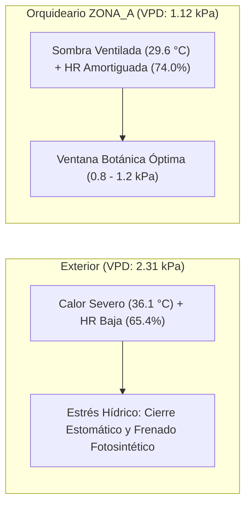

# Informe Técnico: Contraste Microclimático (Orquideario vs Exterior)

Este documento presenta el análisis formal comparativo de las condiciones ambientales registradas entre la **Estación Meteorológica Exterior (EMA Actuador)** y la **Estación Meteorológica del Orquideario (EMA ZONA_A)** de Pristinoplant, con base en la telemetría histórica consolidada entre mayo y septiembre de 2026.

---

## 📌 Resumen Ejecutivo y Dictamen Agronómico

El análisis de **48 días con datos completos y válidos** (superando el umbral de supervivencia del 60% de muestras por franja y excluyendo los días con fallas de telemetría del 10 al 17 de agosto de 2026) demuestra que la infraestructura del orquideario genera un **microclima amortiguado y altamente eficiente**:

1. **Malla-Sombra**: Proporciona un **filtrado medio en fotoperíodo del 88.51%** (transmisión lumínica del 11.49%). Atenúa la radiación extrema del exterior (30.000–45.000 lx) reduciéndola a niveles seguros (3.000–7.000 lx), eliminando el riesgo de fotoinhibición y quemaduras foliares.
2. **Ventilación Natural y Disipación Térmica**: Genera un **diferencial térmico diurno promedio de -6.49 °C** respecto al exterior. El orquideario no experimenta efecto invernadero; al contrario, la ventilación pasiva y la sombra logran que en días exteriores de 40 °C a 42 °C el interior no supere los 33 °C a 34 °C.
3. **Conservación de Humedad y Amortiguamiento**: Mantiene una **humedad relativa diurna +8.53% superior al exterior** (alcanzando hasta +24% en días de sequedad extrema), evitando caídas críticas de humedad al mediodía.
4. **Déficit de Presión de Vapor (VPD)**: Mientras el exterior alcanza un promedio diurno de **2.31 kPa** (estrés por desecación y cierre estomático), el orquideario mantiene un **VPD diurno promedio de 1.12 kPa**, ubicándose en el centro exacto de la ventana botánica óptima para orquídeas (*0.8–1.2 kPa*).

---

## 📊 Métricas Consolidadas y Comparativa Global

| Segmento Ambiental | Variable Analizada | Exterior (EMA Actuador) | Interior (Orquideario ZONA_A) | Diferencial / Comportamiento | Evaluación Botánica |
| :--- | :--- | :--- | :--- | :--- | :--- |
| **Iluminancia** | Fotoperíodo (08h–16h) | 34.460 lx prom. | 4.020 lx prom. | **88.51% filtrado** (11.49% trans.) | Protección total contra quemaduras |
| **Iluminancia** | Amanecer (06h–08h) | 8.230 lx prom. | 870 lx prom. | **88.73% filtrado** | Transición lumínica suave |
| **Iluminancia** | Atardecer (16h–18h) | 10.350 lx prom. | 460 lx prom. | **93.55% filtrado** | Protección contra sol poniente rasante |
| **Luz Fotosintética** | DLI (*Daily Light Integral*) | 16.7 mol/m²/d | 2.1 mol/m²/d | **88.57% retención** | Seguro, evaluar si requiere ajuste de luz |
| **Temperatura** | Diurna (08h–16h) | 36.12 °C | 29.63 °C | **-6.49 °C (Amortiguamiento)** | Excelente ventilación pasiva |
| **Temperatura** | Nocturna (19h–05h) | 26.04 °C | 25.56 °C | **-0.48 °C (Equilibrio)** | Disipación completa del calor diurno |
| **Temperatura** | DIF Térmico (Día - Noche) | 10.09 °C | 4.07 °C | **-6.02 °C vs Exterior** | Estable (apto para Cattleya) |
| **Humedad Relativa** | Diurna (08h–16h) | 65.42% | 73.95% | **+8.53% (Buffer hídrico)** | Previene deshidratación de raíces |
| **Humedad Relativa** | Nocturna (19h–05h) | 93.81% | 86.45% | **-7.36% (Anti-encharcamiento)** | Menor riesgo de *Botrytis* |
| **Transpiración** | VPD Diurno Promedio | 2.31 kPa | 1.12 kPa | **-1.19 kPa** | **Zona Óptima de Transpiración** |

---

## ☀️ 1. Análisis de Iluminancia y Comportamiento de la Malla-Sombra

### Desempeño por Franja Solar

1. **Amanecer (06:00 am – 07:59 am)**:
   - La luz exterior promedia entre 6.000 lx y 11.000 lx.
   - En el interior, la malla atenúa la entrada a 400–1.200 lx (**88.73% de filtrado**).
   - Permite una activación lumínica progresiva de los cloroplastos sin cambios abruptos de temperatura foliar.
2. **Fotoperíodo Pleno (08:00 am – 04:00 pm)**:
   - Durante las horas de radiación cenital máxima, el exterior registra valores de 30.000 lx a más de 45.000 lx.
   - En el orquideario, la iluminación se estabiliza entre 3.000 lx y 7.400 lx (**88.51% de filtrado**).
   - La transmitancia media de 11.5% evita la degradación de la clorofila en géneros sensibles como *Phalaenopsis*, *Oncidium* y plántulas de *Cattleya*.
3. **Atardecer (04:01 pm – 06:00 pm)**:
   - El porcentaje de filtrado se eleva al **93.55%**.
   - Esto se explica por la física óptica de la malla: a ángulos solares bajos y rasantes, el espesor efectivo aparente de los filamentos de polietileno aumenta, bloqueando una mayor fracción de luz directa.

### Evaluación del DLI (*Daily Light Integral*)

- El DLI exterior acumulado promedia **16.7 mol/m²/d**, alcanzando picos de 22 a 23 mol/m²/d en días despejados.
- En el orquideario, el DLI resultante oscila entre **1.5 y 4.4 mol/m²/d** (promedio de 2.1 mol/m²/d).

> [!NOTE]
> Para el desarrollo vegetativo estándar y orquídeas de sombra moderada, este rango de DLI previene cualquier estrés fotoquímico. No obstante, para inducir floraciones masivas en plantas adultas de *Cattleya*, el DLI objetivo recomendado en literatura técnica es de 6 a 10 mol/m²/d. Se aconseja evaluar si en zonas de floración se puede elevar ligeramente la luz mediante mallas del 70% o limpieza periódica del polvo acumulado en la cubierta.

---

## 🌡️ 2. Balance Térmico, Ventilación Natural y DIF

### Eficiencia de la Ventilación Natural Diurna

Uno de los mayores riesgos en estructuras protegidas con mallas es la acumulación de calor atrapado (efecto invernadero pasivo), que ocurre cuando no hay suficiente circulación de aire.

Los datos demuestran un comportamiento inverso y sumamente favorable:

- **Exterior Diurno**: Alcanza picos sostenidos de 37 °C a 42 °C (ejemplo: 42.0 °C el 28 de agosto y 41.5 °C el 1 de septiembre).
- **Interior Diurno**: Se mantiene entre 28.5 °C y 33.6 °C, promediando **-6.49 °C por debajo del exterior**.
- En las jornadas más extremas, el amortiguamiento térmico superó los **-8.0 °C** a **-9.2 °C** (ejemplo: 30 de junio con Ext 40.2 °C vs Int 30.9 °C, $\Delta T = -9.26\text{ °C}$).

> [!TIP]
> Este diferencial térmico negativo confirma que la permeabilidad al viento de la malla-sombra combinada con la apertura perimetral y la evapotranspiración de las plantas disipa eficientemente la radiación incidente.

### Régimen Térmico Nocturno y DIF ($T_{\text{Día}} - T_{\text{Noche}}$)

- **Noche (19:00 pm – 05:00 am)**: La temperatura interior acompaña casi exactamente a la exterior (25.56 °C vs 26.04 °C, $\Delta T = -0.48\text{ °C}$). No hay retención de calor residual indeseado.
- **DIF Interior Promedio**: **4.07 °C** (oscilando entre 3.0 °C y 6.6 °C). Aunque el exterior experimenta un DIF extremo de 10.09 °C, el interior amortigua la curva, brindando estabilidad fisiológica.

---

## 💧 3. Conservación de Humedad y Déficit de Presión de Vapor (VPD)

### Amortiguamiento de Humedad Diurna

En climas tropicales cálidos, el mediodía genera caídas drásticas de humedad relativa en el exterior, provocando marchitamiento temporal y deshidratación del velamen en raíces aéreas:

- **Comportamiento Exterior**: La humedad diurna exterior cae frecuentemente a niveles de 49% a 59% (promedio 65.42%).
- **Comportamiento Interior**: El orquideario retiene la humedad en 65% a 85% (promedio 73.95%), logrando un **incremento neto de +8.53%**.
- En días de calor seco intenso (como el 11 de junio), el orquideario mantuvo un **+24.37% de humedad adicional** respecto al exterior (83.5% interior vs 59.2% exterior).

### Régimen Nocturno y Control Fitopatológico

Durante la noche, el exterior alcanza saturación casi total (95% a 100% HR). En contraste, el interior promedia **86.45% HR** (-7.36% respecto al exterior):

- Esta diferencia es una ventaja fitosanitaria: reduce el tiempo de rocío foliar libre en hojas y flores, disminuyendo drásticamente el riesgo de germinación de esporas de hongos fitopatógenos (*Botrytis cinerea*, *Phytophthora*).

### Déficit de Presión de Vapor (VPD)

El VPD es el indicador biofísico más preciso del intercambio de agua y apertura estomática de las plantas:

$$\text{VPD} = \text{P}_{\text{sat}}(T) \times \left(1 - \frac{\text{HR}}{100}\right)$$

- **Exterior (2.31 kPa)**: Se sitúa en zona de estrés severo por desecación ($>1.6\text{ kPa}$). Las plantas se ven obligadas a cerrar sus estomas para no deshidratarse, paralizando la absorción de CO₂ y nutrientes.
- **Orquideario (1.12 kPa)**: Se ubica de forma consistente dentro del **rango óptimo de 0.8 a 1.2 kPa**. Las orquídeas transpiran de forma activa y continua sin riesgo de desbalance hídrico.

---

## 📋 Inventario de Datos y Disponibilidad Operativa

De los 99 días cronológicos evaluados (26 de mayo a 2 de septiembre de 2026):

- **Días Válidos Completos (3/3)**: **48 días** con telemetría representativa de luz, temperatura y humedad en ambas EMAs simultáneamente.
- **Días Excluidos por Falla Documentada**: **8 días** (10 al 17 de agosto de 2026), excluidos automáticamente por el filtro de telemetría corrupta de `rebuild-rain-history.ts`.
- **Días Parciales / Descartados**: Días afectados por apagones de red eléctrica prolongados en la EMA Exterior o desconexiones temporales de sensores I2C/DHT22 en la EMA del orquideario.

---

## 🎯 Conclusiones y Recomendaciones de Manejo

1. **Eficiencia Estructural Comprobada**:
   - La combinación de malla-sombra y ventilación pasiva es sumamente exitosa: reduce la temperatura pico en hasta 9 °C y eleva la humedad diurna en más de 8 puntos porcentuales sin generar estancamiento.
2. **Optimización del DLI Fotosintético**:
   - La malla actual entrega un filtrado efectivo de casi 89%. Si se busca acelerar el crecimiento o inducir floraciones en géneros demandantes de luz (*Cattleya*, *Dendrobium*), se sugiere considerar mallas de tejido más abierto (ej. 70%) en sectores específicos o mantener la cubierta libre de polvo.
3. **Mantenimiento del Sistema de Humidificación**:
   - Las rutinas automatizadas de riego y humedecimiento de suelo (*Soil Wetting*) complementan perfectamente la física de la estructura, permitiendo sostener el VPD en 1.12 kPa incluso durante olas de calor exteriores de 41 °C.
