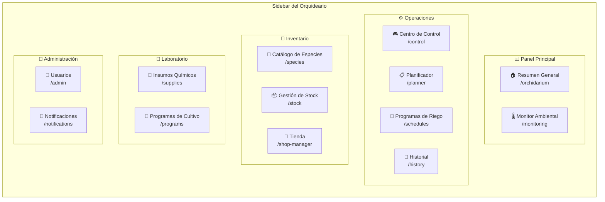
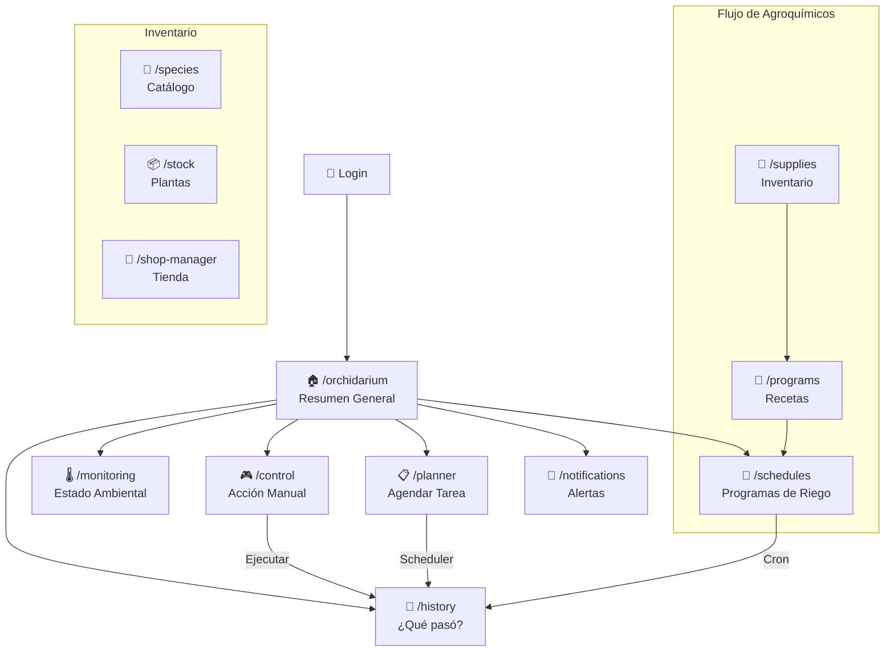

# 🗺️ Arquitectura de Navegación — PristinoPlant

Documento maestro que define la estructura de navegación del panel administrativo (Orquideario), el propósito de cada ruta, y el roadmap de implementación.

---

## 1. Auditoría del Estado Actual

### Mapa de rutas vs Estado

| Grupo | Ruta | Nombre UI | Estado | Líneas |
| --- | --- | --- | --- | --- |
| **Dashboard** | `/orchidarium` | Resumen General | 🔴 Placeholder | 32 |
| | `/monitoring` | Monitor Ambiental | ✅ Implementado | 362 |
| | `/timeline` | Línea de Tiempo | 🔴 Placeholder | 14 |
| | `/alerts` | Alertas | 🔴 Placeholder | 14 |
| **Inventario** | `/species` | Catálogo Especies | 🔴 Placeholder | 14 |
| | `/stock` | Gestión Stock | 🔴 Placeholder | 14 |
| | `/shop-manager` | Tienda | 🔴 Placeholder | 14 |
| **Laboratorio** | `/supplies` | Insumos Químicos | 🔴 Placeholder | 14 |
| | `/recipes` | Recetas y Mezclas | 🔴 Placeholder | 14 |
| **Operaciones** | `/control` | Centro de Control | ✅ Implementado | ~400 |
| | `/planner` | Planificador | ✅ Implementado | 435 |
| | `/history` | Historial | ✅ Implementado | ~200 |
| **Admin** | `/admin` | Panel Admin | ✅ Implementado | 43 |
| | `/admin/timeline` | Timeline Admin | 🟡 Parcial | ~50 |
| | `/admin/ui` | Debug UI | 🟡 Debug | — |

> **Resultado:** De 15 rutas, solo **4 están operativas** + 2 parciales. El 73% del esqueleto de navegación son placeholders.

---

## 2. Estructura Propuesta (Reorganización)

### Principio: Cada ruta = una función concreta, no un placeholder



---

## 3. Cambios Propuestos por Sección

### 📊 Panel Principal (Dashboard)

| Antes | Después | Justificación |
| --- | --- | --- |
| `/orchidarium` (vacío) | **Resumen General** | Landing del admin: KPIs, estado del sistema, alertas recientes |
| `/monitoring` ✅ | Se mantiene | Funciona correctamente |
| `/timeline` ❌ | **Eliminar** | Redundante con `/history` |
| `/alerts` ❌ | **Mover a `/notifications`** bajo Administración | Las alertas son parte del sistema de notificaciones, no del dashboard |

#### Propuesta para `/orchidarium` — Resumen General

- **Estado del Sistema:** Widgets compactos mostrando estado Online/Offline de cada nodo (Sensores, Actuador)
- **Última Lectura:** Cards con temp, humedad, lux actuales (resumen, no el gráfico completo)
- **Próxima Tarea:** Card con la próxima ejecución programada (cron o diferida)
- **Alertas Recientes:** Últimas 3-5 alertas/notificaciones (link a `/notifications`)
- **Resumen de Riego:** Estadística del día (tareas completadas/fallidas)

---

### ⚙️ Operaciones

| Antes | Después | Justificación |
| --- | --- | --- |
| `/control` ✅ | Se mantiene | Funciona correctamente |
| `/planner` ✅ | **Solo tareas diferidas manuales** | Form de agendar + cola de ejecución manual |
| — (nuevo) | **`/schedules` — Programas de Riego** | CRUD de `AutomationSchedule` con validación de colisiones |
| `/history` ✅ | Se mantiene | Funciona correctamente |

> [!NOTE]
> **UX Writing:** Renombrar "Planificador" por un nombre que distinga mejor. Propuestas:
>
> - `/planner` → **"Tareas Diferidas"** (lo que es: tareas únicas programadas manualmente)
> - `/schedules` → **"Programas de Riego"** (rutinas recurrentes automatizadas)

---

### 🌿 Inventario

Sin cambios en la estructura. Todas son rutas por implementar (Fase 1 del roadmap).

| Ruta | Propósito | Modelo Prisma |
| --- | --- | --- |
| `/species` | CRUD de `Genus` + `Species` + `SpeciesImage` | `Genus`, `Species`, `SpeciesImage` |
| `/stock` | CRUD de `Plant` (activos vivos) + gestión de ubicaciones | `Plant`, `Location`, `FloweringEvent` |
| `/shop-manager` | CRUD de `ProductVariant` (precios y stock público) | `ProductVariant` |

---

### 🧪 Laboratorio

| Antes | Después | Justificación |
| --- | --- | --- |
| `/supplies` | Se mantiene — CRUD de **Agroquímicos** | `Agrochemical` |
| `/recipes` | Renombrar a **`/programs`** — **Programas de Cultivo** | `FertilizationProgram`/`PhytosanitaryProgram` + `Cycles` |

> [!IMPORTANT]
> **Dependencia crítica:** Los Programas de Cultivo (`/programs`) alimentan a los Programas de Riego (`/schedules`). Un `AutomationSchedule` con `purpose: FERTIGATION` referencia un `FertilizationProgram` que a su vez contiene una secuencia de `Agrochemical` con su `FertilizationCycle`.
>
> **Orden de desarrollo:** Insumos (`/supplies`) → Programas de Cultivo (`/programs`) → Programas de Riego (`/schedules`)

---

### 🔧 Administración

| Antes | Después | Justificación |
| --- | --- | --- |
| `/admin` ✅ | Se mantiene — Gestión de usuarios y roles | `User` |
| `/admin/timeline` | **Eliminar** | Redundante. El historial vive en `/history` |
| `/admin/ui` | **Mantener solo en dev** | Componente de debug/IoT |
| — (nuevo) | **`/notifications`** | Centro de notificaciones y alertas (Telegram/WhatsApp/Push) |

---

## 4. Actualización de `routes.tsx`

Cambios propuestos al archivo [routes.tsx](file:///c:/Dev/pristinoplant/app/src/config/routes.tsx):

```diff
 // Dashboard
-  { name: 'Línea de Tiempo', url: '/timeline', ... },
-  { name: 'Alertas', url: '/alerts', ... },

 // Operaciones
+  { name: 'Programas de Riego', url: '/schedules', icon: <IoRepeatOutline />, description: 'Rutinas automatizadas y recurrentes' },

 // Laboratorio
-  { name: 'Recetas y Mezclas', url: '/recipes', ... },
+  { name: 'Programas de Cultivo', url: '/programs', description: 'Secuencias de fertilización y fumigación' },

 // Administración (nueva sección o integrado en admin)
+  { name: 'Notificaciones', url: '/notifications', icon: <IoBellOutline />, description: 'Alertas, confirmaciones e historial' },
```

---

## 5. Flujo de Trabajo del Administrador



---

## 6. Prioridad de Implementación

Basado en dependencias y valor para el usuario:

| Prioridad | Ruta | Depende de | Fase |
| --- | --- | --- | --- |
| 🔥 1 | `/schedules` — Programas de Riego | Validación de colisiones | Fase 3 |
| 🔥 2 | `/orchidarium` — Resumen General | APIs existentes | Fase 4 |
| 🔶 3 | `/supplies` — Insumos Químicos | Modelo `Agrochemical` | Fase 1 |
| 🔶 4 | `/programs` — Programas de Cultivo | `/supplies` | Fase 1 |
| 🔶 5 | `/species` — Catálogo | Modelo `Genus`/`Species` | Fase 1 |
| 🔶 6 | `/stock` — Gestión de Plantas | `/species`, `Location` | Fase 1 |
| ⬜ 7 | `/shop-manager` — Tienda | `/species`, `ProductVariant` | Fase 1 |
| ⬜ 8 | `/notifications` — Centro de Notificaciones | Telegram/WhatsApp API | Fase 3+ |
