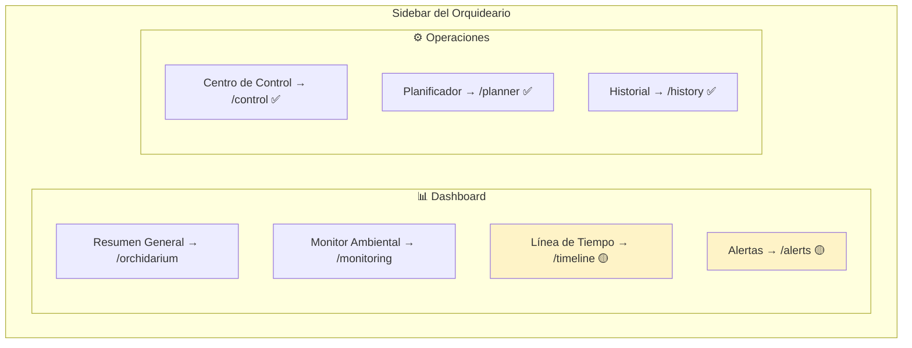
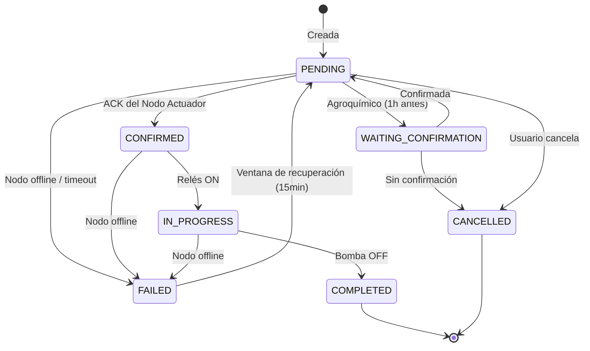
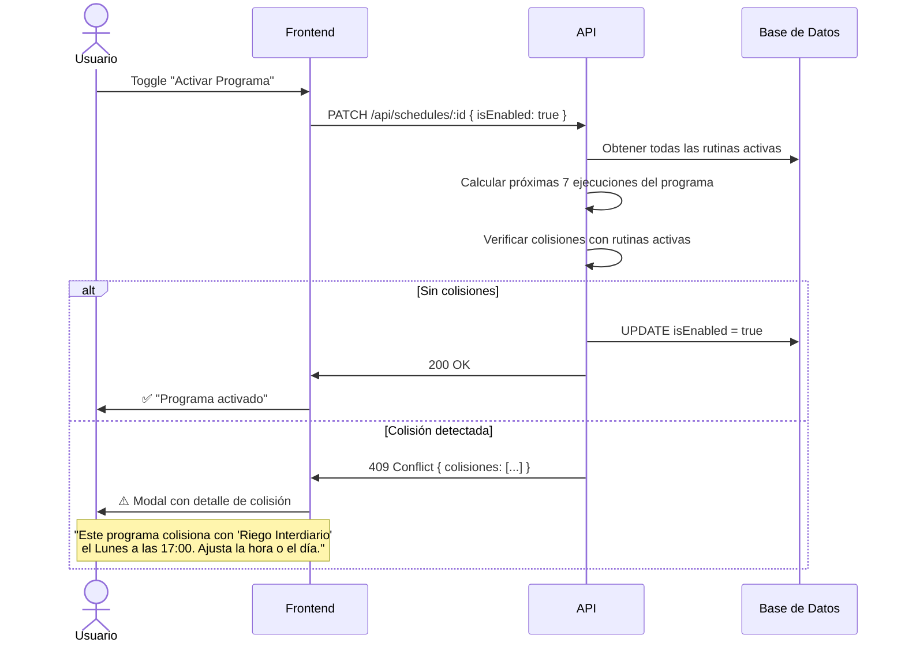

# 🏗️ Arquitectura del Módulo de Operaciones — PristinoPlant

Documento de referencia para organizar el flujo de navegación, las validaciones de colisiones, y el CRUD de rutinas del sistema de riego.

---

## 1. Mapa de Navegación Actual



🟡 = Placeholder sin implementar &nbsp; ✅ = Implementado

### Observación: `/timeline` vs `/history`

| Ruta | Propósito actual | Dónde vive |
| --- | --- | --- |
| `/history` | Registro de tareas ejecutadas del sistema de riego | `(operations)` |
| `/timeline` | Placeholder "Log de actividades y eventos" | `(dashboard)` |
| `/admin/timeline` | Vista admin con componente `TimelineView` | `admin` |

> [!IMPORTANT]
> **Propuesta:** Eliminar `/timeline` del dashboard (placeholder). El historial de operaciones en `/history` ya cumple esa función para el riego. Si a futuro se necesita un timeline global (que incluya eventos biológicos, alertas, etc.), se construirá como evolución de `/history` o como vista separada en el Dashboard con su propio alcance.

---

## 2. Ciclo de Vida de una Tarea (Estado)

Toda actividad del sistema de riego — manual, diferida o automatizada — sigue este flujo:



---

## 3. Fuentes de Tareas

El sistema genera tareas desde 3 orígenes distintos que **comparten** el mismo Circuito Hidráulico:

| Origen | Ruta UI | Quién crea el `TaskLog` | Estado inicial |
| --- | --- | --- | --- |
| **Manual** | `/control` | Frontend vía API → DB | `PENDING` (inmediato) |
| **Diferida** | `/planner` (form) | Frontend vía API → DB | `PENDING` (futuro) |
| **Automatizada** | CRUD Rutinas (pendiente) | Scheduler cron → DB | `PENDING` |

> [!CAUTION]
> Las 3 fuentes compiten por el **mismo recurso físico** (el Circuito Hidráulico). Dos tareas ejecutándose simultáneamente pueden causar conflictos de válvulas y presión. **Se requiere validación de colisiones.**

---

## 4. Sistema de Validación de Colisiones

### 4.1 Concepto: Ventana de Reserva

Cada tarea ocupa una **ventana temporal** que incluye:

```text
[scheduledAt] ──── duración ──── [fin] ── gracia (15min) ── [fin ventana]
```

- **Duración efectiva:** `durationMinutes` del circuito
- **Ventana de cebado:** `PUMP_PRIME_DELAY_SECONDS` (10s, despreciable)
- **Ventana de gracia:** 15 minutos de recuperación en caso de fallo
- **Ventana total:** `durationMinutes + 15 min`

### 4.2 Regla de Colisión

Dos tareas **colisionan** si sus ventanas de reserva se solapan:

```text
Tarea A: [inicio_A, inicio_A + duración_A + 15min]
Tarea B: [inicio_B, inicio_B + duración_B + 15min]

Colisión = inicio_A < fin_B AND inicio_B < fin_A
```

### 4.3 Dónde validar

| Punto de validación | Acción |
| --- | --- |
| **POST `/api/tasks`** (tarea diferida) | Rechazar si colisiona con cualquier tarea `PENDING`/`CONFIRMED`/`IN_PROGRESS` o ventana cron activa |
| **CRUD Rutinas: activar (`isEnabled: true`)** | Rechazar si la expresión cron genera ventanas que solapan con otras rutinas activas |
| **Scheduler: `runTask()`** | Verificación de última instancia antes de despachar (por si se creó una colisión manual entre checks) |

### 4.4 Validación de Colisión entre Crons

Para dos rutinas con `cronTrigger`, calcular las **próximas N ejecuciones** (ej: 7 días) y verificar que ninguna ventana se solape:

```text
Rutina A: "0 17 * * 1" (Lunes 5pm, 5min)  → ventana [17:00, 17:20]
Rutina B: "0 17 * * 5" (Viernes 5pm, 5min) → ventana [17:00, 17:20]
```

Estas NO colisionan (días diferentes). Pero:

```text
Rutina A: "0 17 * * 1" (Lunes 5pm, 10min) → ventana [17:00, 17:25]  
Rutina B: "0 17 * * 1" (Lunes 5pm, 5min)  → ventana [17:00, 17:20]  
```

Estas SÍ colisionan (mismo día y hora).

---

## 5. CRUD de Programas de Riego (Rutinas)

### 5.1 Nomenclatura

> [!NOTE]
> **Propuesta de UX Writing:** Llamarles **"Programas de Riego"** en la UI en vez de "Rutinas" o "Automation Schedules". Es más natural para el usuario.
>
> - Sidebar: `Programas de Riego` (nueva sección bajo Operaciones)
> - O alternativamente: integrar como pestaña/tab dentro de `/planner`

### 5.2 Modelo actual (`AutomationSchedule`)

```prisma
model AutomationSchedule {
  id              String      @id @default(uuid())
  name            String      @unique
  description     String?
  isEnabled       Boolean     @default(true)
  purpose         TaskPurpose
  cronTrigger     String          // "0 6 * * *"
  intervalDays    Int         @default(1)
  durationMinutes Int         @default(10)
  zones           ZoneType[]

  fertilizationProgram   FertilizationProgram?
  phytosanitaryProgram   PhytosanitaryProgram?
  taskLogs TaskLog[]
}
```

### 5.3 Flujo de Activación con Validación



---

## 6. Estructura de Navegación (Confirmado: Opción B)

```text
Sidebar Operaciones:
  ├── Centro de Control  → /control     (acción manual inmediata)
  ├── Planificador       → /planner     (tareas diferidas manuales)
  ├── Programas de Riego → /schedules   (CRUD rutinas automatizadas)
  └── Historial          → /history     (registro de ejecuciones)
```

---

## 7. Reglas de Auditoría y Trazabilidad

### 7.1 Principio Fundamental

> [!CAUTION]
> **Toda actividad del Circuito Hidráulico — manual, diferida o automatizada — debe quedar registrada con su estado final y nota auditable una vez finalizada, cancelada o fallida.**

### 7.2 Trazabilidad por Origen

| Origen | Crea `TaskLog` | Estado final obligatorio | Nota de finalización |
| --- | --- | --- | --- |
| **Manual** (`/control`) | Sí, al despachar | `COMPLETED` / `FAILED` | No requiere nota — el origen `manual` es suficiente |
| **Diferida** (`/planner`) | Sí, al agendar | `COMPLETED` / `FAILED` / `CANCELLED` | Automática o manual (el usuario escribe motivo si cancela) |
| **Automatizada** (`/schedules`) | Sí, al ejecutar cron | `COMPLETED` / `FAILED` / `CANCELLED` | Automática o manual (el usuario escribe motivo si cancela) |

### 7.3 Cancelación de Tareas

| Tipo de tarea | ¿Se puede cancelar? | ¿Requiere motivo? | Quién puede cancelar |
| --- | --- | --- | --- |
| **Manual** (`/control`) | N/A — es un switch con apagado automático de seguridad (10 min estándar, 5 min fertirriego). El usuario puede apagarlo manualmente en cualquier momento, pero no se registra como "cancelación" sino como apagado anticipado. | — | — |
| **Diferida** (`PENDING`) | ✅ Sí | ✅ Sí, obligatorio | Admin vía `/planner` |
| **Programada/Rutina** (`PENDING`) | ✅ Sí | ✅ Sí, obligatorio | Admin vía `/schedules` o `/planner` (cola) |
| **Esperando confirmación** (`WAITING_CONFIRMATION`) | ✅ Sí (auto-cancel si no hay respuesta) | Automático: "Sin confirmación del operador" | Sistema o Admin |

> [!NOTE]
> Las duraciones del modo manual están hardcodeadas actualmente (10 min riego/nebulización/humectación, 5 min fertirriego/fumigación), pero el usuario puede apagar el circuito antes del cierre automático. Por lo tanto, la **duración registrada en el historial debe ser calculada** (`executedAt` − `scheduledAt`), no asumida como la duración del auto-off. El timer del firmware es solo la capa de seguridad que impide dejar el Circuito Hidráulico abierto indefinidamente.

### 7.4 Notas Auditables por Transición de Estado

| Transición | Nota generada |
| --- | --- |
| `PENDING` → `CONFIRMED` | "Comandos recibidos y encolados por el Nodo Actuador." |
| `CONFIRMED` → `IN_PROGRESS` | "Circuito Hidráulico activado. Actuadores en operación." |
| `IN_PROGRESS` → `COMPLETED` | "Circuito Hidráulico cerrado correctamente." |
| `IN_PROGRESS` → `FAILED` (offline) | "Fallo Crítico: El Nodo Actuador perdió conexión durante una ventana crítica." |
| `PENDING` → `CANCELLED` (usuario) | *Motivo escrito por el usuario* (obligatorio) |
| `WAITING_CONFIRMATION` → `CANCELLED` | "Sin confirmación del operador. Tarea cancelada automáticamente." |
| `PENDING` → `CANCELLED` (clima) | "Cancelada por WeatherGuard: lluvia acumulada superó el umbral." |
| `FAILED` → `PENDING` (recuperación) | "Reintento automático dentro de la ventana de gracia (15 min)." |

### 7.5 Seguridad por Origen y Circuito

| Origen | Circuito | Requiere confirmación previa |
| --- | --- | --- |
| **Manual** | Riego / Nebulización / Humectación | ❌ No — acción directa |
| **Manual** | **Fertirriego / Fumigación** | ✅ **Sí** — confirmar tanque preparado |
| **Diferida** | Riego / Nebulización / Humectación | ❌ No — se ejecuta automáticamente |
| **Diferida** | **Fertirriego / Fumigación** | ✅ **Sí** — confirmar 1h antes |
| **Automatizada** | Riego / Nebulización / Humectación | ❌ No — se ejecuta automáticamente |
| **Automatizada** | **Fertirriego / Fumigación** | ✅ **Sí** — confirmar 1h antes vía notificación |

> [!IMPORTANT]
> **La confirmación de agroquímicos existe porque activar la bomba con un tanque vacío es un riesgo operativo.** El agua de riego normal viene de la red y no requiere preparación previa. Solo las tareas de **Fertilización** y **Fumigación** requieren que el operador confirme la preparación del tanque auxiliar antes de activar el Circuito Hidráulico, independientemente del origen (manual, diferida o automatizada).

---

## 8. Próximos Pasos (Priorizados)

1. **API de validación de colisiones** — función compartida usada por tareas diferidas y rutinas
2. **CRUD de Programas de Riego** (`/schedules`) — crear/editar/activar/desactivar con validación
3. **Motivo de cancelación** — agregar campo `cancellationReason` al formulario de cancelación
4. **Confirmación de agroquímicos** — modal en `/control` y notificación 1h antes en diferidas/crons
5. **Sistema de Notificaciones** — Telegram/WhatsApp/Web Push para confirmaciones y alertas
