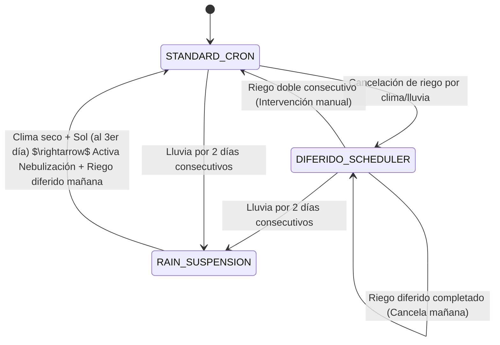

# Especificación: Máquina de Estados del Scheduler (Riego Interdiario)

Esta especificación detalla la arquitectura de la máquina de estados del scheduler y las reglas para orquestar y controlar de forma interdiaria el riego por aspersión de las 6:00 AM, así como la mitigación de sobre-riego en el orquideario de **PristinoPlant**.

---

## Conceptos Fundamentales

### 1. Definición de "Riego Completo / Riego Efectivo Diario"

Un día natural se considera "regado" con éxito (evitando la necesidad de aspersión adicional) si se cumple al menos una de las siguientes condiciones:

* **Aspersión Controlada**: La duración acumulada de las ejecuciones de tipo `ASPERSION` (con `purpose = IRRIGATION`) que terminaron en `status = COMPLETED` durante el día natural es **mayor o igual a 15 minutos**.
* **Lluvia Natural Acumulada**: La suma de la duración de todos los eventos de lluvia registrados (`RainEvent` finalizados o en curso) durante el día natural actual es **mayor o igual a 20 minutos**.

Si no se cumple ninguna de estas condiciones, el día se clasifica como de **Riego Insuficiente / Día Seco**.

### 2. Límite de Emergencia (Emergency Hard Trigger)

Las plantas no pueden pasar más de 3 días sin agua. Por lo tanto, si el orquideario pasa **3 días consecutivos sin un riego completo** (es decir, 3 días seguidos sin lluvias acumuladas $\ge 20$ min ni riegos por aspersión acumulados $\ge 15$ min), se debe programar y ejecutar **obligatoriamente** un riego de aspersión de 15 minutos a las 6:00 AM del día siguiente.

#### Exclusiones Críticas del Límite de Emergencia

Para evitar ahogar las orquídeas en condiciones de humedad extrema o lluvias muy recientes, este riego de emergencia de las 6:00 AM **SE CANCELARÁ** si se cumple alguna de las siguientes condiciones de exclusión:

1. **Lluvia Reciente (últimas 24h)**: La lluvia acumulada total (suma de la duración de todos los eventos de lluvia) registrada en las últimas **24 horas** previas a la evaluación del riego (día actual y anterior) es **mayor o igual a 20 minutos**.
2. **Humedad Sostenida Crítica Exterior o Interior**: Se han registrado **$\ge 3$ horas** continuas con un promedio de humedad relativa **$\ge 98\%$** en la zona exterior (`EXTERIOR`) o en la zona interior (`ZONA_A`).

Si se activa cualquiera de estas exclusiones, el riego de emergencia se aborta temporalmente, reprogramándose la evaluación para el día siguiente.

---

## Matriz de Estados del Scheduler

El scheduler mantendrá un modelo persistido `SchedulerState` en la base de datos PostgreSQL para transicionar entre tres estados lógicos:

### 1. STANDARD_CRON

* **Comportamiento**: Se ejecutan las rutinas fijas de riego configuradas en el cron del sistema (Lunes, Miércoles, Viernes y Domingo a las 6:00 AM).
* **Transición de salida**: Si una aspersión programada por cron se cancela debido a lluvia real, lluvia acumulada o veto nocturno de humedad, el scheduler desactiva la ejecución directa del cron base y transiciona a **DIFERIDO_SCHEDULER**.

### 2. DIFERIDO_SCHEDULER

* **Comportamiento**: El scheduler deshabilita los disparadores fijos del cron de aspersión y genera dinámicamente tareas diferidas de 15 min a las 6:00 AM según las necesidades hídricas diarias.
* **Evaluación Diaria (8:00 PM)**:
  * Si hoy hubo riego completo (aspersión $\ge 15$ min o lluvia acumulada $\ge 20$ min), se **cancela preventivamente** la tarea de aspersión diferida de mañana a las 6:00 AM para mantener la alternancia interdiaria.
  * Si hoy no se regó (por lluvia escasa o nublado):
    * Se evalúan las métricas climáticas de hoy (8:00 AM - 4:00 PM): lluvia acumulada hoy $< 20$ min AND lux promedio hoy $> 13,000$ lux AND racha de sombra consecutiva $\le 60$ min.
    * Si las condiciones fueron secas/soleadas, se **reprograma** un riego diferido para mañana a las 6:00 AM.
    * Si fue lluvioso o nublado extremo, se suspende la reprogramación (esperar y volver a evaluar mañana a las 8:00 PM).
* **Reset por Riego Doble**: Si el usuario interviene manualmente regando dos días seguidos (provocando que hoy y ayer sumen riego completo $\ge 15$ min en cada día), la máquina de estados se **resetea** a **STANDARD_CRON** y restaura el control de cron base.
* **Reset por Fallo**: Si una tarea diferida falla o se cancela, se ignora la regla de alternancia y se agenda un riego diferido de emergencia para mañana a las 6:00 AM.

### 3. RAIN_SUSPENSION

* **Comportamiento**: Bloqueo total preventivo de riego de aspersión y nebulización por exceso hídrico severo.
* **Gatillo**: Registros de lluvia acumulada $\ge 20$ min en 2 días consecutivos.
* **Condición de Salida**: Al tercer día (o subsiguientes), si se registra clima seco y soleado (promedio de lux $> 20,000$ lux y sin lluvia activa), se reactiva el sistema de nebulización y se agenda una aspersión diferida de 15 min para mañana a las 6:00 AM, volviendo a **STANDARD_CRON**.

---

## Regla de Secado Rápido (Secado en el Trópico)

En el clima tropical de Ciudad Guayana, una lluvia intensa de corta duración puede ser sucedida inmediatamente por un sol inclemente que seca el ambiente rápidamente. Para evitar deshidratación en días de lluvia esporádica:

* **Bypass de Veto por Lluvia Reciente**: Las cancelaciones automáticas de `SOIL_WETTING` (Humectación del suelo) y `HUMIDIFICATION` (Nebulización) debido a lluvia registrada en las últimas 4 u 8 horas **serán anuladas y la tarea se ejecutará** si se cumplen simultáneamente las siguientes condiciones de secado rápido:
  1. **Luz Promedio del Día**: El promedio de iluminancia acumulado desde las 8:00 AM hasta la hora de evaluación actual es mayor o igual a **26,000 lux** (evapotranspiración activa).
  2. **Humedad Exterior**: La humedad exterior actual es menor o igual a **85.0%** (aire exterior seco).
  3. **Humedad Interior**: La humedad interior actual es menor o igual a **90.0%** (orquideario desaturado).
  4. **Temperatura Crítica**: Si la hora local de Caracas está en la ventana de calor extremo (de **11:00 AM a 3:00 PM**), la temperatura en el interior debe ser estrictamente mayor o igual a **30.0°C**.

Si estas cuatro condiciones se cumplen, el scheduler asume que el exceso hídrico foliar ha sido disipado por la radiación y temperatura, permitiendo reanudar la humectación o misting para enfriamiento foliar.
