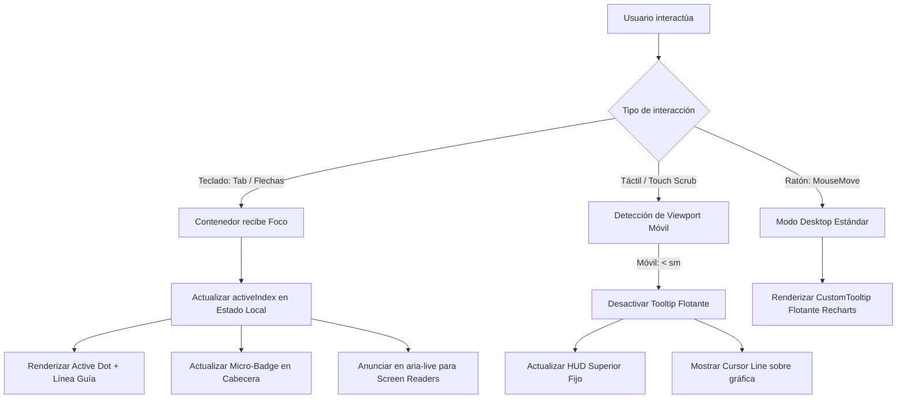

# SDD: Mejoras de Experiencia de Usuario (UX) y Navegación para Gráficas de Monitoreo

Este documento de especificación de diseño de software (SDD) establece las directrices arquitectónicas, de diseño y de accesibilidad para optimizar el componente [EnvironmentDataChart](file:///c:/Dev/pristinoplant/app/src/app/(orchidarium)/(monitoring)/monitoring/ui/components/EnvironmentDataChart.tsx) en dos frentes críticos: **Navegación Precisa por Teclado** y **Optimización para Dispositivos Móviles**.

---

## 1. Diagnóstico del Estado Actual

En el ecosistema de monitoreo de **Pristinoplant**, las gráficas representan variables ambientales críticas (Temperatura, Humedad Relativa, Iluminancia y Duración de Lluvia/Inferencia).

```
+-----------------------------------------------------------------------+
|  Titulo: Humedad Relativa                     [ 24h | 1D | 30d | ... ]|
+-----------------------------------------------------------------------+
|                                                                       |
|   100% |  ~~~~~~~~~~~~~~~~~~\                                         |
|        |                     \______/~~~~~~~~~                        |
|     0% |______________________________________                        |
|                                                                       |
+-----------------------------------------------------------------------+
|  [ Mínimo: 45% ]  [ Máximo: 98% ]  [ Promedio: 78% ]  [ Reg: 288 ]    |
+-----------------------------------------------------------------------+
```

### Problemas Identificados

1. **Ausencia de Navegación por Teclado:**
   - La gráfica solo responde al puntero del ratón (`hover`).
   - Usuarios con teclado o lectores de pantalla no pueden recorrer las muestras temporales secuencialmente.
   - Es imposible realizar un análisis quirúrgico punto a punto (ej. comparar el valor de las 14:15 vs 14:20) sin pulso milimétrico en el ratón.
2. **Invasión del Tooltip en Móviles:**
   - En pantallas estrechas (360px–420px), el `CustomTooltip` (con dimensiones de 280px–340px) se superpone sobre la curva, bloqueando la visualización del gráfico completo.
3. **Pérdida de Área Útil:**
   - Padding de la tarjeta (`p-5` = 40px horizontales) sumado al ancho del eje Y (`width={45}`) reduce el ancho disponible para la serie de datos a menos de 270px en teléfonos estándar.
4. **Fricción Táctil:**
   - Deslizar el pulgar sobre la gráfica compite con el desplazamiento vertical de la página (`vertical scroll`), causando saltos accidentales de pantalla o bloqueos de interacción.

---

## 2. Requerimientos y Objetivos de Diseño

| Requerimiento | Descripción | Criterio de Éxito |
| :--- | :--- | :--- |
| **REQ-01: Foco Estético** | Permitir navegación secuencial por teclado **sin** recuadros toscos alrededor de la tarjeta (`focus-ring` externo). | El foco se evidencia internamente en el punto activo (`activeDot`) y un micro-badge contextual. |
| **REQ-02: Control por Teclado** | Navegar muestras con `←`, `→`, `Shift + Flechas`, `Home` y `End`. | Avance y retroceso inmediato del cursor y actualización de datos sincronizada. |
| **REQ-03: HUD Fijo Móvil** | Desacoplar el Tooltip flotante en pantallas `< sm` (móviles). | La información de la muestra se proyecta en una barra superior fija (HUD), manteniendo la gráfica 100% despejada. |
| **REQ-04: Layout Edge-to-Edge** | Maximizar el área gráfica en pantallas pequeñas. | Padding reducido (`p-2.5` en móvil) y eje Y compacto/flotante ganando hasta 60px de área de trazado. |
| **REQ-05: Micro-controles Táctiles** | Facilitar el paso a paso en móviles sin depender exclusivamente del pulgar. | Botones compactos `‹` / `›` opcionales integrados en el HUD móvil. |
| **REQ-06: Accesibilidad (a11y)** | Integrar soporte para tecnologías asistivas. | Salida `aria-live="polite"` que anuncie valores temporales sin saturar al usuario. |

---

## 3. Especificación: Navegación Fina por Teclado

### A. El Desafío Estético: Evitar el `focus-ring` del Contenedor

Tradicionalmente, hacer un elemento enfocable (`tabIndex={0}`) agrega un anillo exterior (`focus-visible:ring-2 focus-visible:ring-primary`). En una tarjeta de dashboard, este anillo:
- Resulta visualmente tosco y pesado.
- No le comunica al usuario **qué muestra específica** está seleccionada dentro del lienzo.

### B. Solución: Indicador de Foco Puntual e Interno

El contenedor del gráfico mantendrá `tabIndex={0}` con `focus-visible:outline-none`, y el estado de foco activo se reflejará exclusivamente a través de 3 elementos internos integrados armónicamente en el diseño:

```
+-----------------------------------------------------------------------+
|  💧 Humedad Relativa               [ ⌨️ Muestra 142/288 | 14:10 ]     | <-- Micro-Badge
+-----------------------------------------------------------------------+
|                                                                       |
|        |             | (Línea guía punteada)                          |
|        |            (O) <--- Punto activo con halo pulsante (Glow)    |
|        |             |                                                |
+-----------------------------------------------------------------------+
```

1. **Punto Activo con Halo Resplandeciente (`Active Dot Glow`):**
   - El punto temporal actual renderiza un círculo destacado con doble borde y un halo semitransparente pulsante con el color de la métrica (`customColor`).
2. **Línea Guía Vertical Dinámica (`Scrubbing Cursor Line`):**
   - Una línea vertical punteada (`strokeDasharray="3 3"`) centrada exactamente en el eje temporal de la muestra enfocada.
3. **Micro-Badge Contextual de Teclado:**
   - Un chip discreto en la cabecera del gráfico: `[ ⌨️ Muestra 24 / 288 • Usa ← → ]`.
   - Se muestra únicamente cuando el contenedor tiene el foco del teclado y se desvanece suavemente (`transition-opacity`) al perder el foco (`blur`).
4. **Región Oculta para Lectores de Pantalla:**
   - Un contenedor `sr-only` con `aria-live="polite"` que anuncia: *"Muestra 24 de 288: 24.5 °C a las 14:20"*.

### C. Matriz de Atajos de Teclado

| Tecla / Combinación | Acción | Descripción |
| :--- | :--- | :--- |
| `Tab` | Enfocar Gráfica | Pone el foco en la gráfica y selecciona la última muestra (o la del cursor actual). |
| `ArrowRight` (`→`) | Siguiente Muestra | Desplaza el selector a la muestra `index + 1`. Si está al final, se mantiene. |
| `ArrowLeft` (`←`) | Muestra Anterior | Desplaza el selector a la muestra `index - 1`. Si está al inicio, se mantiene. |
| `Shift + ArrowRight` | Salto Rápido (+10) | Avanza 10 muestras (configurable según la densidad de datos). |
| `Shift + ArrowLeft` | Salto Rápido (-10) | Retrocede 10 muestras. |
| `Home` | Primera Muestra | Salta directamente al inicio de la serie temporal. |
| `End` | Última Muestra | Salta directamente al punto más reciente de la serie temporal. |
| `Escape` | Deseleccionar | Oculta el cursor activo y devuelve la vista al resumen general. |

---

## 4. Especificación: Experiencia Móvil Optimizada

### A. Patrón HUD Superior Fijo (Desacoplamiento de Tooltip)

En pantallas móviles (`< sm`), el `CustomTooltip` flotante se desactiva para evitar oclusiones sobre la curva. Los datos se visualizan en un panel integrado (**HUD - Heads-Up Display**) ubicado entre los controles superiores y la gráfica.

```
MÓVIL (< 640px)
+-------------------------------------------------------------+
| 💧 Humedad Relativa                 [ Hoy v ] [ ... ]       |
+-------------------------------------------------------------+
| [ HUD FIJO ]                                                |
|  📅 Hoy, 2:15 pm   |   💧 84.5% HR   |   🌡️ 23.1 °C         |
|  [ ‹ Anterior ]                             [ Siguiente › ] |
+-------------------------------------------------------------+
|                                                             |
|   ~~~~~~~~~~~~~~~~~~\                                       |
|                      \______/~~~~~~~~~                      |
|                                                             |
+-------------------------------------------------------------+
| [ Mín: 45% ] [ Máx: 98% ] [ Prom: 78% ] [ Eventos: 12 ]    |
+-------------------------------------------------------------+
```

#### Comportamiento del HUD:
- **Estado de Reposo (Sin interacción táctil):**
  - Muestra la última lectura registrada o el resumen promedio del periodo.
- **Estado Activo (Touch / Scrubbing / Botones de paso):**
  - Muestra en tiempo real la fecha/hora formateada, el valor principal y las variables secundarias (temperatura asociada, iluminancia o estado de inferencia de lluvia).
- **Sub-Modo Inferencia de Lluvia en Móvil:**
  - En gráficas de lluvia, el HUD incluye un botón expandible *"Ver detalles de inicio/cese"* que abre un Drawer o Bottom Sheet accesible en lugar de saturar el espacio vertical de la tarjeta.

### B. Arquitectura de Aprovechamiento Espacial (Edge-to-Edge)

1. **Ajuste de Paddings:**
   - Pantalla Grande (`>= sm`): `p-5` (20px).
   - Pantalla Móvil (`< sm`): `p-2.5` a `p-3` (10px a 12px).
2. **Eje Y Flotante / Compacto:**
   - En pantallas de escritorio: `YAxis` clásico con `width={45}` y etiquetas a la izquierda.
   - En pantallas móviles: `YAxis` con `tick={false}` y `width={0}`. Se insertan dos etiquetas sutiles flotantes con posicionamiento absoluto en la esquina superior e inferior derecha de la cuadrícula:
     - `Max: 98%` (arriba a la derecha).
     - `Min: 45%` (abajo a la derecha).
   - **Ganancia:** Recupera 45px directos de ancho horizontal para la visualización de la curva.
3. **Gestión de Gestos Táctiles (`touch-action`):**
   - El contenedor SVG utiliza `touch-action: pan-y` para asegurar que el scroll vertical de la página web no se trabe al rozar la gráfica con el pulgar.
   - El seguimiento de la muestra se activa con toque directo o arrastre horizontal intencional.

---

## 5. Arquitectura de Estado y Flujo de Interacción



### Estructura de Estado Propuesta

```typescript
interface ChartInteractionState {
  // Índice del punto actualmente seleccionado (-1 si no hay selección)
  activeIndex: number | null
  // Indica si la gráfica tiene el foco de teclado
  isKeyboardFocused: boolean
  // Indica si el usuario está tocando activamente en móvil
  isTouching: boolean
  // Modo de visualización detectado
  isMobileViewport: boolean
}
```

---

## 6. Plan de Implementación por Fases

### Fase 1: Motor de Navegación por Teclado y Foco Interno
- [ ] Implementar `tabIndex={0}` y manejador `onKeyDown` en el contenedor de la gráfica.
- [ ] Crear el estado `activeIndex` y vincularlo con `ArrowLeft`, `ArrowRight`, `Shift + Flechas`, `Home`, `End` y `Escape`.
- [ ] Renderizar el `ActiveDot` personalizado y la línea guía en la posición del `activeIndex`.
- [ ] Crear el componente `ChartKeyboardBadge` en la cabecera (visible solo durante foco de teclado).
- [ ] Añadir región `sr-only` con `aria-live="polite"` para accesibilidad.

### Fase 2: Componente HUD Fijo para Móviles
- [ ] Diseñar el subcomponente `ChartMobileHUD` para alojar los datos de la muestra seleccionada.
- [ ] Implementar detector de viewport móvil (hook `useMediaQuery` o Tailwind container queries).
- [ ] Condicionar el renderizado de `Recharts.Tooltip`: activo en desktop, redirigido a `ChartMobileHUD` en móviles.
- [ ] Añadir micro-botones de paso `[ ‹ ]` y `[ › ]` en la barra HUD móvil.

### Fase 3: Optimización Espacial y Ejes en Móviles
- [ ] Ajustar clases responsivas de padding (`p-2.5 sm:p-5`).
- [ ] Implementar etiquetas flotantes de Max/Min para móviles en sustitución de la columna fija del eje Y.
- [ ] Configurar propiedades de gestos táctiles (`touch-action: pan-y`).

### Fase 4: Pruebas y Validación
- [ ] Validar navegación completa por teclado con tabulación cruzada entre múltiples gráficas de la vista.
- [ ] Validar en emuladores móviles (360px, 390px, 412px de ancho).
- [ ] Verificar compatibilidad con linters (`pnpm lint`) y estándares de TypeScript del proyecto (sin `any`).

---

## 7. Conclusión

Con este diseño, la experiencia de visualización en **Pristinoplant** alcanza un estándar de nivel profesional:
- **En Escritorio:** Análisis quirúrgico, rápido y accesible vía teclado sin generar polución visual en las tarjetas.
- **En Móvil:** Interacción limpia, con gráficas despejadas, aprovechamiento total de la pantalla y lectura instantánea mediante HUD superior.
