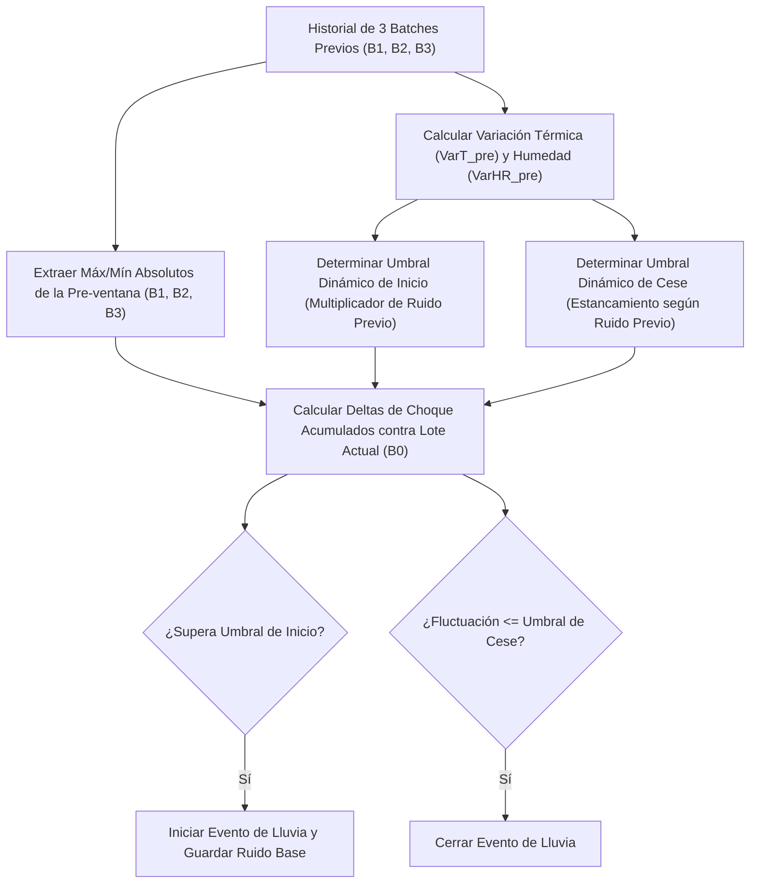

# Sustento Científico: Modelado de Gradientes y Detección de Anomalías Climáticas

Este documento proporciona las bases físicas, termodinámicas y estadísticas para optimizar el motor de inferencia de lluvia del orquideario, sustituyendo los umbrales planos por el análisis de gradientes dinámicos y derivadas temporales de series de tiempo auto-calibrables.

---

## 1. Fundamentos Físicos y Termodinámicos

La atmósfera del orquideario se comporta como un sistema físico abierto regido por leyes termodinámicas. Durante la noche, el comportamiento de las variables de temperatura (\(T\)) y humedad relativa (\(HR\)) sigue patrones predecibles hasta que son perturbados por un evento meteorológico externo (lluvia).

### A. Enfriamiento Radiativo Nocturno (Fase Estable)
En ausencia de radiación solar, la superficie de la Tierra pierde calor principalmente por radiación infrarroja de onda larga hacia el espacio. Este proceso de pérdida de energía térmica se describe mediante la **Ley de Enfriamiento de Newton**:

\[\frac{dT}{dt} = -k (T - T_{\infty})\]

Donde:
* \(\frac{dT}{dt}\) es la tasa de cambio de temperatura en el tiempo (gradiente térmico temporal).
* \(k\) es la constante de acoplamiento conductivo/radiativo del entorno.
* \(T_{\infty}\) es la temperatura de equilibrio de la atmósfera circundante profunda.

En condiciones secas o estables (prelluvia), este enfriamiento es gradual y cuasi-lineal. En nuestra telemetría del 24 de junio, observamos un gradiente estable prelluvia de aproximadamente:

\[\frac{dT}{dt} \approx -0.1^\circ\text{C} \text{ por cada 10 minutos} \quad (-0.6^\circ\text{C}/\text{h})\]

### B. Relación de Clausius-Clapeyron para la Humedad Relativa
La humedad relativa (\(HR\)) es la relación entre la presión de vapor de agua actual (\(e\)) y la presión de vapor de saturación (\(e_s\)) a la temperatura dada:

\[HR = \frac{e}{e_s(T)} \times 100\]

La presión de vapor de saturación (\(e_s(T)\)) tiene una dependencia exponencial con la temperatura, modelada por la **Ecuación de Clausius-Clapeyron**:

\[e_s(T) = 0.611 \exp\left(\frac{17.27 T}{T + 237.3}\right)\]

Como consecuencia matemática de esta ley, cuando la temperatura baja lentamente debido al enfriamiento radiativo nocturno, \(e_s(T)\) disminuye exponencialmente y la humedad relativa (\(HR\)) experimenta una subida lenta, predecible y controlada:

\[\frac{dHR}{dt} > 0 \quad (\text{típicamente } +0.1\% \text{ a } +0.4\% \text{ por cada 10 minutos})\]

---

## 2. Metodología Estadística Dinámica (Sin Límites Hardcoreados)

Para evitar la rigidez de constantes estáticas frente a los cambios estacionales del clima, las tasas de cambio esperadas y de estancamiento se **infieren dinámicamente de los datos recientes** del sensor.

### A. Cálculo de la Variación de Referencia (Ruido Natural Previo)
Evaluamos el comportamiento del clima en una ventana estable previa de 30 minutos (los 3 lotes anteriores: $B_1$, $B_2$, $B_3$, correspondientes a la ventana de hace 10 a 40 minutos atrás). Al sumar el lote actual ($B_0$, 0-10 minutos), el análisis completo abarca una **ventana total de 40 minutos**.

La variación de referencia de temperatura ($V_{Temp}$) y humedad ($V_{Hum}$) se define como la fluctuación máxima registrada de lote a lote dentro de los lotes previos:

\[V_{Temp} = \max(B_i.max - B_i.min) \quad \text{para } i \in \{1, 2, 3\}\]
\[V_{Hum} = \max(B_i.max - B_i.min) \quad \text{para } i \in \{1, 2, 3\}\]

#### Justificación del uso de Máximo (`Math.max`) en lugar de Promedio:
El uso de `Math.max` actúa como un **filtro protector contra picos de ruido aislados** (por ejemplo, una ráfaga de viento momentánea). Promediar las variaciones diluiría la fluctuación real reciente del sensor, reduciendo artificialmente el umbral y causando falsos positivos ante pequeñas perturbaciones de viento. El máximo establece el "peor caso" de variabilidad en la calma previa.

Para evitar que la variación se determine como cero en noches de calma absoluta (lo que multiplicaría el factor por cero y causaría disparos ante la menor perturbación infinitesimal), se aplican pisos mínimos basados en las **limitaciones físicas e instrumentales del sensor DHT22** (resolución mínima de paso térmico de $0.1^\circ\text{C}$):
* \(V_{Temp\_Ref} = \max(V_{Temp}, 0.15^\circ\text{C})\)
* \(V_{Hum\_Ref} = \max(V_{Hum}, 0.5\%)\)

### B. Criterio Dinámico de Inicio (Detección de Anomalías)
El gradiente de cambio en el lote actual ($B_0$) se evalúa comparándolo contra los extremos absolutos de los **3 batches anteriores combinados** ($B_1, B_2, B_3$) para medir la caída de temperatura y el alza de humedad respecto a todo el rango dinámico de la tendencia previa:

1. **Caída Térmica Abrupta**:
   \[\Delta T_{actual} = \max(B_1.max, B_2.max, B_3.max) - B_0.min \ge K_T \times V_{Temp\_Ref}\]
2. **Subida de Humedad Abrupta**:
   \[\Delta HR_{actual} = B_0.max - \min(B_1.min, B_2.min, B_3.min) \ge K_{HR} \times V_{Hum\_Ref}\]

Donde los coeficientes óptimos de sensibilidad dinámica son:
* \(K_T = 2.5\) (la caída térmica supera por más de 2.5 veces la variación natural previa).
* \(K_{HR} = 2.0\) (el aumento de humedad supera por más de 2.0 veces la variación natural previa).

*Nota*: Si el ambiente exterior ya se encuentra en saturación extrema (\(HR \ge 98.0\%\) en el lote actual o \(HR \ge 95.0\%\) en el lote previo), la subida hídrica se obvia y el disparo se realiza basándose exclusivamente en el gradiente de choque térmico (\(\Delta T_{actual} \ge K_T \times V_{Temp\_Ref}\)). El evento se dispara sólo si la pre-ventana venía de calma general (oscilación térmica total de la ventana previa $\le 0.6^\circ\text{C}$).

### C. Criterio Dinámico de Cese (Estancamiento Adaptativo)
El cese de lluvia se declara cuando la fluctuación interna en el lote actual (\(B_0\)) decae por debajo de un umbral proporcional a la variabilidad base calculada antes del inicio del evento de lluvia (`baselineVarTemp` y `baselineVarHum`), demostrando que el clima ha retornado a la calma típica estable:

\[V_{actual\_Temp} = B_0.max - B_0.min \le \max(0.4^\circ\text{C}, 1.2 \times baselineVarTemp)\]
\[V_{actual\_Hum} = B_0.max - B_0.min \le \max(1.0\%, 1.2 \times baselineVarHum)\]

Esto permite auto-calibrar el cese adaptando el cierre al estado natural base del clima prelluvia.

---

## 3. Validación de Campo con Datos Históricos (Caso de Estudio del 24/06)

Se evaluó el comportamiento del algoritmo frente al evento de lluvia real ocurrido de **8:50 PM a 9:20 PM** del 24 de junio de 2026:

### A. Telemetría Registrada
* **Prelluvia (8:10 PM - 8:40 PM)**:
  - Lote 8:10 - 8:20: VarTemp = $0.00^\circ\text{C}$, VarHum = $0.4\%$
  - Lote 8:20 - 8:30: VarTemp = $0.10^\circ\text{C}$, VarHum = $0.3\%$
  - Lote 8:30 - 8:40: VarTemp = $0.00^\circ\text{C}$, VarHum = $0.2\%$
  - **Cálculo de Referencia**: $V_{Temp\_Ref} = \max(0.00, 0.10, 0.00, 0.15) = 0.15^\circ\text{C}$; $V_{Hum\_Ref} = \max(0.4, 0.3, 0.2, 0.5) = 0.5\%$.
  - **Calma Previa**: Oscilación de temperatura total en 30m = $26.30^\circ\text{C} - 26.20^\circ\text{C} = 0.10^\circ\text{C}$ (calma chicha $\le 0.6^\circ\text{C}$).

* **Choque / Inicio (8:50 PM - 9:00 PM)**:
  - Lote actual $B_0$ (8:50 - 9:00): La temperatura cae de $26.10^\circ\text{C}$ a $25.40^\circ\text{C}$ ($B_0.min = 25.40^\circ\text{C}$).
  - Caída térmica real: $\Delta T = 26.30^\circ\text{C} - 25.40^\circ\text{C} = 0.90^\circ\text{C}$.
  - Umbral térmico dinámico: $2.5 \times V_{Temp\_Ref} = 2.5 \times 0.15 = 0.375^\circ\text{C}$.
  - **Resultado**: Como $0.90^\circ\text{C} \ge 0.375^\circ\text{C}$, y el clima ya estaba pre-saturado, se infiere el **inicio de lluvia de forma correcta a las 8:50 PM**. Se almacena en variables `baselineVarTemp = 0.15` y `baselineVarHum = 0.5`.

* **Salida / Cese (9:10 PM - 9:20 PM)**:
  - Lote actual $B_0$ (9:10 - 9:20): VarTemp actual = $24.80 - 24.60 = 0.20^\circ\text{C}$; VarHum actual = $99.7 - 99.1 = 0.6\%$.
  - Umbrales dinámicos de cese:
    - Temp: $\max(0.4, 1.2 \times 0.15) = 0.4^\circ\text{C}$.
    - Hum: $\max(1.0, 1.2 \times 0.5) = 1.0\%$.
  - **Resultado**: Como $0.20^\circ\text{C} \le 0.4^\circ\text{C}$ y $0.6\% \le 1.0\%$, el motor **cierra el evento de lluvia por estancamiento de forma exacta a las 9:20 PM**.

* **Post-lluvia (9:20 PM - 9:50 PM)**:
  - Posterior al cierre, las variaciones internas decaen de forma estable a $0.10^\circ\text{C}$ de temperatura y $0.2\% \to 0.0\%$ de humedad, demostrando que el ambiente de calma post-lluvia se acopla perfectamente a los niveles de estancamiento climáticos esperados.

---

## 4. Análisis de Encapotamiento y Lluvia sobre Mojado (Últimos 30 Días)

Para validar la resiliencia del algoritmo ante escenarios complejos de nubosidad continua y lluvias múltiples el mismo día, se realizó un análisis profundo sobre la base de datos InfluxDB de los últimos 30 días, extrayendo datos concretos:

### A. Objetivo 1: Encapotamiento Prolongado Post-Lluvia (30/05/2026)
Tras el cese de una tormenta diurna, la iluminancia no experimentó un rebote solar típico:
* **Fase Encapotada (75 minutos de duración)**: La iluminancia se mantuvo de forma plana en niveles extremadamente bajos:
  - **Mínimo**: $375$ lx
  - **Máximo**: $983$ lx
  - **Promedio**: $644$ lx
* **Justificación Física**: A las 2:00 PM, este nivel de luz es virtualmente indistinguible de la noche botánica. La regla de cese solar elástico (`SOLAR_RECOVERY`) no se activa dado que el sol nunca rebota. 
* **Resultado**: El cese del evento recae de manera 100% segura en la regla de **Estancamiento Térmico e Hídrico (`STAGNANT`)**, la cual detecta que las oscilaciones internas térmicas del DHT22 decaen por debajo de los umbrales de calma ($0.20^\circ\text{C}$ de temp y $0.6\%$ de humedad en $B_0$), permitiendo reanudar los riegos de forma segura sin quedar atrapados en un evento infinito.

### B. Objetivo 2: Lluvia sobre Mojado bajo Nubosidad Persistente (30/05/2026 - 2:20 PM)
Se identificó un caso de inicio de lluvia diurna partiendo de un cielo que ya estaba encapotado por lluvias anteriores:
* **Condición de Partida (2:10 PM)**: El cielo estaba oscuro con una iluminancia previa de **$4,440$ lx** (cielo nublado).
* **Choque / Inicio (2:20 PM)**:
  - La temperatura se desplomó de **$32.6^\circ\text{C}$ a $29.0^\circ\text{C}$** ($\Delta T = -3.6^\circ\text{C}$ en 10 min).
  - La humedad relativa subió abruptamente de **$72.5\%$ a $90.6\%$** ($\Delta HR = +18.1\%$).
  - La iluminancia bajó aún más hasta **$1,179$ lx**.
* **Calibración del Algoritmo**: Aunque la iluminancia previa ya era baja ($< 10,000$ lx), el choque térmico ($\ge 3^\circ\text{C}$) y el alza hídrica ($\ge 10\%$) fueron tan masivos debido al calor residual previo que la regla `THERMAL_DROP_DAY` se disparó correctamente.
* **Refinamiento para Atmósferas Enfriadas**: Para casos donde el aire ya se encuentra frío y pre-saturado por la lluvia anterior (ej. $T \le 27^\circ\text{C}$ y $HR \ge 90\%$), la caída térmica de $-3.0^\circ\text{C}$ es inviable por bulbo húmedo. En estas condiciones específicas (detectadas por $lux_{previo} \le 10,000$ lx), el motor de inferencia diurno adaptativo reduce el umbral de choque térmico a **$\ge 1.2^\circ\text{C}$** (o $2.5 \times V_{Temp\_Ref}$) y el de humedad a **$\ge 4.0\%$** HR (o saturación $\ge 98\%$), garantizando la detección del nuevo chubasco.

