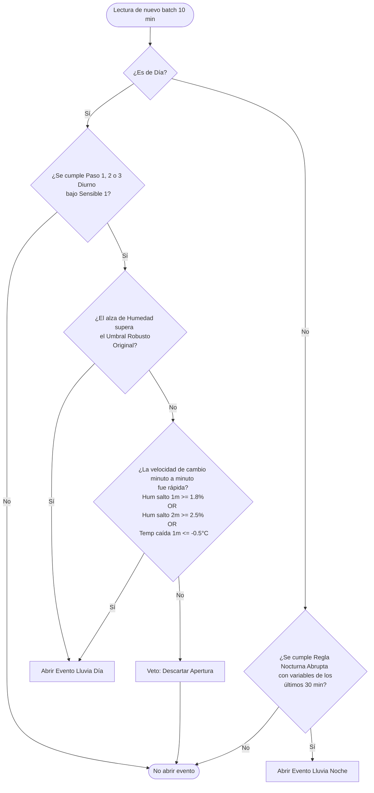

# Guía de Umbrales e Integración de Veto de Pendiente

Este documento detalla los valores de los umbrales de inferencia climática de lluvia para el orquideario, comparando la configuración **Actual (Original)** con la propuesta **Sensible 1**, y describe el funcionamiento e integración de la lógica de **Veto de Pendiente**.

---

## 1. Explicación Simple: ¿Qué es el "Análisis de Pendiente" en vez de "Derivada"?

Cuando decimos que analizamos la **derivada**, nos referimos simplemente a medir la **velocidad o el ritmo de cambio minuto a minuto** de los sensores. 

En lugar de ver solo el cambio acumulado total de 10 o 20 minutos (que puede ser lento y progresivo), nos acercamos con una lupa a ver qué tan "empinado" o "vertical" fue el salto entre un minuto y el siguiente:

*   **Cambio Lento/Gradual (Normal):** La humedad sube de $80\%$ a $88\%$ de forma muy suave: $+0.5\%$ en el minuto 1, $+0.8\%$ en el minuto 2, $+0.6\%$ en el minuto 3... Al final de 10 minutos subió un $8\%$, pero nunca hubo un salto brusco.
*   **Cambio Rápido/Vertical (Lluvia):** La humedad sube de $80\%$ a $88\%$ de golpe: $+1.0\%$ en el minuto 1, **$+4.5\%$ en el minuto 2** (cae la primera gota), $+1.2\%$ en el minuto 3... El acumulado sigue siendo $8\%$, pero el salto de $+4.5\%$ en un solo minuto revela el impacto físico de la lluvia sobre el sensor.

---

## 2. Comparativa de Umbrales: ORIGINAL vs. SENSIBLE 1

En esta propuesta, la temperatura se simplifica usando una base de **$-1.5\text{ °C}$** con incrementos fijos de **$-0.5\text{ °C}$** para cada paso temporal (Paso 1, Paso 2, Paso 3). 

La humedad de **Sensible 1** reduce en **$2.0\%$ HR** los umbrales de activación diurnos. Para el Paso 3 en cielo nublado, se corrige el umbral a **$14.0\%$ HR** (el cual originalmente debió ser $16.0\%$ en base a la progresión $+2\%$ de incremento).

### A. Inferencia Diurna (Pasos 1, 2 y 3)

| Escenario de Inferencia / Rama | Configuración ORIGINAL (Robustez) | Configuración SENSIBLE 1 (Sensibilidad) |
| :--- | :--- | :--- |
| **Paso 1 (20 minutos)** | | |
| ─ Cielo Nublado ($\le 15\text{ klx}$) | Temp: $-1.5\text{ °C}$ \| Hum: $+12.0\%$ | Temp: **$-1.5\text{ °C}$** \| Hum: **$+10.0\%$** |
| ─ Cielo Intermedio ($\le 26\text{ klx}$) | Temp: $-1.5\text{ °C}$ \| Hum: $+10.0\%$ | Temp: **$-1.5\text{ °C}$** \| Hum: **$+8.0\%$** |
| ─ Cielo Soleado ($> 26\text{ klx}$) | Temp: $-2.0\text{ °C}$ \| Hum: $+10.0\%$ | Temp: **$-2.0\text{ °C}$** \| Hum: **$+8.0\%$** |
| **Paso 2 (30 minutos)** | | |
| ─ Cielo Nublado ($\le 15\text{ klx}$) | Temp: $-2.5\text{ °C}$ \| Hum: $+14.0\%$ | Temp: **$-2.0\text{ °C}$** \| Hum: **$+12.0\%$** |
| ─ Cielo Intermedio ($\le 26\text{ klx}$) | Temp: $-2.5\text{ °C}$ \| Hum: $+12.0\%$ | Temp: **$-2.0\text{ °C}$** \| Hum: **$+10.0\%$** |
| ─ Cielo Soleado ($> 26\text{ klx}$) | Temp: $-3.0\text{ °C}$ \| Hum: $+12.0\%$ | Temp: **$-2.5\text{ °C}$** \| Hum: **$+10.0\%$** |
| **Paso 3 (40 minutos)** | | |
| ─ Cielo Nublado ($\le 15\text{ klx}$) | Temp: $-3.5\text{ °C}$ \| Hum: $+16.0\%$ | Temp: **$-2.5\text{ °C}$** \| Hum: **$+14.0\%$** |
| ─ Cielo Intermedio ($\le 26\text{ klx}$) | Temp: $-3.5\text{ °C}$ \| Hum: $+14.0\%$ | Temp: **$-2.5\text{ °C}$** \| Hum: **$+12.0\%$** |
| ─ Cielo Soleado ($> 26\text{ klx}$) | Temp: $-4.0\text{ °C}$ \| Hum: $+14.0\%$ | Temp: **$-3.0\text{ °C}$** \| Hum: **$+12.0\%$** |

### B. Inferencia Nocturna (Gradiente Dinámico)

| Parámetro de Regulación | Configuración ORIGINAL | Configuración SENSIBLE 1 |
| :--- | :---: | :---: |
| **Multiplicador de Caída Térmica** | $1.8 \times$ variabilidad (últimos 30 min) | **$1.6 \times$ variabilidad (últimos 30 min)** |
| **Multiplicador de Alza de Humedad** | $1.6 \times$ variabilidad (últimos 30 min) | **$1.4 \times$ variabilidad (últimos 30 min)** |

---

## 3. Lógica del Veto de Pendiente Personalizado

El Veto de Pendiente se activa únicamente en la **zona de sensibilidad intermedia** (entre el umbral sensible y el umbral robusto original). Si el cambio de humedad es tan alto que supera el umbral robusto original, el evento se abre directamente sin evaluar la velocidad interna.

### A. Zonas de Activación del Veto por Paso y Rama (Día)

*   **Paso 1 (20 min):**
    *   *Nublado:* Si el alza de humedad está entre **`10.0%` y `12.0%`**, evaluar Veto. Si es $\ge 12.0\%$, abrir directo.
    *   *Intermedio:* Si el alza de humedad está entre **`8.0%` y `10.0%`**, evaluar Veto. Si es $\ge 10.0\%$, abrir directo.
    *   *Soleado:* Si el alza de humedad está entre **`8.0%` y `10.0%`**, evaluar Veto. Si es $\ge 10.0\%$, abrir directo.
*   **Paso 2 (30 min):**
    *   *Nublado:* Si el alza de humedad está entre **`12.0%` y `14.0%`**, evaluar Veto. Si es $\ge 14.0\%$, abrir directo.
    *   *Intermedio:* Si el alza de humedad está entre **`10.0%` y `12.0%`**, evaluar Veto. Si es $\ge 12.0\%$, abrir directo.
    *   *Soleado:* Si el alza de humedad está entre **`10.0%` y `12.0%`**, evaluar Veto. Si es $\ge 12.0\%$, abrir directo.
*   **Paso 3 (40 min):**
    *   *Nublado:* Si el alza de humedad está entre **`14.0%` y `16.0%`**, evaluar Veto. Si es $\ge 16.0\%$, abrir directo.
    *   *Intermedio:* Si el alza de humedad está entre **`12.0%` y `14.0%`**, evaluar Veto. Si es $\ge 14.0\%$, abrir directo.
    *   *Soleado:* Si el alza de humedad está entre **`12.0%` y `14.0%`**, evaluar Veto. Si es $\ge 14.0\%$, abrir directo.

### B. Umbrales del Veto (Criterios de Aprobación de Velocidad)

Para que el evento sea aprobado dentro de la zona de veto, se debe cumplir al menos una de estas velocidades internas dentro del lote actual de 10 minutos (10 muestras minuto a minuto):
1.  **Humedad rápida (1 min):** Un salto de humedad $\ge 1.8\%$ de un minuto al siguiente.
2.  **Humedad rápida (2 min):** Un salto de humedad $\ge 2.5\%$ acumulado en 2 minutos.
3.  **Temperatura rápida (1 min):** Una caída térmica $\le -0.5\text{ °C}$ de un minuto al siguiente.

---

## 4. Diagrama de Flujo de Integración

