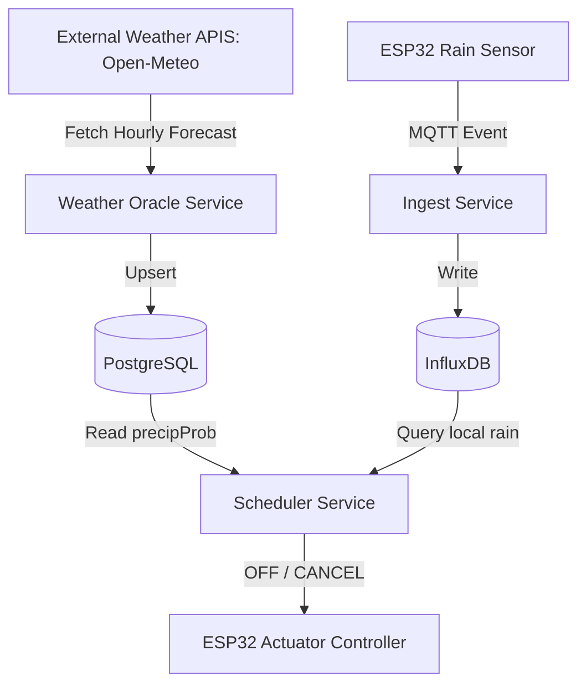

# 🌦️ Arquitectura WeatherGuard (Blindaje Climático)

**WeatherGuard** es el sistema de inteligencia ambiental de PristinoPlant diseñado para optimizar el recurso hídrico y prevenir enfermedades fúngicas mediante la toma de decisiones basada en el contexto climático.

## 🏗️ Filosofía de Diseño: Inteligencia Híbrida

El sistema opera bajo una arquitectura desacoplada que combina datos locales en tiempo real con predicciones globales en la nube.

### 1. El Centinela Proactivo: `weather-oracle`

* **Tipo**: Micro-servicio (Worker) en contenedor.
* **Función**: Sincroniza cada 6 horas el pronóstico de **Open-Meteo** para Ciudad Guayana.
* **Persistencia**: Guarda los datos en la tabla `WeatherForecast` (PostgreSQL).
* **Resiliencia**: Si el Oracle falla (corte de internet o API caída), el sistema de riego no se detiene; simplemente pierde la capacidad "predictiva" temporalmente.

### 2. El Centinela Reactivo: ESP32 Actuator Controller

* **Tipo**: Hardware (Firmware MicroPython).
* **Función**: Monitorea el sensor de gotas de lluvia físico mediante una FSM (Máquina de Estados Finita).
* **Persistencia**: Envía eventos de lluvia (`rain_events`) a **InfluxDB** vía MQTT.
* **Resiliencia**: Funciona incluso si el servidor central está offline (almacena el estado en NVS local).

### 3. El Juez: `scheduler`

* **Tipo**: Micro-servicio (Orquestador).
* **Función**: Antes de ejecutar cualquier riego, consulta ambos centinelas:
  1. **Consulta DB (Prisma)**: "¿Hay > 70% de probabilidad de lluvia en las próximas 3 horas?" (**Oracle**).
  2. **Consulta InfluxDB (Flux)**: "¿Llovió más de 30 minutos en las últimas 24 horas?" (**ESP32**).
* **Acción**: Si cualquiera es `true`, el riego se cancela automáticamente y se registra el motivo.

---

## 📡 Flujo de Datos

## 📋 Reglas de Decisión Actuales (v0.8.0)

| Factor | Umbral | Acción |
| :--- | :--- | :--- |
| **Lluvia Local** | > 1800s (30m) acumulados / 24h | `CANCEL` |
| **Pronóstico** | > 70% probabilidad / 3h | `CANCEL` |
| **Error de API** | Fallo de conexión | `CONTINUE` (Prioriza vida de la planta) |
