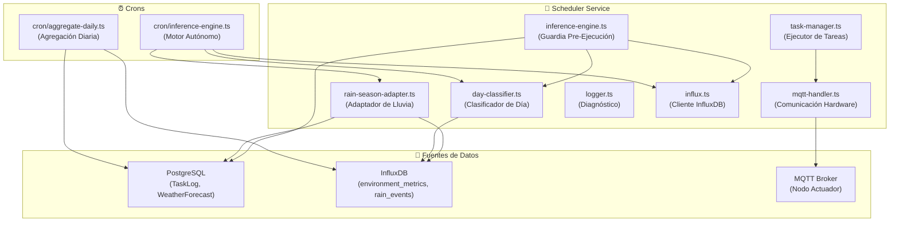

# Documentación del Servicio Scheduler — Librerías

## Arquitectura General

El servicio `scheduler` es el cerebro operativo de Pristinoplant. Gestiona la automatización del riego, nebulización, fertilización y fumigación del orquideario. Se comunica con el hardware a través de MQTT y toma decisiones basándose en datos de sensores locales (InfluxDB) y pronósticos meteorológicos (PostgreSQL).



---

## Librerías (`src/lib/`)

---

### 1. `inference-engine.ts` — Motor de Inferencia v4

#### Propósito de InferenceEngine

Guardia pre-ejecución que evalúa si una tarea programada (AutomationSchedule) debe ejecutarse, cancelarse o diferirse. Es la capa de protección entre el cronograma programado y la ejecución real.

#### Origen de las Reglas de Negocio

Las reglas fueron definidas directamente por los cultivadores (padres del desarrollador) basándose en su experiencia con orquídeas epífitas tropicales (Cattleya):

- **Padre**: "No quiero que el sistema cancele mis riegos por pronóstico de lluvia. Las APIs mienten."
- **Madre**: "Si el día está fresco y húmedo, no hace falta pulverizar."
- **Observación de campo**: OWM reportó 100% de lluvia y no llovió. Al día siguiente, 86% y tampoco.

#### Principios Cardinales

1. **IRRIGACIÓN**: JAMÁS se cancela por pronóstico de APIs. Solo por lluvia REAL acumulada (sensor de gotas).
2. **APIs meteorológicas**: Factor informativo para FERTIGATION/FUMIGATION. Requiere consenso >95% de AMBAS APIs + cielo nublado para tener efecto.
3. **Sensores físicos**: Verdad absoluta. Tienen poder de veto total.
4. **Clasificación del día**: Aporta contexto para pulverización (promedio 8am-4pm).
5. **Ante error**: EJECUTAR. Las orquídeas no deben quedarse sin agua por un bug.

#### Reglas de Evaluación (Orden de Prioridad)

| # | Regla | Condición | Acción | Aplica a |
| --- | --- | --- | --- | --- |
| 1 | Cancelación Manual | TaskLog con status CANCELLED ±5min | SKIP | Todos |
| 2 | Telemetría + Clasificación | Obtener datos sensores + DayClassifier | — | — |
| 3 | Lluvia Real en Curso | `rain_intensity > 0` (sensor gotas) | SKIP | Todos |
| 4 | Lluvia Acumulada (24h) | `>20min` en últimas 24h | SKIP | IRRIGATION |
| 4.1 | Lluvia Acumulada (4h) | `>20min` en últimas 4h | SKIP | SOIL_WETTING |
| 5 | HR Interior Crítica | `>90%` + día nublado o lluvia reciente | SKIP | Todo lo hídrico |
| 6 | Día Fresco | `HR>80%` + `Temp<28°C` + `Lux prom<26k` | SKIP | HUMIDIFICATION |
| 7 | Pulverización por Clima | Promedio 8am-4pm `≤26k` lux | SKIP | HUMIDIFICATION |
| 8 | Protección Fertilización | AMBAS APIs `>95%` + día OVERCAST/RAINY | SKIP | FERTIGATION/FUMIGATION |
| 9 | Veto Inteligente | Lux+20%, Temp+2°C o Hum-2% vs Baseline | VETO | Automáticos |
| 10 | Reversión de Veto | Retorno a Baseline (Oscuridad/Frío) | UNVETO | Si Rain físico |
| — | Default | Ninguna condición bloquea | EXECUTE | Todos |

#### Datos que NO están calibrados (TODO)

- **HR interior (90%, 80%)**: El sensor DHT22 del orquideario no está activado. Los umbrales son tentativos.
- **Temperatura interior**: Misma situación. No hay datos históricos para comparación.
- **Protección de fertilización**: Falta comparar temp/hum vs promedio de 7 días a la misma hora (filtrando días con lluvia 1pm-5pm).

#### Métodos Privados

| Método | Fuente | Descripción |
| --- | --- | --- |
| `getLatestLocalConditions()` | InfluxDB | Última lectura de temp, hum, lux, lluvia (30 min) |
| `getRecentRainAccumulation(hours)` | InfluxDB | Lluvia acumulada en N horas (rain_events) |
| `getForecastConsensus()` | PostgreSQL | Consenso OWM/OM + VWC AgroMonitoring |

---

### 2. `day-classifier.ts` — Clasificador de Día

#### Propósito de DayClassifier

Clasifica el tipo de día actual basándose en datos de iluminancia acumulados desde las 8:00 AM hasta las 4:00 PM. Fuera de este rango retorna `UNKNOWN`.

#### Calibración

Los umbrales fueron calibrados con observaciones de campo durante la temporada seca (marzo-abril 2026) y las interpretaciones definidas en `MonitoringView.tsx climate()`:

| Tipo | Lux Promedio (8am-4pm) | Observación de Campo |
| --- | --- | --- |
| `EXTREMELY_SUNNY` | > 40,000 | Promedio típico de sequía. Radiación sostenida. |
| `SUNNY` | 30,000 — 40,000 | Radiación directa. El sol pasa rápido de 25k a 30k. |
| `TEMPERATE` | 26,000 — 30,000 | Nubes intermitentes. Transición rápida. |
| `OVERCAST` | 15,000 — 26,000 | Nublado confirmado por el cultivador. |
| `RAINY` | < 15,000 | Cielo cerrado / posible lluvia activa. |
| `UNKNOWN` | Sin datos (noche) | Antes de 8am o después de 4pm. |

**Dato clave del cultivador**: "Un día nublado se mantiene < 26k lux. Ya 30k es soleado. El sol se mueve de 25k a 30k muy rápido, no he registrado que se mantenga constante en ese rango."

#### Datos Adicionales que Retorna

- `avgLuxSince8am`: Promedio de iluminancia acumulado
- `currentLux`: Lectura instantánea (últimos 5 min)
- `overcastMinutes`: Minutos consecutivos recientes con lux < 15k

#### TODO de DayClassifier

- Recalibrar umbrales cuando haya datos de temporada de lluvia (mayo+).
- El rango de evaluación finaliza a las 4pm. El corte a las 4:01pm asegura que la lectura de las 4:00pm sea válida.

---

### 3. `rain-season-adapter.ts` — Adaptador de Temporada de Lluvia

#### Propósito de RainSeasonAdapter

Gestiona el espaciado interdiario del riego por aspersión (6AM, L/M/V/D), adaptándose a la lluvia real acumulada. Puede crear tareas diferidas automáticamente en PostgreSQL.

#### Reglas de Negocio (del cultivador)

El programa de riego es **interdiario**: un día se riega, el otro no, el siguiente sí. Este patrón debe mantenerse incluso en temporada de lluvia, adaptándose:

1. **Lluvia >20min = equivale a un riego**. Si llovió el día de "descanso", el próximo día de riego programado se mantiene. Si llovió el día de riego, el sistema lo detecta y ajusta.

2. **Si llueve 2 días seguidos**: Se omiten TODAS las tareas de riego y nebulización para el día siguiente (descanso hídrico). Se evalúa el clima de ese día.

3. **Si el día de descanso es nublado (<26k lux promedio) + HR >80%**: Se agrega un segundo día de descanso antes de retomar el riego.

4. **Emergencia**: Si pasan ≥3 días sin riego, ejecutar obligatoriamente (sin importar lluvia).

5. **Verificación de duplicados**: Antes de crear una tarea diferida, consultar la cola de ejecuciones para no duplicar.

#### Parámetros

| Parámetro | Valor | Origen |
| --- | --- | --- |
| Lluvia significativa | 20 min (1200s) | Observación de campo |
| Ventana de análisis | 48 horas | Cobertura de 2 días |
| Máximo sin riego | 3 días | Límite de seguridad |
| Duración aspersión | 15 min | Confirmado por cultivador |
| Hora de riego | 6:00 AM | Programa establecido |
| HR para descanso extra | >80% | TODO: Calibrar con DHT22 |

#### Escenarios de Temporada de Lluvia

```text
Lunes 6am → Riego ✅
Martes → Llueve 45min
Miércoles 6am → SKIP (lluvia ayer >20min, mantener interdiario)
Jueves 6am → EJECUTAR (2 días sin riego + sin lluvia hoy) ✅
Jueves → Llueve 30min
Viernes → Llueve 25min (2 días de lluvia consecutivos)
Sábado → SKIP riego + nebulización (descanso hídrico obligatorio)
Sábado → Evaluar: si <26k lux + HR >80% → domingo también descansa
Domingo → Depende del sábado y las condiciones del domingo
```

#### TODO de RainSeasonAdapter

- Evaluar si el día de descanso fue soleado (>40k lux) para considerar humidificación 10min al día siguiente a las 6am.
- Registrar temp/hum histórica del orquideario para calibrar umbrales de descanso extendido.
- Los domingos con HR ≥80% a las 6am podrían saltar riego y re-evaluar a las 4pm.

---

### 4. `task-manager.ts` — Ejecutor de Tareas

#### Propósito de TaskManager

Gestiona el ciclo de vida completo de las tareas (TaskLog) en PostgreSQL, desde la creación hasta la ejecución y limpieza.

#### Funciones Exportadas

| Función | Descripción |
| --- | --- |
| `recordTaskEvent()` | Registra transiciones de estado atómicamente (TaskLog + TaskEventLog) |
| `processTaskLog()` | Despacha una tarea al Nodo Actuador vía MQTT |
| `resumeInterruptedTasks()` | Marca tareas interrumpidas (por reinicio) como FAILED |
| `processPostponedTasks()` | Reactiva tareas postergadas por nodo offline |
| `handleAckTimeout()` | Callback cuando el nodo no responde (ACK timeout) |
| `cleanupExpiredTasks()` | Marca tareas que excedieron la ventana de 20 minutos como EXPIRED |

#### Ciclo de Vida de una Tarea

```text
PENDING → DISPATCHED → ACKNOWLEDGED → IN_PROGRESS → COMPLETED
                ↓              ↓              ↓
              FAILED        FAILED         FAILED
                ↓
             EXPIRED (ventana de 20 min)
```

#### Protecciones

- **Deduplicación**: Bloquea eventos duplicados en una ventana de 2 segundos.
- **Idempotencia**: No permite transiciones desde estados terminales.
- **Ventana de Oportunidad**: 20 minutos para que una tarea PENDING/FAILED sea ejecutada antes de expirar.

---

### 5. `mqtt-handler.ts` — Comunicación con Hardware

#### Propósito de MqttHandler

Gestiona toda la comunicación MQTT con el Nodo Actuador (ESP32). Envía comandos de circuito (riego, nebulización, etc.) y gestiona reintentos con ACK.

#### Componentes

| Componente | Descripción |
| --- | --- |
| `mqttClient` | Cliente MQTT conectado al broker (HiveMQ Cloud) |
| `retryManager` | Gestor de reintentos con confirmación por ACK |
| `executeSequence()` | Envía comando de circuito al nodo |
| `executeSystemCommand()` | Envía comandos del sistema (lux_sampling, eco, reset) |
| `syncNodeSampling()` | Sincroniza muestreo de iluminancia (5AM-7PM) |

#### Sistema de Reintentos (CommandRetryManager)

1. Se envía comando MQTT con QoS 1.
2. Se registra en cola de pendientes con timer de 60s.
3. Si el nodo responde con ACK → se elimina de la cola.
4. Si no responde en 2 min → se reporta "Fallo Visual" pero se sigue reintentando.
5. Si pasan 20 min → se marca como expirado y se limpia.

#### Topics MQTT

| Topic | Uso |
| --- | --- |
| `PristinoPlant/Actuator_Controller/irrigation/cmd` | Comandos de circuito (riego, nebulización) |
| `PristinoPlant/Actuator_Controller/cmd` | Comandos de sistema (lux_sampling, eco) |

---

### 6. `influx.ts` — Cliente InfluxDB

#### Propósito de InfluxClient

Singleton del cliente InfluxDB v3. Conecta al bucket `telemetry` que almacena toda la telemetría de sensores.

#### Mediciones (Measurements) que consume el scheduler

| Measurement | Campos | Descripción |
| --- | --- | --- |
| `environment_metrics` | temperature, humidity, illuminance, rain_intensity | Telemetría ambiental |
| `rain_events` | duration_seconds, zone | Eventos de lluvia registrados |

#### Fuentes de datos (source tag)

| Source | Zona | Sensores |
| --- | --- | --- |
| `Weather_Station` | EXTERIOR | Iluminancia (BH1750), Sensor gotas de lluvia |
| `Weather_Station` | INTERIOR (orquideario) | Temperatura, Humedad, Iluminancia (DHT22 + BH1750) |

**Nota**: La estación meteorológica exterior NO tiene sensor de temperatura/humedad (DHT22). Los datos de temp/hum del exterior se obtienen de las APIs del clima.

---

### 7. `logger.ts` — Sistema de Diagnóstico

#### Propósito de Logger

Logger centralizado con formato estandarizado, colores ANSI y timestamps en zona horaria Venezuela (America/Caracas).

#### Niveles

| Método | Icono | Tag | Color | Uso |
| --- | --- | --- | --- | --- |
| `info()` | 📡 | INFO | Azul | Información general |
| `success()` | ✅ | DONE | Verde | Operaciones exitosas |
| `warn()` | ⚠️ | WARN | Amarillo | Alertas (acepta error opcional) |
| `error()` | ❌ | ERRO | Rojo | Errores críticos (con soporte Prisma) |
| `debug()` | 🔎 | DBUG | Cyan | Solo en desarrollo |
| `mqtt()` | 📡 | MQTT | Magenta | Comunicación MQTT |
| `cron()` | ⏰ | CRON | Cyan | Eventos de cron |
| `node()` | ✅/❌ | NODE | Verde/Rojo | Estado del nodo actuador |
| `oracle()` | 🔮 | ORCL | Azul | Motor de inferencia |

---

## Crons (`src/cron/`)

---

### `cron/inference-engine.ts` — Motor Autónomo Proactivo

Cron que se ejecuta periódicamente para evaluar el microclima del orquideario y tomar acciones proactivas (crear tareas diferidas si las condiciones lo requieren).

**Diferencia con `lib/inference-engine.ts`**:

- `lib/inference-engine.ts` = **Guardia** (evalúa si una tarea YA programada debe ejecutarse)
- `cron/inference-engine.ts` = **Motor Autónomo** (detecta necesidades y CREA tareas nuevas)

#### Flujo de Ejecución

1. Verificar lluvia real acumulada (modo pasivo si llovió recientemente)
2. Consultar telemetría térmica del orquideario (InfluxDB: avgTemp, avgHum)
3. Obtener VWC del suelo (AgroMonitoring en PostgreSQL)
4. Revisar cooldown (no crear tareas si ya se actuó en los últimos 60 min)
5. Evaluar adaptación de cronograma (RainSeasonAdapter + DayClassifier)
6. Lógica reactiva: calor extremo → humectar suelo; resequedad → nebulizar
7. Inyectar tarea diferida en PostgreSQL si hay decisión

---

### `cron/aggregate-daily.ts` — Agregación Diaria

Worker que calcula estadísticas diarias del orquideario. Debe ejecutarse a las **4:01 PM** (rango de procesamiento: 8:00 AM — 4:00 PM).

**Campo nuevo**: `dayType` (String?) en `DailyEnvironmentStat` para persistir la clasificación del día.

> **Estado actual**: No está funcionando correctamente. No se ven resultados en /monitoring ni rastro en los logs del scheduler. Requiere diagnóstico.
